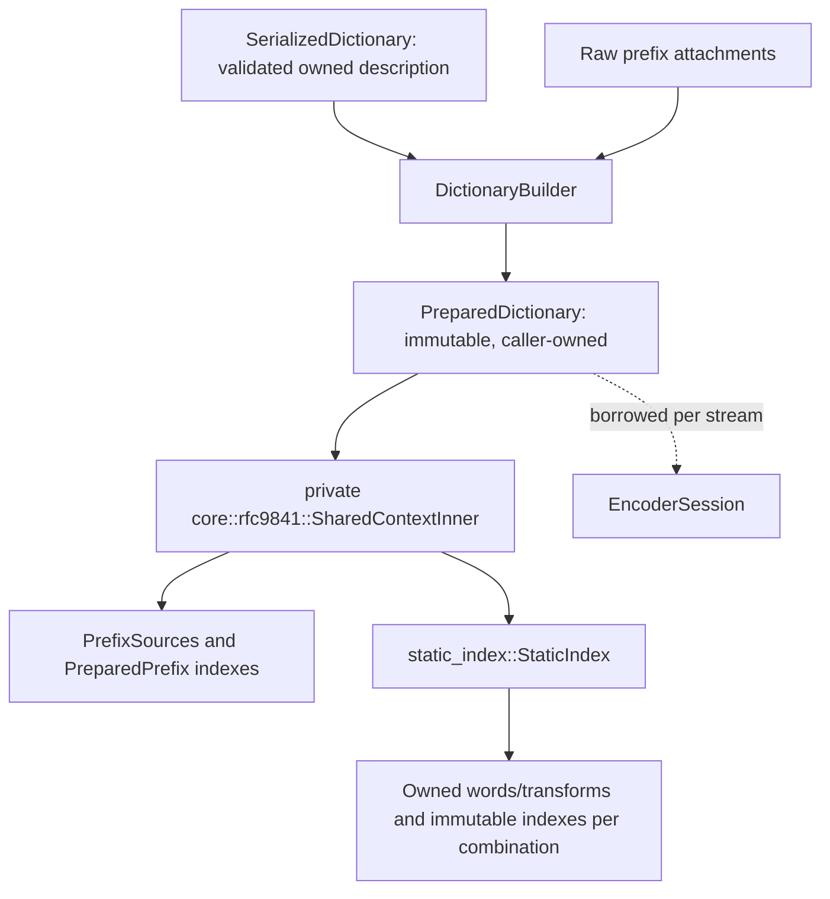
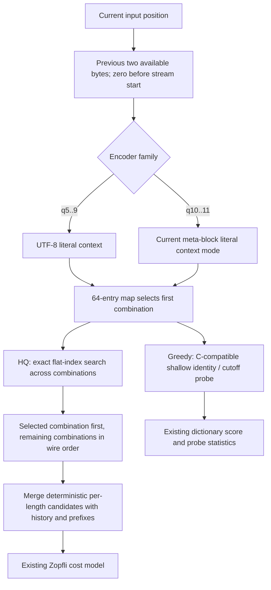

# RFC 9841 encoding: custom dictionaries and continuations

This specification describes the `experimental` encoder extensions. The wire
authority is [RFC 9841](https://www.rfc-editor.org/rfc/rfc9841.html), not the
limitations of the pinned C encoder's experimental search tables. The existing
[serialized dictionary codec](serialized-dictionary.md) owns parsing, canonical
serialization, list validation and transform semantics.

## Ownership and preparation



`DictionaryBuilder::add_serialized` attaches the embedded prefix at that call's
position and copies the custom static description. The last custom description
replaces an earlier one; additional prefix-only descriptions leave it intact.
`build` returns the same `PreparedDictionary` as raw prefix preparation. A
static-only dictionary is valid and has zero prefix attachments. Diagnostics
include its custom source bytes and retained index storage.

`StaticIndex::prepare` makes two passes over words and transforms. The first
applies transforms into stack scratch, checks transformed byte count, entry
count and the aggregate retained estimate, and records exact capacities. Only
then does the second pass allocate flat entry/byte arrays and shallow hash
tables. No transformed word or candidate allocates during compression.

Each combination owns its word list, transform list, a 32,768-slot shallow hash
table, and entries sorted by `(first four bytes, output length, address, base
length)`. The full index permits the entire transform output, up to 541 bytes,
including outputs larger than the pinned C encoder's scratch limit. Built-in
lists can be named explicitly in combinations. The transform implementation
uses RFC byte operations, never locale-sensitive casing.

The added `DictionaryLimits` ceilings default to 128 MiB of transformed bytes
and 8,000,000 flat static entries. `max_retained_bytes` also bounds their total
storage; `max_source_bytes` includes custom word and transform bytes. The flat
entry count is the implementation's equivalent of a trie-node limit.
Preparation rechecks description byte/list/combination ceilings even when the
description was parsed earlier under more permissive limits. These refusals use
the public `DictionaryError::LimitExceeded`; index expansion uses
`PreparationTooLarge`. Allocation estimates are capped at `isize::MAX` even if
a caller raises the 64-bit budget further.

## Candidate flow and dispatch



Dictionary distances start after the real/logical sliding window and attached
prefix. Each preceding combination adds its base-length word count multiplied
by its transform count. HQ retains the smallest `(distance, base length)` for
each output length. A custom index suppresses the implicit built-in search;
the built-in dictionary participates only where the serialized description
names it. Greedy retains the reference's restricted shallow search and cutoff
ordering rather than consulting every HQ transform.

The existing top-level encoder SIMD dispatch is unchanged. Index preparation
and lookup are scalar; history comparisons continue to receive the selected
SIMD capability. Plain greedy streams keep the `ENABLE_PREFIX = false`
specialization. All index fields and extra branches compile out without
`experimental`.

Long transformed words need a base copy length different from their output
length. Unused packed modifier ranges represent that base length directly:
command modifiers 32..63 and HQ node modifiers 96..127. Existing ordinary
command layouts and struct sizes are unchanged. The decoder still receives the
RFC base word length, not the expanded length.

## Headerless continuation streams

`StreamConfig::with_stream_offset` supports nonzero offsets at qualities 2..11
with `experimental`; other combinations return `UnsupportedStreamOffset`.
The caller must concatenate the output after a compatible, byte-aligned Brotli
flush. A continuation alone is not a Brotli stream.

```mermaid
sequenceDiagram
    participant Caller
    participant Session as EncoderSession
    participant Core as GreedyEncoder / HqEncoder
    Caller->>Session: start(offset, optional exact size)
    Session->>Session: check offset + declared length <= 2^63 - 1
    Session->>Core: suppress header; poison distance cache; clamp logical base to retained window
    Caller->>Session: Process / Flush / Finish
    Session->>Session: check offset + accepted input before consumption
    Session->>Core: first two bytes, flush if more follows
    Session->>Core: normal blocks with shifted dictionary addresses
    Core-->>Caller: headerless encoded continuation
```

Only logical dictionary placement includes the offset; history probes remain
limited to bytes actually present in the ring. The first two bytes form the
reference encoder's restart flush (unless the stream ends within them), so
unavailable preceding literal contexts cannot influence later commands. The
first four distance-cache entries are poisoned and the stored cache is reset
consistently. Logical position overflow returns `StreamPositionOverflow` before
accepting input. Fresh streams reset the offset, header, caches and staging.

Declared large windows still retain at most 30 bits of history. Clamping an
offset to that effective window does not allocate history or authorize reading
unavailable bytes. Resource starts in the framing API require offset zero;
partial chunks share one encoder session instead.

## Verification and known gaps

- `tests/serialized_dictionary.rs` verifies C decoding, C-identical identity
  dictionaries on every host SIMD level, context combinations, split input,
  preparation limits, all transform operations and the long-transform packed
  length regression.
- `tests/stream_offset.rs` checks C byte identity, decoding after a flushed
  prefix, empty/one/two-byte restarts, one-byte writes, tiny output buffers,
  backend identity, overflow and fresh-stream recovery.
- AFL's serialized target parses and reserializes arbitrary bytes, prepares
  under small budgets, then checks q5/q11 streams with C's attached-dictionary
  decoder. No decoder was added to this crate.
- C byte identity is authoritative only for equivalent exposed behavior. Its
  experimental HQ encoder searches fewer combinations and shorter transformed
  words than RFC 9841 permits. Extended cases require deterministic output and
  independent decoding, not an artificial restriction to those C search limits.
- As before, declared windows above 30 bits have header tests but no available
  independent end-to-end decoder in this repository. Cross-platform release
  performance gates require measurements on the requested target machines.
