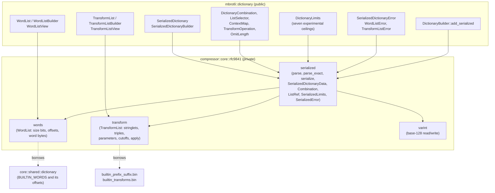
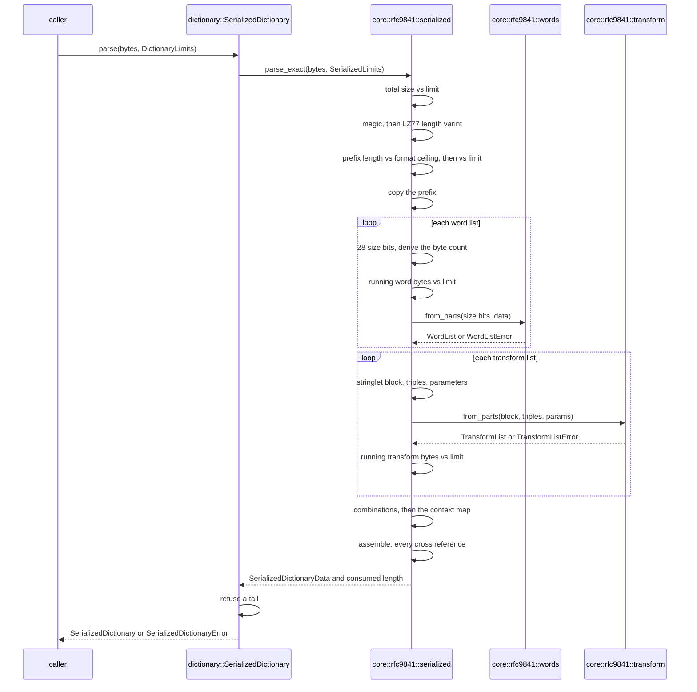
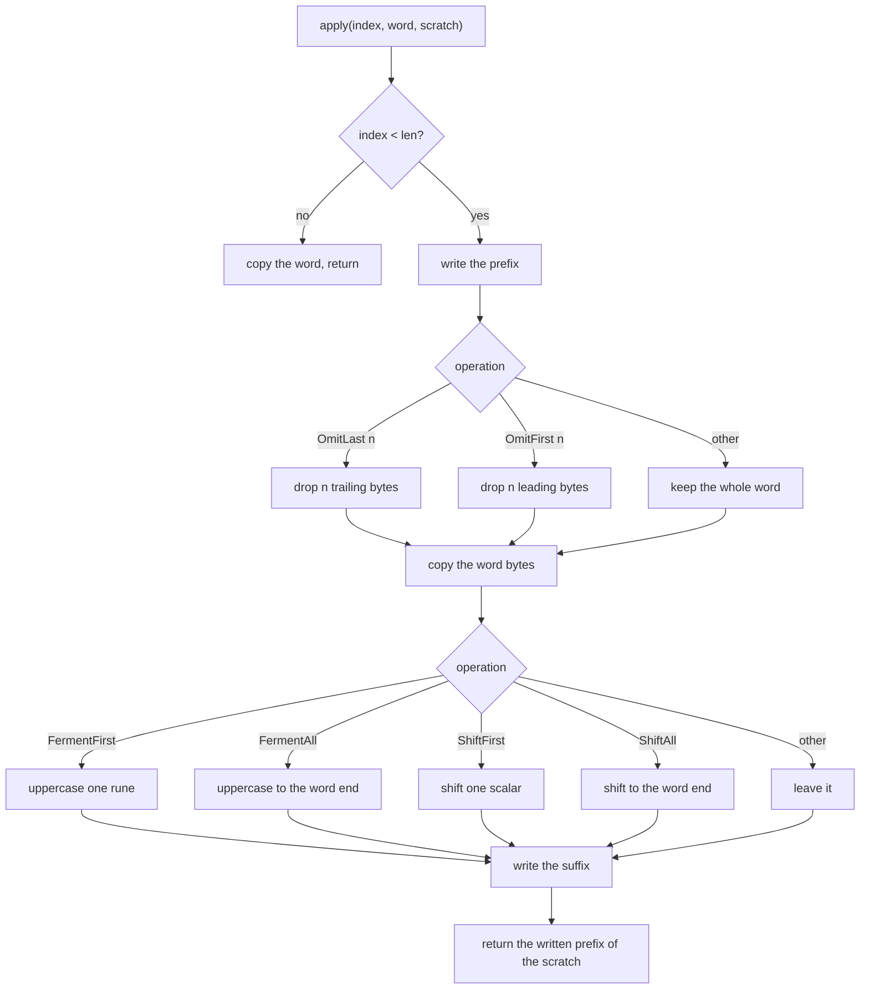

# Serialized shared dictionaries (RFC 9841 section 5)

The serialized dictionary API requires the `experimental` Cargo feature and
may change in a patch release. It parses and writes dictionary descriptions;
preparation and compression are described in [rfc9841-encoding.md](rfc9841-encoding.md).

Rust API/backend identity and independent decoder compatibility apply. Full
custom static search has no blanket C encoder byte-identity oracle. The C test
build enables its serialized parser with `BROTLI_EXPERIMENTAL`.

[RFC 9841]: https://www.rfc-editor.org/rfc/rfc9841.html

## 1. Module boundaries

The codec is private and the description is public. Nothing above
`core::rfc9841` knows the wire layout, and nothing below `dictionary` knows the
public type names.



Ownership: a `SerializedDictionary` owns every byte it describes and borrows
nothing from what it was parsed from. The two built-in lists are the exception
in the other direction — `WordList::builtin()` and `TransformList::builtin()`
hold `Cow::Borrowed` views of static tables, so naming the built-in list costs
the offset arrays and nothing else.

`WordListView` and `TransformListView` exist because the owned wrappers are
newtypes over the codec's types: a parsed dictionary hands out a borrow rather
than cloning a word list that may be a megabyte.

## 2. Wire format

[RFC 9841] section 5. Every field below is checked before the bytes it
describes are copied.

```
2 bytes   magic 0x91 0x00
varint    LZ77_DICTIONARY_LENGTH
N bytes   the LZ77 prefix
1 byte    NUM_CUSTOM_WORD_LISTS            (0..=64)
  per list:
    28 bytes  SIZE_BITS_BY_LENGTH, lengths 4..=31, each <= 15
    N bytes   the words, shortest length first
1 byte    NUM_CUSTOM_TRANSFORM_LISTS       (0..=64)
  per list:
    2 bytes   PREFIX_SUFFIX_LENGTH (>= 1)
    N bytes   length-prefixed stringlets, terminated by a zero length
              that must be the block's last byte, at most 256 stringlets
    1 byte    NTRANSFORMS
    3N bytes  (prefix id, operation, suffix id) per transform
    2N bytes  parameters, present if and only if some operation shifts
if either count is non-zero:
    1 byte    NUM_DICTIONARIES                 (1..=64)
    2N bytes  (word list index, transform list index) per combination,
              where the index equal to the custom count names the built-in
    1 byte    CONTEXT_ENABLED                  (0 or 1)
    64 bytes  CONTEXT_MAP, each entry < NUM_DICTIONARIES
```

## 3. Parse flow



`parse` reports how many bytes it consumed so an embedding container can carry
on; `parse_exact` is what the public API calls and refuses a tail.

## 4. Transform application

`TransformList::apply` is a port of `BrotliTransformDictionaryWord`. It writes
into a caller-held `TransformScratch`, so a search allocates nothing per
candidate.



Transform casing and scratch behavior follow the reference:

- the casing model is an exclusive-or — bit five for ASCII and for the second
  byte of a two-byte sequence, and the constant five for the third byte of a
  three-byte one. It is not a Unicode mapping and is not locale aware;
- uppercasing may write one byte past the word when the word ends mid-sequence.
  The reference relies on that, and the suffix overwrites it. `TransformScratch`
  is sized for the longest possible output rather than the exact one, so the
  same behaviour costs no out-of-bounds write. Everything the port writes is
  inside a `[u8; 541]`.

Shift arithmetic follows section 3.1.1: the sixteen-bit parameter is
zero-extended and `0xFF0000` added when its high bit is set, and the result is
added to the 7-, 11-, 16- or 21-bit scalar the encoding pattern describes.

## 5. Canonical encoding

`SerializedDictionary::to_bytes` writes one encoding per dictionary:

- the shortest varint for the prefix length;
- the combination block present exactly when a custom list is;
- the parameter block present exactly when some transform shifts;
- the context map present exactly when the dictionary is context based;
- the stringlet table in first-use order with duplicates merged, the
  zero-length terminator last and doubling as the empty prefix or suffix.

The RFC permits a longer varint than a value needs. Such an encoding is
accepted on parse and normalised on write, which is the documented treatment of
the one noncanonical encoding the format allows.

The pinned C helper reads prefix lengths with `ReadVarint32` and rejects a
fifth byte with its high bit set, even for a valid six-to-nine-byte redundant
encoding of a small length. RFC 9841 permits those encodings. AFL minimized
this oracle disagreement to the committed zero-length and 17-byte-prefix
fixtures. The Rust parser retains RFC behavior; differential fuzzing exempts
only that structural C width limit and still requires canonical reserialization
to parse and compressed payloads to decode with C.

`WordListBuilder` pads each length group to a power of two by repeating its last
word, because the format addresses a word by a fixed-width index and spells "no
words of this length" as a zero exponent — so a group of one word is stored as
two.

## 6. Resource limits

`DictionaryLimits` gained seven ceilings, the last six behind `experimental`.
Every one is checked before the allocation it bounds.

| Limit | Default | What it bounds |
| --- | --- | --- |
| `max_attachments` | 15 | prefix dictionaries per prepared dictionary |
| `max_serialized_bytes` | 128 MiB | the whole stream, before any field is read |
| `max_prefix_bytes` | 64 MiB | the LZ77 prefix, declared length first |
| `max_word_lists` | 64 | custom word lists |
| `max_word_bytes` | 16 MiB | word bytes, accumulated as the lists are parsed |
| `max_transform_lists` | 64 | custom transform lists |
| `max_transform_bytes` | 8 MiB | transform wire bytes, accumulated |
| `max_combinations` | 64 | word-and-transform-list combinations |

The format's own ceilings are enforced regardless: sixty-four of any list,
fifteen size bits, two hundred and fifty-five transforms, two hundred and
fifty-six stringlets, and an LZ77 prefix no larger than large-window Brotli's
widest sliding window.

Checked arithmetic: the word byte count is derived from the size bits, whose
product is bounded by `31 << 15` per length and cannot overflow a `u32`; the
varint reader caps at sixty-three bits; every slice is taken through a checked
`take` that reports truncation rather than panicking.

## 7. Parser and transform boundaries

- The LZ77 prefix ceiling is `(1 << 30) - 16`.
- Public parsing rejects bytes after a complete structure; the C parser can
  accept the same structure while ignoring trailing input.
- Applying a transform index beyond the list returns the word unchanged.
- The Rust prefix-length reader accepts up to nine varint bytes, including
  redundant encodings. C's `ReadVarint32` rejects continuation in byte five.
  Differential tests account for this narrower C reader and require canonical
  serialization to parse with C.

## 8. Verification

| Where | What is checked |
| --- | --- |
| `core::rfc9841::varint` | every bit position round trips, truncation, the ninth-byte cap, noncanonical encodings, trailing bytes left for the caller |
| `core::rfc9841::words` | the built-in tables tile every length, addressing by length and index, a zero exponent meaning no words, the exponent and data-length refusals, the largest list a length may hold, wire round trip |
| `core::rfc9841::transform` | the built-in list is the reference's 121 transforms with the cutoff table the packed constant already encodes; every operation; the casing model on a two-byte rune; sign-extended and wrapping shifts; a rune truncated at the word end; eight malformed-list refusals; the longest possible output fitting the scratch |
| `core::rfc9841::serialized` | round trips for prefix, word list, transform list and context map dictionaries; every truncation; ten field-level refusals; the noncanonical varint; limit refusals before allocation |
| `tests/serialized_dictionary.rs` | **differential against the C parser**: every truncation and every single-byte mutation of a rich dictionary, ten hand-written malformed streams, and the structure the reference recovered field for field; **differential against `BrotliTransformDictionaryWord`**: every operation over ASCII, two-byte, three-byte and truncated-rune words, for the custom list and for the built-in one; canonical fixture bytes; each resource limit |
| `tests/differential_c.rs`, `tests/dictionary.rs`, and the rest | default encoding matches equivalent C streaming settings and all Rust API shapes; native C one-shot differences are specified in [universal-encoding.md](universal-encoding.md) |

The C oracle exists because `brotli-ffi`'s own `experimental` feature compiles
the vendored library with `BROTLI_EXPERIMENTAL` and adds two shim entry points:
`mbrotli_shim_parse_shared_dictionary`, which reports the parsed structure the
public API keeps opaque, and `mbrotli_shim_transform_dictionary_word`. The flag
gates only the serialized parser, custom dictionary construction and one
`static_dict.c` branch a built-in dictionary never takes; the byte-identity
suite passing unchanged with it defined is what shows no ordinary output moved.

## Known gaps

Preparation uses `SerializedDictionaryData::allocation_bound` to account for the
owned description while prefix and static indexes are constructed. Word and
transform bytes, stringlet indexes, list/combination vector capacities and the
embedded prefix remain part of that peak until the description is dropped.
The preparation flow and allocator-backed regression are described in
[rfc9841-encoding.md](rfc9841-encoding.md).

- Custom static compression is implemented by the immutable
  `core::rfc9841::static_index` described in
  [rfc9841-encoding.md](rfc9841-encoding.md). Its expansion limits are
  `max_transformed_word_bytes`, `max_static_entries` and the aggregate retained
  byte ceiling. A flat index is used instead of a trie.
- Container writing is described in [framing.md](framing.md).
- The `serialized_dictionary` AFL target covers parse/serialize, bounded
  preparation and attached-dictionary C decoding. Extended combination and
  transform search has no equivalent blanket C encoder byte-identity authority.
