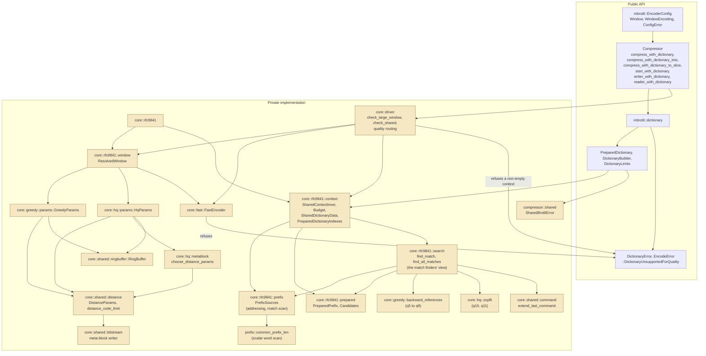
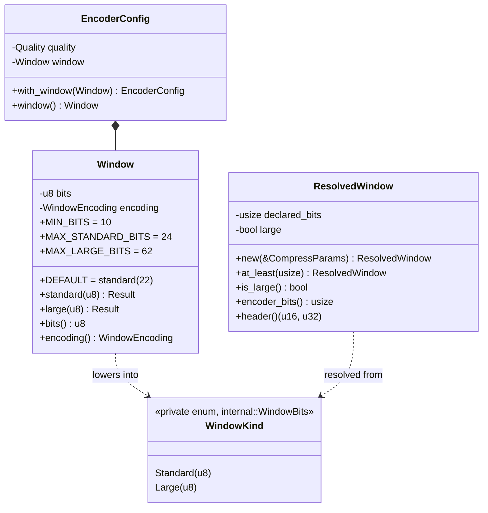
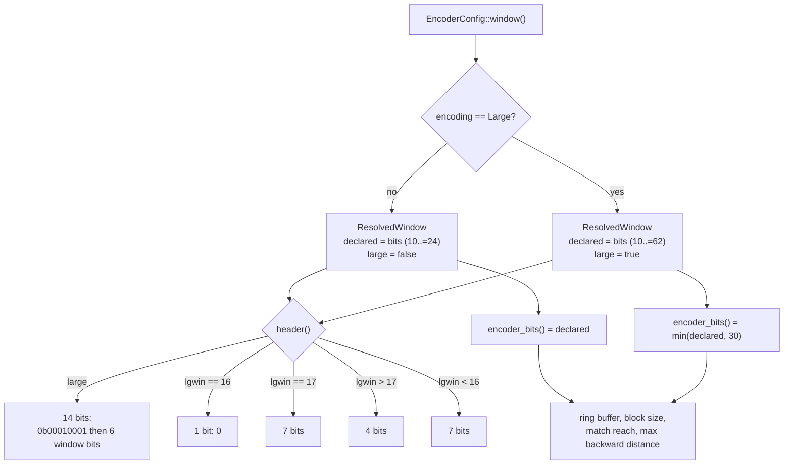
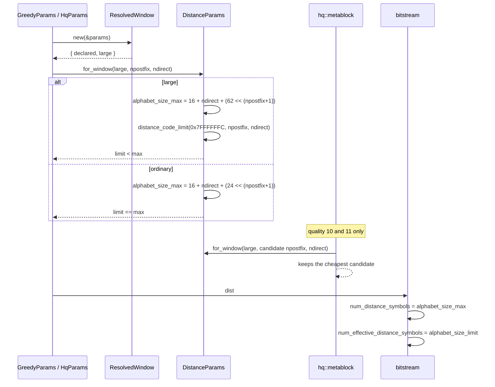
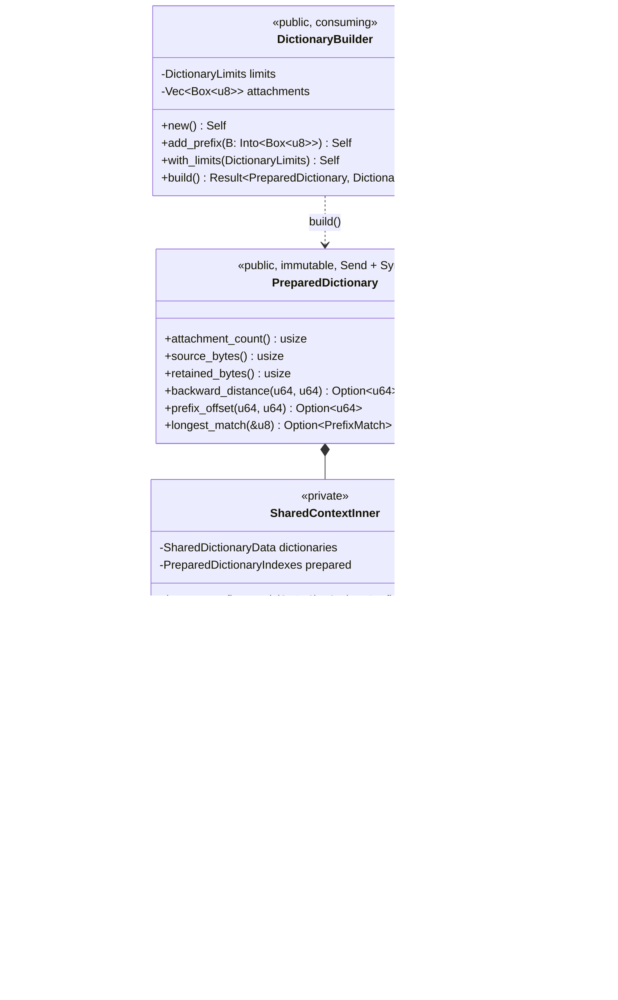
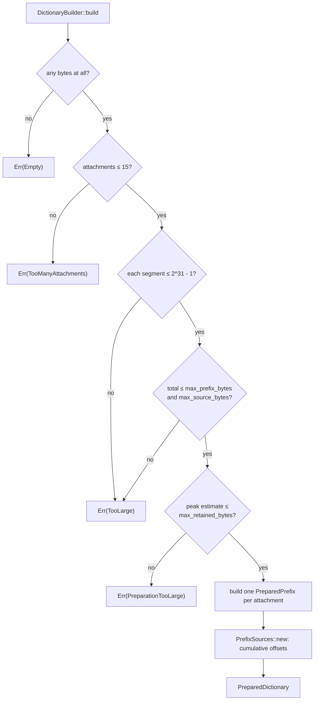
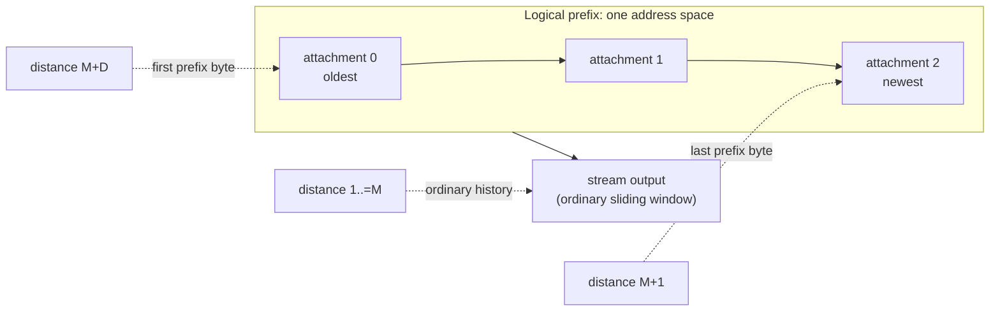
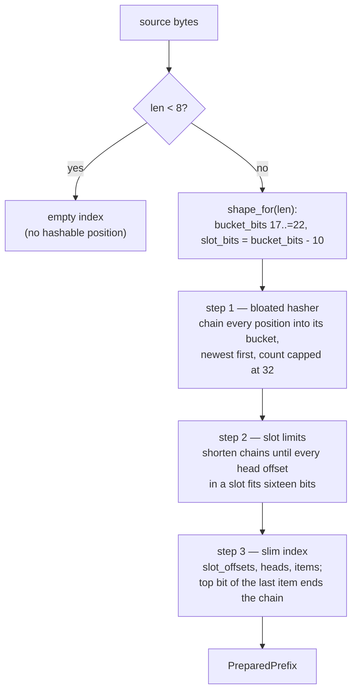
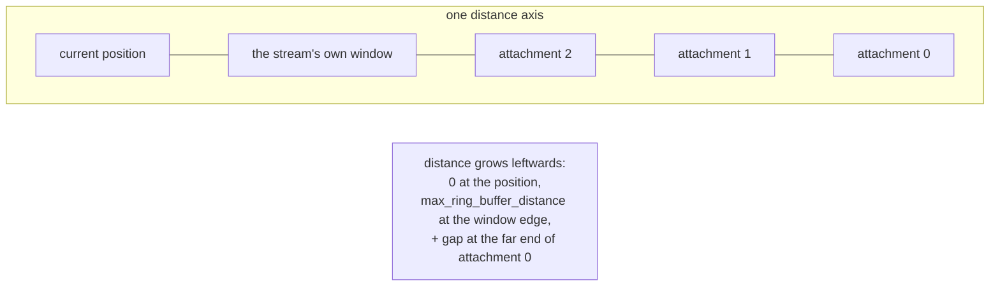
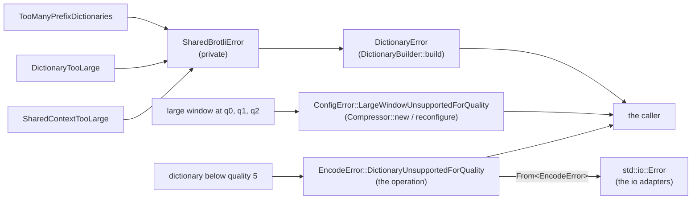

# Shared Brotli (RFC 9841)

What this crate implements of [RFC 9841] today, and where the boundaries of
that implementation are. RFC 9841 updates RFC 7932 with three separable
features:

| Feature | State |
| --- | --- |
| Large Window Brotli | **implemented** for qualities 3 to 11 |
| LZ77 prefix dictionaries: preparation, indexes, addressing, search | **implemented** |
| LZ77 prefix dictionaries: use by an encoder | **implemented** for qualities 5 to 11 — refused below, not ignored |
| Serialized shared dictionaries | not implemented |
| Framing container format | not implemented |

Only the implemented rows are described below as working mechanics. The rest is
recorded in "Known gaps" so that this file never describes intent as if it were
behaviour.

Interoperability choices this design rests on are recorded in
[`docs/rfc9841_interop_decisions.md`](../docs/rfc9841_interop_decisions.md); the
symbol-by-symbol mapping is in
[`docs/rfc9841_api_binding.md`](../docs/rfc9841_api_binding.md).

[RFC 9841]: https://www.rfc-editor.org/rfc/rfc9841.html

## 1. Module boundaries

`mbrotli::dictionary` is the public home of RFC 9841's prefix dictionaries: the
immutable `PreparedDictionary`, the builder that indexes one, the limits it is
built under, and the error preparation reports. Large Window Brotli is not
there, because it is a configuration value rather than a dictionary — it is one
of the two headers a `Window` can carry — so it lives in `EncoderConfig`
alongside the quality and the mode.

`mbrotli::compressor::shared` is what is left: a private module holding the
low-level error the encoders raise, which the public `DictionaryError`,
`ConfigError` and `EncodeError` are built from.

Below the API, `compressor::core::rfc9841` owns the wire primitives. It is
distinct from `compressor::core::shared`, which predates it and means "code more
than one quality needs".



## 2. Selecting a large window

Large Window mode is reached one way only: the constructor a caller names. It
is never inferred from the size, the input, the quality, the target, or anything
else.

```rust
let config = EncoderConfig::default()
    .with_quality(Quality::Q5)
    .with_window(Window::large(30)?);
```

`Window` carries both the size and the header that declares it, in one value,
because they are one decision. The two constructors are the only way to build
one and each validates its own range: `standard` takes `10..=24`, `large` takes
`10..=62`. The ranges overlap, and that is the point — `Window::large(22)` and
`Window::standard(22)` are different windows of the same size, because they
select different headers and different distance alphabets.

There is no separate `large_window` flag that could disagree with the size, and
nothing downstream re-checks a range, because no `Window` can exist that no
header can express.



## 3. Declared window versus retained history

`ResolvedWindow` separates two numbers that an ordinary stream never has to
distinguish:

- **declared bits** — what the header says, `10..=62`;
- **encoder bits** — what the encoder actually keeps history for, capped at
  `MAX_ENCODER_WINDOW_BITS` (30).

Everything that costs memory or bounds a distance is derived from the *encoder*
bits: the ring buffer size, the block size, the match finders' reach, and the
largest backward distance. Only `header()` reads the declared bits.



This is what makes a 62-bit declaration free: it allocates nothing, and the
emitted payload is byte-identical to the same stream declared at 30 bits. See
decision D2.

## 4. The distance alphabet

Large Window is not only a header. The distance alphabet written to the stream
is sized for 62 distance bits instead of 24, while the symbols that may actually
occur stop at `MAX_ALLOWED_DISTANCE` (`(1 << 31) - 4`). `alphabet_size_max` and
`alphabet_size_limit`, which coincide for every RFC 7932 stream, genuinely
differ here — and the meta-block writer already kept them apart, which is why
that layer needed no change.

`distance_code_limit` ports `BrotliCalculateDistanceCodeLimit`: it finds the
largest alphabet that cannot express a distance past the limit, cut on a
complete interleaved group so neither side ever sees a half-represented group.
Its widest result over every legal `(NPOSTFIX, NDIRECT)` pair is exactly 544,
the size of a distance histogram — which is a unit test, not a comment.



The per-meta-block retune at qualities 10 and 11 is the subtle part: it walks
candidate `(NPOSTFIX, NDIRECT)` pairs and replaces the block's alphabet with the
cheapest. Building a candidate with the RFC 7932 constructor there would emit a
64-symbol alphabet under a header that promised 140, and every stream past the
first few bytes would fail to decode. `for_window` carries the flag so it
cannot.

## 5. The prepared dictionary

A `PreparedDictionary` is the caller's. It owns the dictionary bytes, it is
built by a builder that consumes them, and it is handed to a compression call by
*shared* borrow. There is no `Arc`, no `Rc`, no `Mutex`, no `RwLock`, no atomic,
no global registry and no interior mutability anywhere in it or below it — the
type is `Send` and `Sync` because its fields are, and because nothing in it is
mutable, any number of compressors may borrow one at the same time, on any
number of threads, with no synchronisation of this crate's making. A caller who
wants shared *ownership* wraps it in an `Arc`, and that is their policy.

Building one takes no quality. The indexes a dictionary carries are the same
whichever quality later reads them, so one prepared dictionary serves every
quality that can consult one.



Every collection that has stopped growing is a `Box<[_]>`, not a `Vec<_>`: the
capacity word is dead weight after preparation, and dropping it removes `push`
and `truncate` from the type, so "immutable after preparation" is a property
of the type rather than a comment. The builder's attachment list is the one
collection that grows, and it is a `Vec`.

### 5.1. Preparation is a transaction

`build` is all-or-nothing, and every check runs before the first table is
allocated — including the allocation check, which compares a computed upper
bound rather than the finished size, so a dictionary that would not fit its
limit is never built and thrown away. A dictionary with no bytes in it is
refused outright rather than behaving like no dictionary at all: the two would
be indistinguishable, which is exactly the confusion this crate avoids
elsewhere by refusing a dictionary a quality cannot read.



The estimate bounds the build's *peak*, not the finished size: step 3 fills the
slim tables while step 1's and step 2's scratch is still alive, so preparation
costs roughly eight bytes per source byte at its high-water mark, and the peak
is what a limit should refuse. It over-counts on purpose — the item table is
bounded at one entry per hashable position, the most step 1 can chain, and
every other table is counted exactly — so it also bounds the finished context.
`context::the_estimate_is_never_smaller_than_the_context_it_predicts` is what
keeps the two in step.

### 5.2. Virtual concatenation, and the distances that address it

The attachments are never copied into one buffer. `PrefixSources` gives them
one logical address space with a cumulative offset table, and everything else
works in that space. Attachment order *is* prefix order: the first attachment
holds the oldest bytes, the last one the bytes immediately before the stream's
own output.



For a total prefix length `D` and an ordinary maximum backward distance `M`:

```text
address_of(distance, M)  = D - (distance - M)   for M < distance <= M + D
distance_of(address, M)  = M + (D - address)    for 0 <= address < D
```

Both are checked `u64` arithmetic and return `None` rather than wrapping,
outside the prefix range in either direction.
`prefix::addressing_round_trips_through_the_distance` walks every address of a
three-attachment prefix through both directions, and
`dictionary::a_dictionary_reports_its_own_shape` does the same through the
public `PreparedDictionary::backward_distance` and
`PreparedDictionary::prefix_offset`.

### 5.3. The prepared index

One index per attachment, a port of `CreatePreparedDictionary`. The shape is
the reference's because the shape is observable: the bucket count, the hash
width and the per-bucket cap decide which candidates a search sees and in what
order, and those candidates become the commands an encoder emits.



`prepared::the_index_is_identical_to_the_c_reference` builds both and compares
`bucket_bits`, `slot_bits`, `slot_offsets`, `heads` and `items` entry for entry
over six corpora, including one large enough to trigger the shape scaling. The
C side is reached through `brotli-ffi/shim/static_dict_probe.c`, which copies
the reference's three tables out of the single flat allocation it carves them
from.

### 5.4. The search


This is the standalone diagnostic `PreparedDictionary::longest_match` exposes
behind the `diagnostics` feature, not the search a match finder runs; that one
is §5.5. It is feature-gated because the candidate order it breaks ties by is an
implementation detail no application should depend on.

The scan is **scalar**, and its own — a whole-word compare with a byte tail,
not the vector kernel `core::shared::match_len` gives the encoders. Reaching
for the encoders' kernel meant refactoring it, which cost about 6% of quality
1: `docs/rfc9841_benchmarks.md` records the measurement and the symmetric A/B
that separated it from machine drift. The prefix search therefore touches no
file any encoder compiles.

Being scalar, the answer cannot depend on the backend, so there is no identity
test to run for it. The tie rule is the reference's: strictly-longer wins, so
of two equally long matches the one in the *older* attachment, and within an
attachment the one at the *newer* position, is kept.

A match may begin in one attachment and run into the next, and on into the
stream's own history — the virtual concatenation RFC 9841 allows. The candidate
that *starts* a match must still be indexed, so its own eight hashed bytes have
to lie inside one attachment; that is the reference's behaviour too, and is
recorded as decision D6.

### 5.5. How a match finder consults a prefix

`core::rfc9841::search` is the attached context in the form a match finder
needs it. It ports `FindCompoundDictionaryMatch`,
`LookupCompoundDictionaryMatch`, `FindAllCompoundDictionaryMatches` and
`LookupAllCompoundDictionaryMatches`.

The whole integration rests on one number, the reference's `gap`: the total
attached bytes. The concatenated prefix ends exactly where the stream begins,
so a backward distance addresses the window while it is at most
`max_ring_buffer_distance`, and the prefix beyond that. Written the reference's
way, logical address zero of attachment `d` sits at distance
`max_ring_buffer_distance + gap - chunk_start(d)`.



Three things shift together wherever a prefix is attached, and all three
collapse to their ordinary form when `gap` is zero:

| Site | Without a prefix | With one |
| --- | --- | --- |
| Static-dictionary boundary handed to the matcher | `dictionary_start` | `dictionary_start + gap` |
| Prefix search boundary | — | `dictionary_start` |
| `compute_distance_code`, distance-cache guard | `dictionary_start` | `dictionary_start + gap` |

`find_match` improves a `SearchResult` in place, attachment by attachment in
attachment order, replacing the incumbent only on a strictly higher score — so
a tie leaves the earlier finder's match. It probes the four cached distances
first, exactly as the reference does, then walks the bucket chain behind a
four-byte pre-filter at `best_len`. `find_all_matches` is the high-quality
sibling: no cached distances, every length improvement reported, at most
sixty-four per position, with `min_length` carried forward between attachments.

A candidate is measured **inside the attachment it was found in** and stops at
its end, even though the addressing spans every attachment. That is the
reference's behaviour, not an omission. The one place a copy does run across a
seam is `extend_last_command`, which continues an already emitted command into
the concatenation using `PrefixSources::run_from`.

Which qualities reach this at all is fixed by the reference: it compiles its
compound-dictionary search only for `H5`, `H6`, `H40`, `H41`, `H42`, `H55`,
`H65` and the binary tree, so qualities five and above consult a prefix and
qualities zero to four have nowhere to put a match. Where the reference then
silently ignores the dictionary, this crate refuses.

### 5.6. What a dictionary compression call does

```mermaid
stateDiagram-v2
    [*] --> Build: Compressor::new(config)
    Build --> LW: large window at quality 0, 1 or 2
    LW --> [*]: Err(ConfigError::LargeWindowUnsupportedForQuality)
    Build --> Q: a compressor
    Q --> Low: quality below 5
    Low --> [*]: Err(EncodeError::DictionaryUnsupportedForQuality)
    Q --> Attached: quality 5 to 11
    Attached --> Consulted: every match finder consults the prefix
    Consulted --> [*]: a stream whose distances may address the prefix
    Q --> EmptyInput: input empty
    EmptyInput --> [*]: one byte, 0x06
```

The order is fixed and every check runs before any input is consumed: the window
against the quality when the compressor is built, then the quality against the
dictionary when the operation starts.

Below quality five a dictionary is **refused, not ignored**. A stream compressed
without the dictionary it was handed decodes perfectly well on its own, so a
silent drop would only surface as corruption at a decoder that *did* attach the
dictionary. Refusing costs the caller nothing: the compressor is untouched and
the next ordinary call works.

There is no empty dictionary to reason about — `DictionaryBuilder::build`
refuses one — so a compressor either has a dictionary attached to a call or it
does not, and the second case is byte for byte the ordinary path.

An empty *input* keeps the one-shot shortcut and emits the single byte
`BrotliEncoderCompress` emits, dictionary or not: a stream with no bytes in it
cannot reference one. See decision D5.

Every entry point that takes a dictionary — the three one-shot forms, the
session, the writer and the reader — reaches the same bytes for the same
declared size, which `dictionary::every_dictionary_entry_point_reaches_the_same_bytes`
checks. A flush carries the dictionary too, so the bytes after one are still
compressed against it.

### 5.7. Reuse determinism

Nothing a dictionary owns is stream state. There is no LZ77 history in it, no
distance cache, no pending command, no meta-block state and no input position —
only the caller's bytes and indexes derived from them by a pure function. That
is what makes a shared borrow sound, and it makes the reuse contract hold by
construction rather than by a reset.

The compressor is the mutable half, and it *does* reset:
`dictionary::reusing_one_compressor_with_a_dictionary_is_deterministic` runs a
deliberate failure, an ordinary call and an abandoned session between two
dictionary calls and requires the same bytes from both.

## 6. Where a large window is refused

```mermaid
stateDiagram-v2
    [*] --> Check: Compressor::new / reconfigure
    Check --> Ordinary: the window is not large
    Check --> Q012: quality 0, 1 or 2
    Check --> Large: quality 3..=11
    Q012 --> [*]: Err(ConfigError::LargeWindowUnsupportedForQuality)
    Ordinary --> Encode: any operation
    Large --> Encode: any operation
    Encode --> Empty: input empty
    Empty --> [*]: one byte, 0x06
    Encode --> [*]: stream
```

The check runs when the compressor is built, so a refused request never reaches
an operation at all and cannot be dropped on the way to a one-byte stream. The
encoders keep their own copies of the refusal in `FastEncoder::new` and
`GreedyParams::new`, which is now unreachable from a validated configuration and
is reported as `EncodeError::InternalInvariant` if it ever fires.

Qualities 0, 1 and 2 are refused rather than downgraded because all three may
write distances through a code built for the 64-symbol RFC 7932 alphabet: the
fast qualities always do, and quality 2 does whenever a meta-block carries at
most a hundred and twenty-eight commands. `SanitizeParams` drops the request
silently instead; see decision D4 for what lifting the restriction would take.

## 7. Error propagation



The split is by domain rather than by layer: a window the quality cannot carry
is a *configuration* mistake and is reported when the compressor is built; a
dictionary that cannot be prepared is a *dictionary* mistake and is reported
when it is built; a dictionary the quality cannot read needs an operation to
happen at all. `SharedBrotliError` is private and exists only to carry the
low-level refusals up to whichever public error owns them.

## 8. Determinism and SIMD

The window touches no SIMD dispatch at all. `ResolvedWindow` is resolved once
per session from `CompressParams` alone; no window decision depends on the
instruction set, the machine, or the input.
`every_backend_produces_the_same_large_window_stream` runs every backend the
host supports at four declared windows across all nine supporting qualities and
requires byte identity.

The shared context adds **no dispatch point at all**, and touches none of the
existing ones. Preparation and the prefix search are both scalar, both pure
functions of their inputs. Section 42.3 of the implementation specification
lists the prefix hash loop and the prefix match length as kernels to *profile*
before vectorising, and this repository's rules require measurement before
optimisation; Section 45 puts scalar parity first in any case.

The consequence is worth stating plainly: prepared indexes, candidate order and
search results are identical on every machine, so a context prepared once may
be used by a compressor that later resolves a different backend, and no test
has to prove it.

## 9. Verification topology

| Layer | What it checks |
| --- | --- |
| `core::rfc9841::window` unit tests | header bits for all 53 large windows and every ordinary window; retained history never exceeds the declaration |
| `core::shared::distance` unit tests | the large alphabet against every legal `(NPOSTFIX, NDIRECT)` pair; the 544-symbol histogram ceiling; the degenerate branches of `distance_code_limit` |
| `tests/large_window.rs` | header golden bits; round trips through the pinned C decoder with `BROTLI_DECODER_PARAM_LARGE_WINDOW` for `10..=30`; header-only equivalence for `31..=62`; refusal at qualities 0, 1 and 2; empty and tiny inputs; the bound; streaming and one-shot agreement over sixteen chunk sizes; backend identity |
| `core::rfc9841::prefix` unit tests | attachment ordering; addressing over empty attachments; the distance round trip; saturating arithmetic at `u64::MAX`; the match scan against a materialised oracle over every start, seam and limit; the word scan against a byte-by-byte comparison at every shared length and limit |
| `core::rfc9841::prepared` unit tests | the shape ladder; every hashable position indexed once; newest-first, capped bucket chains; **entry-for-entry equality with `CreatePreparedDictionary`** through the workspace shim, over six corpora including one that triggers shape scaling |
| `core::rfc9841::context` unit tests | attachment order and per-attachment indexes; every construction limit; the allocation estimate bounding the real size; the search's longest-match, seam-crossing and longest-over-nearest behaviour |
| `tests/dictionary.rs` | **byte identity with the C encoder** over six dictionary-and-payload shapes at qualities 5 to 11, with the same bytes prepared by `BrotliEncoderPrepareDictionary` and attached by `BrotliEncoderAttachPreparedDictionary`; a round trip through the C decoder with the same dictionaries attached; a ratio floor that fails if the dictionary were ignored; agreement between all six dictionary entry points; the refusal below quality 5 on every one of them; attachment order changing the stream and both orders matching the reference; one dictionary shared by four threads; flush with a dictionary attached; every preparation limit; reuse determinism across a failure and an abandoned session; and that a dictionary call never changes the next ordinary one |
| `fuzz/afl/src/bin/dictionary.rs` | the same oracles driven from fuzz input: attachment counts past the format limit, impossible budgets, the addressing round trip, and the refusal below quality five |
| `tests/differential_c.rs`, `tests/roundtrip.rs`, and the rest | unchanged, and still byte-identical to the C encoder — which is the evidence that no ordinary stream moved |

## Known gaps

- **An attached prefix reaches qualities 5 to 11 only.** The reference compiles
  its compound-dictionary search for `H5`, `H6`, `H40`, `H41`, `H42`, `H55`,
  `H65` and the binary tree, so qualities 0 to 4 have no match finder that could
  carry a prefix match. Where the reference then ignores the dictionary, every
  dictionary entry point refuses with
  `EncodeError::DictionaryUnsupportedForQuality`.
- **No serialized shared dictionaries.** Custom word lists, custom transform
  lists and the context map are not implemented, so
  `DictionaryBuilder::add_serialized` does not exist and the reference's
  `contextual.dict[dict_id]` selection has no counterpart.
- **Three of the six specified limits are absent.** `DictionaryLimits` carries
  the three that something checks today. `max_transformed_word_bytes` and
  `max_trie_nodes` land with the serialized dictionary;
  `max_reusable_workspace_bytes` would bound the compressor's workspace, which
  `RetentionPolicy::Bounded` now does instead.
- **No framing container.** No signature, chunks, metadata, references, central
  directory or final footer. `Compressor::framed_writer` does not exist.
- **No varint module.** It lands with the serialized dictionary parser, its
  first consumer.
- **Large window is refused at qualities 0, 1 and 2.** See decision D4 and §6.
- **Declared windows above 30 bits are not decoded end to end** by any
  implementation in this repository; the pinned C decoder rejects them and this
  crate has no decoder. See decision D3 for what is checked instead.
- **Retained history stops at 30 bits.** Distances therefore never need more
  than 31 bits, so window and distance arithmetic is proven to fit a `usize`
  rather than carried in `u64`. Widening the history past 30 bits would make
  64-bit positions load-bearing and is a separate change. See decision D2.
- **An empty input ignores the declared window and any attached dictionary** in
  the one-shot entry points, matching the reference's shortcut. See decision
  D5.
- **The prefix path is measured but not tuned.** Consulting a prefix costs
  1.26x to 1.84x the time of compressing the same payload without one, for 6%
  to 9% off the output; against the reference's own compound dictionary the
  path sits at 0.69x to 0.90x, which is where the encoder around it sits
  anyway. See [`docs/api_benchmarks.md`](../docs/api_benchmarks.md) §3. Nothing
  in it has been optimised against that measurement: the chain walk and the
  byte comparison are scalar, and the high-quality merge allocates a vector per
  position that contributes a match. The ordinary path is unaffected —
  `attachment` hands the encoders `None`, and every prefix branch is behind
  that or behind `ENABLE_PREFIX`.
