# Shared Brotli (RFC 9841)

What this crate implements of [RFC 9841] today, and where the boundaries of
that implementation are. RFC 9841 updates RFC 7932 with three separable
features:

| Feature | State |
| --- | --- |
| Large Window Brotli | **implemented** for qualities 3 to 11 |
| LZ77 prefix dictionaries: context, indexes, addressing, search | **implemented** |
| LZ77 prefix dictionaries: use by an encoder | not implemented — refused, not ignored |
| Serialized shared dictionaries | not implemented |
| Framing container format | not implemented |

Only the implemented rows are described below as working mechanics. The rest is
recorded in "Known gaps" so that this file never describes intent as if it were
behaviour.

Interoperability choices this design rests on are recorded in
[`docs/rfc9841_interop_decisions.md`](../docs/rfc9841_interop_decisions.md); the
symbol-by-symbol mapping is in
[`docs/rfc9841_api_binding.md`](../docs/rfc9841_api_binding.md).

[RFC 9841]: https://www.rfc-editor.org/rfc/rfc9841.html

## 1. Module boundaries

`mbrotli::compressor::shared` is the public home of every RFC 9841 feature that
is not a per-call encoder parameter: the error enum, the caller-owned
`SharedContext` and its builder, the limits a context is prepared under, and the
result type of a prefix search. Large Window Brotli *is* a per-call parameter —
it is one of the two headers a `WindowBits` can carry — so it lives beside the
others in `mbrotli::compressor` rather than in this module.

Below the API, `compressor::core::rfc9841` owns the wire primitives. It is
distinct from `compressor::core::shared`, which predates it and means "code more
than one quality needs".

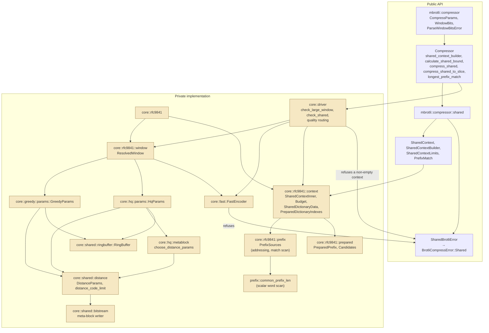

## 2. Selecting a large window

Large Window mode is reached one way only: the constructor a caller names. It
is never inferred from the size, the input, the quality, the target, or anything
else.

```rust
let params = CompressParams::new(QualityLevel::Q5, WindowBits::large(30)?);
```

`WindowBits` is a newtype over a private `WindowKind` enum, so the two
constructors are the only way to build one and each validates its own range:
`standard` takes `10..=24`, `large` takes `10..=62`. The ranges overlap, and
that is the point — `WindowBits::large(22)` and `WindowBits::standard(22)` are
different windows of the same size, because they select different headers and
different distance alphabets.

Keeping the enum private is what makes the invalid state unrepresentable:
nothing downstream has to re-check a range, because no `WindowBits` can exist
that no header can express.

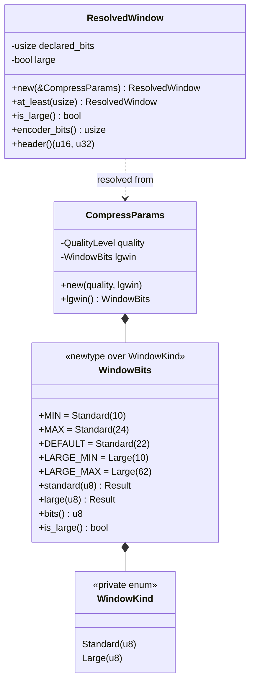

## 3. Declared window versus retained history

`ResolvedWindow` separates two numbers that an ordinary stream never has to
distinguish:

- **declared bits** — what the header says, `10..=62`;
- **encoder bits** — what the encoder actually keeps history for, capped at
  `MAX_ENCODER_WINDOW_BITS` (30).

Everything that costs memory or bounds a distance is derived from the *encoder*
bits: the ring buffer size, the block size, the match finders' reach, and the
largest backward distance. Only `header()` reads the declared bits.

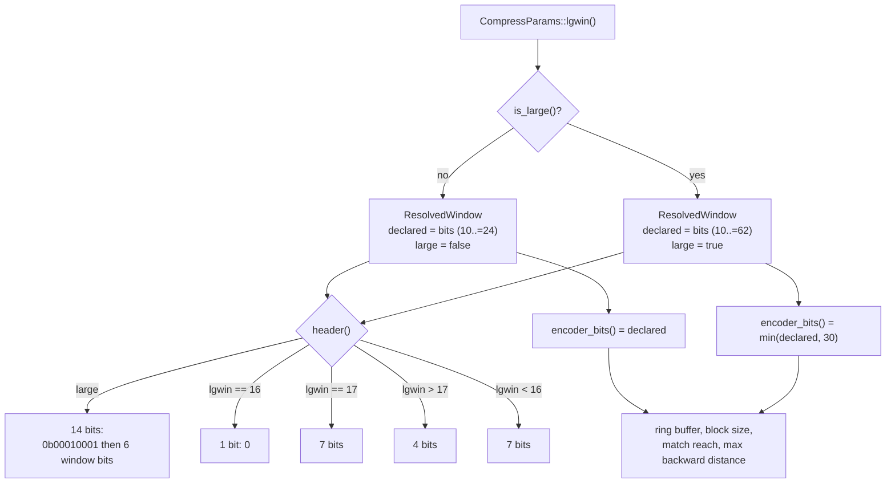

This is what makes a 62-bit declaration free: it allocates nothing, and the
emitted payload is byte-identical to the same stream declared at 30 bits. See
decision D2.

## 4. The distance alphabet

Large Window is not only a header. The distance alphabet written to the stream
is sized for 62 distance bits instead of 24, while the symbols that may actually
occur stop at `MAX_ALLOWED_DISTANCE` (`(1 << 31) - 4`). `alphabet_size_max` and
`alphabet_size_limit`, which coincide for every RFC 7932 stream, genuinely
differ here — and the meta-block writer already kept them apart, which is why
that layer needed no change.

`distance_code_limit` ports `BrotliCalculateDistanceCodeLimit`: it finds the
largest alphabet that cannot express a distance past the limit, cut on a
complete interleaved group so neither side ever sees a half-represented group.
Its widest result over every legal `(NPOSTFIX, NDIRECT)` pair is exactly 544,
the size of a distance histogram — which is a unit test, not a comment.

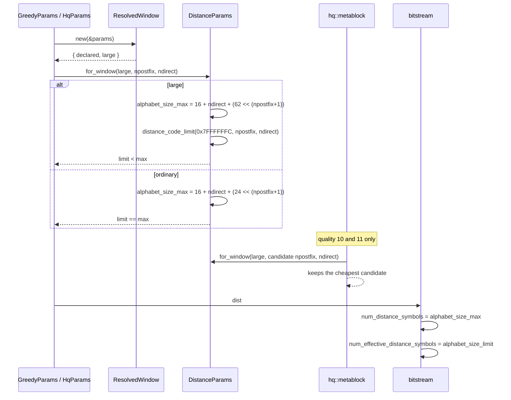

The per-meta-block retune at qualities 10 and 11 is the subtle part: it walks
candidate `(NPOSTFIX, NDIRECT)` pairs and replaces the block's alphabet with the
cheapest. Building a candidate with the RFC 7932 constructor there would emit a
64-symbol alphabet under a header that promised 140, and every stream past the
first few bytes would fail to decode. `for_window` carries the flag so it
cannot.

## 5. The shared context

A `SharedContext` is the caller's. It owns the dictionary bytes, it is built by
a builder that consumes them, and it is handed to a compression call by
exclusive borrow. There is no `Arc`, no `Rc`, no `Mutex`, no `RwLock`, no
atomic, no global registry and no interior mutability anywhere in it or below
it — the type is `Send` and `Sync` because its fields are, and one context
backs at most one call at a time because `&mut` says so.

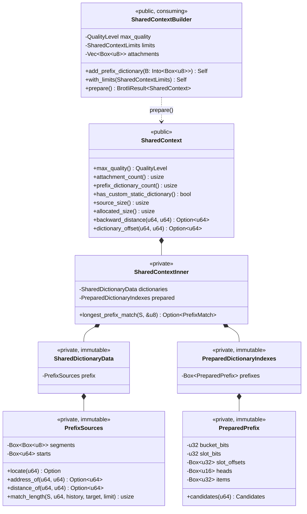

Every collection that has stopped growing is a `Box<[_]>`, not a `Vec<_>`: the
capacity word is dead weight after preparation, and dropping it removes `push`
and `truncate` from the type, so "immutable after preparation" is a property
of the type rather than a comment. The builder's attachment list is the one
collection that grows, and it is a `Vec`.

### 5.1. Preparation is a transaction

`prepare` is all-or-nothing, and every check runs before the first table is
allocated — including the allocation check, which compares a computed upper
bound rather than the finished size, so a context that would not fit its limit
is never built and thrown away.

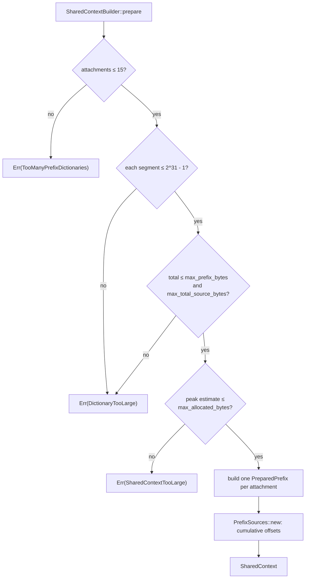

The estimate bounds the build's *peak*, not the finished size: step 3 fills the
slim tables while step 1's and step 2's scratch is still alive, so preparation
costs roughly eight bytes per source byte at its high-water mark, and the peak
is what a limit should refuse. It over-counts on purpose — the item table is
bounded at one entry per hashable position, the most step 1 can chain, and
every other table is counted exactly — so it also bounds the finished context.
`context::the_estimate_is_never_smaller_than_the_context_it_predicts` is what
keeps the two in step.

### 5.2. Virtual concatenation, and the distances that address it

The attachments are never copied into one buffer. `PrefixSources` gives them
one logical address space with a cumulative offset table, and everything else
works in that space. Attachment order *is* prefix order: the first attachment
holds the oldest bytes, the last one the bytes immediately before the stream's
own output.

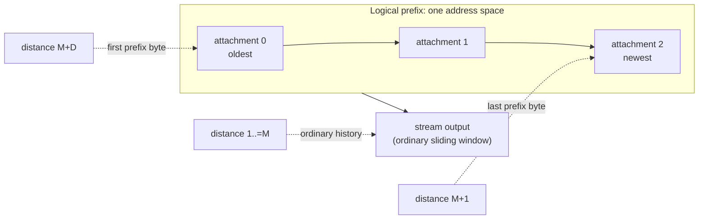

For a total prefix length `D` and an ordinary maximum backward distance `M`:

```text
address_of(distance, M)  = D - (distance - M)   for M < distance <= M + D
distance_of(address, M)  = M + (D - address)    for 0 <= address < D
```

Both are checked `u64` arithmetic and return `None` rather than wrapping,
outside the prefix range in either direction.
`prefix::addressing_round_trips_through_the_distance` walks every address of a
three-attachment prefix through both directions, and
`shared_context::a_prefix_offset_maps_to_the_distance_that_addresses_it` does
the same through the public `SharedContext::backward_distance` and
`SharedContext::dictionary_offset`.

### 5.3. The prepared index

One index per attachment, a port of `CreatePreparedDictionary`. The shape is
the reference's because the shape is observable: the bucket count, the hash
width and the per-bucket cap decide which candidates a search sees and in what
order, and those candidates become the commands an encoder emits.

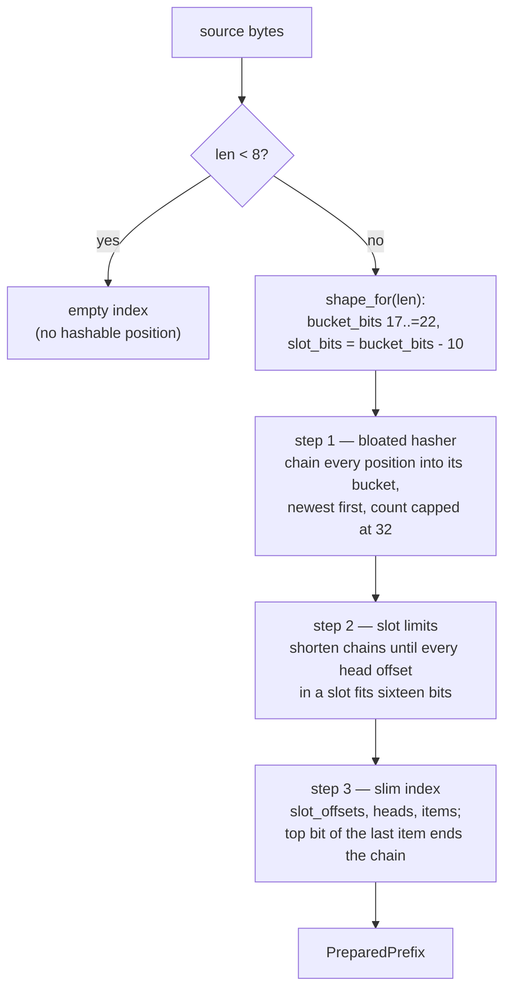

`prepared::the_index_is_identical_to_the_c_reference` builds both and compares
`bucket_bits`, `slot_bits`, `slot_offsets`, `heads` and `items` entry for entry
over six corpora, including one large enough to trigger the shape scaling. The
C side is reached through `brotli-ffi/shim/static_dict_probe.c`, which copies
the reference's three tables out of the single flat allocation it carves them
from.

### 5.4. The search

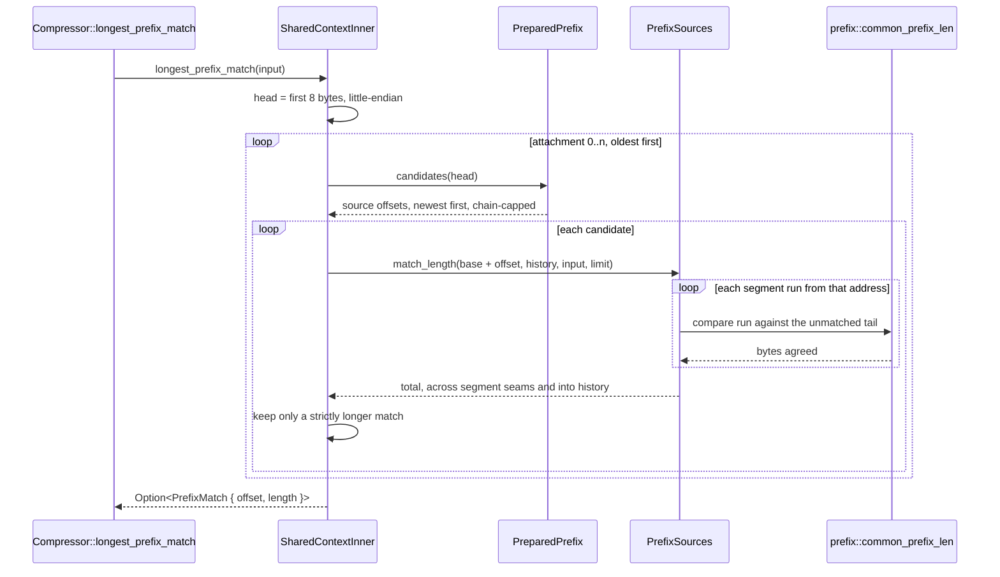

The scan is **scalar**, and its own — a whole-word compare with a byte tail,
not the vector kernel `core::shared::match_len` gives the encoders. Two reasons.
No encoder consults a prefix dictionary yet, so there is no profile that could
justify vectorising this, and this repository's rule is to measure first.
And reaching for the encoders' kernel meant refactoring it, which cost about
6% of quality 1: `docs/rfc9841_benchmarks.md` records the measurement and the
symmetric A/B that separated it from machine drift. The prefix search now
touches no file any encoder compiles.

Being scalar, the answer cannot depend on the backend, so there is no identity
test to run for it. The tie rule is the reference's: strictly-longer wins, so
of two equally long matches the one in the *older* attachment, and within an
attachment the one at the *newer* position, is kept.

A match may begin in one attachment and run into the next, and on into the
stream's own history — the virtual concatenation RFC 9841 allows. The candidate
that *starts* a match must still be indexed, so its own eight hashed bytes have
to lie inside one attachment; that is the reference's behaviour too, and is
recorded as decision D6.

### 5.5. What a shared compression call does

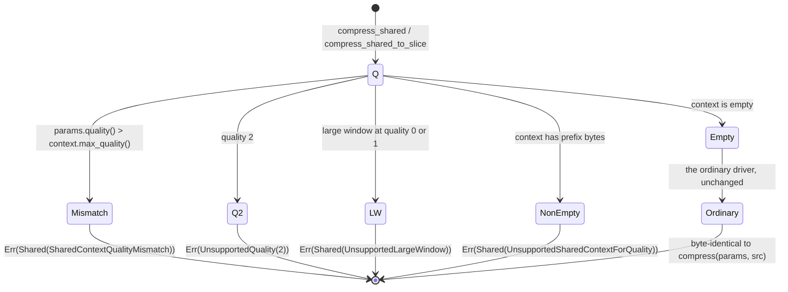

The order is fixed: the context's prepared quality is checked by the public
entry point, which is the only layer that knows it; the rest is checked in
`core::driver::check_shared`. Everything runs before any input is consumed.

A non-empty context is **refused, not ignored**. A stream compressed without
the dictionary it was handed decodes perfectly well on its own, so a silent
drop would only surface as corruption at a decoder that *did* attach the
dictionary. `shared_context::an_attached_dictionary_is_refused_rather_than_ignored`
asserts the refusal at all eleven implemented qualities.

An empty context takes the ordinary driver with no wrapper and no extra
allocation, so it emits exactly the bytes `compress` emits — for ordinary and
large-window streams alike.

### 5.6. Reuse determinism

Nothing a context owns is stream state. There is no LZ77 history in it, no
distance cache, no pending command, no meta-block state and no input position —
only the caller's bytes and indexes derived from them by a pure function. So
the specification's reuse contract holds by construction rather than by a
reset: `compress A; compress B; fail C; compress A` emits the same bytes for
both runs of `A`, which
`shared_context::reusing_one_context_is_deterministic_across_failures` checks
with both a buffer-too-small failure and a quality-mismatch failure in between.

The generation counter and the RAII idle guard the specification describes
belong to the reusable *encoder workspace*, which no context owns yet; they
land with the match finders that need them.

## 6. Where a large window is refused

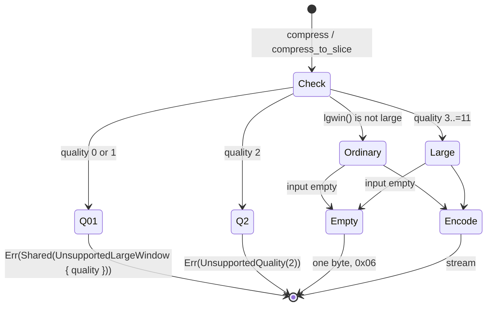

The check runs *before* the empty-input shortcut, so an explicit request is
never dropped on the way to a one-byte stream; and it inspects only the field
this extension added, so nothing that was constructible before reaches it. The
streaming adapters build their encoder lazily and reach the same refusal through
`FastEncoder::new`, which is why `compress_writer` did not have to become
fallible to construct.

Qualities 0 and 1 are refused rather than downgraded because their static
entropy model hard-codes a 64-symbol distance alphabet; see decision D4 for what
lifting that would take.

## 7. Error propagation

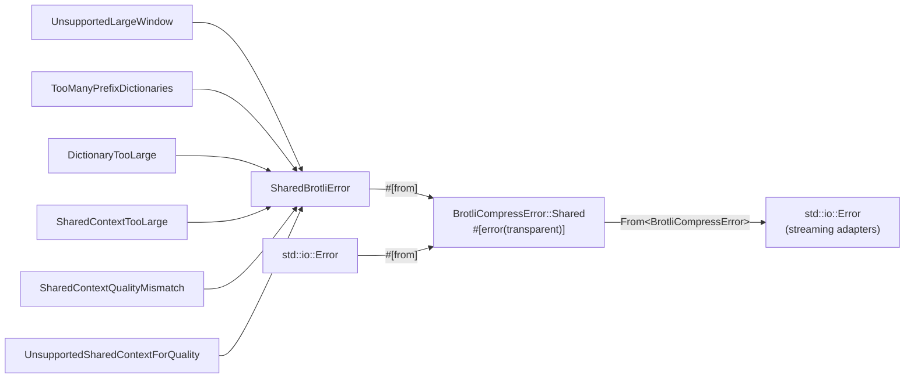

`SharedBrotliError` is public and `#[non_exhaustive]`. Its variants are added as
they become reachable rather than declared ahead of the code that raises them,
so the enum is always an accurate list of what can happen.

## 8. Determinism and SIMD

The window touches no SIMD dispatch at all. `ResolvedWindow` is resolved once
per session from `CompressParams` alone; no window decision depends on the
instruction set, the machine, or the input.
`every_backend_produces_the_same_large_window_stream` runs every backend the
host supports at four declared windows across all nine supporting qualities and
requires byte identity.

The shared context adds **no dispatch point at all**, and touches none of the
existing ones. Preparation and the prefix search are both scalar, both pure
functions of their inputs. Section 42.3 of the implementation specification
lists the prefix hash loop and the prefix match length as kernels to *profile*
before vectorising, and this repository's rules require measurement before
optimisation; Section 45 puts scalar parity first in any case.

The consequence is worth stating plainly: prepared indexes, candidate order and
search results are identical on every machine, so a context prepared once may
be used by a compressor that later resolves a different backend, and no test
has to prove it. `Compressor::longest_prefix_match` still takes `&self` so that
a vectorised scan can be dispatched from the level that type already holds,
without moving the method.

## 9. Verification topology

| Layer | What it checks |
| --- | --- |
| `core::rfc9841::window` unit tests | header bits for all 53 large windows and every ordinary window; retained history never exceeds the declaration |
| `core::shared::distance` unit tests | the large alphabet against every legal `(NPOSTFIX, NDIRECT)` pair; the 544-symbol histogram ceiling; the degenerate branches of `distance_code_limit` |
| `tests/large_window.rs` | header golden bits; round trips through the pinned C decoder with `BROTLI_DECODER_PARAM_LARGE_WINDOW` for `10..=30`; header-only equivalence for `31..=62`; refusal at qualities 0, 1 and 2; empty and tiny inputs; the bound; streaming and one-shot agreement over sixteen chunk sizes; backend identity |
| `core::rfc9841::prefix` unit tests | attachment ordering; addressing over empty attachments; the distance round trip; saturating arithmetic at `u64::MAX`; the match scan against a materialised oracle over every start, seam and limit; the word scan against a byte-by-byte comparison at every shared length and limit |
| `core::rfc9841::prepared` unit tests | the shape ladder; every hashable position indexed once; newest-first, capped bucket chains; **entry-for-entry equality with `CreatePreparedDictionary`** through the workspace shim, over six corpora including one that triggers shape scaling |
| `core::rfc9841::context` unit tests | attachment order and per-attachment indexes; every construction limit; the allocation estimate bounding the real size; the search's longest-match, seam-crossing and longest-over-nearest behaviour |
| `tests/shared_context.rs` | the public surface end to end: accessors, the fifteen-dictionary limit, every limit refusal, the quality-mismatch refusal on all three entry points, the refusal of a non-empty context at all eleven qualities, empty-context byte equality with `compress` over the structural corpora at every quality with a C round trip, large-window equality, slice and vector agreement, reuse determinism across two kinds of failure, `Send` across threads and behind `Arc<Mutex<_>>`, the prefix search and the distance mapping |
| `tests/differential_c.rs`, `tests/roundtrip.rs`, and the rest | unchanged, and still byte-identical to the C encoder — which is the evidence that no ordinary stream moved |

## Known gaps

- **No encoder consults an attached dictionary.** The context, the prepared
  indexes, the addressing and the search all exist and are verified against the
  C reference, but no match finder in `core::fast`, `core::greedy` or
  `core::hq` calls into them, and no command carries a prefix distance. Until
  they do, `compress_shared` and `compress_shared_to_slice` refuse a non-empty
  context with `UnsupportedSharedContextForQuality` rather than emitting a
  stream that ignored it.
- **No streaming shared adapters.** `SharedCompressorWriter` and
  `SharedCompressorReader` do not exist; they land with the encoder
  integration, because a streaming adapter that refused every non-empty context
  would hold an exclusive borrow for a session that cannot happen.
- **No serialized shared dictionaries.** `SharedDictionary`, custom word lists,
  custom transform lists and the context map are not implemented, so
  `SharedContextBuilder::add_serialized_dictionary` does not exist and
  `SharedContext::has_custom_static_dictionary` is always `false`.
- **Three of the six specified limits are absent.** `SharedContextLimits`
  carries the three that something checks today. `max_transformed_word_bytes`
  and `max_trie_nodes` land with the serialized dictionary;
  `max_reusable_workspace_bytes` lands with the reusable encoder workspace.
- **No reusable workspace, so no session guard.** A context holds nothing a
  call can disturb, which is why reuse determinism holds by construction and
  why the generation counter and RAII idle guard of the specification are not
  written yet.
- **No framing container.** No signature, chunks, metadata, references, central
  directory or final footer. `Compressor::framed_writer` does not exist.
- **No varint module.** It lands with the serialized dictionary parser, its
  first consumer.
- **Large window is refused at qualities 0 and 1**, and quality 2 has no
  encoder at all. See decision D4.
- **Declared windows above 30 bits are not decoded end to end** by any
  implementation in this repository; the pinned C decoder rejects them and this
  crate has no decoder. See decision D3 for what is checked instead.
- **Retained history stops at 30 bits.** Distances therefore never need more
  than 31 bits, so window and distance arithmetic is proven to fit a `usize`
  rather than carried in `u64`. Widening the history past 30 bits would make
  64-bit positions load-bearing and is a separate change. See decision D2.
- **An empty input ignores the declared window** in the one-shot entry points,
  matching the reference's shortcut. See decision D5.
