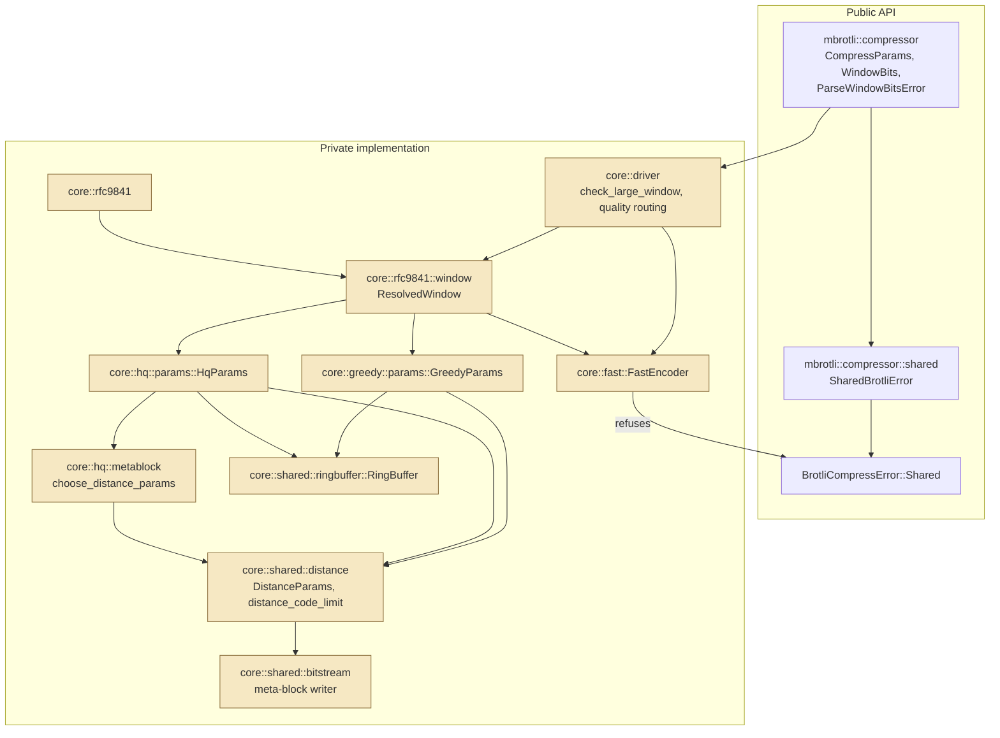
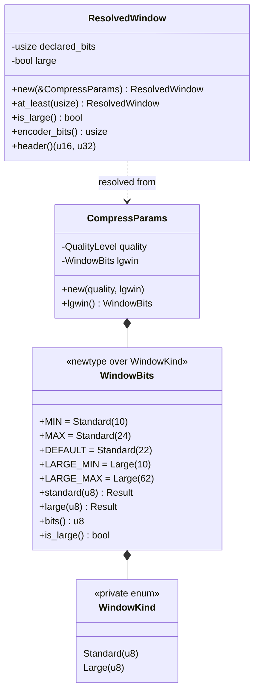
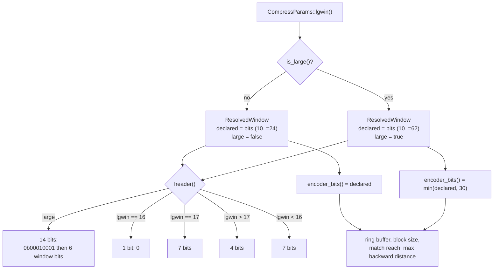
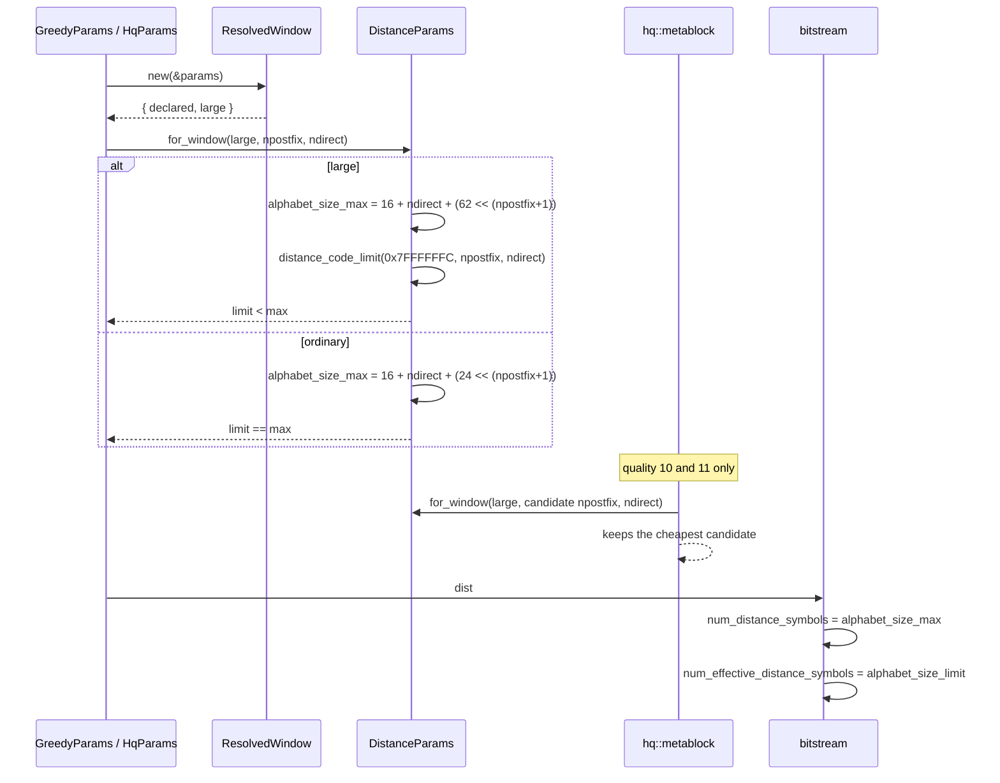
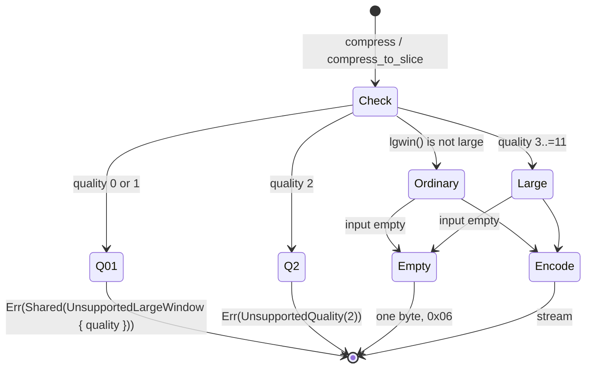
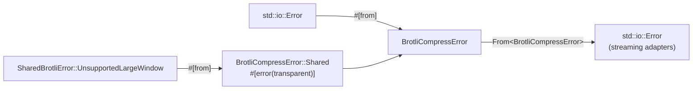

# Shared Brotli (RFC 9841)

What this crate implements of [RFC 9841] today, and where the boundaries of
that implementation are. RFC 9841 updates RFC 7932 with three separable
features:

| Feature | State |
| --- | --- |
| Large Window Brotli | **implemented** for qualities 3 to 11 |
| Shared dictionaries (prefix and serialized) | not implemented |
| Framing container format | not implemented |

Only the first is described below as working mechanics. The rest is recorded in
"Known gaps" so that this file never describes intent as if it were behaviour.

Interoperability choices this design rests on are recorded in
[`docs/rfc9841_interop_decisions.md`](../docs/rfc9841_interop_decisions.md); the
symbol-by-symbol mapping is in
[`docs/rfc9841_api_binding.md`](../docs/rfc9841_api_binding.md).

[RFC 9841]: https://www.rfc-editor.org/rfc/rfc9841.html

## 1. Module boundaries

`mbrotli::compressor::shared` is the public home of every RFC 9841 feature that
is not a per-call encoder parameter. Today it holds one type, the error enum.
Large Window Brotli *is* a per-call parameter — it is one of the two headers a
`WindowBits` can carry — so it lives beside the others in
`mbrotli::compressor` rather than in this module.

Below the API, `compressor::core::rfc9841` owns the wire primitives. It is
distinct from `compressor::core::shared`, which predates it and means "code more
than one quality needs".



## 2. Selecting a large window

Large Window mode is reached one way only: the constructor a caller names. It
is never inferred from the size, the input, the quality, the target, or anything
else.

```rust
let params = CompressParams::new(QualityLevel::Q5, WindowBits::large(30)?);
```

`WindowBits` is a newtype over a private `WindowKind` enum, so the two
constructors are the only way to build one and each validates its own range:
`standard` takes `10..=24`, `large` takes `10..=62`. The ranges overlap, and
that is the point — `WindowBits::large(22)` and `WindowBits::standard(22)` are
different windows of the same size, because they select different headers and
different distance alphabets.

Keeping the enum private is what makes the invalid state unrepresentable:
nothing downstream has to re-check a range, because no `WindowBits` can exist
that no header can express.



## 3. Declared window versus retained history

`ResolvedWindow` separates two numbers that an ordinary stream never has to
distinguish:

- **declared bits** — what the header says, `10..=62`;
- **encoder bits** — what the encoder actually keeps history for, capped at
  `MAX_ENCODER_WINDOW_BITS` (30).

Everything that costs memory or bounds a distance is derived from the *encoder*
bits: the ring buffer size, the block size, the match finders' reach, and the
largest backward distance. Only `header()` reads the declared bits.



This is what makes a 62-bit declaration free: it allocates nothing, and the
emitted payload is byte-identical to the same stream declared at 30 bits. See
decision D2.

## 4. The distance alphabet

Large Window is not only a header. The distance alphabet written to the stream
is sized for 62 distance bits instead of 24, while the symbols that may actually
occur stop at `MAX_ALLOWED_DISTANCE` (`(1 << 31) - 4`). `alphabet_size_max` and
`alphabet_size_limit`, which coincide for every RFC 7932 stream, genuinely
differ here — and the meta-block writer already kept them apart, which is why
that layer needed no change.

`distance_code_limit` ports `BrotliCalculateDistanceCodeLimit`: it finds the
largest alphabet that cannot express a distance past the limit, cut on a
complete interleaved group so neither side ever sees a half-represented group.
Its widest result over every legal `(NPOSTFIX, NDIRECT)` pair is exactly 544,
the size of a distance histogram — which is a unit test, not a comment.



The per-meta-block retune at qualities 10 and 11 is the subtle part: it walks
candidate `(NPOSTFIX, NDIRECT)` pairs and replaces the block's alphabet with the
cheapest. Building a candidate with the RFC 7932 constructor there would emit a
64-symbol alphabet under a header that promised 140, and every stream past the
first few bytes would fail to decode. `for_window` carries the flag so it
cannot.

## 5. Where a large window is refused



The check runs *before* the empty-input shortcut, so an explicit request is
never dropped on the way to a one-byte stream; and it inspects only the field
this extension added, so nothing that was constructible before reaches it. The
streaming adapters build their encoder lazily and reach the same refusal through
`FastEncoder::new`, which is why `compress_writer` did not have to become
fallible to construct.

Qualities 0 and 1 are refused rather than downgraded because their static
entropy model hard-codes a 64-symbol distance alphabet; see decision D4 for what
lifting that would take.

## 6. Error propagation



`SharedBrotliError` is public and `#[non_exhaustive]`. Its variants are added as
they become reachable rather than declared ahead of the code that raises them,
so the enum is always an accurate list of what can happen.

## 7. Determinism and SIMD

Nothing added here touches SIMD dispatch. `ResolvedWindow` is resolved once per
session from `CompressParams` alone; no window decision depends on the
instruction set, the machine, or the input. `every_backend_produces_the_same_large_window_stream`
runs every backend the host supports at four declared windows across all nine
supporting qualities and requires byte identity.

## 8. Verification topology

| Layer | What it checks |
| --- | --- |
| `core::rfc9841::window` unit tests | header bits for all 53 large windows and every ordinary window; retained history never exceeds the declaration |
| `core::shared::distance` unit tests | the large alphabet against every legal `(NPOSTFIX, NDIRECT)` pair; the 544-symbol histogram ceiling; the degenerate branches of `distance_code_limit` |
| `tests/large_window.rs` | header golden bits; round trips through the pinned C decoder with `BROTLI_DECODER_PARAM_LARGE_WINDOW` for `10..=30`; header-only equivalence for `31..=62`; refusal at qualities 0, 1 and 2; empty and tiny inputs; the bound; streaming and one-shot agreement over sixteen chunk sizes; backend identity |
| `tests/differential_c.rs`, `tests/roundtrip.rs`, and the rest | unchanged, and still byte-identical to the C encoder — which is the evidence that no ordinary stream moved |

## Known gaps

- **No shared dictionaries.** `SharedContext`, `SharedContextBuilder`, the
  prefix-dictionary match sources in every quality, and the serialized
  dictionary format are not implemented. There is no `_shared` entry point.
- **No framing container.** No signature, chunks, metadata, references, central
  directory or final footer. `Compressor::framed_writer` does not exist.
- **No varint module.** It lands with the serialized dictionary parser, its
  first consumer.
- **Large window is refused at qualities 0 and 1**, and quality 2 has no
  encoder at all. See decision D4.
- **Declared windows above 30 bits are not decoded end to end** by any
  implementation in this repository; the pinned C decoder rejects them and this
  crate has no decoder. See decision D3 for what is checked instead.
- **Retained history stops at 30 bits.** Distances therefore never need more
  than 31 bits, so window and distance arithmetic is proven to fit a `usize`
  rather than carried in `u64`. Widening the history past 30 bits would make
  64-bit positions load-bearing and is a separate change. See decision D2.
- **An empty input ignores the declared window** in the one-shot entry points,
  matching the reference's shortcut. See decision D5.
