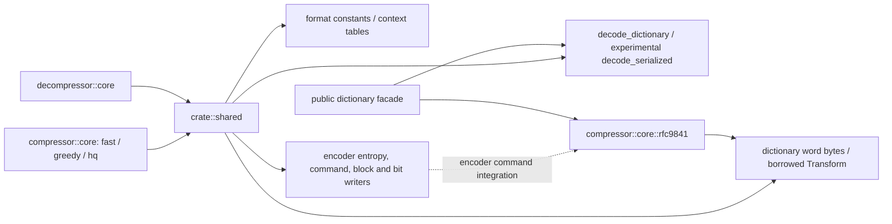
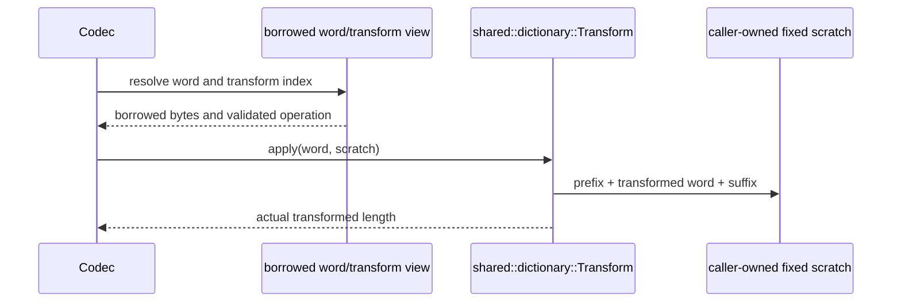

# Private common codec primitives

`src/shared` is a private crate-root module. It replaces
`src/compressor/core/shared`; both codecs import it directly. It is not a public
re-export or a second implementation. Existing bit writer, entropy construction,
match scans, command/metablock representations and ring buffer keep their encoder
behavior and tests. Binary dictionary/transform data is stored once here.

The decoder uses wire constants, context tables, built-in words, shared borrowed
transform application and decode-only dictionary storage. It owns its own bit
reader, Huffman reader, window/history and parser state in `decompressor::core`;
encoder bit output and match-search types are not reused as decoder state.

The encoder's experimental transform-list ownership and index construction stay
under `compressor::core::rfc9841`, but application delegates to the same borrowed
`Transform` used by decoding. The shared module still contains encoder-only
primitives: command integration depends on private RFC9841 encoder types. This
is a crate-private dependency, not a fully independent reusable package. Backend
selection remains at each public codec's construction boundary; existing encoder
SIMD dispatch stays in `compressor::core::dispatch`.

Transform operations are byte-oriented format rules, not general Unicode case
conversion. Incomplete sequences use initialized guard space in the fixed scratch;
suffix output overwrites any casing writes beyond the logical word. Custom shift
operations and custom serialized representations compile only with `experimental`.
No transformed dictionary is materialized. Borrowed inputs outlive one application,
and no core keeps caller pointers between operations.

Known gap: encoder-specific primitives remain colocated with format-neutral data;
there is no standalone common-data crate. This keeps existing private dependencies
and public API identities intact while making common data accessible to both codecs.
