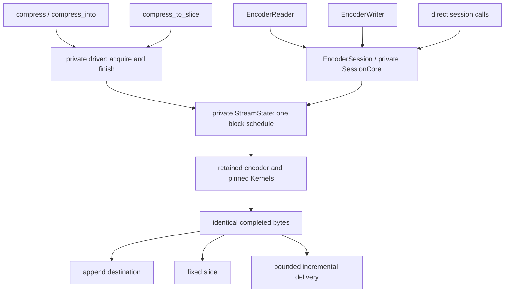
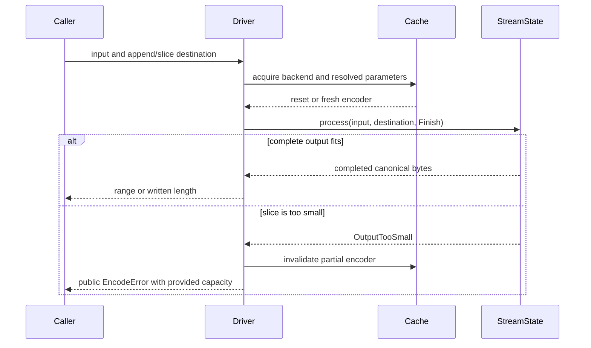

# Universal compression API identity

## Decision and scope

The user explicitly chose universal Rust API byte identity over native C
one-shot identity. This supersedes the earlier unresolved choice recorded during
the Track A audit; it does not alter the externally authored files in
`specifications/`.

For equivalent stream settings, `compress`, `compress_into`, `compress_to_slice`,
`EncoderSession`, `EncoderReader` and `EncoderWriter` produce identical bytes.
The rule includes empty, tiny, incompressible, dictionary-backed and Large Window
inputs. Backend selection, reuse, caller chunk sizes and output capacity do not
select another encoding. Output capacity can determine success versus error.

Equivalent settings mean the same encoder configuration, dictionary, declared
size and flush/continuation behavior. The streaming counterpart of one-shot is a
zero-offset session declaring `InputSize::Exact(input.len() as u64)` and no extra
flushes. Unknown input size can choose different matchers; flush boundaries alter
meta-blocks; nonzero offsets produce continuations rather than standalone streams.
These are different compression jobs, not exceptions based on API shape.

## Removed behavior

Previously the private one-shot driver reproduced two C-only rewrites:

- Empty input bypassed the encoder and returned `[0x06]`, losing the requested
  stream header, including an explicit Large Window declaration.
- Expanded compressed output was replaced with a whole-stream uncompressed
  encoding. A short destination could succeed by selecting that smaller encoding.

Neither rewrite is compatible with an incremental sink that has already received
bytes. They are removed rather than added to streaming through unbounded buffering.
Per-meta-block compressed/uncompressed decisions inside the encoders remain intact.
Decompression functionality is unchanged and remains outside this crate's scope.

## Module boundaries and flow

The public API and configuration types are unchanged. `core::driver` owns routing,
cache acquisition and one-shot transactionality. `core::stream::StreamState` owns
the shared block schedule and output delivery. `core::session::SessionCore` owns
session borrows, logical-position validation and cleanup. Encoder families retain
their selected SIMD kernels; no dispatch point or inner algorithm changed here.



One-shot input remains borrowed and needs no staging/pending allocation. Even
empty input passes through the shared encoder finish path. Empty standard streams
retain the resolved window header; empty Large Window streams retain the explicit
marker and declared bits. Unsupported configurations/dictionaries are still
rejected before compression, including for empty input.



The vector path retains append rollback on error. A failed slice can contain a
partial output prefix; its encoder is conservatively invalidated. A retry must
restart the operation with sufficient capacity, and reproduces the same canonical
stream. Exactly the vector output's length suffices, even when it is smaller than
the fast encoder's preferred scratch reservation. Public conservative size bounds
continue to apply without relying on a whole-stream rewrite.

## Reference oracles

C remains an independent encoder and decoder oracle, but its API is part of the
comparison contract:

| Oracle | Purpose |
| --- | --- |
| C streaming FINISH, same settings | Canonical byte differential for Rust one-shot and exact-size sessions |
| C streaming with matching flush boundaries | Flush semantics and dictionary continuation checks |
| Native C one-shot | Explicit regression demonstrating intentional API-specific differences |
| C decoder | Independent validity and content round trips |

C quality 0/1 PROCESS calls emit fragments at caller chunk boundaries; Rust holds
undecided tails to make chunking irrelevant. The streaming Criterion adapter
normalizes C's chunk schedule and charges its staging copy/allocation to C. The
one-shot Criterion adapter borrows the whole input and uses streaming FINISH.
Test and benchmark C buffers use conservative streaming capacity, not the native
one-shot bound whose validity depends on rewriting expanded output.

The public guarantee does not assert identical bytes to every possible native C
call schedule. Nor does it claim a new independent decoder oracle for original
window declarations above the pinned C decoder's limit.

## Verification

`tests/streaming.rs` now includes empty/tiny inputs in its all-quality API matrix.
A new small-window regression compares all six API shapes at lengths 0, 1, 1024
and 8193, checks exact and one-byte-short slices, append-prefix preservation and
chunk sizes 1, 1024 and 8193. Before the fix its first case failed with one-shot
`[6]` versus streamed `[51]`. An independent regression decodes both canonical
and native C empty streams while requiring their bytes to differ.

Dictionary and Large Window tests pin empty-input equality and header retention.
The greedy parameter matrix no longer skips empty one-shot input. The warmed
incompressible small-window slice allocator test remains, now without asserting
the removed fallback header.

The AFL streaming target strictly compares vector, append, exact slice, session,
reader and writer output. There are no empty-input skips or output-length-based
exceptions. The C differential and Large Window targets likewise process empty
input. Campaigns use fresh output directories because the oracle changed.

Relevant commands (local reports under `target/`, never committed):

```sh
CARGO_PROFILE_TEST_OPT_LEVEL=1 cargo test --workspace --all-features --locked
cargo clippy --workspace --all-targets --all-features --locked -- -D warnings
CARGO_PROFILE_TEST_OPT_LEVEL=1 CARGO_TARGET_DIR=target/universal-coverage cargo llvm-cov --workspace --all-features --locked --json --output-path target/universal-coverage.json
CARGO_PROFILE_TEST_OPT_LEVEL=1 CARGO_TARGET_DIR=target/universal-coverage cargo llvm-cov --no-clean --all-features --locked --bench compress --json --output-path target/universal-coverage-bench.json -- --test
cargo bench --bench compress --locked -- 'universal/q(0|1|5|11)/' --sample-size 10 --warm-up-time 1 --measurement-time 2
# From fuzz/afl:
cargo fmt --all -- --check
cargo clippy --all-targets -- -D warnings
cargo afl test
cargo afl build --release --bin differential_c --bin streaming_equivalence --bin output_capacity --bin large_window
```

The September 5, 2026 validation on aarch64 Apple M5 Pro passed all 959 workspace
tests (including doctests), strict all-feature/all-target Clippy and formatting.
The workspace LLVM coverage report covers 1,932/1,932 library functions (100%);
source-location inspection found no uncalled library functions. The separate AFL
package passed formatting, strict Clippy and committed regression replay.
The Criterion test-mode coverage pass exercised every benchmark helper and
closure, including the new canonical C adapter and all universal benchmark cases.
AddressSanitizer passed 67 streaming, public API, dictionary and Large Window
tests on `aarch64-apple-darwin` with nightly Rust and the `experimental` feature.

Fresh 60-second AFL campaigns completed 284,412 C differential, 155,775 streaming
equivalence, 160,012 output-capacity and 25,667 Large Window executions, with no
saved crashes or hangs. Their reported stability was 99.98%; these are bounded smoke campaigns,
not a claim of exhaustive coverage or perfectly stable edge instrumentation.

## Performance and remaining gates

`universal/q*/` measures cold canonical empty and incompressible 16 KiB streams
at window 10, with byte and decoder validation before timing Rust and C. An empty
call now constructs/resets its configured encoder rather than bypassing it; cold
latency and retained memory can therefore increase. Expanded output can also be
larger than native C one-shot output. Those are explicit costs of this contract,
not equivalent-output speed regressions to conceal.

Exploratory Criterion central estimates from the command above (release mode,
stable Rust 1.98.1, Apple M5 Pro, pinned C revision `028fb5a`):

| Quality | Empty bytes, both | Empty Rust / C | 16 KiB binary bytes, both | Binary Rust / C |
| --- | ---: | ---: | ---: | ---: |
| 0 | 1 | 216 / 107 ns | 16,433 | 116 / 128 µs |
| 1 | 1 | 371 / 93 ns | 16,433 | 94 / 110 µs |
| 5 | 2 | 2.99 / 0.075 µs | 16,389 | 88 / 75 µs |
| 11 | 2 | 5.88 / 0.077 µs | 16,389 | 23.27 / 22.64 ms |

Both timed implementations include cold encoder/output allocation and destruction;
corpus generation and byte/decoder validation occur outside the timed region.
Other verification work ran concurrently, so these short measurements identify
costs to investigate rather than establish release performance gates.

Earlier native-C-one-shot benchmark results are historical and cannot be treated
as equivalent-API before/after measurements for this change. Track A's complete
per-quality/per-API speed/RSS targets, executed AVX2 evidence and original-header
wide-window interoperability evidence remain separate open gates.
