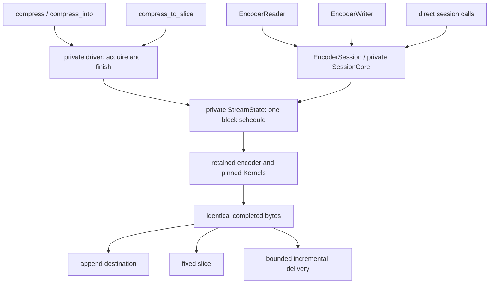
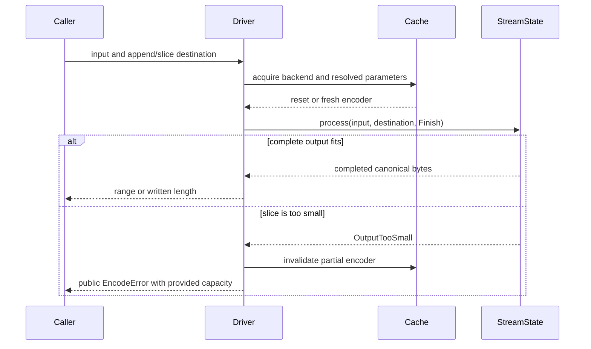

# Universal compression API identity

## Scope

For equivalent stream settings, `compress`, `compress_into`, `compress_to_slice`,
`EncoderSession`, `EncoderReader` and `EncoderWriter` produce identical bytes.
The rule includes empty, tiny, incompressible, dictionary-backed and Large Window
inputs. Backend selection, reuse, caller chunk sizes and output capacity do not
select another encoding. Output capacity can determine success versus error.

Equivalent settings mean the same encoder configuration, dictionary, declared
size and flush/continuation behavior. The streaming counterpart of one-shot is a
zero-offset session declaring `InputSize::Exact(input.len() as u64)` and no extra
flushes. Unknown input size can choose different matchers; flush boundaries alter
meta-blocks; nonzero offsets produce continuations rather than standalone streams.
These are different compression jobs, not exceptions based on API shape.

## Module boundaries and flow

`core::driver` owns routing, cache acquisition and one-shot transactionality.
`core::stream::StreamState` owns the shared block schedule and output delivery.
`core::session::SessionCore` owns session borrows, logical-position validation
and cleanup. Encoder families retain their selected SIMD kernels.

Empty input uses the configured encoder's finish path. Expanded output keeps
its per-meta-block compressed/uncompressed choices; there is no whole-stream
replacement based on final size. The same rules apply to all serial APIs.

One-shot input remains borrowed and needs no staging/pending allocation. Even
empty input passes through the shared encoder finish path. Empty standard streams
retain the resolved window header; empty Large Window streams retain the explicit
marker and declared bits. Unsupported configurations/dictionaries are still
rejected before compression, including for empty input.

The vector path retains append rollback on error. A failed slice can contain a
partial output prefix; its encoder is conservatively invalidated. A retry must
restart the operation with sufficient capacity, and reproduces the same canonical
stream. Exactly the vector output's length suffices, even when it is smaller than
the fast encoder's preferred scratch reservation. Public conservative size bounds
continue to apply without relying on a whole-stream rewrite.

## Reference oracles

C remains an independent encoder and decoder oracle, but its API is part of the
comparison contract:

| Oracle | Purpose |
| --- | --- |
| C streaming FINISH, same settings | Canonical byte differential for Rust one-shot and exact-size sessions |
| C streaming with matching flush boundaries | Flush semantics and dictionary continuation checks |
| Native C one-shot | Explicit regression demonstrating intentional API-specific differences |
| C decoder | Independent validity and content round trips |

C quality 0/1 PROCESS calls emit fragments at caller chunk boundaries; Rust holds
undecided tails to make chunking irrelevant. The streaming Criterion adapter
normalizes C's chunk schedule and charges its staging copy/allocation to C. The
one-shot Criterion adapter borrows the whole input and uses streaming FINISH.
Test and benchmark C buffers use conservative streaming capacity, not the native
one-shot bound whose validity depends on rewriting expanded output.

The public guarantee does not assert identical bytes to every possible native C
call schedule. Nor does it claim a new independent decoder oracle for original
window declarations above the pinned C decoder's limit.

## Verification

`tests/streaming.rs` compares all six serial API shapes across qualities,
empty/tiny/incompressible inputs, small windows, and input/output chunk sizes.
It checks exact-size and one-byte-short slices and append-prefix preservation.
Dictionary and Large Window tests check empty-input identity and header retention.
Native C one-shot differences have explicit regression tests.

AFL's streaming target compares vector, append, exact slice, session, reader and
writer output. The C differential and Large Window targets include empty input.
`universal/q*/` in the Criterion harness measures cold empty and incompressible
streams with matching C streaming settings. See [benchmarking](../docs/benchmarking.md).

## Known gaps

- Original window declarations above 30 bits lack an independent end-to-end
  decoder oracle in this repository.
- Experimental custom search has a narrower C byte oracle than ordinary encoding.
- Independent parallel segments have a separate output policy; serial API byte
  identity does not extend to parallel compression.
