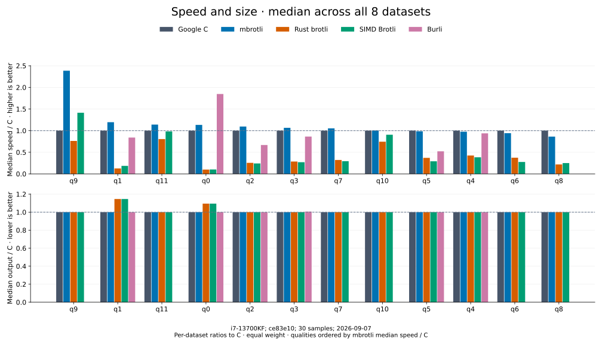

# Benchmark results

Compare compression and decompression with vertical speed bars across eight
datasets, then open a quality page for individual workloads. Compression includes
Google C Brotli, mbrotli, Rust Brotli, SIMD Brotli and Burli, with output sizes.
Decompression uses the same libraries except SIMD Brotli.

## Decompression comparison

The [four-decoder comparison](decoders/README.md) measures Google C Brotli,
mbrotli, Rust brotli and Burli on identical C-generated streams from the eight
datasets listed below at q0–q11. SIMD Brotli shares Rust brotli's decoder project and
is omitted. Burli participates at every source quality.


Each bar is the median of eight equally weighted C-time/decoder-time ratios.
The tables also show direct median Burli-time/mbrotli-time ratios (overall **1.013×**). Higher is
faster. Open the [quality pages](decoders/README.md) for all 384 cases, mean
confidence bounds, restored throughput and shared compressed sizes.
The current decoder includes three-symbol literal batches and short stored
header recognition; their benefit on identical inputs is recorded separately
in the [paired optimization report](../../architecture/decoder-literal-performance.md).

These are cold native APIs: C knows output capacity, while Rust brotli includes
its 4 KiB I/O adapter. See the [run report](decoder-comparison.md),
[CSV](decoder-comparison.csv) and [environment](decoder-comparison-environment.json).
The preceding run measured **0.967×** on the same inputs; separate-run
variation is not paired evidence of a code regression or improvement.

## Compression: median across all datasets



Each dataset contributes one ratio: **speed / C = C mean time / encoder mean
time**, and **output / C = encoder bytes / C bytes**. The summary takes the
median of the eight ratios, giving empty input, tiny input, and large inputs
equal weight. Higher speed and lower output are better; the dashed line is C
at 1×. These are medians across datasets, not median Criterion sample times.

Qualities with the highest mbrotli median speed / C appear first. Within each
quality page, datasets are sorted by mbrotli speed relative to the fastest
competitor. All results remain visible, including slower cases. All bar axes
are linear and start at zero; exact values accompany the charts.

[Open the median table and larger charts for every quality](qualities/README.md).

## Results by quality

These pages use the latest recorded five-encoder run,
`library-refresh-2026-09-07-191328` (2026-09-07), from the
[library benchmark refresh](library-comparison.md). Every chart and
table on a quality page comes from that same run. Burli supports q0–q5 only.

| Encoding family | Quality pages |
| --- | --- |
| Fast | [0](qualities/q0.md) · [1](qualities/q1.md) |
| Greedy | [2](qualities/q2.md) · [3](qualities/q3.md) · [4](qualities/q4.md) · [5](qualities/q5.md) · [6](qualities/q6.md) · [7](qualities/q7.md) · [8](qualities/q8.md) · [9](qualities/q9.md) |
| High quality | [10](qualities/q10.md) · [11](qualities/q11.md) |

Each page opens with a median speed/size comparison, followed by eight dataset
charts. Expand the tables below a chart for exact mean timings, 95% confidence
bounds, throughput, output bytes, and output / input ratios.

## Datasets and measurement contract

| Dataset | Input bytes | Content |
| --- | ---: | --- |
| empty | 0 | API overhead without input |
| tiny-text | 44 | Quick-brown-fox sentence |
| alice29 | 152,089 | Vendored Alice in Wonderland text |
| text-1m | 1,048,576 | Alice repeated cyclically |
| binary-64k | 65,536 | Structured binary bytes |
| random-64k | 65,536 | Prefix of the pseudorandom corpus |
| random-1m | 1,048,576 | Deterministic xorshift64 bytes |
| repeated-1m | 1,048,576 | Repeated `a` bytes |

The recorded host is an Intel Core i7-13700KF under WSL2, with release builds
pinned to logical CPU 2. Each case uses generic mode, window 22, and cold native
APIs, including encoder construction, allocation, compression, and disposal.
There are 30 samples per case, 0.2 seconds warmup, and at least 0.5 seconds
measurement. All 432 outputs passed C-decoder validation before timing.

Equal quality numbers express each implementation's effort policy, not equal
output size. Rust Brotli and SIMD Brotli include their native 4 KiB I/O adapters.
The lowest recorded mean is not necessarily a statistically significant lead;
confidence bounds do not capture every source of host or allocator variation.
See the [run analysis and limits](library-comparison.md#final-measurements).
This is a fresh comparison at the recorded revision, not a matched before/after
experiment.

## Run reports and raw data

| Record | Contents |
| --- | --- |
| [Decoder literal optimization](../../architecture/decoder-literal-performance.md) | Literal batching, short stored headers, direct Burli medians and 78 paired cases |
| [Decoder benchmark refresh](decoder-comparison.md) | Current optimized decoder, complete four-library sweep, measurement settings and limitations |
| [Latest four-decoder CSV](decoder-comparison.csv) | All 384 measurements used by the decoder quality pages |
| [Latest decoder environment](decoder-comparison-environment.json) | Source and binary hashes, versions, commands and run provenance |
| [Before literal batching](decoder-comparison-before-literal-batching.csv) | Preceding 384-case run on the same eight inputs, with median speed / Burli of 0.980× |
| [Before literal batching environment](decoder-comparison-before-literal-batching-environment.json) | Provenance of the preceding run |
| [Previous decoder CSV](decoder-comparison-before-owned-output.csv) | Preserved 384-case run before the owned-output optimization |
| [Previous decoder environment](decoder-comparison-before-owned-output-environment.json) | Original provenance for the historical decoder run |
| [Library benchmark refresh](library-comparison.md) | Current checkout, complete five-library sweep, measurement settings, and limitations |
| [Latest five-encoder CSV](library-comparison.csv) | All 432 measurements used by the quality pages |
| [Latest run environment](library-comparison-environment.json) | Revision, versions, compiler, machine, commands, source hashes, and binary identity |
| [Optimization follow-up](competitor-paths.md) | Source review, targeted changes, matched before/after results, limitations, and charts across qualities |
| [Quality 11 review against SIMD Brotli](hq-q11-review.md) | Why the fork led at q11, the short-scan and distance-cache changes, matched q10/q11 Criterion pairs, and the remaining leads with their causes |
| [Decoder ownership review](../../architecture/decoder-owned-output.md) | Why Burli led on raw/repeated output, ownership and growth changes, paired performance, allocation measurements and validation |
| [Burli review](burli-review.md) | Which Burli q0–q5 leads are policy and which were mbrotli overhead; the lazy q0 arena, per-build Huffman pool, first-word match length and array-reference tables; the fuzz oracle fix; the after sweep |
| [Optimization follow-up CSV](competitor-paths-comparison.csv) | Preserved earlier five-encoder measurements |
| [Optimization follow-up environment](competitor-paths-environment.json) | Provenance for the earlier optimization run |
| [Matched before/after CSV](competitor-paths-before-after.csv) | Separate 96-case mbrotli comparison; not mixed into quality-page measurements |
| [Original comparison report](implementation-comparison.md) | Earlier 20-sample run, presented with the same median/bar format |
| [Original CSV](implementation-comparison.csv) | Preserved earlier measurements |
| [Original environment](implementation-comparison-environment.json) | Provenance for the earlier run |

## Reproduce the documentation

For running benchmarks, profiling, and checks, use the
[benchmark guide](../benchmarking.md). Rebuild the quality pages and SVG charts
from the recorded data with Matplotlib 3.10.8:

```sh
python3 benchmarks/comparison/quality_docs.py \
  --csv docs/benchmarks/library-comparison.csv \
  --environment docs/benchmarks/library-comparison-environment.json \
  --report docs/benchmarks/library-comparison.md \
  --output docs/benchmarks/qualities
python3 benchmarks/comparison/plot.py \
  --csv docs/benchmarks/library-comparison.csv \
  --output docs/benchmarks/library-comparison-charts \
  --subtitle 'i7-13700KF; ce83e10; 30 samples; 2026-09-07'
python3 benchmarks/comparison/decoder_docs.py \
  --csv docs/benchmarks/decoder-comparison.csv \
  --environment docs/benchmarks/decoder-comparison-environment.json \
  --report docs/benchmarks/decoder-comparison.md \
  --output docs/benchmarks/decoders
```

The generator validates the complete supported matrix, then groups it by
quality and dataset. It generates the median overview, twelve quality pages,
and their charts from the CSV and environment record without rerunning
benchmarks. Earlier and matched before/after runs retain their own data sources.
