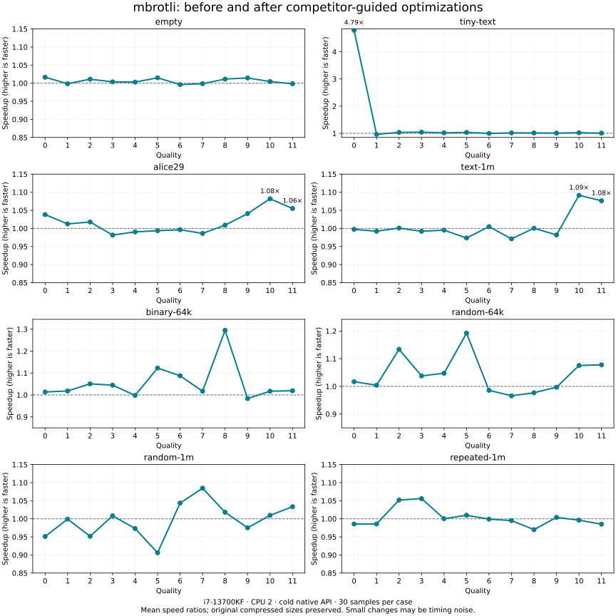
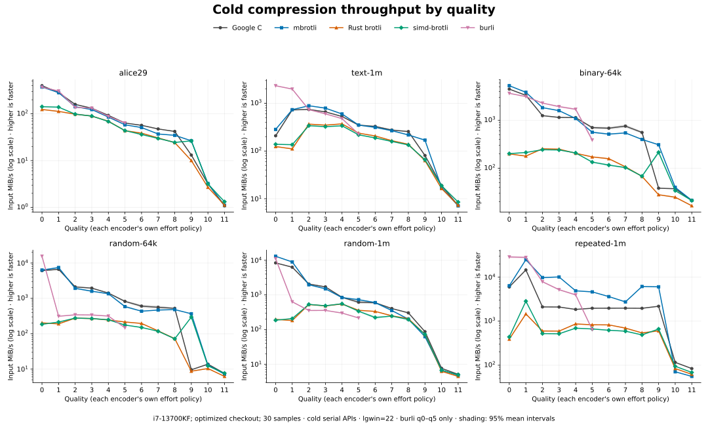
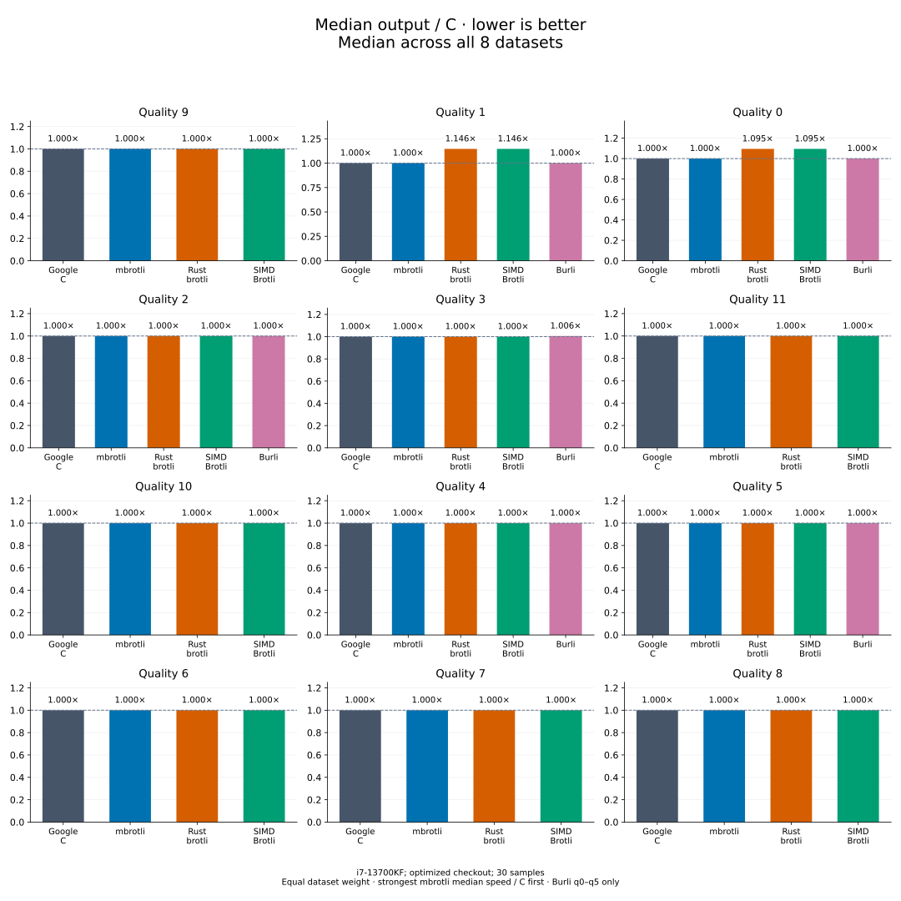

# Competitor-guided path optimizations

[Benchmark index and per-quality results](README.md)

This follow-up reviews the competitors that beat mbrotli in the original
[implementation comparison](implementation-comparison.md). The original suite,
raw results and Criterion baseline are preserved; charts use the current
vertical-bar presentation. The before revision is
`33b7014` (`add benches`); the after revision is that checkout plus the changes
in this report. No production dependency or public API changes were made.

## Median results across all datasets


Each bar is a median across all eight datasets, including empty and tiny input.
Speed / C = C mean latency / encoder mean latency; output / C = encoder bytes /
C bytes. Ratios are calculated per dataset before taking the median, with equal
weight. Higher speed and lower output are better. Qualities with the highest
mbrotli median speed / C appear first; all qualities are retained.

Open the [median table](qualities/README.md) or [individual dataset charts](README.md#results-by-quality)
for exact results. The matched before/after run below is a separate experiment.

## Source review

The repositories were cloned outside the workspace and checked out at the exact
commits used to publish the benchmarked releases:

| Library | Release and source | Local checkout |
| --- | --- | --- |
| Burli | [0.3.1, fd93d1b](https://github.com/paddor/burli/tree/fd93d1b7fbc380383872f6e0d6986613e0580bd4) | `/tmp/mbrotli-competitors/burli` |
| SIMD Brotli | [10.0.1, 76fea39](https://github.com/Mnwa/rust-brotli/tree/76fea392876916b9f4d29f5ceaf99e930a7e2440) | `/tmp/mbrotli-competitors/simd-brotli` |

Burli's `crates/encode/src/encode/{mod,q0,sparse,tune}.rs` uses input-dependent
policies, including large q0/q1 blocks when input fits the window and sampling
to bypass work on likely incompressible input. Its q2–q5 paths also tune match
search and context decisions. These are not mechanically interchangeable with
mbrotli's C-compatible decisions: several speed wins also change compressed
size. For example, q0 repeated text is 82,461 bytes with Burli and 190,491 with
mbrotli; repeated `a` is 21 versus 712 bytes. Those policies were not ported.

SIMD Brotli's `src/enc/block_splitter.rs` updates histogram costs and switch
bitmaps eight lanes at a time. Its default uses f32 costs. mbrotli uses f64 to
match Google's reference partition, so the new implementation retains f64 and
explicitly preserves the first histogram index on tied minima.

The q9 random-data lead was also reviewed against SIMD Brotli's compact bucket
offsets in `src/enc/backward_references/mod.rs`. mbrotli already selects compact,
sparse, or dense storage in `greedy/hashers.rs::select_layout`; the layouts are
different enough that importing the competitor's allocation rule would require
a separate measurement and equivalence study. That matcher was left unchanged.
Likewise, Burli's small q4 input path switches to its q5 collector and bypasses
the normal context path, another policy difference rather than a direct port.

The following are **original-run observations**, selecting every competitor lead
above 5% to prioritize investigation. Small leads can reflect timing noise;
equal numeric quality does not promise equal compression decisions.

| Competitor | Corpus | Quality | Original speed advantage | Bytes: mbrotli / competitor |
| --- | --- | ---: | ---: | ---: |
| burli | tiny-text | 0 | 10.39× | 48 / 48 |
| burli | tiny-text | 4 | 1.76× | 48 / 48 |
| burli | tiny-text | 5 | 1.80× | 48 / 48 |
| burli | alice29 | 1 | 1.10× | 60292 / 68699 |
| burli | alice29 | 5 | 1.11× | 52809 / 54231 |
| simd-brotli | alice29 | 10 | 1.08× | 47477 / 47488 |
| simd-brotli | alice29 | 11 | 1.28× | 46487 / 46493 |
| burli | text-1m | 0 | 8.46× | 190491 / 82461 |
| burli | text-1m | 1 | 2.68× | 138777 / 68717 |
| simd-brotli | text-1m | 10 | 1.16× | 47492 / 47516 |
| simd-brotli | text-1m | 11 | 1.32× | 46491 / 46491 |
| burli | binary-64k | 2 | 1.19× | 2673 / 2688 |
| burli | binary-64k | 3 | 1.17× | 2687 / 2760 |
| burli | binary-64k | 4 | 1.54× | 2554 / 2593 |
| burli | random-64k | 0 | 2.24× | 65540 / 65540 |
| simd-brotli | random-64k | 11 | 1.14× | 65540 / 65540 |
| simd-brotli | random-1m | 9 | 1.18× | 1048581 / 1048581 |
| simd-brotli | random-1m | 11 | 1.09× | 1048581 / 1048581 |
| burli | repeated-1m | 0 | 3.99× | 712 / 21 |
| simd-brotli | repeated-1m | 10 | 1.40× | 14 / 14 |
| simd-brotli | repeated-1m | 11 | 1.25× | 14 / 14 |

## Changes kept

1. **Quality 0, tiny final serial fragments.** A compressed fragment needs at
   least 19 header bits, 13 context/block bits, and the retained command code.
   If `input.len() <= cmd_code_numbits / 8`, the existing size guard necessarily
   selects the uncompressed representation. Emit it immediately, avoiding
   literal Huffman construction and the match scan. The initial bound is 56
   bytes; trained command codes use their own bound. Non-final fragments still
   update state, and independent parallel fragments retain their existing path.
2. **Qualities 10–11, histogram assignment.** The existing retained SIMD kernel
   now handles an entire assignment pass. Eight f64 lanes perform cost updates
   and switch comparisons, with scalar tails. Lane minima carry histogram ids,
   so ties choose the same first index as the original scalar loop. Arithmetic
   is not reassociated. Backend selection stays outside symbol loops, scratch
   allocations are unchanged, and a scalar oracle remains in production.

See the [fast encoder](../../architecture/fast-encoder.md) and
[HQ encoder](../../architecture/hq-encoder.md) specifications for control flow,
state invariants, dispatch, and diagrams.

**Rejected experiment:** price each cached-copy length-code bucket once in the
Zopfli search. On the initial paired run, Alice q11 was effectively unchanged
(138.15 → 138.42 ms), while 1 MiB text q11 worsened (149.18 → 151.43 ms).
That code was removed before the final measurements.

## Profiling evidence

Release-mode `hotpath` timing hooks put `zopfli_iterate` at about 59% and
`find_blocks` at 14% of the instrumented Alice q11 run. Callgrind recorded
2,131,719,578 instructions for one cold compression: `update_nodes` accounted
for 64.0%, H10 match search 13.1%, and block splitting 9.0%. Instruction shares
are not wall-time shares. CPU sampling through hotpath/samply failed on this
WSL host, including outside the sandbox; no sampled-CPU result is claimed.

After the change, diagnostic `find_blocks` timing averaged 377.73 µs per call,
versus 726.13 µs before (360 calls per run). These instrumented runs explain the
mechanism; the uninstrumented Criterion results below determine the speed claim.
Disassembly confirms packed-double `vaddpd`/`vsubpd` and vector selection in the
AVX2 assignment loop. No new unsafe code, heap allocation, or dependency was
introduced. Retained-workspace tests passed.

## Measurement contract

The machine is the same Intel Core i7-13700KF, WSL2 Linux x86_64 host as the
original comparison, with Rust 1.98.1, normal release optimization, and runtime
AVX2 selection. Measurements are pinned to logical CPU 2. They run separately
from compilation, profiling, tests, and fuzzing. Each case uses 30 samples,
0.2 seconds warmup, and at least 0.5 seconds measurement; expensive cases extend
measurement automatically.

The saved before binary was built from `33b7014`. Both binaries use the unchanged
standalone comparison harness. The before and matched after runs each cover all
96 mbrotli cases in identical order. A separate after run covers all 432 cases
across all five implementations. Corpora,
window 22, generic mode, cold end-to-end API costs, and native API differences
are exactly those documented in the original comparison. Rust Brotli and SIMD
Brotli still include their native 4 KiB I/O adapters.

```sh
# Before editing: build and save the original executable.
cargo bench --manifest-path benchmarks/comparison/Cargo.toml --bench implementations --locked --no-run
# Copy the printed executable path to /tmp/before-comparison.
taskset -c 2 /tmp/before-comparison 'mbrotli$' --bench \
  --save-baseline path-review-final-before --sample-size 30 \
  --warm-up-time 0.2 --measurement-time 0.5 --noplot

# After editing and validation:
cargo bench --manifest-path benchmarks/comparison/Cargo.toml --bench implementations --locked --no-run
# Run the printed executable path with taskset, --bench, and these options:
# --save-baseline path-review-final-after --sample-size 30
# --warm-up-time 0.2 --measurement-time 0.5 --noplot
# For matched before/after ratios, also run the new executable with 'mbrotli$'
# and the same options, saving baseline path-review-final-mbrotli.
python3 benchmarks/comparison/report.py --baseline path-review-final-after \
  --csv docs/benchmarks/competitor-paths-comparison.csv
python3 benchmarks/comparison/plot.py \
  --csv docs/benchmarks/competitor-paths-comparison.csv \
  --output docs/benchmarks/competitor-paths-charts \
  --subtitle 'i7-13700KF; optimized checkout; 30 samples' \
  --before-after docs/benchmarks/competitor-paths-before-after.csv \
  --before-after-output docs/benchmarks/competitor-paths-speedups.svg
```

## Final measurements

The matched 96-case sweep gives the following results. Times include cold API
construction and allocation. Speedup is `before time / after time`.

| Corpus | Quality | Before | After | Speedup |
| --- | ---: | ---: | ---: | ---: |
| tiny-text | 0 | 1.096 µs | 0.229 µs | 4.790× |
| alice29 | 10 | 49.285 ms | 45.561 ms | 1.082× |
| alice29 | 11 | 139.222 ms | 131.957 ms | 1.055× |
| text-1m | 10 | 63.089 ms | 57.800 ms | 1.092× |
| text-1m | 11 | 152.659 ms | 141.839 ms | 1.076× |
| repeated-1m | 10 | 14.488 ms | 14.543 ms | 0.996× |
| repeated-1m | 11 | 18.264 ms | 18.539 ms | 0.985× |

The intended text gains are about **5–9% higher throughput**; the tiny q0 case
is **4.8× faster**. Repeated-byte q10/q11 workloads did not improve. The full
five-encoder after sweep still puts Burli ahead on tiny q0 (0.105 µs versus
mbrotli’s 0.233 µs) and SIMD Brotli ahead on Alice q11 (109.50 ms versus
130.86 ms). The peer comparison is a separate run, so its means differ slightly
from the matched before/after table.

**Tradeoffs and uncertainty:** tiny q1 increased from 1.940 to 2.010 µs in the
matched sweep (+3.6%). Four alternating isolated runs confirmed a larger
difference: before 1.879/1.880 µs, after 2.022/2.002 µs, about +6.5–7.7%.
The cause has not been isolated; unchanged q1 source does not make the observed
slowdown disappear. This change is not an all-workload speedup.

The matched sweep also showed random-1m q0/q2 approximately 5% slower and q5
approximately 10% slower. Other unchanged greedy cases had apparent gains as
large as 29%; these are not attributed to the two optimized paths. Cold API
results depend on run conditions and allocator history as well as encoder work.
Four alternating isolated rechecks did not establish a stable regression for
q0 or q2. For q5, the before binary itself varied from 1.49 to 1.92 ms, while
after measured 2.10 and 2.06 ms. This is **inconclusive**, not a no-regression
pass: a q5 random-data slowdown remains possible. The retained changes have
repeatable gains in their intended q0/HQ text cases, with the tiny-q1 tradeoff
and this unresolved random-data limitation explicitly recorded. No across-the-
board performance improvement is claimed. See the [random-input rechecks](competitor-paths-random-recheck.csv).
Rechecks used the same CPU and fresh processes in before/after/after/before
order: tiny q1 used 100 samples, 0.5 s warmup, 2 s measurement; random-1m
q0/q2/q5 used 60 samples, 0.3 s warmup, 1 s measurement. Their named baselines
are `path-review-q1-{before1,after1,after2,before2}` and
`path-review-random-{before1,after1,after2,before2}`.

Raw results, including slower cases and confidence bounds, remain available:

- [All 96 matched before/after cases](competitor-paths-before-after.csv).
- [All 432 fresh competitor measurements](competitor-paths-comparison.csv).
- [Isolated tiny-q1 recheck](competitor-paths-q1-recheck.csv).
- [Environment, source hashes, and binary identities](competitor-paths-environment.json).



The matched panels are ordered by median speedup across qualities, highest
first. The 1× line marks unchanged speed; all 96 cases are shown.

The five-encoder diagrams below show medians across all eight datasets at each
quality, with Burli stopping at q5. They use the same ordering as the overview.
Individual confidence bounds remain in the dataset tables and raw CSV; no
confidence interval is inferred for these medians.





## Correctness and limits

- `cargo fmt --all -- --check` and workspace Clippy with all targets/features,
  locked dependencies, and `-D warnings` pass.
- `CARGO_PROFILE_TEST_OPT_LEVEL=1 cargo test --workspace --all-features --locked`:
  **1,005 tests pass**, including C byte identity, streaming, parallel fragments,
  experimental features, and host backend equivalence.
- `CARGO_PROFILE_TEST_OPT_LEVEL=1 cargo llvm-cov --lib --all-features --locked
  --json --output-path /tmp/mbrotli-path-review/coverage.json`: all functions in
  the six changed implementation files are covered (100% per-file function
  coverage). This does not claim every generated ISA instantiation executes;
  unsupported host ISAs are not run.
- New tiny-fragment tests compare the original full encoder across lengths,
  bit offsets, data patterns, trained state, final/non-final calls, independent
  fragments, and every available backend. Histogram tests compare **f64 bits**,
  ids, and switch bitmaps across ties, partial vectors, and the 2000-symbol
  prologue boundary, including empty streams.
- All **432 compressed sizes** match the original comparison; all outputs pass
  C-decoder validation before timing. The full differential suite also requires
  mbrotli's bytes to match equivalent C streaming settings.
- AFL++ 4.40c / cargo-afl 0.18.2: two 60-second smoke runs, no saved crashes or
  hangs. `simd_equivalence`: 40,349 executions; `differential_c`: 46,842;
  both reported 99.99% stability. These short runs are not exhaustive fuzzing.

AFL used the existing release targets, no default features, a 5-second timeout,
and bounded parameter-prefixed seeds at qualities 0, 10, and 11, including the
55/56/57-byte boundary and 32 KiB text. Results are local under
`/tmp/mbrotli-path-review/afl-{simd,c}`. Commands:

```sh
cd fuzz/afl
cargo afl build --release --no-default-features --bin simd_equivalence --bin differential_c
AFL_SKIP_CPUFREQ=1 AFL_NO_AFFINITY=1 AFL_I_DONT_CARE_ABOUT_MISSING_CRASHES=1 \
AFL_NO_UI=1 cargo afl fuzz -i /tmp/mbrotli-path-review/afl-seeds \
  -o /tmp/mbrotli-path-review/afl-simd -V 60 -t 5000 -m none \
  -- target/release/simd_equivalence
# Repeat with a fresh output directory and target/release/differential_c.
```

The WSL piped crash handler required the AFL crash-handler override; no host
settings were changed. Results and claims apply to this CPU and these corpora.
The dominant HQ candidate search remains scalar, and Burli's different block
policies remain an important source of its low-quality advantage.
