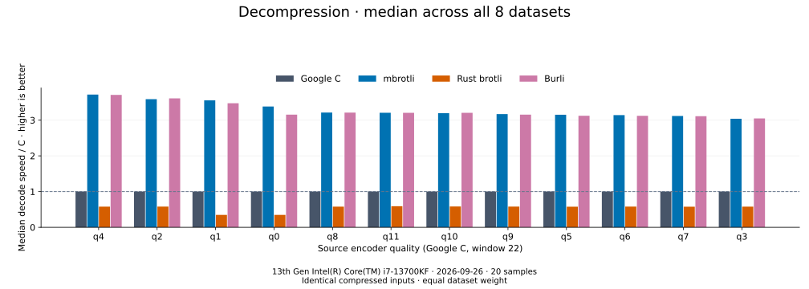

# Decoder comparison

[Benchmark index](../README.md)

Recorded run: **decoder-synthetic-final-2026-09-10-090040** (2026-09-10).
[CSV](../decoder-comparison.csv) · [Environment](../decoder-comparison-environment.json) · [Methodology and limits](../decoder-comparison.md).

Each value is the median of C mean time / decoder mean time across all 8 datasets,
equally weighted. Higher is faster; 1× matches C.
Qualities are ordered by mbrotli median speed / C. Medians do not imply statistical significance.

All four decoders restore identical C-generated streams. Source quality is an encoder setting,
not a decoder setting. Burli decodes q0–q11; SIMD Brotli shares Rust brotli's decoder and is omitted.
Compressed sizes and ratios are properties of those shared inputs, so there is no decoder size ranking.

| Source quality | Google C | mbrotli | Rust brotli | Burli | mbrotli / Burli |
| --- | ---: | ---: | ---: | ---: | ---: |
| [q0](q0.md) | 1.000× | 2.830× | 0.347× | 3.222× | 0.953× |
| [q1](q1.md) | 1.000× | 2.812× | 0.340× | 3.103× | 0.934× |
| [q2](q2.md) | 1.000× | 2.669× | 0.591× | 3.066× | 0.976× |
| [q11](q11.md) | 1.000× | 2.644× | 0.585× | 3.170× | 0.963× |
| [q4](q4.md) | 1.000× | 2.609× | 0.581× | 3.102× | 0.963× |
| [q10](q10.md) | 1.000× | 2.582× | 0.564× | 3.205× | 0.955× |
| [q7](q7.md) | 1.000× | 2.450× | 0.588× | 3.094× | 0.977× |
| [q8](q8.md) | 1.000× | 2.427× | 0.596× | 3.096× | 0.980× |
| [q3](q3.md) | 1.000× | 2.394× | 0.591× | 2.908× | 0.981× |
| [q5](q5.md) | 1.000× | 2.382× | 0.577× | 3.075× | 0.974× |
| [q9](q9.md) | 1.000× | 2.380× | 0.563× | 3.222× | 0.962× |
| [q6](q6.md) | 1.000× | 2.369× | 0.580× | 3.090× | 0.976× |

The last column takes the median of direct Burli time / mbrotli time ratios;
it does not divide the two medians relative to C.

Open a source quality for all datasets, compressed/restored byte counts,
mean latency, confidence bounds and throughput. Measurements include cold construction,
allocation, decoding and disposal. C receives the known output capacity; Rust brotli
includes its native 4 KiB I/O adapter. See the linked methodology for reproducible commands
and the limits of this single-host comparison.
