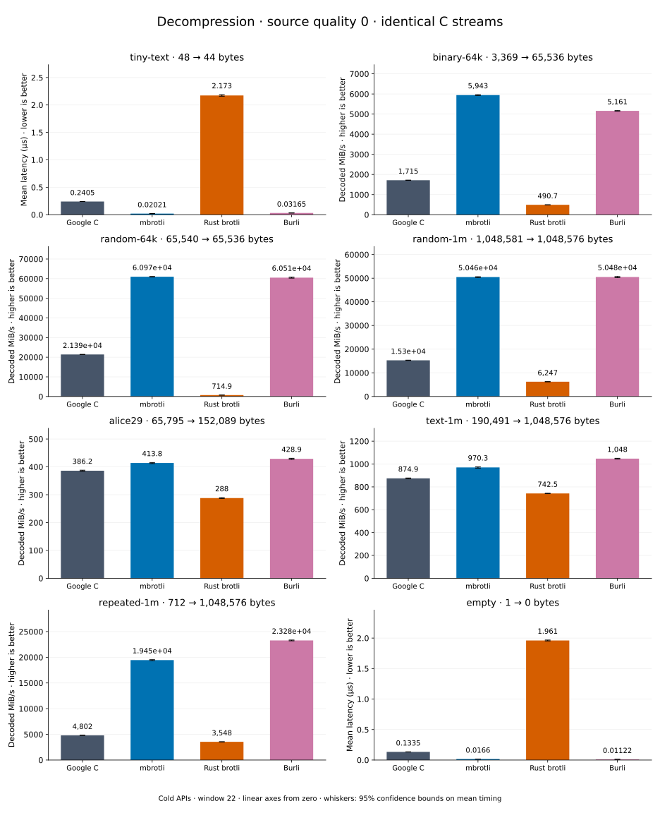

# Decompression of quality 0 streams

[Decoder overview](README.md) · [Benchmark index](../README.md)

Recorded run: **decoder-comparison-2026-09-10-060318** (2026-09-10).
[CSV](../decoder-comparison.csv) · [Environment](../decoder-comparison-environment.json) · [Methodology and limits](../decoder-comparison.md).

Quality belongs to the C encoder that prepared the input; decoders have no quality setting.
All four decode the same bytes. Burli is included at every source quality; SIMD Brotli
re-exports Rust brotli's decoder and is omitted.

## Median speed across eight datasets

Median of eight per-dataset C mean time / decoder mean time ratios, with equal weight
including empty and tiny input. Higher is faster; 1× matches C. No confidence interval
is inferred for this across-dataset median.

| Decoder | Median speed / C |
| --- | ---: |
| Google C | 1.000× |
| mbrotli | 1.185× |
| Rust brotli | 0.369× |
| Burli | 2.998× |

Datasets are ranked by mbrotli speed relative to the fastest peer, highest first.
Throughput counts restored bytes; empty input has latency only. Whiskers and intervals
describe sampling uncertainty, not all host variation. Cold APIs include allocation
and disposal. C knows the output capacity; Rust brotli includes its 4 KiB I/O adapter.

## binary-64k

64 KiB of structured binary bytes: ((i / 16) XOR i) modulo 256.

**3,369 compressed → 65,536 restored bytes; compressed / original: 5.141%.**

| Decoder | Mean µs | 95% mean interval µs | Decoded MiB/s | Speed / C |
| --- | ---: | ---: | ---: | ---: |
| Google C | 36.68 | 36.53–36.86 | 1,703.77 | 1.000× |
| mbrotli | 13.03 | 12.96–13.1 | 4,796.61 | 2.815× |
| Rust brotli | 125.4 | 124.9–125.8 | 498.49 | 0.293× |
| Burli | 16.21 | 16.05–16.39 | 3,856.58 | 2.264× |

## text-1m

Alice text repeated cyclically to 1 MiB.

**190,491 compressed → 1,048,576 restored bytes; compressed / original: 18.167%.**

| Decoder | Mean µs | 95% mean interval µs | Decoded MiB/s | Speed / C |
| --- | ---: | ---: | ---: | ---: |
| Google C | 1,168 | 1,157–1,180 | 856.39 | 1.000× |
| mbrotli | 1,138 | 1,115–1,172 | 878.98 | 1.026× |
| Rust brotli | 1,369 | 1,351–1,389 | 730.56 | 0.853× |
| Burli | 1,211 | 1,200–1,222 | 826.02 | 0.965× |

## alice29

Vendored Alice in Wonderland text.

**65,795 compressed → 152,089 restored bytes; compressed / original: 43.261%.**

| Decoder | Mean µs | 95% mean interval µs | Decoded MiB/s | Speed / C |
| --- | ---: | ---: | ---: | ---: |
| Google C | 381.6 | 375.3–391.2 | 380.06 | 1.000× |
| mbrotli | 381.3 | 375.9–387.5 | 380.42 | 1.001× |
| Rust brotli | 516.5 | 510.2–523.2 | 280.82 | 0.739× |
| Burli | 425.1 | 422.8–427.5 | 341.18 | 0.898× |

## random-64k

64 KiB prefix of the deterministic pseudorandom corpus.

**65,540 compressed → 65,536 restored bytes; compressed / original: 100.006%.**

| Decoder | Mean µs | 95% mean interval µs | Decoded MiB/s | Speed / C |
| --- | ---: | ---: | ---: | ---: |
| Google C | 2.939 | 2.907–2.975 | 21,262.48 | 1.000× |
| mbrotli | 3.79 | 3.742–3.85 | 16,490.63 | 0.776× |
| Rust brotli | 88.26 | 87.34–89.37 | 708.17 | 0.033× |
| Burli | 0.9803 | 0.9734–0.9882 | 63,753.24 | 2.998× |

## tiny-text

44-byte quick-brown-fox sentence.

**48 compressed → 44 restored bytes; compressed / original: 109.091%.**

| Decoder | Mean µs | 95% mean interval µs | Decoded MiB/s | Speed / C |
| --- | ---: | ---: | ---: | ---: |
| Google C | 0.2325 | 0.23–0.2354 | 180.51 | 1.000× |
| mbrotli | 0.1342 | 0.1331–0.1354 | 312.75 | 1.733× |
| Rust brotli | 2.132 | 2.11–2.155 | 19.68 | 0.109× |
| Burli | 0.03436 | 0.03393–0.03485 | 1,221.22 | 6.765× |

## random-1m

1 MiB of deterministic xorshift64 pseudorandom bytes.

**1,048,581 compressed → 1,048,576 restored bytes; compressed / original: 100.000%.**

| Decoder | Mean µs | 95% mean interval µs | Decoded MiB/s | Speed / C |
| --- | ---: | ---: | ---: | ---: |
| Google C | 65.77 | 65.07–66.58 | 15,203.60 | 1.000× |
| mbrotli | 86.26 | 85.54–87 | 11,593.36 | 0.763× |
| Rust brotli | 147.3 | 145.4–149.6 | 6,787.05 | 0.446× |
| Burli | 21.94 | 21.74–22.16 | 45,570.57 | 2.997× |

## repeated-1m

1 MiB of repeated a bytes.

**712 compressed → 1,048,576 restored bytes; compressed / original: 0.068%.**

| Decoder | Mean µs | 95% mean interval µs | Decoded MiB/s | Speed / C |
| --- | ---: | ---: | ---: | ---: |
| Google C | 209.5 | 208.7–210.3 | 4,772.94 | 1.000× |
| mbrotli | 156 | 154.8–157.3 | 6,410.38 | 1.343× |
| Rust brotli | 268.8 | 266.9–271 | 3,720.84 | 0.780× |
| Burli | 37.07 | 36.71–37.6 | 26,978.58 | 5.652× |

## empty

Empty input; measures API overhead.

**1 compressed → 0 restored bytes; compressed / original: undefined.**

| Decoder | Mean µs | 95% mean interval µs | Decoded MiB/s | Speed / C |
| --- | ---: | ---: | ---: | ---: |
| Google C | 0.1374 | 0.1357–0.1395 | — | 1.000× |
| mbrotli | 0.09032 | 0.08967–0.09104 | — | 1.522× |
| Rust brotli | 1.916 | 1.901–1.935 | — | 0.072× |
| Burli | 0.01586 | 0.01571–0.01605 | — | 8.665× |
