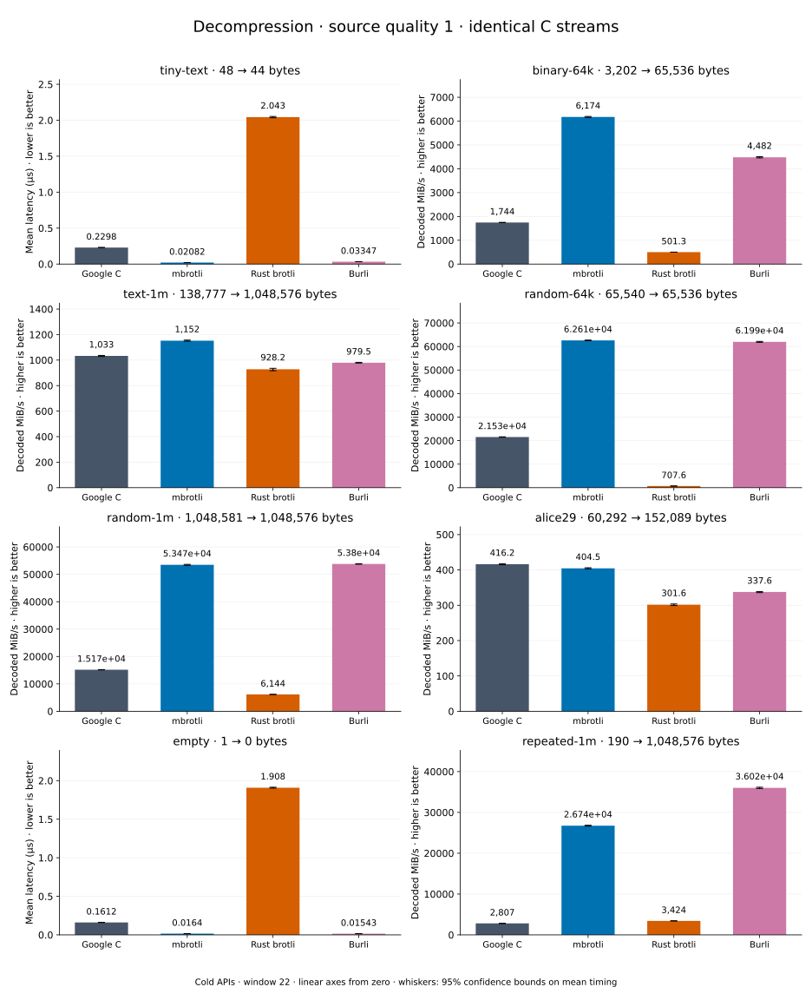

# Decompression of quality 1 streams

[Decoder overview](README.md) · [Benchmark index](../README.md)

Recorded run: **decoder-synthetic-final-2026-09-10-090040** (2026-09-10).
[CSV](../decoder-comparison.csv) · [Environment](../decoder-comparison-environment.json) · [Methodology and limits](../decoder-comparison.md).

Quality belongs to the C encoder that prepared the input; decoders have no quality setting.
All four decode the same bytes. Burli is included at every source quality; SIMD Brotli
re-exports Rust brotli's decoder and is omitted.

## Median speed across 8 datasets

Median of per-dataset C mean time / decoder mean time ratios, with equal weight.
Higher is faster; 1× matches C. No confidence interval
is inferred for this across-dataset median.

| Decoder | Median speed / C |
| --- | ---: |
| Google C | 1.000× |
| mbrotli | 2.812× |
| Rust brotli | 0.340× |
| Burli | 3.103× |

mbrotli median speed / Burli: **0.934×** (direct per-dataset ratios).

Datasets are ranked by mbrotli speed relative to the fastest peer, highest first.
Throughput counts restored bytes; empty input has latency only. Whiskers and intervals
describe sampling uncertainty, not all host variation. Cold APIs include allocation
and disposal. C knows the output capacity; Rust brotli includes its 4 KiB I/O adapter.

## binary-64k

64 KiB of structured binary bytes: ((i / 16) XOR i) modulo 256.

**3,202 compressed → 65,536 restored bytes; compressed / original: 4.886%.**

| Decoder | Mean µs | 95% mean interval µs | Decoded MiB/s | Speed / C |
| --- | ---: | ---: | ---: | ---: |
| Google C | 35.66 | 35.48–35.87 | 1,752.45 | 1.000× |
| mbrotli | 10.43 | 10.35–10.54 | 5,990.88 | 3.419× |
| Rust brotli | 124.9 | 124.3–125.7 | 500.20 | 0.285× |
| Burli | 14.15 | 14.06–14.26 | 4,415.55 | 2.520× |

## text-1m

Alice text repeated cyclically to 1 MiB.

**138,777 compressed → 1,048,576 restored bytes; compressed / original: 13.235%.**

| Decoder | Mean µs | 95% mean interval µs | Decoded MiB/s | Speed / C |
| --- | ---: | ---: | ---: | ---: |
| Google C | 985.5 | 979.4–992.2 | 1,014.66 | 1.000× |
| mbrotli | 850.8 | 845.8–856.4 | 1,175.34 | 1.158× |
| Rust brotli | 1,072 | 1,063–1,082 | 933.05 | 0.920× |
| Burli | 1,022 | 1,016–1,027 | 978.72 | 0.965× |

## alice29

Vendored Alice in Wonderland text.

**60,292 compressed → 152,089 restored bytes; compressed / original: 39.643%.**

| Decoder | Mean µs | 95% mean interval µs | Decoded MiB/s | Speed / C |
| --- | ---: | ---: | ---: | ---: |
| Google C | 348.8 | 347.2–350.5 | 415.81 | 1.000× |
| mbrotli | 351.1 | 348.8–353.5 | 413.16 | 0.994× |
| Rust brotli | 479.7 | 477.7–482 | 302.33 | 0.727× |
| Burli | 436.3 | 433.3–439.5 | 332.45 | 0.800× |

## random-1m

1 MiB of deterministic xorshift64 pseudorandom bytes.

**1,048,581 compressed → 1,048,576 restored bytes; compressed / original: 100.000%.**

| Decoder | Mean µs | 95% mean interval µs | Decoded MiB/s | Speed / C |
| --- | ---: | ---: | ---: | ---: |
| Google C | 64.86 | 64.15–65.6 | 15,418.58 | 1.000× |
| mbrotli | 20.13 | 19.98–20.3 | 49,666.11 | 3.221× |
| Rust brotli | 164.6 | 161.5–168.4 | 6,074.02 | 0.394× |
| Burli | 19.8 | 19.68–19.93 | 50,512.22 | 3.276× |

## random-64k

64 KiB prefix of the deterministic pseudorandom corpus.

**65,540 compressed → 65,536 restored bytes; compressed / original: 100.006%.**

| Decoder | Mean µs | 95% mean interval µs | Decoded MiB/s | Speed / C |
| --- | ---: | ---: | ---: | ---: |
| Google C | 2.893 | 2.872–2.921 | 21,605.20 | 1.000× |
| mbrotli | 1.117 | 1.111–1.123 | 55,962.80 | 2.590× |
| Rust brotli | 88.12 | 87.68–88.61 | 709.27 | 0.033× |
| Burli | 0.9875 | 0.9798–0.9985 | 63,291.92 | 2.929× |

## repeated-1m

1 MiB of repeated a bytes.

**190 compressed → 1,048,576 restored bytes; compressed / original: 0.018%.**

| Decoder | Mean µs | 95% mean interval µs | Decoded MiB/s | Speed / C |
| --- | ---: | ---: | ---: | ---: |
| Google C | 362.2 | 357.4–368.4 | 2,761.12 | 1.000× |
| mbrotli | 35.42 | 34.99–35.92 | 28,236.04 | 10.226× |
| Rust brotli | 285.1 | 282.5–287.9 | 3,507.39 | 1.270× |
| Burli | 24.43 | 24.17–24.71 | 40,935.82 | 14.826× |

## tiny-text

44-byte quick-brown-fox sentence.

**48 compressed → 44 restored bytes; compressed / original: 109.091%.**

| Decoder | Mean µs | 95% mean interval µs | Decoded MiB/s | Speed / C |
| --- | ---: | ---: | ---: | ---: |
| Google C | 0.2431 | 0.2419–0.2446 | 172.61 | 1.000× |
| mbrotli | 0.08014 | 0.07927–0.08147 | 523.59 | 3.033× |
| Rust brotli | 2.04 | 2.015–2.069 | 20.57 | 0.119× |
| Burli | 0.03259 | 0.03238–0.03284 | 1,287.52 | 7.459× |

## empty

Empty input; measures API overhead.

**1 compressed → 0 restored bytes; compressed / original: undefined.**

| Decoder | Mean µs | 95% mean interval µs | Decoded MiB/s | Speed / C |
| --- | ---: | ---: | ---: | ---: |
| Google C | 0.1576 | 0.1569–0.1583 | — | 1.000× |
| mbrotli | 0.07473 | 0.07431–0.07517 | — | 2.109× |
| Rust brotli | 1.908 | 1.897–1.92 | — | 0.083× |
| Burli | 0.01502 | 0.01495–0.01509 | — | 10.493× |
