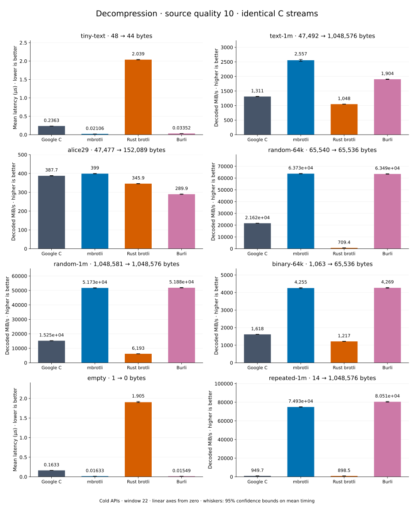

# Decompression of quality 10 streams

[Decoder overview](README.md) · [Benchmark index](../README.md)

Recorded run: **decoder-synthetic-final-2026-09-10-090040** (2026-09-10).
[CSV](../decoder-comparison.csv) · [Environment](../decoder-comparison-environment.json) · [Methodology and limits](../decoder-comparison.md).

Quality belongs to the C encoder that prepared the input; decoders have no quality setting.
All four decode the same bytes. Burli is included at every source quality; SIMD Brotli
re-exports Rust brotli's decoder and is omitted.

## Median speed across 8 datasets

Median of per-dataset C mean time / decoder mean time ratios, with equal weight.
Higher is faster; 1× matches C. No confidence interval
is inferred for this across-dataset median.

| Decoder | Median speed / C |
| --- | ---: |
| Google C | 1.000× |
| mbrotli | 2.582× |
| Rust brotli | 0.564× |
| Burli | 3.205× |

mbrotli median speed / Burli: **0.955×** (direct per-dataset ratios).

Datasets are ranked by mbrotli speed relative to the fastest peer, highest first.
Throughput counts restored bytes; empty input has latency only. Whiskers and intervals
describe sampling uncertainty, not all host variation. Cold APIs include allocation
and disposal. C knows the output capacity; Rust brotli includes its 4 KiB I/O adapter.

## text-1m

Alice text repeated cyclically to 1 MiB.

**47,492 compressed → 1,048,576 restored bytes; compressed / original: 4.529%.**

| Decoder | Mean µs | 95% mean interval µs | Decoded MiB/s | Speed / C |
| --- | ---: | ---: | ---: | ---: |
| Google C | 769.2 | 765–774.1 | 1,300.06 | 1.000× |
| mbrotli | 382.2 | 380.1–384.3 | 2,616.73 | 2.013× |
| Rust brotli | 943.6 | 931.3–963.5 | 1,059.80 | 0.815× |
| Burli | 518.1 | 516.3–519.9 | 1,930.31 | 1.485× |

## alice29

Vendored Alice in Wonderland text.

**47,477 compressed → 152,089 restored bytes; compressed / original: 31.217%.**

| Decoder | Mean µs | 95% mean interval µs | Decoded MiB/s | Speed / C |
| --- | ---: | ---: | ---: | ---: |
| Google C | 378.6 | 374.8–383.8 | 383.08 | 1.000× |
| mbrotli | 363.8 | 359–371.5 | 398.64 | 1.041× |
| Rust brotli | 418.9 | 417.1–420.7 | 346.25 | 0.904× |
| Burli | 500.2 | 497.8–502.6 | 289.99 | 0.757× |

## binary-64k

64 KiB of structured binary bytes: ((i / 16) XOR i) modulo 256.

**1,063 compressed → 65,536 restored bytes; compressed / original: 1.622%.**

| Decoder | Mean µs | 95% mean interval µs | Decoded MiB/s | Speed / C |
| --- | ---: | ---: | ---: | ---: |
| Google C | 38.16 | 37.95–38.41 | 1,637.83 | 1.000× |
| mbrotli | 14.66 | 14.57–14.76 | 4,263.35 | 2.603× |
| Rust brotli | 51.97 | 51.55–52.49 | 1,202.59 | 0.734× |
| Burli | 14.65 | 14.59–14.71 | 4,266.63 | 2.605× |

## random-1m

1 MiB of deterministic xorshift64 pseudorandom bytes.

**1,048,581 compressed → 1,048,576 restored bytes; compressed / original: 100.000%.**

| Decoder | Mean µs | 95% mean interval µs | Decoded MiB/s | Speed / C |
| --- | ---: | ---: | ---: | ---: |
| Google C | 65.32 | 64.51–66.24 | 15,309.43 | 1.000× |
| mbrotli | 19.2 | 19.02–19.4 | 52,070.33 | 3.401× |
| Rust brotli | 165.6 | 164.1–167.3 | 6,038.67 | 0.394× |
| Burli | 18.77 | 18.68–18.87 | 53,264.92 | 3.479× |

## repeated-1m

1 MiB of repeated a bytes.

**14 compressed → 1,048,576 restored bytes; compressed / original: 0.001%.**

| Decoder | Mean µs | 95% mean interval µs | Decoded MiB/s | Speed / C |
| --- | ---: | ---: | ---: | ---: |
| Google C | 1,050 | 1,046–1,053 | 952.81 | 1.000× |
| mbrotli | 13.62 | 13.54–13.71 | 73,432.84 | 77.070× |
| Rust brotli | 1,108 | 1,102–1,115 | 902.31 | 0.947× |
| Burli | 12.68 | 12.63–12.74 | 78,833.36 | 82.738× |

## random-64k

64 KiB prefix of the deterministic pseudorandom corpus.

**65,540 compressed → 65,536 restored bytes; compressed / original: 100.006%.**

| Decoder | Mean µs | 95% mean interval µs | Decoded MiB/s | Speed / C |
| --- | ---: | ---: | ---: | ---: |
| Google C | 2.92 | 2.896–2.948 | 21,400.47 | 1.000× |
| mbrotli | 1.134 | 1.127–1.142 | 55,096.26 | 2.575× |
| Rust brotli | 88.36 | 87.74–89.02 | 707.31 | 0.033× |
| Burli | 0.9965 | 0.9911–1.002 | 62,717.52 | 2.931× |

## tiny-text

44-byte quick-brown-fox sentence.

**48 compressed → 44 restored bytes; compressed / original: 109.091%.**

| Decoder | Mean µs | 95% mean interval µs | Decoded MiB/s | Speed / C |
| --- | ---: | ---: | ---: | ---: |
| Google C | 0.2099 | 0.2088–0.2111 | 199.89 | 1.000× |
| mbrotli | 0.08107 | 0.08071–0.08147 | 517.58 | 2.589× |
| Rust brotli | 2.054 | 2.042–2.066 | 20.43 | 0.102× |
| Burli | 0.03237 | 0.03219–0.03257 | 1,296.33 | 6.485× |

## empty

Empty input; measures API overhead.

**1 compressed → 0 restored bytes; compressed / original: undefined.**

| Decoder | Mean µs | 95% mean interval µs | Decoded MiB/s | Speed / C |
| --- | ---: | ---: | ---: | ---: |
| Google C | 0.1474 | 0.146–0.1492 | — | 1.000× |
| mbrotli | 0.0752 | 0.07453–0.076 | — | 1.960× |
| Rust brotli | 1.919 | 1.9–1.943 | — | 0.077× |
| Burli | 0.01493 | 0.01486–0.01502 | — | 9.870× |
