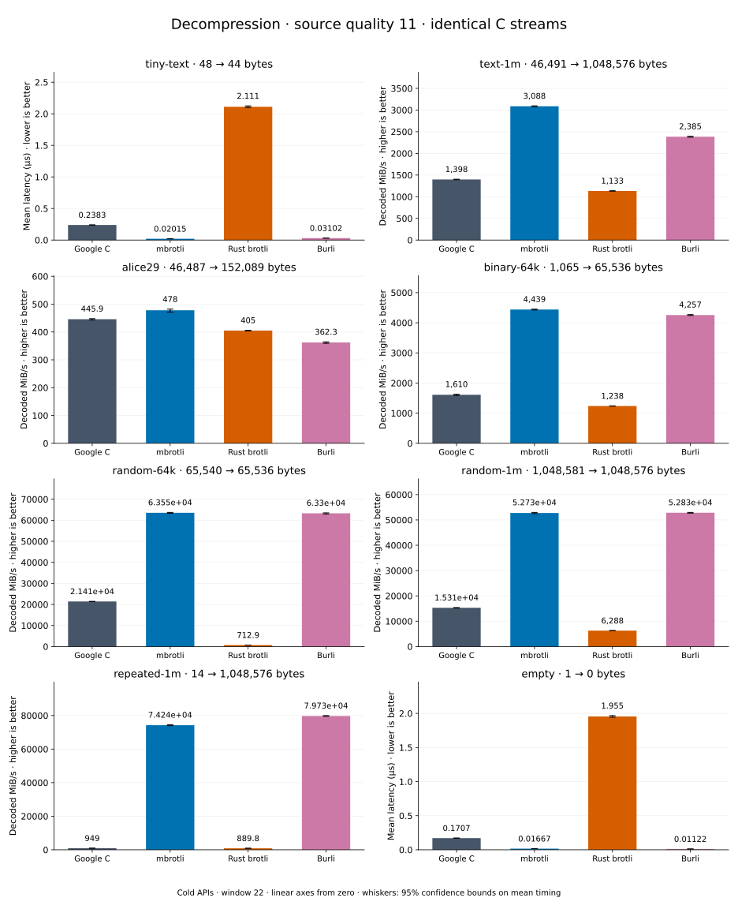

# Decompression of quality 11 streams

[Decoder overview](README.md) · [Benchmark index](../README.md)

Recorded run: **decoder-synthetic-final-2026-09-10-090040** (2026-09-10).
[CSV](../decoder-comparison.csv) · [Environment](../decoder-comparison-environment.json) · [Methodology and limits](../decoder-comparison.md).

Quality belongs to the C encoder that prepared the input; decoders have no quality setting.
All four decode the same bytes. Burli is included at every source quality; SIMD Brotli
re-exports Rust brotli's decoder and is omitted.

## Median speed across 8 datasets

Median of per-dataset C mean time / decoder mean time ratios, with equal weight.
Higher is faster; 1× matches C. No confidence interval
is inferred for this across-dataset median.

| Decoder | Median speed / C |
| --- | ---: |
| Google C | 1.000× |
| mbrotli | 3.131× |
| Rust brotli | 0.582× |
| Burli | 3.137× |

mbrotli median speed / Burli: **1.020×** (direct per-dataset ratios).

Datasets are ranked by mbrotli speed relative to the fastest peer, highest first.
Throughput counts restored bytes; empty input has latency only. Whiskers and intervals
describe sampling uncertainty, not all host variation. Cold APIs include allocation
and disposal. C knows the output capacity; Rust brotli includes its 4 KiB I/O adapter.

## tiny-text

44-byte quick-brown-fox sentence.

**48 compressed → 44 restored bytes; compressed / original: 109.091%.**

| Decoder | Mean µs | 95% mean interval µs | Decoded MiB/s | Speed / C |
| --- | ---: | ---: | ---: | ---: |
| Google C | 0.239 | 0.2378–0.2403 | 175.60 | 1.000× |
| mbrotli | 0.02133 | 0.02107–0.02161 | 1,967.60 | 11.205× |
| Rust brotli | 2.067 | 2.059–2.077 | 20.30 | 0.116× |
| Burli | 0.03314 | 0.03283–0.03353 | 1,266.15 | 7.210× |

## text-1m

Alice text repeated cyclically to 1 MiB.

**46,491 compressed → 1,048,576 restored bytes; compressed / original: 4.434%.**

| Decoder | Mean µs | 95% mean interval µs | Decoded MiB/s | Speed / C |
| --- | ---: | ---: | ---: | ---: |
| Google C | 720.6 | 714.3–728.1 | 1,387.77 | 1.000× |
| mbrotli | 346.8 | 343.7–350.4 | 2,883.58 | 2.078× |
| Rust brotli | 873.6 | 868.3–879.1 | 1,144.75 | 0.825× |
| Burli | 448 | 444.2–452.3 | 2,232.31 | 1.609× |

## binary-64k

64 KiB of structured binary bytes: ((i / 16) XOR i) modulo 256.

**1,065 compressed → 65,536 restored bytes; compressed / original: 1.625%.**

| Decoder | Mean µs | 95% mean interval µs | Decoded MiB/s | Speed / C |
| --- | ---: | ---: | ---: | ---: |
| Google C | 38.5 | 38.18–38.89 | 1,623.42 | 1.000× |
| mbrotli | 14.21 | 14.05–14.4 | 4,397.91 | 2.709× |
| Rust brotli | 50.75 | 50.56–50.95 | 1,231.52 | 0.759× |
| Burli | 14.73 | 14.58–14.92 | 4,243.04 | 2.614× |

## alice29

Vendored Alice in Wonderland text.

**46,487 compressed → 152,089 restored bytes; compressed / original: 30.566%.**

| Decoder | Mean µs | 95% mean interval µs | Decoded MiB/s | Speed / C |
| --- | ---: | ---: | ---: | ---: |
| Google C | 329.7 | 328–331.5 | 439.90 | 1.000× |
| mbrotli | 323.8 | 320–328.6 | 447.99 | 1.018× |
| Rust brotli | 369.8 | 367.9–371.9 | 392.27 | 0.892× |
| Burli | 447.6 | 445.4–449.8 | 324.07 | 0.737× |

## random-64k

64 KiB prefix of the deterministic pseudorandom corpus.

**65,540 compressed → 65,536 restored bytes; compressed / original: 100.006%.**

| Decoder | Mean µs | 95% mean interval µs | Decoded MiB/s | Speed / C |
| --- | ---: | ---: | ---: | ---: |
| Google C | 2.923 | 2.903–2.945 | 21,380.15 | 1.000× |
| mbrotli | 1.003 | 0.9928–1.015 | 62,316.99 | 2.915× |
| Rust brotli | 89.47 | 88.62–90.5 | 698.53 | 0.033× |
| Burli | 1.006 | 0.9968–1.016 | 62,152.08 | 2.907× |

## random-1m

1 MiB of deterministic xorshift64 pseudorandom bytes.

**1,048,581 compressed → 1,048,576 restored bytes; compressed / original: 100.000%.**

| Decoder | Mean µs | 95% mean interval µs | Decoded MiB/s | Speed / C |
| --- | ---: | ---: | ---: | ---: |
| Google C | 66.26 | 65.51–67.1 | 15,091.73 | 1.000× |
| mbrotli | 19.79 | 19.6–20.03 | 50,519.25 | 3.347× |
| Rust brotli | 163.8 | 162.3–165.5 | 6,105.48 | 0.405× |
| Burli | 19.68 | 19.53–19.84 | 50,801.49 | 3.366× |

## empty

Empty input; measures API overhead.

**1 compressed → 0 restored bytes; compressed / original: undefined.**

| Decoder | Mean µs | 95% mean interval µs | Decoded MiB/s | Speed / C |
| --- | ---: | ---: | ---: | ---: |
| Google C | 0.1653 | 0.1643–0.1665 | — | 1.000× |
| mbrotli | 0.0163 | 0.01622–0.01639 | — | 10.139× |
| Rust brotli | 1.921 | 1.908–1.934 | — | 0.086× |
| Burli | 0.01543 | 0.01531–0.01559 | — | 10.715× |

## repeated-1m

1 MiB of repeated a bytes.

**14 compressed → 1,048,576 restored bytes; compressed / original: 0.001%.**

| Decoder | Mean µs | 95% mean interval µs | Decoded MiB/s | Speed / C |
| --- | ---: | ---: | ---: | ---: |
| Google C | 1,062 | 1,054–1,071 | 941.68 | 1.000× |
| mbrotli | 13.59 | 13.49–13.71 | 73,574.05 | 78.131× |
| Rust brotli | 1,147 | 1,137–1,157 | 871.96 | 0.926× |
| Burli | 12.82 | 12.62–13.11 | 77,974.41 | 82.804× |
