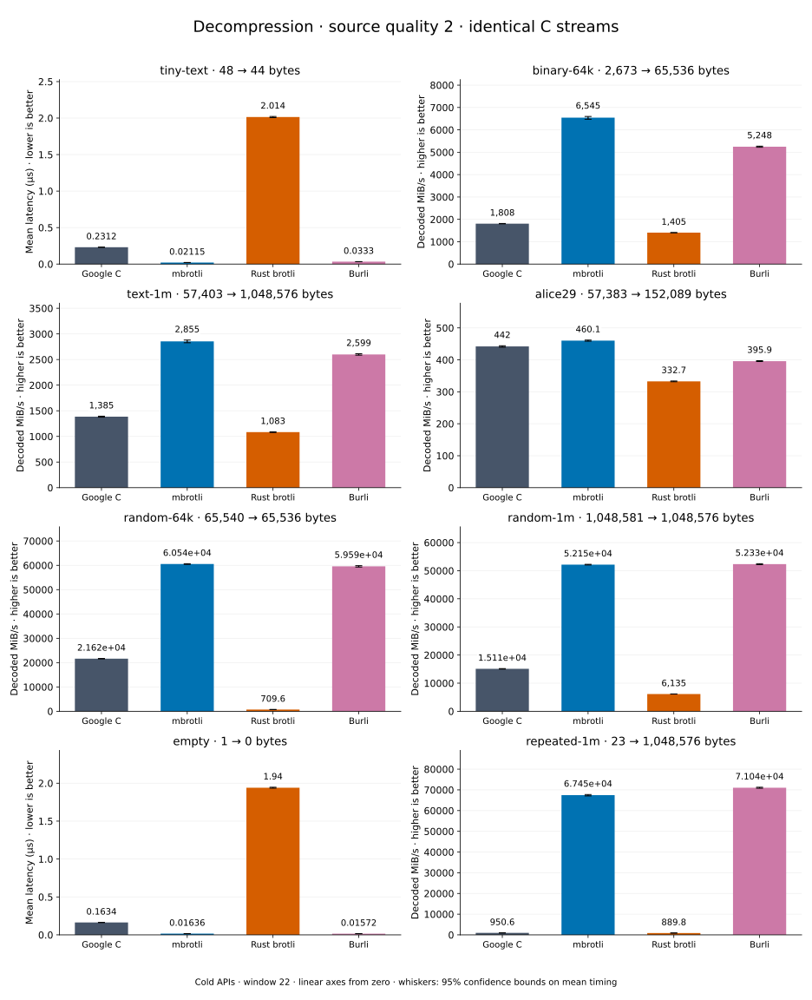

# Decompression of quality 2 streams

[Decoder overview](README.md) · [Benchmark index](../README.md)

Recorded run: **decoder-synthetic-final-2026-09-10-090040** (2026-09-10).
[CSV](../decoder-comparison.csv) · [Environment](../decoder-comparison-environment.json) · [Methodology and limits](../decoder-comparison.md).

Quality belongs to the C encoder that prepared the input; decoders have no quality setting.
All four decode the same bytes. Burli is included at every source quality; SIMD Brotli
re-exports Rust brotli's decoder and is omitted.

## Median speed across 8 datasets

Median of per-dataset C mean time / decoder mean time ratios, with equal weight.
Higher is faster; 1× matches C. No confidence interval
is inferred for this across-dataset median.

| Decoder | Median speed / C |
| --- | ---: |
| Google C | 1.000× |
| mbrotli | 2.669× |
| Rust brotli | 0.591× |
| Burli | 3.066× |

mbrotli median speed / Burli: **0.976×** (direct per-dataset ratios).

Datasets are ranked by mbrotli speed relative to the fastest peer, highest first.
Throughput counts restored bytes; empty input has latency only. Whiskers and intervals
describe sampling uncertainty, not all host variation. Cold APIs include allocation
and disposal. C knows the output capacity; Rust brotli includes its 4 KiB I/O adapter.

## binary-64k

64 KiB of structured binary bytes: ((i / 16) XOR i) modulo 256.

**2,673 compressed → 65,536 restored bytes; compressed / original: 4.079%.**

| Decoder | Mean µs | 95% mean interval µs | Decoded MiB/s | Speed / C |
| --- | ---: | ---: | ---: | ---: |
| Google C | 34.79 | 34.53–35.08 | 1,796.37 | 1.000× |
| mbrotli | 9.628 | 9.567–9.699 | 6,491.75 | 3.614× |
| Rust brotli | 46.01 | 45.68–46.35 | 1,358.43 | 0.756× |
| Burli | 12.13 | 12.01–12.26 | 5,153.40 | 2.869× |

## text-1m

Alice text repeated cyclically to 1 MiB.

**57,403 compressed → 1,048,576 restored bytes; compressed / original: 5.474%.**

| Decoder | Mean µs | 95% mean interval µs | Decoded MiB/s | Speed / C |
| --- | ---: | ---: | ---: | ---: |
| Google C | 724 | 720.7–727.6 | 1,381.17 | 1.000× |
| mbrotli | 332.2 | 330.5–334 | 3,010.24 | 2.179× |
| Rust brotli | 938.9 | 932–946.7 | 1,065.13 | 0.771× |
| Burli | 391.1 | 387.8–395 | 2,557.19 | 1.851× |

## alice29

Vendored Alice in Wonderland text.

**57,383 compressed → 152,089 restored bytes; compressed / original: 37.730%.**

| Decoder | Mean µs | 95% mean interval µs | Decoded MiB/s | Speed / C |
| --- | ---: | ---: | ---: | ---: |
| Google C | 329.2 | 327.4–331.2 | 440.63 | 1.000× |
| mbrotli | 309.3 | 304.7–316.7 | 468.90 | 1.064× |
| Rust brotli | 438.6 | 435.2–442.5 | 330.70 | 0.751× |
| Burli | 370.2 | 365.7–376.5 | 391.82 | 0.889× |

## random-1m

1 MiB of deterministic xorshift64 pseudorandom bytes.

**1,048,581 compressed → 1,048,576 restored bytes; compressed / original: 100.000%.**

| Decoder | Mean µs | 95% mean interval µs | Decoded MiB/s | Speed / C |
| --- | ---: | ---: | ---: | ---: |
| Google C | 64.94 | 64.34–65.61 | 15,399.05 | 1.000× |
| mbrotli | 20.31 | 20.09–20.56 | 49,240.38 | 3.198× |
| Rust brotli | 150.7 | 149–152.9 | 6,637.03 | 0.431× |
| Burli | 20.15 | 19.87–20.51 | 49,619.44 | 3.222× |

## repeated-1m

1 MiB of repeated a bytes.

**23 compressed → 1,048,576 restored bytes; compressed / original: 0.002%.**

| Decoder | Mean µs | 95% mean interval µs | Decoded MiB/s | Speed / C |
| --- | ---: | ---: | ---: | ---: |
| Google C | 1,072 | 1,062–1,085 | 933.03 | 1.000× |
| mbrotli | 14.98 | 14.88–15.09 | 66,768.76 | 71.562× |
| Rust brotli | 1,134 | 1,125–1,144 | 881.77 | 0.945× |
| Burli | 14.37 | 14.23–14.54 | 69,586.40 | 74.581× |

## random-64k

64 KiB prefix of the deterministic pseudorandom corpus.

**65,540 compressed → 65,536 restored bytes; compressed / original: 100.006%.**

| Decoder | Mean µs | 95% mean interval µs | Decoded MiB/s | Speed / C |
| --- | ---: | ---: | ---: | ---: |
| Google C | 2.887 | 2.873–2.902 | 21,651.99 | 1.000× |
| mbrotli | 1.133 | 1.128–1.139 | 55,153.96 | 2.547× |
| Rust brotli | 88.36 | 87.84–88.94 | 707.30 | 0.033× |
| Burli | 0.9924 | 0.9866–0.9988 | 62,981.06 | 2.909× |

## tiny-text

44-byte quick-brown-fox sentence.

**48 compressed → 44 restored bytes; compressed / original: 109.091%.**

| Decoder | Mean µs | 95% mean interval µs | Decoded MiB/s | Speed / C |
| --- | ---: | ---: | ---: | ---: |
| Google C | 0.2249 | 0.2236–0.2266 | 186.59 | 1.000× |
| mbrotli | 0.08058 | 0.07973–0.0817 | 520.75 | 2.791× |
| Rust brotli | 2.01 | 1.997–2.024 | 20.88 | 0.112× |
| Burli | 0.03271 | 0.0325–0.03291 | 1,282.93 | 6.876× |

## empty

Empty input; measures API overhead.

**1 compressed → 0 restored bytes; compressed / original: undefined.**

| Decoder | Mean µs | 95% mean interval µs | Decoded MiB/s | Speed / C |
| --- | ---: | ---: | ---: | ---: |
| Google C | 0.158 | 0.1572–0.1587 | — | 1.000× |
| mbrotli | 0.07486 | 0.0744–0.07534 | — | 2.110× |
| Rust brotli | 1.903 | 1.886–1.925 | — | 0.083× |
| Burli | 0.01515 | 0.01493–0.01543 | — | 10.427× |
