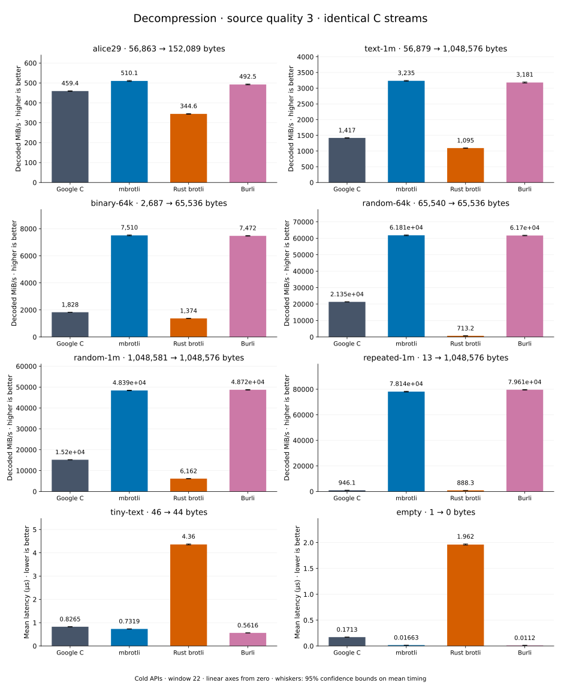

# Decompression of quality 3 streams

[Decoder overview](README.md) · [Benchmark index](../README.md)

Recorded run: **decoder-comparison-2026-09-10-060318** (2026-09-10).
[CSV](../decoder-comparison.csv) · [Environment](../decoder-comparison-environment.json) · [Methodology and limits](../decoder-comparison.md).

Quality belongs to the C encoder that prepared the input; decoders have no quality setting.
All four decode the same bytes. Burli is included at every source quality; SIMD Brotli
re-exports Rust brotli's decoder and is omitted.

## Median speed across eight datasets

Median of eight per-dataset C mean time / decoder mean time ratios, with equal weight
including empty and tiny input. Higher is faster; 1× matches C. No confidence interval
is inferred for this across-dataset median.

| Decoder | Median speed / C |
| --- | ---: |
| Google C | 1.000× |
| mbrotli | 1.443× |
| Rust brotli | 0.601× |
| Burli | 2.939× |

Datasets are ranked by mbrotli speed relative to the fastest peer, highest first.
Throughput counts restored bytes; empty input has latency only. Whiskers and intervals
describe sampling uncertainty, not all host variation. Cold APIs include allocation
and disposal. C knows the output capacity; Rust brotli includes its 4 KiB I/O adapter.

## binary-64k

64 KiB of structured binary bytes: ((i / 16) XOR i) modulo 256.

**2,687 compressed → 65,536 restored bytes; compressed / original: 4.100%.**

| Decoder | Mean µs | 95% mean interval µs | Decoded MiB/s | Speed / C |
| --- | ---: | ---: | ---: | ---: |
| Google C | 34.48 | 34.34–34.65 | 1,812.60 | 1.000× |
| mbrotli | 10.97 | 10.83–11.17 | 5,699.19 | 3.144× |
| Rust brotli | 45.22 | 45.05–45.4 | 1,382.13 | 0.763× |
| Burli | 11.84 | 11.77–11.91 | 5,278.96 | 2.912× |

## alice29

Vendored Alice in Wonderland text.

**56,863 compressed → 152,089 restored bytes; compressed / original: 37.388%.**

| Decoder | Mean µs | 95% mean interval µs | Decoded MiB/s | Speed / C |
| --- | ---: | ---: | ---: | ---: |
| Google C | 321.2 | 317.7–325.4 | 451.56 | 1.000× |
| mbrotli | 299.6 | 297.2–302.3 | 484.13 | 1.072× |
| Rust brotli | 429.7 | 424.3–436.9 | 337.57 | 0.748× |
| Burli | 368.5 | 365.3–371.8 | 393.59 | 0.872× |

## text-1m

Alice text repeated cyclically to 1 MiB.

**56,879 compressed → 1,048,576 restored bytes; compressed / original: 5.424%.**

| Decoder | Mean µs | 95% mean interval µs | Decoded MiB/s | Speed / C |
| --- | ---: | ---: | ---: | ---: |
| Google C | 725.7 | 716–736.2 | 1,377.94 | 1.000× |
| mbrotli | 382.2 | 377.6–387.3 | 2,616.74 | 1.899× |
| Rust brotli | 912.8 | 905.8–920 | 1,095.47 | 0.795× |
| Burli | 384.6 | 380.6–389.1 | 2,600.18 | 1.887× |

## tiny-text

44-byte quick-brown-fox sentence.

**46 compressed → 44 restored bytes; compressed / original: 104.545%.**

| Decoder | Mean µs | 95% mean interval µs | Decoded MiB/s | Speed / C |
| --- | ---: | ---: | ---: | ---: |
| Google C | 0.7984 | 0.7931–0.8041 | 52.56 | 1.000× |
| mbrotli | 1.035 | 1.028–1.043 | 40.55 | 0.771× |
| Rust brotli | 4.314 | 4.292–4.341 | 9.73 | 0.185× |
| Burli | 0.647 | 0.6417–0.6541 | 64.85 | 1.234× |

## random-64k

64 KiB prefix of the deterministic pseudorandom corpus.

**65,540 compressed → 65,536 restored bytes; compressed / original: 100.006%.**

| Decoder | Mean µs | 95% mean interval µs | Decoded MiB/s | Speed / C |
| --- | ---: | ---: | ---: | ---: |
| Google C | 2.898 | 2.863–2.938 | 21,568.09 | 1.000× |
| mbrotli | 3.757 | 3.707–3.817 | 16,637.28 | 0.771× |
| Rust brotli | 86.46 | 86.11–86.83 | 722.87 | 0.034× |
| Burli | 0.977 | 0.9694–0.9859 | 63,974.01 | 2.966× |

## random-1m

1 MiB of deterministic xorshift64 pseudorandom bytes.

**1,048,581 compressed → 1,048,576 restored bytes; compressed / original: 100.000%.**

| Decoder | Mean µs | 95% mean interval µs | Decoded MiB/s | Speed / C |
| --- | ---: | ---: | ---: | ---: |
| Google C | 66.07 | 65.56–66.61 | 15,135.83 | 1.000× |
| mbrotli | 87.71 | 86.9–88.73 | 11,400.97 | 0.753× |
| Rust brotli | 145.6 | 144.7–146.5 | 6,868.97 | 0.454× |
| Burli | 20.63 | 20.46–20.82 | 48,471.82 | 3.202× |

## repeated-1m

1 MiB of repeated a bytes.

**13 compressed → 1,048,576 restored bytes; compressed / original: 0.001%.**

| Decoder | Mean µs | 95% mean interval µs | Decoded MiB/s | Speed / C |
| --- | ---: | ---: | ---: | ---: |
| Google C | 1,060 | 1,052–1,070 | 943.37 | 1.000× |
| mbrotli | 63.91 | 63.38–64.51 | 15,647.76 | 16.587× |
| Rust brotli | 1,122 | 1,115–1,130 | 891.15 | 0.945× |
| Burli | 12.85 | 12.78–12.94 | 77,800.91 | 82.472× |

## empty

Empty input; measures API overhead.

**1 compressed → 0 restored bytes; compressed / original: undefined.**

| Decoder | Mean µs | 95% mean interval µs | Decoded MiB/s | Speed / C |
| --- | ---: | ---: | ---: | ---: |
| Google C | 0.1652 | 0.1635–0.1671 | — | 1.000× |
| mbrotli | 0.0911 | 0.0904–0.09183 | — | 1.813× |
| Rust brotli | 1.911 | 1.894–1.931 | — | 0.086× |
| Burli | 0.01595 | 0.01579–0.01615 | — | 10.354× |
