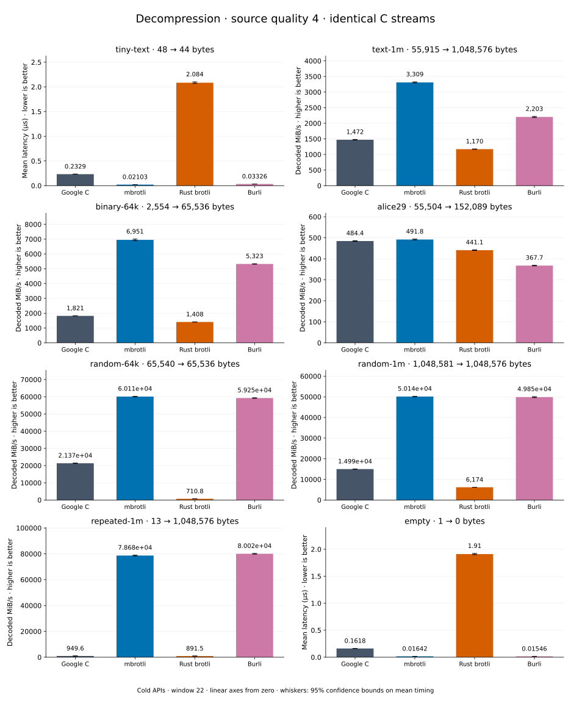

# Decompression of quality 4 streams

[Decoder overview](README.md) · [Benchmark index](../README.md)

Recorded run: **decoder-synthetic-final-2026-09-10-090040** (2026-09-10).
[CSV](../decoder-comparison.csv) · [Environment](../decoder-comparison-environment.json) · [Methodology and limits](../decoder-comparison.md).

Quality belongs to the C encoder that prepared the input; decoders have no quality setting.
All four decode the same bytes. Burli is included at every source quality; SIMD Brotli
re-exports Rust brotli's decoder and is omitted.

## Median speed across 8 datasets

Median of per-dataset C mean time / decoder mean time ratios, with equal weight.
Higher is faster; 1× matches C. No confidence interval
is inferred for this across-dataset median.

| Decoder | Median speed / C |
| --- | ---: |
| Google C | 1.000× |
| mbrotli | 3.710× |
| Rust brotli | 0.611× |
| Burli | 3.181× |

mbrotli median speed / Burli: **1.176×** (direct per-dataset ratios).

Datasets are ranked by mbrotli speed relative to the fastest peer, highest first.
Throughput counts restored bytes; empty input has latency only. Whiskers and intervals
describe sampling uncertainty, not all host variation. Cold APIs include allocation
and disposal. C knows the output capacity; Rust brotli includes its 4 KiB I/O adapter.

## tiny-text

44-byte quick-brown-fox sentence.

**48 compressed → 44 restored bytes; compressed / original: 109.091%.**

| Decoder | Mean µs | 95% mean interval µs | Decoded MiB/s | Speed / C |
| --- | ---: | ---: | ---: | ---: |
| Google C | 0.2219 | 0.2206–0.2239 | 189.11 | 1.000× |
| mbrotli | 0.02037 | 0.02021–0.02055 | 2,059.57 | 10.891× |
| Rust brotli | 2.051 | 2.039–2.064 | 20.46 | 0.108× |
| Burli | 0.03276 | 0.03259–0.03297 | 1,280.72 | 6.772× |

## text-1m

Alice text repeated cyclically to 1 MiB.

**55,915 compressed → 1,048,576 restored bytes; compressed / original: 5.332%.**

| Decoder | Mean µs | 95% mean interval µs | Decoded MiB/s | Speed / C |
| --- | ---: | ---: | ---: | ---: |
| Google C | 680.7 | 674.5–688.2 | 1,469.14 | 1.000× |
| mbrotli | 301.4 | 298.4–304.7 | 3,318.29 | 2.259× |
| Rust brotli | 876.4 | 871–882.1 | 1,141.01 | 0.777× |
| Burli | 459.5 | 455.9–463.4 | 2,176.44 | 1.481× |

## binary-64k

64 KiB of structured binary bytes: ((i / 16) XOR i) modulo 256.

**2,554 compressed → 65,536 restored bytes; compressed / original: 3.897%.**

| Decoder | Mean µs | 95% mean interval µs | Decoded MiB/s | Speed / C |
| --- | ---: | ---: | ---: | ---: |
| Google C | 35.42 | 34.99–35.88 | 1,764.46 | 1.000× |
| mbrotli | 9.097 | 8.987–9.222 | 6,870.24 | 3.894× |
| Rust brotli | 45.31 | 44.79–45.93 | 1,379.32 | 0.782× |
| Burli | 11.98 | 11.87–12.11 | 5,216.08 | 2.956× |

## alice29

Vendored Alice in Wonderland text.

**55,504 compressed → 152,089 restored bytes; compressed / original: 36.494%.**

| Decoder | Mean µs | 95% mean interval µs | Decoded MiB/s | Speed / C |
| --- | ---: | ---: | ---: | ---: |
| Google C | 304 | 302.2–306.1 | 477.04 | 1.000× |
| mbrotli | 288.5 | 287.4–289.7 | 502.69 | 1.054× |
| Rust brotli | 333.2 | 331.7–334.7 | 435.35 | 0.913× |
| Burli | 398.4 | 395.9–401.1 | 364.06 | 0.763× |

## random-1m

1 MiB of deterministic xorshift64 pseudorandom bytes.

**1,048,581 compressed → 1,048,576 restored bytes; compressed / original: 100.000%.**

| Decoder | Mean µs | 95% mean interval µs | Decoded MiB/s | Speed / C |
| --- | ---: | ---: | ---: | ---: |
| Google C | 66.86 | 66.28–67.47 | 14,956.86 | 1.000× |
| mbrotli | 18.96 | 18.75–19.2 | 52,737.41 | 3.526× |
| Rust brotli | 150 | 148.8–151.2 | 6,667.06 | 0.446× |
| Burli | 19.63 | 19.37–19.92 | 50,946.04 | 3.406× |

## random-64k

64 KiB prefix of the deterministic pseudorandom corpus.

**65,540 compressed → 65,536 restored bytes; compressed / original: 100.006%.**

| Decoder | Mean µs | 95% mean interval µs | Decoded MiB/s | Speed / C |
| --- | ---: | ---: | ---: | ---: |
| Google C | 2.9 | 2.879–2.922 | 21,554.44 | 1.000× |
| mbrotli | 0.9856 | 0.9785–0.9938 | 63,414.45 | 2.942× |
| Rust brotli | 90.34 | 89.34–91.52 | 691.79 | 0.032× |
| Burli | 0.9945 | 0.986–1.004 | 62,847.55 | 2.916× |

## repeated-1m

1 MiB of repeated a bytes.

**13 compressed → 1,048,576 restored bytes; compressed / original: 0.001%.**

| Decoder | Mean µs | 95% mean interval µs | Decoded MiB/s | Speed / C |
| --- | ---: | ---: | ---: | ---: |
| Google C | 1,059 | 1,049–1,071 | 944.28 | 1.000× |
| mbrotli | 12.86 | 12.75–13 | 77,772.50 | 82.362× |
| Rust brotli | 1,137 | 1,130–1,145 | 879.42 | 0.931× |
| Burli | 12.57 | 12.5–12.65 | 79,549.42 | 84.243× |

## empty

Empty input; measures API overhead.

**1 compressed → 0 restored bytes; compressed / original: undefined.**

| Decoder | Mean µs | 95% mean interval µs | Decoded MiB/s | Speed / C |
| --- | ---: | ---: | ---: | ---: |
| Google C | 0.1627 | 0.162–0.1635 | — | 1.000× |
| mbrotli | 0.01632 | 0.01623–0.0164 | — | 9.972× |
| Rust brotli | 1.96 | 1.94–1.985 | — | 0.083× |
| Burli | 0.01544 | 0.01533–0.01558 | — | 10.537× |
