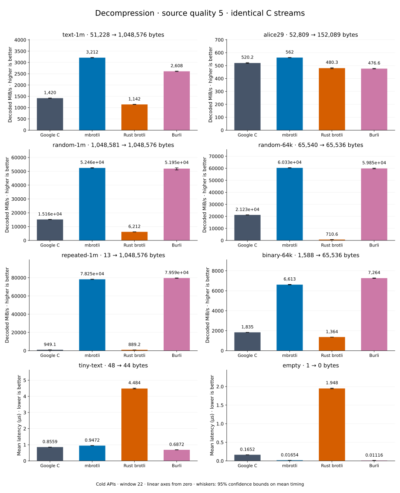

# Decompression of quality 5 streams

[Decoder overview](README.md) · [Benchmark index](../README.md)

Published measurements: **2026-09-10**. See the report for provenance limits.
[CSV](../decoder-comparison.csv) · [Environment](../decoder-comparison-environment.json) · [Methodology and limits](../decoder-comparison.md).

Quality belongs to the C encoder that prepared the input; decoders have no quality setting.
All four decode the same bytes. Burli is included at every source quality; SIMD Brotli
re-exports Rust brotli's decoder and is omitted.

## Median speed across 8 datasets

Median of per-dataset C mean time / decoder mean time ratios, with equal weight.
Higher is faster; 1× matches C. No confidence interval
is inferred for this across-dataset median.

| Decoder | Median speed / C |
| --- | ---: |
| Google C | 1.000× |
| mbrotli | 3.254× |
| Rust brotli | 0.591× |
| Burli | 3.102× |

mbrotli median speed / Burli: **1.015×** (direct per-dataset ratios).

Datasets are ranked by mbrotli speed relative to the fastest peer, highest first.
Throughput counts restored bytes; empty input has latency only. Whiskers and intervals
describe sampling uncertainty, not all host variation. Cold APIs include allocation
and disposal. C knows the output capacity; Rust brotli includes its 4 KiB I/O adapter.

## text-1m

Alice text repeated cyclically to 1 MiB.

**51,228 compressed → 1,048,576 restored bytes; compressed / original: 4.885%.**

| Decoder | Mean µs | 95% mean interval µs | Decoded MiB/s | Speed / C |
| --- | ---: | ---: | ---: | ---: |
| Google C | 705.3 | 699.7–711.8 | 1,417.83 | 1.000× |
| mbrotli | 331.1 | 327.4–335.4 | 3,019.99 | 2.130× |
| Rust brotli | 882.4 | 875.5–890.5 | 1,133.22 | 0.799× |
| Burli | 439.7 | 432.6–447.8 | 2,274.03 | 1.604× |

## binary-64k

64 KiB of structured binary bytes: ((i / 16) XOR i) modulo 256.

**1,588 compressed → 65,536 restored bytes; compressed / original: 2.423%.**

| Decoder | Mean µs | 95% mean interval µs | Decoded MiB/s | Speed / C |
| --- | ---: | ---: | ---: | ---: |
| Google C | 34.56 | 34.28–34.88 | 1,808.26 | 1.000× |
| mbrotli | 9.768 | 9.634–9.974 | 6,398.61 | 3.539× |
| Rust brotli | 46.47 | 46.09–47.02 | 1,345.10 | 0.744× |
| Burli | 10.57 | 10.5–10.64 | 5,914.49 | 3.271× |

## alice29

Vendored Alice in Wonderland text.

**52,809 compressed → 152,089 restored bytes; compressed / original: 34.722%.**

| Decoder | Mean µs | 95% mean interval µs | Decoded MiB/s | Speed / C |
| --- | ---: | ---: | ---: | ---: |
| Google C | 286.1 | 284–288.7 | 506.92 | 1.000× |
| mbrotli | 273.5 | 271.9–275.1 | 530.42 | 1.046× |
| Rust brotli | 306.5 | 304.3–309.2 | 473.24 | 0.934× |
| Burli | 373.2 | 370.2–376.9 | 388.69 | 0.767× |

## random-1m

1 MiB of deterministic xorshift64 pseudorandom bytes.

**1,048,581 compressed → 1,048,576 restored bytes; compressed / original: 100.000%.**

| Decoder | Mean µs | 95% mean interval µs | Decoded MiB/s | Speed / C |
| --- | ---: | ---: | ---: | ---: |
| Google C | 66.69 | 66–67.49 | 14,994.14 | 1.000× |
| mbrotli | 18.34 | 18.24–18.43 | 54,533.02 | 3.637× |
| Rust brotli | 152 | 150.8–153.3 | 6,579.52 | 0.439× |
| Burli | 18.66 | 18.48–18.89 | 53,589.03 | 3.574× |

## random-64k

64 KiB prefix of the deterministic pseudorandom corpus.

**65,540 compressed → 65,536 restored bytes; compressed / original: 100.006%.**

| Decoder | Mean µs | 95% mean interval µs | Decoded MiB/s | Speed / C |
| --- | ---: | ---: | ---: | ---: |
| Google C | 2.927 | 2.898–2.958 | 21,356.36 | 1.000× |
| mbrotli | 0.9856 | 0.9792–0.9923 | 63,415.40 | 2.969× |
| Rust brotli | 89.43 | 88.46–90.62 | 698.86 | 0.033× |
| Burli | 0.998 | 0.9921–1.004 | 62,623.61 | 2.932× |

## repeated-1m

1 MiB of repeated a bytes.

**13 compressed → 1,048,576 restored bytes; compressed / original: 0.001%.**

| Decoder | Mean µs | 95% mean interval µs | Decoded MiB/s | Speed / C |
| --- | ---: | ---: | ---: | ---: |
| Google C | 1,058 | 1,053–1,064 | 945.18 | 1.000× |
| mbrotli | 12.8 | 12.75–12.86 | 78,112.43 | 82.643× |
| Rust brotli | 1,125 | 1,115–1,139 | 889.25 | 0.941× |
| Burli | 12.51 | 12.45–12.59 | 79,916.27 | 84.551× |

## empty

Empty input; measures API overhead.

**1 compressed → 0 restored bytes; compressed / original: undefined.**

| Decoder | Mean µs | 95% mean interval µs | Decoded MiB/s | Speed / C |
| --- | ---: | ---: | ---: | ---: |
| Google C | 0.1624 | 0.1616–0.1634 | — | 1.000× |
| mbrotli | 0.01628 | 0.0162–0.01636 | — | 9.976× |
| Rust brotli | 1.926 | 1.909–1.945 | — | 0.084× |
| Burli | 0.01546 | 0.01527–0.01571 | — | 10.503× |

## tiny-text

44-byte quick-brown-fox sentence.

**48 compressed → 44 restored bytes; compressed / original: 109.091%.**

| Decoder | Mean µs | 95% mean interval µs | Decoded MiB/s | Speed / C |
| --- | ---: | ---: | ---: | ---: |
| Google C | 0.8182 | 0.813–0.8245 | 51.29 | 1.000× |
| mbrotli | 0.9288 | 0.9231–0.9364 | 45.18 | 0.881× |
| Rust brotli | 4.495 | 4.461–4.532 | 9.34 | 0.182× |
| Burli | 0.7411 | 0.7378–0.7449 | 56.62 | 1.104× |
