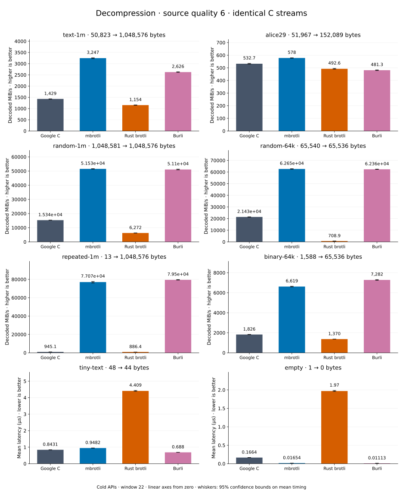

# Decompression of quality 6 streams

[Decoder overview](README.md) · [Benchmark index](../README.md)

Published measurements: **2026-09-10**. See the report for provenance limits.
[CSV](../decoder-comparison.csv) · [Environment](../decoder-comparison-environment.json) · [Methodology and limits](../decoder-comparison.md).

Quality belongs to the C encoder that prepared the input; decoders have no quality setting.
All four decode the same bytes. Burli is included at every source quality; SIMD Brotli
re-exports Rust brotli's decoder and is omitted.

## Median speed across 8 datasets

Median of per-dataset C mean time / decoder mean time ratios, with equal weight.
Higher is faster; 1× matches C. No confidence interval
is inferred for this across-dataset median.

| Decoder | Median speed / C |
| --- | ---: |
| Google C | 1.000× |
| mbrotli | 3.251× |
| Rust brotli | 0.611× |
| Burli | 3.104× |

mbrotli median speed / Burli: **1.006×** (direct per-dataset ratios).

Datasets are ranked by mbrotli speed relative to the fastest peer, highest first.
Throughput counts restored bytes; empty input has latency only. Whiskers and intervals
describe sampling uncertainty, not all host variation. Cold APIs include allocation
and disposal. C knows the output capacity; Rust brotli includes its 4 KiB I/O adapter.

## text-1m

Alice text repeated cyclically to 1 MiB.

**50,823 compressed → 1,048,576 restored bytes; compressed / original: 4.847%.**

| Decoder | Mean µs | 95% mean interval µs | Decoded MiB/s | Speed / C |
| --- | ---: | ---: | ---: | ---: |
| Google C | 707.2 | 701–714.6 | 1,414.04 | 1.000× |
| mbrotli | 323 | 320.1–326.5 | 3,095.79 | 2.189× |
| Rust brotli | 878.4 | 869.4–888.3 | 1,138.45 | 0.805× |
| Burli | 426.2 | 422.8–430.2 | 2,346.17 | 1.659× |

## binary-64k

64 KiB of structured binary bytes: ((i / 16) XOR i) modulo 256.

**1,588 compressed → 65,536 restored bytes; compressed / original: 2.423%.**

| Decoder | Mean µs | 95% mean interval µs | Decoded MiB/s | Speed / C |
| --- | ---: | ---: | ---: | ---: |
| Google C | 34.75 | 34.37–35.18 | 1,798.76 | 1.000× |
| mbrotli | 9.723 | 9.677–9.78 | 6,427.99 | 3.574× |
| Rust brotli | 46.12 | 45.74–46.55 | 1,355.11 | 0.753× |
| Burli | 10.59 | 10.51–10.69 | 5,900.12 | 3.280× |

## alice29

Vendored Alice in Wonderland text.

**51,967 compressed → 152,089 restored bytes; compressed / original: 34.169%.**

| Decoder | Mean µs | 95% mean interval µs | Decoded MiB/s | Speed / C |
| --- | ---: | ---: | ---: | ---: |
| Google C | 277 | 275.1–279.3 | 523.68 | 1.000× |
| mbrotli | 268 | 265.5–271 | 541.13 | 1.033× |
| Rust brotli | 300.2 | 296.4–305.5 | 483.09 | 0.922× |
| Burli | 362.2 | 358.6–366.5 | 400.45 | 0.765× |

## random-64k

64 KiB prefix of the deterministic pseudorandom corpus.

**65,540 compressed → 65,536 restored bytes; compressed / original: 100.006%.**

| Decoder | Mean µs | 95% mean interval µs | Decoded MiB/s | Speed / C |
| --- | ---: | ---: | ---: | ---: |
| Google C | 2.914 | 2.878–2.955 | 21,445.30 | 1.000× |
| mbrotli | 0.9802 | 0.9744–0.9868 | 63,759.87 | 2.973× |
| Rust brotli | 90.33 | 89.01–92.14 | 691.90 | 0.032× |
| Burli | 0.9956 | 0.9916–0.9999 | 62,776.03 | 2.927× |

## random-1m

1 MiB of deterministic xorshift64 pseudorandom bytes.

**1,048,581 compressed → 1,048,576 restored bytes; compressed / original: 100.000%.**

| Decoder | Mean µs | 95% mean interval µs | Decoded MiB/s | Speed / C |
| --- | ---: | ---: | ---: | ---: |
| Google C | 68.94 | 68.24–69.69 | 14,505.95 | 1.000× |
| mbrotli | 19.54 | 19.36–19.74 | 51,182.48 | 3.528× |
| Rust brotli | 147.4 | 145.3–149.9 | 6,784.46 | 0.468× |
| Burli | 19.45 | 19.34–19.58 | 51,409.32 | 3.544× |

## repeated-1m

1 MiB of repeated a bytes.

**13 compressed → 1,048,576 restored bytes; compressed / original: 0.001%.**

| Decoder | Mean µs | 95% mean interval µs | Decoded MiB/s | Speed / C |
| --- | ---: | ---: | ---: | ---: |
| Google C | 1,061 | 1,056–1,067 | 942.41 | 1.000× |
| mbrotli | 12.87 | 12.79–12.95 | 77,728.69 | 82.479× |
| Rust brotli | 1,131 | 1,123–1,138 | 884.55 | 0.939× |
| Burli | 12.55 | 12.47–12.64 | 79,680.52 | 84.550× |

## empty

Empty input; measures API overhead.

**1 compressed → 0 restored bytes; compressed / original: undefined.**

| Decoder | Mean µs | 95% mean interval µs | Decoded MiB/s | Speed / C |
| --- | ---: | ---: | ---: | ---: |
| Google C | 0.164 | 0.1625–0.1658 | — | 1.000× |
| mbrotli | 0.01629 | 0.0162–0.01639 | — | 10.065× |
| Rust brotli | 1.918 | 1.898–1.944 | — | 0.085× |
| Burli | 0.01545 | 0.01536–0.01556 | — | 10.611× |

## tiny-text

44-byte quick-brown-fox sentence.

**48 compressed → 44 restored bytes; compressed / original: 109.091%.**

| Decoder | Mean µs | 95% mean interval µs | Decoded MiB/s | Speed / C |
| --- | ---: | ---: | ---: | ---: |
| Google C | 0.8052 | 0.8–0.811 | 52.11 | 1.000× |
| mbrotli | 0.9219 | 0.9149–0.9305 | 45.52 | 0.873× |
| Rust brotli | 4.455 | 4.427–4.494 | 9.42 | 0.181× |
| Burli | 0.7452 | 0.7391–0.7535 | 56.31 | 1.081× |
