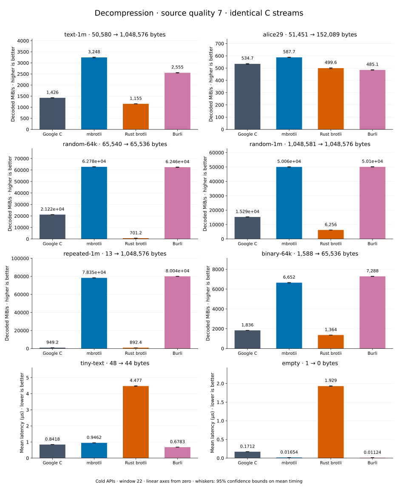

# Decompression of quality 7 streams

[Decoder overview](README.md) · [Benchmark index](../README.md)

Published measurements: **2026-09-10**. See the report for provenance limits.
[CSV](../decoder-comparison.csv) · [Environment](../decoder-comparison-environment.json) · [Methodology and limits](../decoder-comparison.md).

Quality belongs to the C encoder that prepared the input; decoders have no quality setting.
All four decode the same bytes. Burli is included at every source quality; SIMD Brotli
re-exports Rust brotli's decoder and is omitted.

## Median speed across 8 datasets

Median of per-dataset C mean time / decoder mean time ratios, with equal weight.
Higher is faster; 1× matches C. No confidence interval
is inferred for this across-dataset median.

| Decoder | Median speed / C |
| --- | ---: |
| Google C | 1.000× |
| mbrotli | 3.181× |
| Rust brotli | 0.579× |
| Burli | 3.009× |

mbrotli median speed / Burli: **1.032×** (direct per-dataset ratios).

Datasets are ranked by mbrotli speed relative to the fastest peer, highest first.
Throughput counts restored bytes; empty input has latency only. Whiskers and intervals
describe sampling uncertainty, not all host variation. Cold APIs include allocation
and disposal. C knows the output capacity; Rust brotli includes its 4 KiB I/O adapter.

## text-1m

Alice text repeated cyclically to 1 MiB.

**50,580 compressed → 1,048,576 restored bytes; compressed / original: 4.824%.**

| Decoder | Mean µs | 95% mean interval µs | Decoded MiB/s | Speed / C |
| --- | ---: | ---: | ---: | ---: |
| Google C | 713.9 | 705.2–723.3 | 1,400.77 | 1.000× |
| mbrotli | 329.4 | 325.9–332.9 | 3,036.21 | 2.168× |
| Rust brotli | 895.8 | 879.9–916.7 | 1,116.31 | 0.797× |
| Burli | 428.2 | 426.3–430.5 | 2,335.34 | 1.667× |

## binary-64k

64 KiB of structured binary bytes: ((i / 16) XOR i) modulo 256.

**1,588 compressed → 65,536 restored bytes; compressed / original: 2.423%.**

| Decoder | Mean µs | 95% mean interval µs | Decoded MiB/s | Speed / C |
| --- | ---: | ---: | ---: | ---: |
| Google C | 34.16 | 33.99–34.35 | 1,829.68 | 1.000× |
| mbrotli | 9.61 | 9.551–9.699 | 6,503.32 | 3.554× |
| Rust brotli | 45.49 | 45.19–45.83 | 1,373.93 | 0.751× |
| Burli | 10.6 | 10.54–10.68 | 5,894.46 | 3.222× |

## random-64k

64 KiB prefix of the deterministic pseudorandom corpus.

**65,540 compressed → 65,536 restored bytes; compressed / original: 100.006%.**

| Decoder | Mean µs | 95% mean interval µs | Decoded MiB/s | Speed / C |
| --- | ---: | ---: | ---: | ---: |
| Google C | 2.897 | 2.871–2.924 | 21,577.43 | 1.000× |
| mbrotli | 0.9843 | 0.9764–0.9937 | 63,497.71 | 2.943× |
| Rust brotli | 89.13 | 88.54–89.73 | 701.25 | 0.032× |
| Burli | 1.036 | 1.001–1.098 | 60,332.33 | 2.796× |

## alice29

Vendored Alice in Wonderland text.

**51,451 compressed → 152,089 restored bytes; compressed / original: 33.830%.**

| Decoder | Mean µs | 95% mean interval µs | Decoded MiB/s | Speed / C |
| --- | ---: | ---: | ---: | ---: |
| Google C | 273.1 | 271.1–275.2 | 531.12 | 1.000× |
| mbrotli | 263.9 | 262.4–265.3 | 549.69 | 1.035× |
| Rust brotli | 301.2 | 297.4–306.7 | 481.53 | 0.907× |
| Burli | 355.9 | 354.2–358 | 407.49 | 0.767× |

## random-1m

1 MiB of deterministic xorshift64 pseudorandom bytes.

**1,048,581 compressed → 1,048,576 restored bytes; compressed / original: 100.000%.**

| Decoder | Mean µs | 95% mean interval µs | Decoded MiB/s | Speed / C |
| --- | ---: | ---: | ---: | ---: |
| Google C | 66.17 | 65.57–66.86 | 15,112.18 | 1.000× |
| mbrotli | 19.36 | 19.23–19.5 | 51,664.10 | 3.419× |
| Rust brotli | 162.8 | 161.5–164.2 | 6,142.45 | 0.406× |
| Burli | 19.58 | 19.38–19.83 | 51,060.87 | 3.379× |

## repeated-1m

1 MiB of repeated a bytes.

**13 compressed → 1,048,576 restored bytes; compressed / original: 0.001%.**

| Decoder | Mean µs | 95% mean interval µs | Decoded MiB/s | Speed / C |
| --- | ---: | ---: | ---: | ---: |
| Google C | 1,059 | 1,053–1,066 | 944.00 | 1.000× |
| mbrotli | 12.76 | 12.69–12.83 | 78,370.32 | 83.019× |
| Rust brotli | 1,130 | 1,124–1,137 | 884.80 | 0.937× |
| Burli | 12.62 | 12.52–12.73 | 79,243.36 | 83.944× |

## empty

Empty input; measures API overhead.

**1 compressed → 0 restored bytes; compressed / original: undefined.**

| Decoder | Mean µs | 95% mean interval µs | Decoded MiB/s | Speed / C |
| --- | ---: | ---: | ---: | ---: |
| Google C | 0.1623 | 0.1612–0.1639 | — | 1.000× |
| mbrotli | 0.01632 | 0.01624–0.01642 | — | 9.943× |
| Rust brotli | 1.902 | 1.884–1.925 | — | 0.085× |
| Burli | 0.01574 | 0.01548–0.01609 | — | 10.312× |

## tiny-text

44-byte quick-brown-fox sentence.

**48 compressed → 44 restored bytes; compressed / original: 109.091%.**

| Decoder | Mean µs | 95% mean interval µs | Decoded MiB/s | Speed / C |
| --- | ---: | ---: | ---: | ---: |
| Google C | 0.8062 | 0.8018–0.8111 | 52.05 | 1.000× |
| mbrotli | 0.9277 | 0.9169–0.9443 | 45.23 | 0.869× |
| Rust brotli | 4.46 | 4.434–4.488 | 9.41 | 0.181× |
| Burli | 0.7713 | 0.7672–0.7759 | 54.40 | 1.045× |
