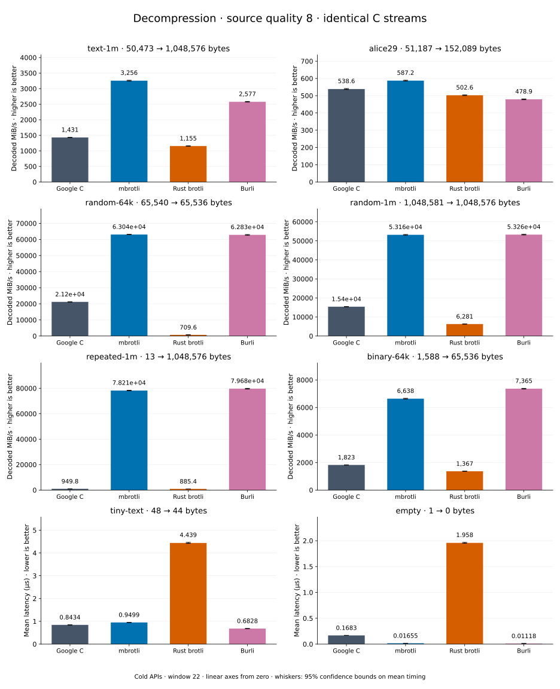

# Decompression of quality 8 streams

[Decoder overview](README.md) · [Benchmark index](../README.md)

Published measurements: **2026-09-10**. See the report for provenance limits.
[CSV](../decoder-comparison.csv) · [Environment](../decoder-comparison-environment.json) · [Methodology and limits](../decoder-comparison.md).

Quality belongs to the C encoder that prepared the input; decoders have no quality setting.
All four decode the same bytes. Burli is included at every source quality; SIMD Brotli
re-exports Rust brotli's decoder and is omitted.

## Median speed across 8 datasets

Median of per-dataset C mean time / decoder mean time ratios, with equal weight.
Higher is faster; 1× matches C. No confidence interval
is inferred for this across-dataset median.

| Decoder | Median speed / C |
| --- | ---: |
| Google C | 1.000× |
| mbrotli | 3.189× |
| Rust brotli | 0.583× |
| Burli | 3.095× |

mbrotli median speed / Burli: **1.011×** (direct per-dataset ratios).

Datasets are ranked by mbrotli speed relative to the fastest peer, highest first.
Throughput counts restored bytes; empty input has latency only. Whiskers and intervals
describe sampling uncertainty, not all host variation. Cold APIs include allocation
and disposal. C knows the output capacity; Rust brotli includes its 4 KiB I/O adapter.

## text-1m

Alice text repeated cyclically to 1 MiB.

**50,473 compressed → 1,048,576 restored bytes; compressed / original: 4.813%.**

| Decoder | Mean µs | 95% mean interval µs | Decoded MiB/s | Speed / C |
| --- | ---: | ---: | ---: | ---: |
| Google C | 706.2 | 699.5–713.5 | 1,416.10 | 1.000× |
| mbrotli | 328.8 | 324–334.1 | 3,041.62 | 2.148× |
| Rust brotli | 880.3 | 870.2–893.5 | 1,135.98 | 0.802× |
| Burli | 426.7 | 422.3–433.2 | 2,343.62 | 1.655× |

## binary-64k

64 KiB of structured binary bytes: ((i / 16) XOR i) modulo 256.

**1,588 compressed → 65,536 restored bytes; compressed / original: 2.423%.**

| Decoder | Mean µs | 95% mean interval µs | Decoded MiB/s | Speed / C |
| --- | ---: | ---: | ---: | ---: |
| Google C | 34.38 | 34.17–34.61 | 1,817.73 | 1.000× |
| mbrotli | 9.705 | 9.657–9.76 | 6,439.81 | 3.543× |
| Rust brotli | 45.63 | 45.3–45.99 | 1,369.69 | 0.754× |
| Burli | 10.5 | 10.44–10.58 | 5,951.96 | 3.274× |

## alice29

Vendored Alice in Wonderland text.

**51,187 compressed → 152,089 restored bytes; compressed / original: 33.656%.**

| Decoder | Mean µs | 95% mean interval µs | Decoded MiB/s | Speed / C |
| --- | ---: | ---: | ---: | ---: |
| Google C | 273.7 | 271.9–275.6 | 529.94 | 1.000× |
| mbrotli | 262.4 | 259.9–265.6 | 552.79 | 1.043× |
| Rust brotli | 294.3 | 292.8–296.1 | 492.78 | 0.930× |
| Burli | 360.6 | 358.9–362.5 | 402.21 | 0.759× |

## random-64k

64 KiB prefix of the deterministic pseudorandom corpus.

**65,540 compressed → 65,536 restored bytes; compressed / original: 100.006%.**

| Decoder | Mean µs | 95% mean interval µs | Decoded MiB/s | Speed / C |
| --- | ---: | ---: | ---: | ---: |
| Google C | 2.936 | 2.913–2.965 | 21,286.04 | 1.000× |
| mbrotli | 0.9963 | 0.9879–1.006 | 62,733.50 | 2.947× |
| Rust brotli | 88.89 | 88.27–89.52 | 703.13 | 0.033× |
| Burli | 1.007 | 0.9959–1.02 | 62,047.71 | 2.915× |

## random-1m

1 MiB of deterministic xorshift64 pseudorandom bytes.

**1,048,581 compressed → 1,048,576 restored bytes; compressed / original: 100.000%.**

| Decoder | Mean µs | 95% mean interval µs | Decoded MiB/s | Speed / C |
| --- | ---: | ---: | ---: | ---: |
| Google C | 66.93 | 66.13–67.87 | 14,940.27 | 1.000× |
| mbrotli | 19.51 | 19.36–19.68 | 51,256.62 | 3.431× |
| Rust brotli | 162.3 | 160.9–163.8 | 6,163.19 | 0.413× |
| Burli | 19.71 | 19.46–20.05 | 50,746.48 | 3.397× |

## repeated-1m

1 MiB of repeated a bytes.

**13 compressed → 1,048,576 restored bytes; compressed / original: 0.001%.**

| Decoder | Mean µs | 95% mean interval µs | Decoded MiB/s | Speed / C |
| --- | ---: | ---: | ---: | ---: |
| Google C | 1,059 | 1,053–1,064 | 944.57 | 1.000× |
| mbrotli | 12.76 | 12.7–12.81 | 78,395.68 | 82.996× |
| Rust brotli | 1,139 | 1,132–1,147 | 877.74 | 0.929× |
| Burli | 12.55 | 12.49–12.61 | 79,694.80 | 84.372× |

## empty

Empty input; measures API overhead.

**1 compressed → 0 restored bytes; compressed / original: undefined.**

| Decoder | Mean µs | 95% mean interval µs | Decoded MiB/s | Speed / C |
| --- | ---: | ---: | ---: | ---: |
| Google C | 0.1642 | 0.1622–0.1669 | — | 1.000× |
| mbrotli | 0.0163 | 0.01622–0.01639 | — | 10.072× |
| Rust brotli | 1.897 | 1.884–1.913 | — | 0.087× |
| Burli | 0.01529 | 0.0152–0.0154 | — | 10.734× |

## tiny-text

44-byte quick-brown-fox sentence.

**48 compressed → 44 restored bytes; compressed / original: 109.091%.**

| Decoder | Mean µs | 95% mean interval µs | Decoded MiB/s | Speed / C |
| --- | ---: | ---: | ---: | ---: |
| Google C | 0.8187 | 0.7973–0.8457 | 51.25 | 1.000× |
| mbrotli | 0.9501 | 0.9412–0.961 | 44.16 | 0.862× |
| Rust brotli | 4.501 | 4.47–4.537 | 9.32 | 0.182× |
| Burli | 0.7507 | 0.7452–0.7568 | 55.89 | 1.091× |
