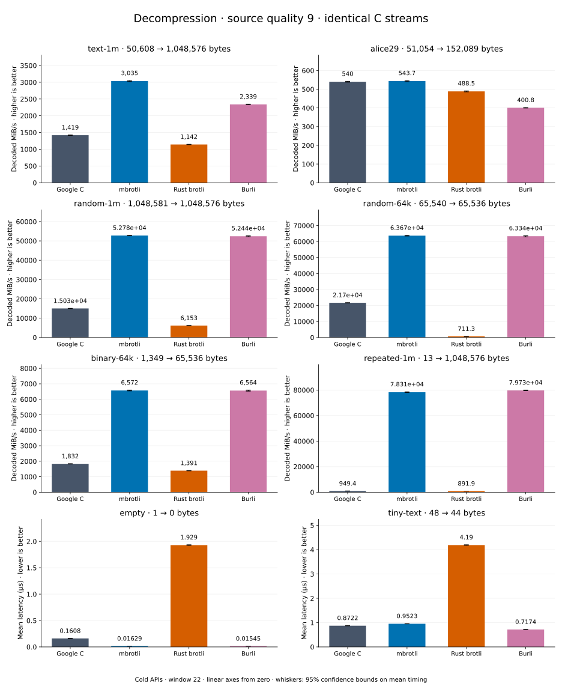

# Decompression of quality 9 streams

[Decoder overview](README.md) · [Benchmark index](../README.md)

Published measurements: **2026-09-10**. See the report for provenance limits.
[CSV](../decoder-comparison.csv) · [Environment](../decoder-comparison-environment.json) · [Methodology and limits](../decoder-comparison.md).

Quality belongs to the C encoder that prepared the input; decoders have no quality setting.
All four decode the same bytes. Burli is included at every source quality; SIMD Brotli
re-exports Rust brotli's decoder and is omitted.

## Median speed across 8 datasets

Median of per-dataset C mean time / decoder mean time ratios, with equal weight.
Higher is faster; 1× matches C. No confidence interval
is inferred for this across-dataset median.

| Decoder | Median speed / C |
| --- | ---: |
| Google C | 1.000× |
| mbrotli | 3.156× |
| Rust brotli | 0.607× |
| Burli | 3.115× |

mbrotli median speed / Burli: **1.013×** (direct per-dataset ratios).

Datasets are ranked by mbrotli speed relative to the fastest peer, highest first.
Throughput counts restored bytes; empty input has latency only. Whiskers and intervals
describe sampling uncertainty, not all host variation. Cold APIs include allocation
and disposal. C knows the output capacity; Rust brotli includes its 4 KiB I/O adapter.

## text-1m

Alice text repeated cyclically to 1 MiB.

**50,608 compressed → 1,048,576 restored bytes; compressed / original: 4.826%.**

| Decoder | Mean µs | 95% mean interval µs | Decoded MiB/s | Speed / C |
| --- | ---: | ---: | ---: | ---: |
| Google C | 703.9 | 700–708.7 | 1,420.68 | 1.000× |
| mbrotli | 327.3 | 324–331 | 3,055.62 | 2.151× |
| Rust brotli | 884.1 | 877.3–892.3 | 1,131.10 | 0.796× |
| Burli | 447.9 | 441.5–454.9 | 2,232.74 | 1.572× |

## alice29

Vendored Alice in Wonderland text.

**51,054 compressed → 152,089 restored bytes; compressed / original: 33.569%.**

| Decoder | Mean µs | 95% mean interval µs | Decoded MiB/s | Speed / C |
| --- | ---: | ---: | ---: | ---: |
| Google C | 271 | 269–273.1 | 535.20 | 1.000× |
| mbrotli | 263.7 | 261.9–265.6 | 550.07 | 1.028× |
| Rust brotli | 297.4 | 295.6–299.3 | 487.69 | 0.911× |
| Burli | 366.3 | 363.6–369.5 | 395.95 | 0.740× |

## binary-64k

64 KiB of structured binary bytes: ((i / 16) XOR i) modulo 256.

**1,349 compressed → 65,536 restored bytes; compressed / original: 2.058%.**

| Decoder | Mean µs | 95% mean interval µs | Decoded MiB/s | Speed / C |
| --- | ---: | ---: | ---: | ---: |
| Google C | 34.08 | 33.83–34.36 | 1,833.91 | 1.000× |
| mbrotli | 9.47 | 9.4–9.557 | 6,599.79 | 3.599× |
| Rust brotli | 45.06 | 44.78–45.38 | 1,387.04 | 0.756× |
| Burli | 9.726 | 9.667–9.79 | 6,425.98 | 3.504× |

## random-1m

1 MiB of deterministic xorshift64 pseudorandom bytes.

**1,048,581 compressed → 1,048,576 restored bytes; compressed / original: 100.000%.**

| Decoder | Mean µs | 95% mean interval µs | Decoded MiB/s | Speed / C |
| --- | ---: | ---: | ---: | ---: |
| Google C | 66.37 | 65.73–67.07 | 15,067.01 | 1.000× |
| mbrotli | 19.91 | 19.75–20.08 | 50,230.08 | 3.334× |
| Rust brotli | 144.9 | 143.3–147 | 6,899.06 | 0.458× |
| Burli | 20.2 | 20.05–20.37 | 49,511.96 | 3.286× |

## random-64k

64 KiB prefix of the deterministic pseudorandom corpus.

**65,540 compressed → 65,536 restored bytes; compressed / original: 100.006%.**

| Decoder | Mean µs | 95% mean interval µs | Decoded MiB/s | Speed / C |
| --- | ---: | ---: | ---: | ---: |
| Google C | 2.979 | 2.939–3.022 | 20,982.15 | 1.000× |
| mbrotli | 1 | 0.9935–1.008 | 62,483.10 | 2.978× |
| Rust brotli | 89.6 | 88.85–90.45 | 697.56 | 0.033× |
| Burli | 1.012 | 1.004–1.02 | 61,782.26 | 2.945× |

## repeated-1m

1 MiB of repeated a bytes.

**13 compressed → 1,048,576 restored bytes; compressed / original: 0.001%.**

| Decoder | Mean µs | 95% mean interval µs | Decoded MiB/s | Speed / C |
| --- | ---: | ---: | ---: | ---: |
| Google C | 1,061 | 1,055–1,068 | 942.58 | 1.000× |
| mbrotli | 13.2 | 12.84–13.82 | 75,768.55 | 80.384× |
| Rust brotli | 1,134 | 1,123–1,146 | 882.09 | 0.936× |
| Burli | 12.56 | 12.51–12.61 | 79,633.62 | 84.485× |

## empty

Empty input; measures API overhead.

**1 compressed → 0 restored bytes; compressed / original: undefined.**

| Decoder | Mean µs | 95% mean interval µs | Decoded MiB/s | Speed / C |
| --- | ---: | ---: | ---: | ---: |
| Google C | 0.165 | 0.1621–0.1685 | — | 1.000× |
| mbrotli | 0.01644 | 0.01634–0.01656 | — | 10.034× |
| Rust brotli | 1.901 | 1.89–1.914 | — | 0.087× |
| Burli | 0.01535 | 0.01526–0.01545 | — | 10.749× |

## tiny-text

44-byte quick-brown-fox sentence.

**48 compressed → 44 restored bytes; compressed / original: 109.091%.**

| Decoder | Mean µs | 95% mean interval µs | Decoded MiB/s | Speed / C |
| --- | ---: | ---: | ---: | ---: |
| Google C | 0.8875 | 0.8802–0.8963 | 47.28 | 1.000× |
| mbrotli | 0.9381 | 0.9338–0.9427 | 44.73 | 0.946× |
| Rust brotli | 4.497 | 4.48–4.514 | 9.33 | 0.197× |
| Burli | 0.7484 | 0.7431–0.7543 | 56.07 | 1.186× |
