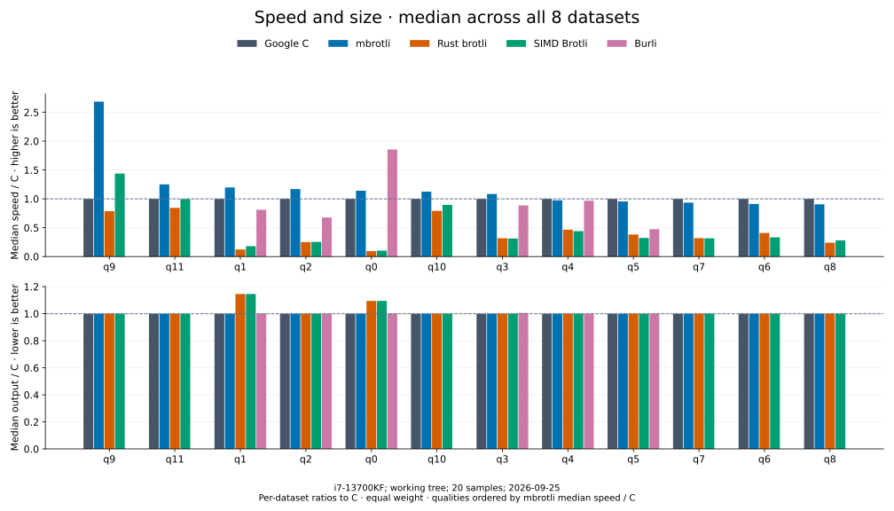

# Compression comparison — 2026-09-07

[Benchmark index](README.md) · [Results by quality](encoders/README.md)

The [432-case CSV](encoder-comparison.csv) and
[environment record](encoder-comparison-environment.json) describe encoder revision
`ce83e1067ca85a2cb6e7ee4826c91b4ed8d0e072` on the recorded machine.

## Final measurements



Each quality summarizes eight equally weighted datasets. Speed / C is C mean
latency divided by the encoder's mean latency for the same input; output / C is
encoder bytes divided by C bytes. The summary takes the median of those eight
ratios, including empty and tiny input. These are not median Criterion sample
times. Higher speed and lower output are better.

| Quality | mbrotli median speed / C ↑ | mbrotli median output / C ↓ |
| --- | ---: | ---: |
| 0 | 1.132× | 1.000× |
| 1 | 1.196× | 1.000× |
| 2 | 1.094× | 1.000× |
| 3 | 1.066× | 1.000× |
| 4 | 0.975× | 1.000× |
| 5 | 0.985× | 1.000× |
| 6 | 0.941× | 1.000× |
| 7 | 1.052× | 1.000× |
| 8 | 0.862× | 1.000× |
| 9 | 2.386× | 1.000× |
| 10 | 1.002× | 1.000× |
| 11 | 1.140× | 1.000× |

mbrotli has a lower mean latency than C in 57 of 96 shared cases and the lowest
mean among supported implementations in 48 of 96 cases. These counts compare
point estimates, not statistical significance. The medians also retain qualities
where mbrotli is slower than C.

For Alice at q5, mbrotli measures 57.22 MiB/s against C's 62.21 MiB/s, both
producing 52,809 bytes. Burli measures 64.11 MiB/s with 54,231 bytes. At q11,
mbrotli measures 1.302 MiB/s against C's 1.096 MiB/s, both producing 46,487 bytes;
SIMD Brotli measures 1.326 MiB/s with 46,493 bytes.

The [quality pages](encoders/README.md) retain all datasets, all implementations,
and exact timings with 95% mean confidence bounds. Burli supports q0–q5 only.
Equal quality numbers describe each encoder's effort policy and do not imply
equal output size.

mbrotli and Google C produce equal output lengths in all 96 shared cases in
this run. Equal lengths alone do not establish compressed byte identity.

## Measurement contract

| Setting | Recorded value |
| --- | --- |
| Host | Intel Core i7-13700KF, x86_64, WSL2 |
| Affinity | Logical CPU 2 |
| Rust | rustc 1.98.1; release defaults; runtime SIMD dispatch |
| C compiler | GCC 11.4.0; vendored release defaults |
| C Brotli | 1.2.0; commit `028fb5a23661f123017c060daa546b55cf4bde29` |
| Rust brotli / simd-brotli / burli | 9.0.0 / 10.0.1 / 0.3.1 |
| Compression | Generic mode, window 22, complete known input, no dictionary or explicit flush |
| API | Cold native serial helpers; construction, allocation, compression, and disposal timed |
| Sampling | 30 samples; 0.2 s warmup; 0.5 s requested measurement per case |
| Validation | All 432 outputs decoded to the original input through Google C Brotli before timing |

Inputs are empty, 44-byte text, vendored `alice29.txt` (152,089 bytes), cyclic
Alice text at 1 MiB, structured binary at 64 KiB, deterministic pseudorandom
bytes at 64 KiB and 1 MiB, and 1 MiB of repeated `a` bytes. Corpus construction
and validation occur outside timing. The environment record hashes the corpus
generator, Alice source, lockfiles, and benchmark executable.

No encoder retains workspace between iterations. Rust Brotli and SIMD Brotli
include their native 4 KiB I/O adapters. The C encoder uses its native one-shot
API, including its output rewrites. Round-trip equality is required; compressed
byte identity across implementations is not. Empty input has latency and output
size but no meaningful throughput or compressed/input fraction.

## Reproduction

Run from the repository root; use a fresh baseline name when repeating timings:

```sh
cargo bench --manifest-path benchmarks/comparison/Cargo.toml --bench implementations --locked -- --test
taskset -c 2 cargo bench --manifest-path benchmarks/comparison/Cargo.toml --bench implementations --locked -- --save-baseline library-refresh-2026-09-07-191328 --sample-size 30 --warm-up-time 0.2 --measurement-time 0.5 --noplot
python3 benchmarks/comparison/report.py --baseline library-refresh-2026-09-07-191328 --csv docs/benchmarks/encoder-comparison.csv
python3 benchmarks/comparison/quality_docs.py --csv docs/benchmarks/encoder-comparison.csv --environment docs/benchmarks/encoder-comparison-environment.json --report docs/benchmarks/encoder-comparison.md --output docs/benchmarks/encoders
python3 benchmarks/comparison/plot.py --csv docs/benchmarks/encoder-comparison.csv --output docs/benchmarks/encoders/charts --subtitle 'i7-13700KF; ce83e10; 30 samples; 2026-09-07'
```

Plotting uses Matplotlib 3.10.8. Criterion extends slow cases to collect the
requested samples. The exporter rejects incomplete matrices and mismatched
input lengths. Export immediately after timing and archive `sizes.csv` with
the named baseline: a later preflight replaces that shared manifest.
Raw samples remain local under `benchmarks/comparison/target/criterion/`.
This run also archives all named baseline directories, the matching size
manifest, logs, exported CSV, and environment under
`benchmarks/comparison/target/run-archives/library-refresh-2026-09-07-191328/`.

## Interpretation limits

This is a short exploratory sweep on one WSL2 host. Affinity restricts CPU
migration but does not control frequency, thermal state, or host scheduling.
Implementation order is fixed. The lowest mean does not necessarily imply a
statistically significant lead; confidence bounds do not capture every source
of host or allocator variation. No builds, tests, or profiling were launched
alongside the timed sweep.

The suite measures cold serial compression. Streaming, retained workspace,
parallel tasks, dictionaries, and experimental formats have separate root API
benchmarks and are not represented by these results. See the
[benchmark guide](../benchmarking.md) and [harness specification](../../architecture/benchmark-comparison.md).
