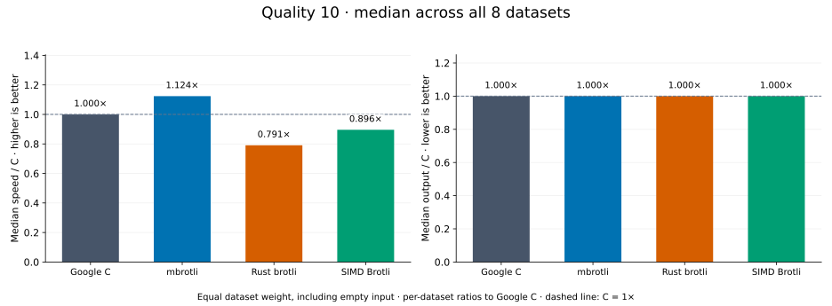
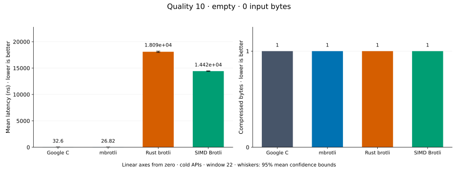
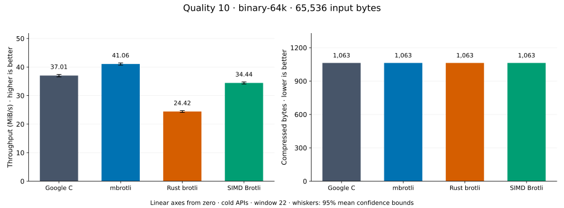
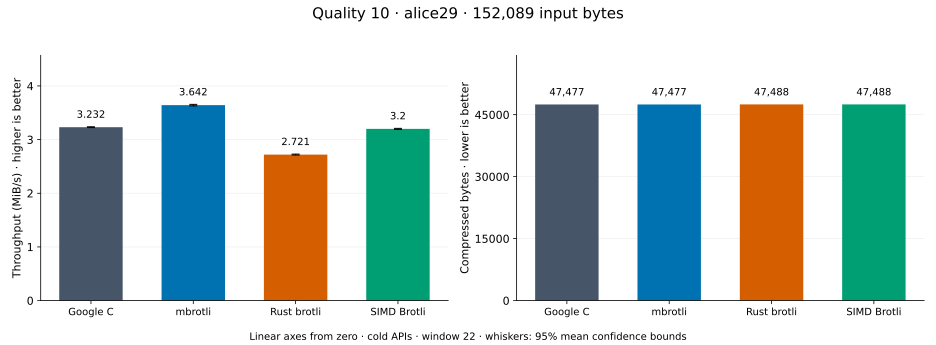
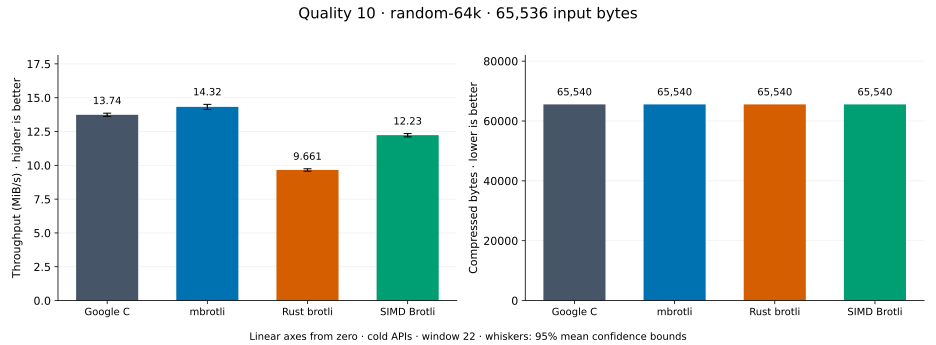
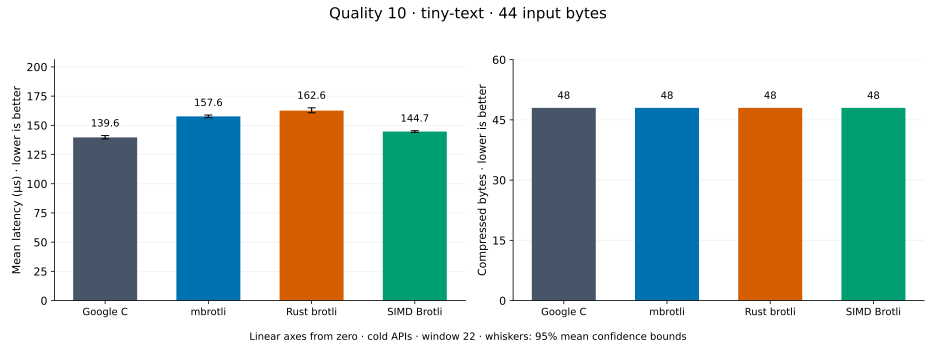
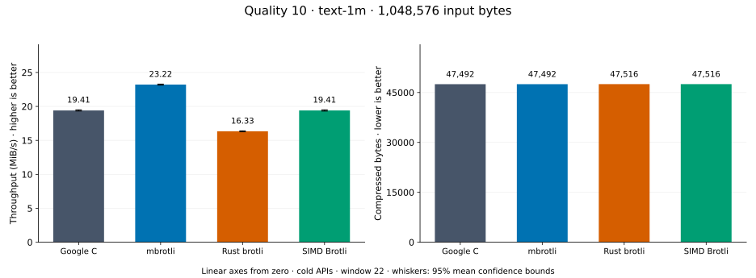
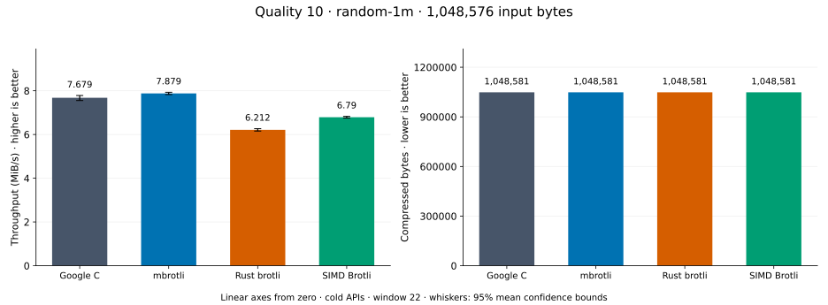
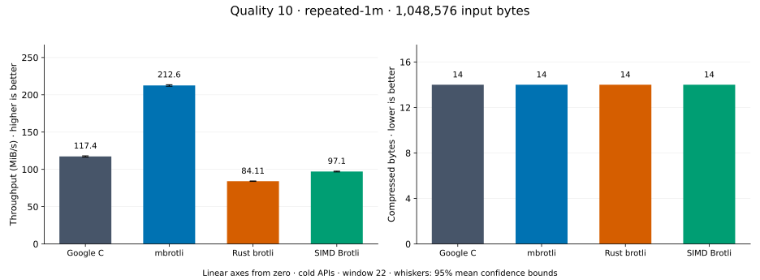

# Compression quality 10

[Benchmark index](../README.md) · [Median overview](README.md) · [← Quality 9](q9.md) · [Quality 11 →](q11.md)

Recorded run: **library-refresh-2026-09-07-191328** (2026-09-07).
[Raw results](../encoder-comparison.csv) · [Environment](../encoder-comparison-environment.json) · [Run analysis](../encoder-comparison.md).

## Median across all datasets

Each of the eight datasets has equal weight, including empty and tiny input.
Speed / C = C mean latency / implementation mean latency; output / C = implementation bytes / C bytes.
We take the median of these eight per-dataset ratios separately for speed and size.
1× matches C; higher speed and lower output are better. These are medians across datasets,
not median sample latencies, and do not imply equal compressed size or statistical significance.

| Implementation | Median speed / C ↑ | Median output / C ↓ | Datasets |
| --- | ---: | ---: | ---: |
| Google C | 1.000× | 1.000× | 8 |
| mbrotli | 1.002× | 1.000× | 8 |
| Rust brotli | 0.744× | 1.000× | 8 |
| SIMD Brotli | 0.905× | 1.000× | 8 |

Measurement setup and interpretation

Google C Brotli 1.2.0, mbrotli at the recorded optimized checkout, Rust brotli 9.0.0,
and SIMD Brotli 10.0.1 are compared at this quality.
**Burli supports only qualities 0–5; it has no results at this quality.**

These are cold native API measurements: construction, allocation, compression, and disposal.
Generic mode, window 22, known input size; 30 samples, 0.2 s warmup, at least 0.5 s measurement.
Host: 13th Gen Intel(R) Core(TM) i7-13700KF, logical CPU 2; unset; Cargo release defaults, runtime SIMD dispatch.
Rust brotli and SIMD Brotli include their native 4 KiB I/O adapters.

Chart whiskers and table intervals describe 95% confidence bounds on mean timing.
They do not capture all host or allocator variation. Throughput bounds are transformed latency bounds.
Output / input is compressed bytes divided by input bytes; smaller is better, and values above 100% mean expansion.
For empty input, throughput and output / input are undefined (—).
See the [run analysis](../encoder-comparison.md#final-measurements) for measurement limitations.

## Dataset details

Ordered by mbrotli speed / fastest competing implementation, highest first; all eight datasets are shown.
This order uses recorded mean latency, not statistical significance. Bars start at zero.

[empty](#empty) · [binary-64k](#binary-64k) · [alice29](#alice29) · [random-64k](#random-64k) · [tiny-text](#tiny-text) · [text-1m](#text-1m) · [random-1m](#random-1m) · [repeated-1m](#repeated-1m)

### empty

Empty input; measures API overhead. **Input: 0 bytes.**

mbrotli speed / fastest peer (Google C): **1.211×**; output: 1 / 1 bytes.

Exact measurements and confidence bounds

| Implementation | Mean, ns | 95% mean interval, ns | MiB/s | Output bytes | Output / input | Speed / C |
| --- | ---: | ---: | ---: | ---: | ---: | ---: |
| Google C | 33.76 | 33.29–34.24 | — | 1 | — | 1.000× |
| mbrotli | 27.88 | 27.54–28.26 | — | 1 | — | 1.211× |
| Rust brotli | 1.869e+04 | 1.838e+04–1.912e+04 | — | 1 | — | 0.002× |
| SIMD Brotli | 1.445e+04 | 1.433e+04–1.46e+04 | — | 1 | — | 0.002× |

### binary-64k

64 KiB of structured binary bytes: ((i / 16) XOR i) modulo 256. **Input: 65,536 bytes.**

mbrotli speed / fastest peer (Google C): **1.085×**; output: 1,063 / 1,063 bytes.

Exact measurements and confidence bounds

| Implementation | Mean, µs | 95% mean interval, µs | MiB/s | Output bytes | Output / input | Speed / C |
| --- | ---: | ---: | ---: | ---: | ---: | ---: |
| Google C | 1,641 | 1,631–1,651 | 38.09 | 1,063 | 1.622% | 1.000× |
| mbrotli | 1,512 | 1,502–1,522 | 41.34 | 1,063 | 1.622% | 1.085× |
| Rust brotli | 2,509 | 2,495–2,524 | 24.91 | 1,063 | 1.622% | 0.654× |
| SIMD Brotli | 1,801 | 1,783–1,824 | 34.69 | 1,063 | 1.622% | 0.911× |

### alice29

Vendored Alice in Wonderland text. **Input: 152,089 bytes.**

mbrotli speed / fastest peer (SIMD Brotli): **1.070×**; output: 47,477 / 47,488 bytes.

Exact measurements and confidence bounds

| Implementation | Mean, µs | 95% mean interval, µs | MiB/s | Output bytes | Output / input | Speed / C |
| --- | ---: | ---: | ---: | ---: | ---: | ---: |
| Google C | 4.59e+04 | 4.553e+04–4.628e+04 | 3.16 | 47,477 | 31.217% | 1.000× |
| mbrotli | 4.254e+04 | 4.22e+04–4.289e+04 | 3.41 | 47,477 | 31.217% | 1.079× |
| Rust brotli | 5.427e+04 | 5.388e+04–5.482e+04 | 2.67 | 47,488 | 31.224% | 0.846× |
| SIMD Brotli | 4.553e+04 | 4.524e+04–4.584e+04 | 3.19 | 47,488 | 31.224% | 1.008× |

### random-64k

64 KiB prefix of the deterministic pseudorandom corpus. **Input: 65,536 bytes.**

mbrotli speed / fastest peer (Google C): **1.031×**; output: 65,540 / 65,540 bytes.

Exact measurements and confidence bounds

| Implementation | Mean, µs | 95% mean interval, µs | MiB/s | Output bytes | Output / input | Speed / C |
| --- | ---: | ---: | ---: | ---: | ---: | ---: |
| Google C | 4,419 | 4,379–4,464 | 14.14 | 65,540 | 100.006% | 1.000× |
| mbrotli | 4,285 | 4,228–4,355 | 14.59 | 65,540 | 100.006% | 1.031× |
| Rust brotli | 6,386 | 6,323–6,458 | 9.79 | 65,540 | 100.006% | 0.692× |
| SIMD Brotli | 4,917 | 4,895–4,939 | 12.71 | 65,540 | 100.006% | 0.899× |

### tiny-text

44-byte quick-brown-fox sentence. **Input: 44 bytes.**

mbrotli speed / fastest peer (Google C): **0.974×**; output: 48 / 48 bytes.

Exact measurements and confidence bounds

| Implementation | Mean, µs | 95% mean interval, µs | MiB/s | Output bytes | Output / input | Speed / C |
| --- | ---: | ---: | ---: | ---: | ---: | ---: |
| Google C | 137.9 | 136.9–139 | 0.30 | 48 | 109.091% | 1.000× |
| mbrotli | 141.6 | 140.9–142.4 | 0.30 | 48 | 109.091% | 0.974× |
| Rust brotli | 154 | 153–155.1 | 0.27 | 48 | 109.091% | 0.895× |
| SIMD Brotli | 144.2 | 143–145.7 | 0.29 | 48 | 109.091% | 0.956× |

### text-1m

Alice text repeated cyclically to 1 MiB. **Input: 1,048,576 bytes.**

mbrotli speed / fastest peer (Google C): **0.955×**; output: 47,492 / 47,492 bytes.

Exact measurements and confidence bounds

| Implementation | Mean, µs | 95% mean interval, µs | MiB/s | Output bytes | Output / input | Speed / C |
| --- | ---: | ---: | ---: | ---: | ---: | ---: |
| Google C | 5.13e+04 | 5.11e+04–5.151e+04 | 19.49 | 47,492 | 4.529% | 1.000× |
| mbrotli | 5.37e+04 | 5.351e+04–5.389e+04 | 18.62 | 47,492 | 4.529% | 0.955× |
| Rust brotli | 6.136e+04 | 6.105e+04–6.167e+04 | 16.30 | 47,516 | 4.531% | 0.836× |
| SIMD Brotli | 5.194e+04 | 5.172e+04–5.219e+04 | 19.25 | 47,516 | 4.531% | 0.988× |

### random-1m

1 MiB of deterministic xorshift64 pseudorandom bytes. **Input: 1,048,576 bytes.**

mbrotli speed / fastest peer (Google C): **0.949×**; output: 1,048,581 / 1,048,581 bytes.

Exact measurements and confidence bounds

| Implementation | Mean, µs | 95% mean interval, µs | MiB/s | Output bytes | Output / input | Speed / C |
| --- | ---: | ---: | ---: | ---: | ---: | ---: |
| Google C | 1.274e+05 | 1.268e+05–1.28e+05 | 7.85 | 1,048,581 | 100.000% | 1.000× |
| mbrotli | 1.342e+05 | 1.329e+05–1.358e+05 | 7.45 | 1,048,581 | 100.000% | 0.949× |
| Rust brotli | 1.628e+05 | 1.618e+05–1.639e+05 | 6.14 | 1,048,581 | 100.000% | 0.783× |
| SIMD Brotli | 1.47e+05 | 1.464e+05–1.475e+05 | 6.80 | 1,048,581 | 100.000% | 0.867× |

### repeated-1m

1 MiB of repeated a bytes. **Input: 1,048,576 bytes.**

mbrotli speed / fastest peer (Google C): **0.609×**; output: 14 / 14 bytes.

Exact measurements and confidence bounds

| Implementation | Mean, µs | 95% mean interval, µs | MiB/s | Output bytes | Output / input | Speed / C |
| --- | ---: | ---: | ---: | ---: | ---: | ---: |
| Google C | 8,537 | 8,479–8,597 | 117.13 | 14 | 0.001% | 1.000× |
| mbrotli | 1.403e+04 | 1.394e+04–1.412e+04 | 71.29 | 14 | 0.001% | 0.609× |
| Rust brotli | 1.21e+04 | 1.202e+04–1.218e+04 | 82.68 | 14 | 0.001% | 0.706× |
| SIMD Brotli | 1.042e+04 | 1.035e+04–1.05e+04 | 95.94 | 14 | 0.001% | 0.819× |

