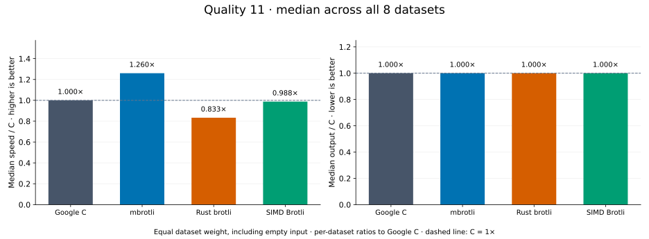
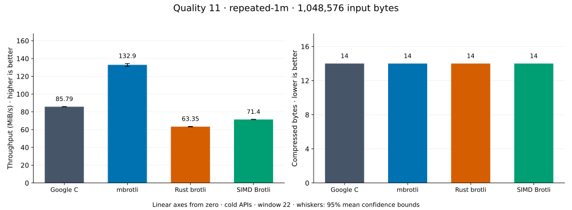
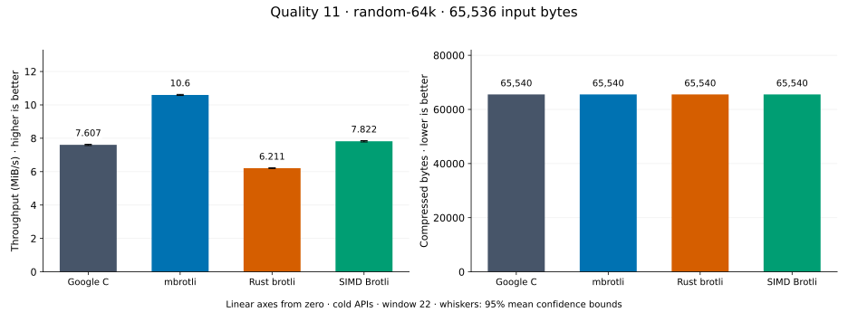
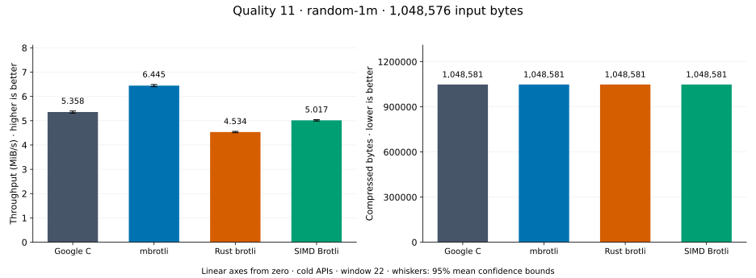
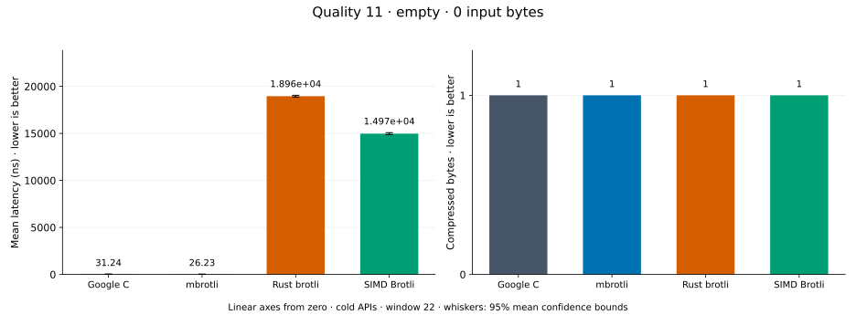
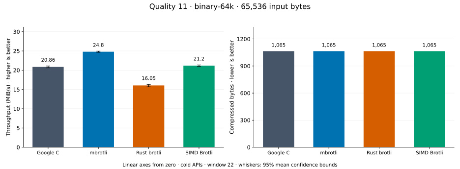
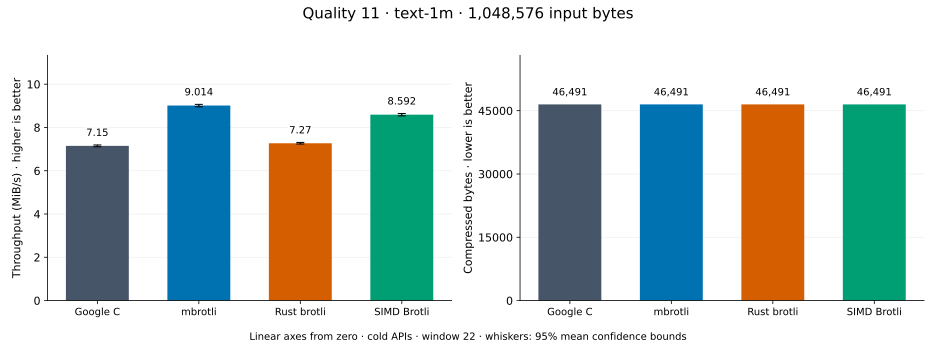
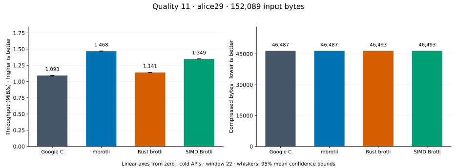
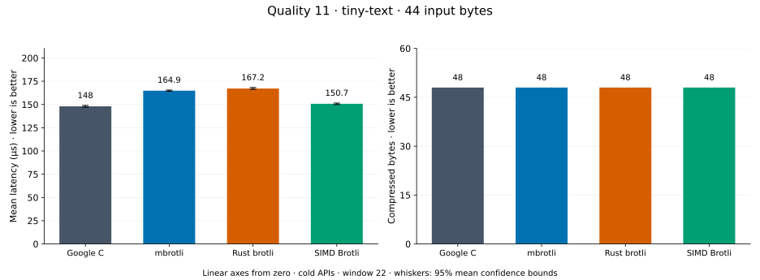

# Compression quality 11

[Benchmark index](../README.md) · [Median overview](README.md) · [← Quality 10](q10.md)

Recorded run: **encoder-final-20260914** (2026-09-14).
[Raw results](../encoder-comparison.csv) · [Environment](../encoder-comparison-environment.json) · [Run analysis](../encoder-comparison.md).

## Median across all datasets

Each of the eight datasets has equal weight, including empty and tiny input.
Speed / C = C mean latency / implementation mean latency; output / C = implementation bytes / C bytes.
We take the median of these eight per-dataset ratios separately for speed and size.
1× matches C; higher speed and lower output are better. These are medians across datasets,
not median sample latencies, and do not imply equal compressed size or statistical significance.

| Implementation | Median speed / C ↑ | Median output / C ↓ | Datasets |
| --- | ---: | ---: | ---: |
| Google C | 1.000× | 1.000× | 8 |
| mbrotli | 1.228× | 1.000× | 8 |
| Rust brotli | 0.830× | 1.000× | 8 |
| SIMD Brotli | 0.995× | 1.000× | 8 |

Measurement setup and interpretation

Google C Brotli 1.2.0, mbrotli at the recorded optimized checkout, Rust brotli 9.0.0,
and SIMD Brotli 10.0.1 are compared at this quality.
**Burli supports only qualities 0–5; it has no results at this quality.**

These are cold native API measurements: construction, allocation, compression, and disposal.
Generic mode, window 22, known input size; 20 samples, 0.1 s warmup, at least 0.3 s measurement.
Host: 13th Gen Intel(R) Core(TM) i7-13700KF, logical CPU 2; unset; Cargo release defaults, runtime SIMD dispatch.
Rust brotli and SIMD Brotli include their native 4 KiB I/O adapters.

Chart whiskers and table intervals describe 95% confidence bounds on mean timing.
They do not capture all host or allocator variation. Throughput bounds are transformed latency bounds.
Output / input is compressed bytes divided by input bytes; smaller is better, and values above 100% mean expansion.
For empty input, throughput and output / input are undefined (—).
See the [run analysis](../encoder-comparison.md#final-measurements) for measurement limitations.

## Dataset details

Ordered by mbrotli speed / fastest competing implementation, highest first; all eight datasets are shown.
This order uses recorded mean latency, not statistical significance. Bars start at zero.

[repeated-1m](#repeated-1m) · [random-64k](#random-64k) · [random-1m](#random-1m) · [empty](#empty) · [binary-64k](#binary-64k) · [text-1m](#text-1m) · [alice29](#alice29) · [tiny-text](#tiny-text)

### repeated-1m

1 MiB of repeated a bytes. **Input: 1,048,576 bytes.**

mbrotli speed / fastest peer (Google C): **1.619×**; output: 14 / 14 bytes.

Exact measurements and confidence bounds

| Implementation | Mean, µs | 95% mean interval, µs | MiB/s | Output bytes | Output / input | Speed / C |
| --- | ---: | ---: | ---: | ---: | ---: | ---: |
| Google C | 1.217e+04 | 1.204e+04–1.232e+04 | 82.15 | 14 | 0.001% | 1.000× |
| mbrotli | 7,518 | 7,406–7,653 | 133.01 | 14 | 0.001% | 1.619× |
| Rust brotli | 1.632e+04 | 1.611e+04–1.654e+04 | 61.29 | 14 | 0.001% | 0.746× |
| SIMD Brotli | 1.45e+04 | 1.434e+04–1.467e+04 | 68.98 | 14 | 0.001% | 0.840× |

### random-64k

64 KiB prefix of the deterministic pseudorandom corpus. **Input: 65,536 bytes.**

mbrotli speed / fastest peer (SIMD Brotli): **1.297×**; output: 65,540 / 65,540 bytes.

Exact measurements and confidence bounds

| Implementation | Mean, µs | 95% mean interval, µs | MiB/s | Output bytes | Output / input | Speed / C |
| --- | ---: | ---: | ---: | ---: | ---: | ---: |
| Google C | 8,226 | 8,182–8,274 | 7.60 | 65,540 | 100.006% | 1.000× |
| mbrotli | 6,106 | 6,042–6,177 | 10.24 | 65,540 | 100.006% | 1.347× |
| Rust brotli | 1.011e+04 | 1.003e+04–1.021e+04 | 6.18 | 65,540 | 100.006% | 0.814× |
| SIMD Brotli | 7,918 | 7,857–7,985 | 7.89 | 65,540 | 100.006% | 1.039× |

### random-1m

1 MiB of deterministic xorshift64 pseudorandom bytes. **Input: 1,048,576 bytes.**

mbrotli speed / fastest peer (Google C): **1.200×**; output: 1,048,581 / 1,048,581 bytes.

Exact measurements and confidence bounds

| Implementation | Mean, µs | 95% mean interval, µs | MiB/s | Output bytes | Output / input | Speed / C |
| --- | ---: | ---: | ---: | ---: | ---: | ---: |
| Google C | 1.957e+05 | 1.941e+05–1.974e+05 | 5.11 | 1,048,581 | 100.000% | 1.000× |
| mbrotli | 1.63e+05 | 1.617e+05–1.645e+05 | 6.13 | 1,048,581 | 100.000% | 1.200× |
| Rust brotli | 2.311e+05 | 2.297e+05–2.324e+05 | 4.33 | 1,048,581 | 100.000% | 0.847× |
| SIMD Brotli | 2.048e+05 | 2.018e+05–2.089e+05 | 4.88 | 1,048,581 | 100.000% | 0.956× |

### empty

Empty input; measures API overhead. **Input: 0 bytes.**

mbrotli speed / fastest peer (Google C): **1.192×**; output: 1 / 1 bytes.

Exact measurements and confidence bounds

| Implementation | Mean, ns | 95% mean interval, ns | MiB/s | Output bytes | Output / input | Speed / C |
| --- | ---: | ---: | ---: | ---: | ---: | ---: |
| Google C | 31.88 | 31.65–32.15 | — | 1 | — | 1.000× |
| mbrotli | 26.74 | 26.37–27.17 | — | 1 | — | 1.192× |
| Rust brotli | 1.939e+04 | 1.914e+04–1.969e+04 | — | 1 | — | 0.002× |
| SIMD Brotli | 1.541e+04 | 1.526e+04–1.559e+04 | — | 1 | — | 0.002× |

### binary-64k

64 KiB of structured binary bytes: ((i / 16) XOR i) modulo 256. **Input: 65,536 bytes.**

mbrotli speed / fastest peer (SIMD Brotli): **1.170×**; output: 1,065 / 1,065 bytes.

Exact measurements and confidence bounds

| Implementation | Mean, µs | 95% mean interval, µs | MiB/s | Output bytes | Output / input | Speed / C |
| --- | ---: | ---: | ---: | ---: | ---: | ---: |
| Google C | 2,997 | 2,965–3,034 | 20.86 | 1,065 | 1.625% | 1.000× |
| mbrotli | 2,521 | 2,505–2,537 | 24.80 | 1,065 | 1.625% | 1.189× |
| Rust brotli | 3,894 | 3,829–3,985 | 16.05 | 1,065 | 1.625% | 0.770× |
| SIMD Brotli | 2,949 | 2,925–2,974 | 21.20 | 1,065 | 1.625% | 1.016× |

### text-1m

Alice text repeated cyclically to 1 MiB. **Input: 1,048,576 bytes.**

mbrotli speed / fastest peer (SIMD Brotli): **1.049×**; output: 46,491 / 46,491 bytes.

Exact measurements and confidence bounds

| Implementation | Mean, µs | 95% mean interval, µs | MiB/s | Output bytes | Output / input | Speed / C |
| --- | ---: | ---: | ---: | ---: | ---: | ---: |
| Google C | 1.399e+05 | 1.391e+05–1.407e+05 | 7.15 | 46,491 | 4.434% | 1.000× |
| mbrotli | 1.109e+05 | 1.103e+05–1.116e+05 | 9.01 | 46,491 | 4.434% | 1.261× |
| Rust brotli | 1.376e+05 | 1.368e+05–1.382e+05 | 7.27 | 46,491 | 4.434% | 1.017× |
| SIMD Brotli | 1.164e+05 | 1.157e+05–1.171e+05 | 8.59 | 46,491 | 4.434% | 1.202× |

### alice29

Vendored Alice in Wonderland text. **Input: 152,089 bytes.**

mbrotli speed / fastest peer (SIMD Brotli): **1.023×**; output: 46,487 / 46,493 bytes.

Exact measurements and confidence bounds

| Implementation | Mean, µs | 95% mean interval, µs | MiB/s | Output bytes | Output / input | Speed / C |
| --- | ---: | ---: | ---: | ---: | ---: | ---: |
| Google C | 1.333e+05 | 1.328e+05–1.338e+05 | 1.09 | 46,487 | 30.566% | 1.000× |
| mbrotli | 1.062e+05 | 1.058e+05–1.067e+05 | 1.37 | 46,487 | 30.566% | 1.255× |
| Rust brotli | 1.296e+05 | 1.29e+05–1.303e+05 | 1.12 | 46,493 | 30.570% | 1.028× |
| SIMD Brotli | 1.087e+05 | 1.081e+05–1.093e+05 | 1.33 | 46,493 | 30.570% | 1.226× |

### tiny-text

44-byte quick-brown-fox sentence. **Input: 44 bytes.**

mbrotli speed / fastest peer (Google C): **0.964×**; output: 48 / 48 bytes.

Exact measurements and confidence bounds

| Implementation | Mean, µs | 95% mean interval, µs | MiB/s | Output bytes | Output / input | Speed / C |
| --- | ---: | ---: | ---: | ---: | ---: | ---: |
| Google C | 159.6 | 157.8–161.8 | 0.26 | 48 | 109.091% | 1.000× |
| mbrotli | 165.6 | 163.7–167.8 | 0.25 | 48 | 109.091% | 0.964× |
| Rust brotli | 168.6 | 166–171.7 | 0.25 | 48 | 109.091% | 0.947× |
| SIMD Brotli | 164 | 160.7–168.2 | 0.26 | 48 | 109.091% | 0.973× |

