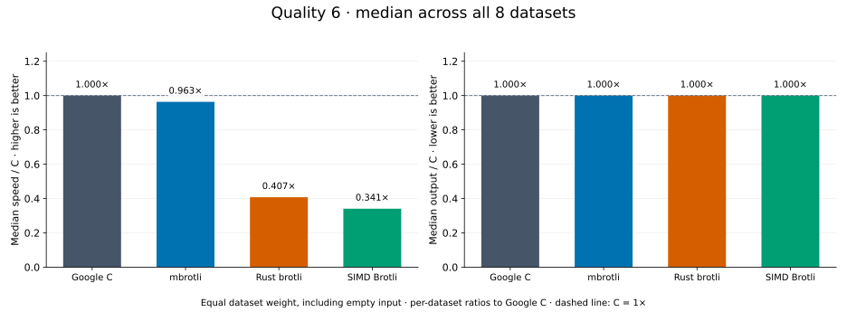
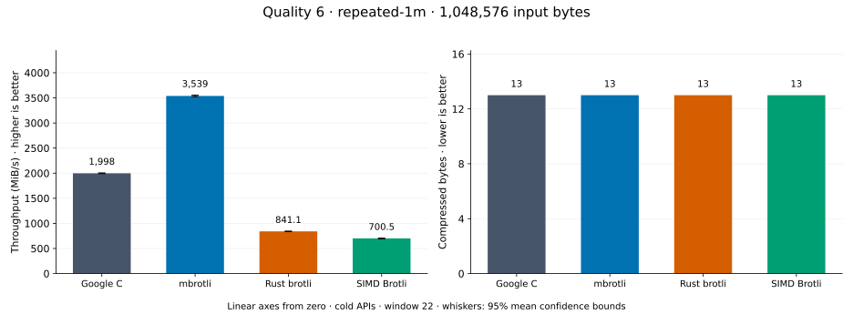
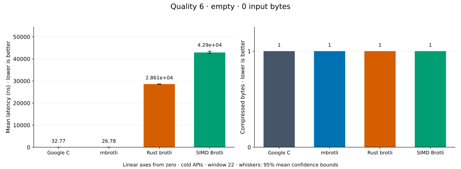
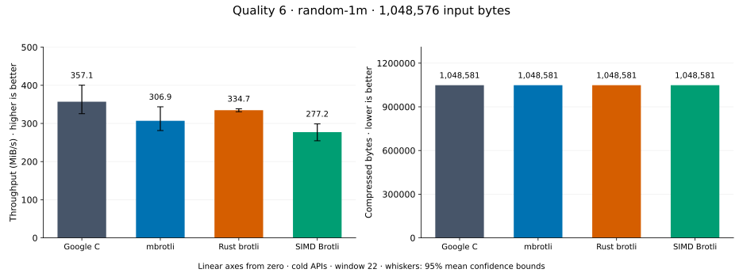
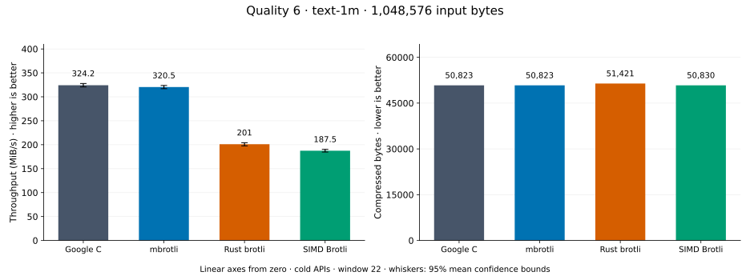
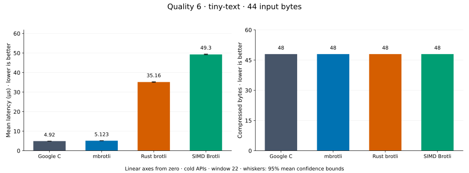
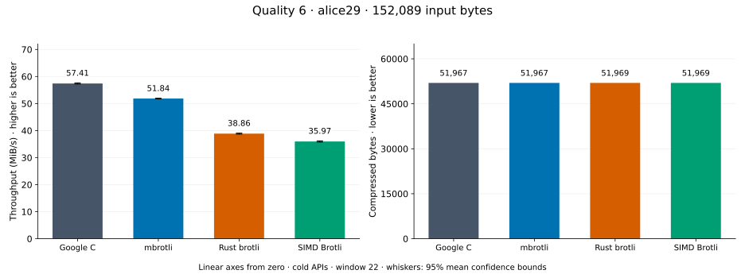
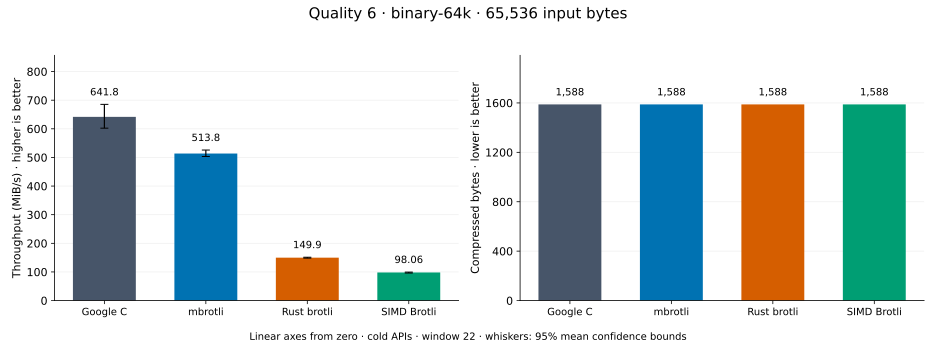
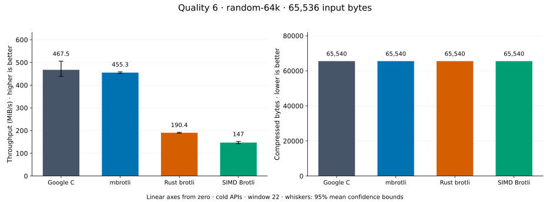

# Compression quality 6

[Benchmark index](../README.md) · [Median overview](README.md) · [← Quality 5](q5.md) · [Quality 7 →](q7.md)

Recorded run: **enc-2026-09-26b** (2026-09-26).
[Raw results](../encoder-comparison.csv) · [Environment](../encoder-comparison-environment.json) · [Run analysis](../encoder-comparison.md).

## Median across all datasets

Each of the eight datasets has equal weight, including empty and tiny input.
Speed / C = C mean latency / implementation mean latency; output / C = implementation bytes / C bytes.
We take the median of these eight per-dataset ratios separately for speed and size.
1× matches C; higher speed and lower output are better. These are medians across datasets,
not median sample latencies, and do not imply equal compressed size or statistical significance.

| Implementation | Median speed / C ↑ | Median output / C ↓ | Datasets |
| --- | ---: | ---: | ---: |
| Google C | 1.000× | 1.000× | 8 |
| mbrotli | 0.974× | 1.000× | 8 |
| Rust brotli | 0.372× | 1.000× | 8 |
| SIMD Brotli | 0.315× | 1.000× | 8 |

Measurement setup and interpretation

Google C Brotli 1.2.0, mbrotli at the recorded optimized checkout, Rust brotli 9.0.0,
and SIMD Brotli 10.0.1 are compared at this quality.
**Burli supports only qualities 0–5; it has no results at this quality.**

These are cold native API measurements: construction, allocation, compression, and disposal.
Generic mode, window 22, known input size; 20 samples, 1 s warmup, at least 3 s measurement.
Host: 13th Gen Intel(R) Core(TM) i7-13700KF, logical CPU 2; unset; Cargo release defaults, runtime SIMD dispatch.
Rust brotli and SIMD Brotli include their native 4 KiB I/O adapters.

Chart whiskers and table intervals describe 95% confidence bounds on mean timing.
They do not capture all host or allocator variation. Throughput bounds are transformed latency bounds.
Output / input is compressed bytes divided by input bytes; smaller is better, and values above 100% mean expansion.
For empty input, throughput and output / input are undefined (—).
See the [run analysis](../encoder-comparison.md#final-measurements) for measurement limitations.

## Dataset details

Ordered by mbrotli speed / fastest competing implementation, highest first; all eight datasets are shown.
This order uses recorded mean latency, not statistical significance. Bars start at zero.

[repeated-1m](#repeated-1m) · [empty](#empty) · [random-1m](#random-1m) · [text-1m](#text-1m) · [tiny-text](#tiny-text) · [alice29](#alice29) · [binary-64k](#binary-64k) · [random-64k](#random-64k)

### repeated-1m

1 MiB of repeated a bytes. **Input: 1,048,576 bytes.**

mbrotli speed / fastest peer (Google C): **1.958×**; output: 13 / 13 bytes.

Exact measurements and confidence bounds

| Implementation | Mean, µs | 95% mean interval, µs | MiB/s | Output bytes | Output / input | Speed / C |
| --- | ---: | ---: | ---: | ---: | ---: | ---: |
| Google C | 501.5 | 499.9–503.1 | 1,994.20 | 13 | 0.001% | 1.000× |
| mbrotli | 256.1 | 255.4–256.8 | 3,904.49 | 13 | 0.001% | 1.958× |
| Rust brotli | 1,269 | 1,265–1,274 | 787.95 | 13 | 0.001% | 0.395× |
| SIMD Brotli | 1,413 | 1,409–1,418 | 707.55 | 13 | 0.001% | 0.355× |

### empty

Empty input; measures API overhead. **Input: 0 bytes.**

mbrotli speed / fastest peer (Google C): **1.224×**; output: 1 / 1 bytes.

Exact measurements and confidence bounds

| Implementation | Mean, ns | 95% mean interval, ns | MiB/s | Output bytes | Output / input | Speed / C |
| --- | ---: | ---: | ---: | ---: | ---: | ---: |
| Google C | 32.77 | 32.6–32.94 | — | 1 | — | 1.000× |
| mbrotli | 26.78 | 26.66–26.89 | — | 1 | — | 1.224× |
| Rust brotli | 2.861e+04 | 2.852e+04–2.868e+04 | — | 1 | — | 0.001× |
| SIMD Brotli | 4.29e+04 | 4.255e+04–4.351e+04 | — | 1 | — | 0.001× |

### random-1m

1 MiB of deterministic xorshift64 pseudorandom bytes. **Input: 1,048,576 bytes.**

mbrotli speed / fastest peer (Google C): **1.039×**; output: 1,048,581 / 1,048,581 bytes.

Exact measurements and confidence bounds

| Implementation | Mean, µs | 95% mean interval, µs | MiB/s | Output bytes | Output / input | Speed / C |
| --- | ---: | ---: | ---: | ---: | ---: | ---: |
| Google C | 2,376 | 2,208–2,542 | 420.86 | 1,048,581 | 100.000% | 1.000× |
| mbrotli | 2,288 | 1,990–2,612 | 437.07 | 1,048,581 | 100.000% | 1.039× |
| Rust brotli | 2,911 | 2,899–2,923 | 343.53 | 1,048,581 | 100.000% | 0.816× |
| SIMD Brotli | 3,615 | 3,435–3,820 | 276.63 | 1,048,581 | 100.000% | 0.657× |

### text-1m

Alice text repeated cyclically to 1 MiB. **Input: 1,048,576 bytes.**

mbrotli speed / fastest peer (Google C): **0.987×**; output: 50,823 / 50,823 bytes.

Exact measurements and confidence bounds

| Implementation | Mean, µs | 95% mean interval, µs | MiB/s | Output bytes | Output / input | Speed / C |
| --- | ---: | ---: | ---: | ---: | ---: | ---: |
| Google C | 3,057 | 3,035–3,078 | 327.15 | 50,823 | 4.847% | 1.000× |
| mbrotli | 3,097 | 3,066–3,131 | 322.94 | 50,823 | 4.847% | 0.987× |
| Rust brotli | 4,842 | 4,828–4,858 | 206.51 | 51,421 | 4.904% | 0.631× |
| SIMD Brotli | 5,281 | 5,221–5,341 | 189.35 | 50,830 | 4.848% | 0.579× |

### tiny-text

44-byte quick-brown-fox sentence. **Input: 44 bytes.**

mbrotli speed / fastest peer (Google C): **0.960×**; output: 48 / 48 bytes.

Exact measurements and confidence bounds

| Implementation | Mean, µs | 95% mean interval, µs | MiB/s | Output bytes | Output / input | Speed / C |
| --- | ---: | ---: | ---: | ---: | ---: | ---: |
| Google C | 4.92 | 4.896–4.947 | 8.53 | 48 | 109.091% | 1.000× |
| mbrotli | 5.123 | 5.103–5.144 | 8.19 | 48 | 109.091% | 0.960× |
| Rust brotli | 35.16 | 35.02–35.31 | 1.19 | 48 | 109.091% | 0.140× |
| SIMD Brotli | 49.3 | 49.16–49.47 | 0.85 | 48 | 109.091% | 0.100× |

### alice29

Vendored Alice in Wonderland text. **Input: 152,089 bytes.**

mbrotli speed / fastest peer (Google C): **0.903×**; output: 51,967 / 51,967 bytes.

Exact measurements and confidence bounds

| Implementation | Mean, µs | 95% mean interval, µs | MiB/s | Output bytes | Output / input | Speed / C |
| --- | ---: | ---: | ---: | ---: | ---: | ---: |
| Google C | 2,527 | 2,517–2,536 | 57.41 | 51,967 | 34.169% | 1.000× |
| mbrotli | 2,798 | 2,791–2,804 | 51.84 | 51,967 | 34.169% | 0.903× |
| Rust brotli | 3,732 | 3,714–3,750 | 38.86 | 51,969 | 34.170% | 0.677× |
| SIMD Brotli | 4,032 | 4,008–4,057 | 35.97 | 51,969 | 34.170% | 0.627× |

### binary-64k

64 KiB of structured binary bytes: ((i / 16) XOR i) modulo 256. **Input: 65,536 bytes.**

mbrotli speed / fastest peer (Google C): **0.823×**; output: 1,588 / 1,588 bytes.

Exact measurements and confidence bounds

| Implementation | Mean, µs | 95% mean interval, µs | MiB/s | Output bytes | Output / input | Speed / C |
| --- | ---: | ---: | ---: | ---: | ---: | ---: |
| Google C | 101.8 | 96.81–106.7 | 613.67 | 1,588 | 2.423% | 1.000× |
| mbrotli | 123.8 | 122.1–125.5 | 504.75 | 1,588 | 2.423% | 0.823× |
| Rust brotli | 400.5 | 397.2–403.7 | 156.07 | 1,588 | 2.423% | 0.254× |
| SIMD Brotli | 527.9 | 510.8–546 | 118.39 | 1,588 | 2.423% | 0.193× |

### random-64k

64 KiB prefix of the deterministic pseudorandom corpus. **Input: 65,536 bytes.**

mbrotli speed / fastest peer (Google C): **0.795×**; output: 65,540 / 65,540 bytes.

Exact measurements and confidence bounds

| Implementation | Mean, µs | 95% mean interval, µs | MiB/s | Output bytes | Output / input | Speed / C |
| --- | ---: | ---: | ---: | ---: | ---: | ---: |
| Google C | 113.8 | 104.2–123.9 | 549.33 | 65,540 | 100.006% | 1.000× |
| mbrotli | 143.1 | 142.1–144.1 | 436.75 | 65,540 | 100.006% | 0.795× |
| Rust brotli | 325.4 | 323.9–326.8 | 192.09 | 65,540 | 100.006% | 0.350× |
| SIMD Brotli | 413.1 | 402.2–425.4 | 151.29 | 65,540 | 100.006% | 0.275× |

