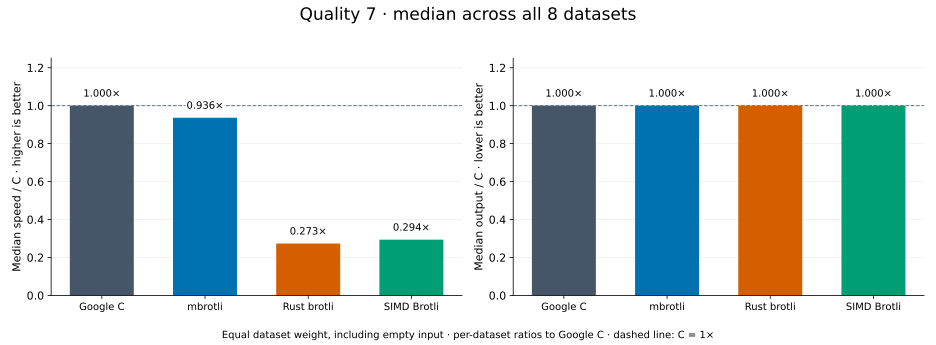
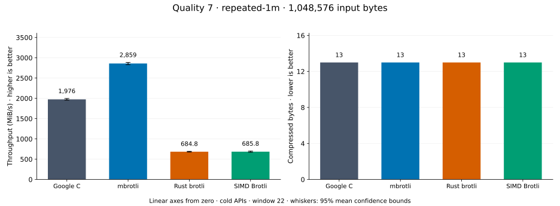
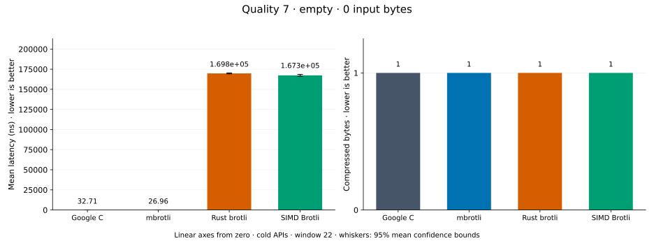
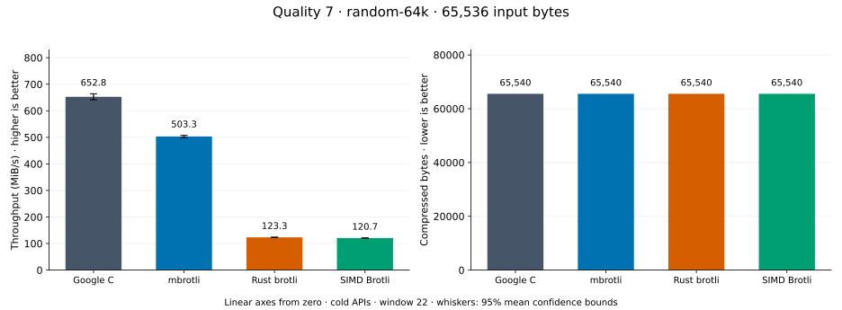
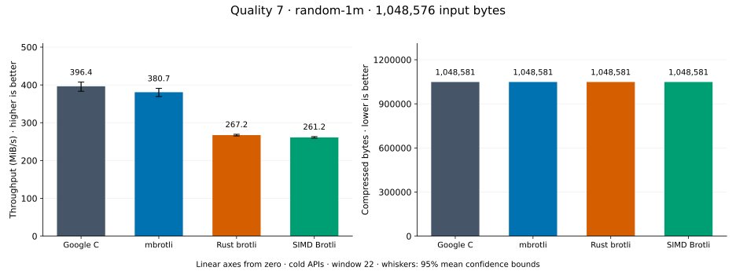
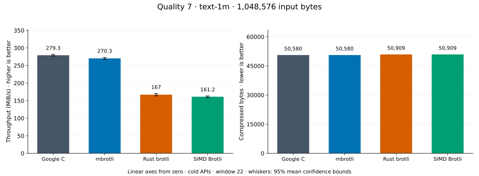
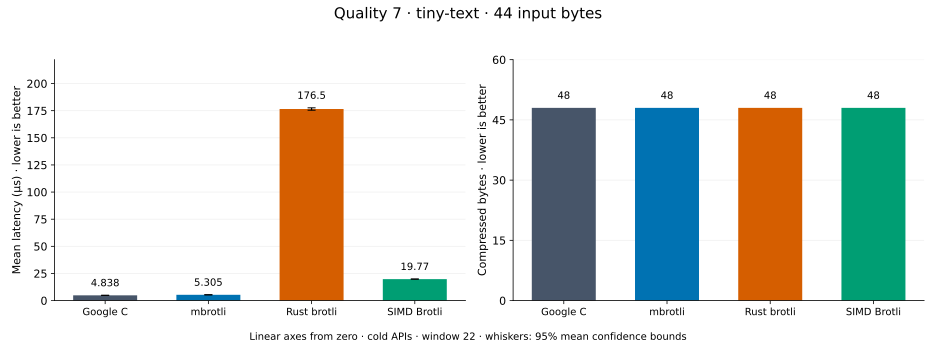
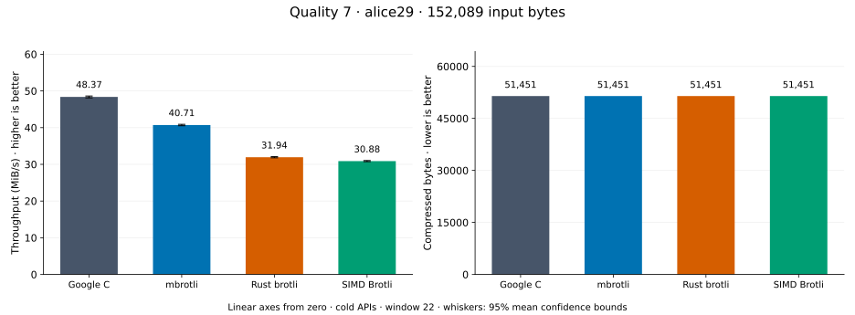
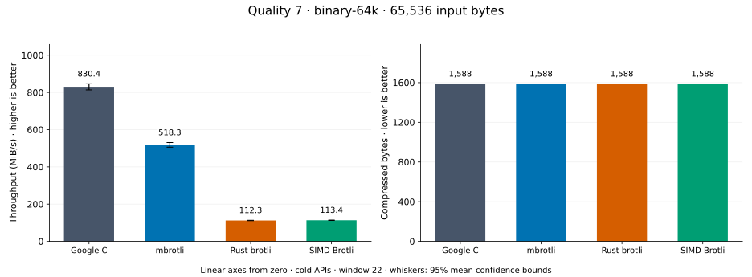

# Compression quality 7

[Benchmark index](../README.md) · [Median overview](README.md) · [← Quality 6](q6.md) · [Quality 8 →](q8.md)

Recorded run: **library-refresh-2026-09-07-191328** (2026-09-07).
[Raw results](../encoder-comparison.csv) · [Environment](../encoder-comparison-environment.json) · [Run analysis](../encoder-comparison.md).

## Median across all datasets

Each of the eight datasets has equal weight, including empty and tiny input.
Speed / C = C mean latency / implementation mean latency; output / C = implementation bytes / C bytes.
We take the median of these eight per-dataset ratios separately for speed and size.
1× matches C; higher speed and lower output are better. These are medians across datasets,
not median sample latencies, and do not imply equal compressed size or statistical significance.

| Implementation | Median speed / C ↑ | Median output / C ↓ | Datasets |
| --- | ---: | ---: | ---: |
| Google C | 1.000× | 1.000× | 8 |
| mbrotli | 1.052× | 1.000× | 8 |
| Rust brotli | 0.322× | 1.000× | 8 |
| SIMD Brotli | 0.294× | 1.000× | 8 |

Measurement setup and interpretation

Google C Brotli 1.2.0, mbrotli at the recorded optimized checkout, Rust brotli 9.0.0,
and SIMD Brotli 10.0.1 are compared at this quality.
**Burli supports only qualities 0–5; it has no results at this quality.**

These are cold native API measurements: construction, allocation, compression, and disposal.
Generic mode, window 22, known input size; 30 samples, 0.2 s warmup, at least 0.5 s measurement.
Host: 13th Gen Intel(R) Core(TM) i7-13700KF, logical CPU 2; unset; Cargo release defaults, runtime SIMD dispatch.
Rust brotli and SIMD Brotli include their native 4 KiB I/O adapters.

Chart whiskers and table intervals describe 95% confidence bounds on mean timing.
They do not capture all host or allocator variation. Throughput bounds are transformed latency bounds.
Output / input is compressed bytes divided by input bytes; smaller is better, and values above 100% mean expansion.
For empty input, throughput and output / input are undefined (—).
See the [run analysis](../encoder-comparison.md#final-measurements) for measurement limitations.

## Dataset details

Ordered by mbrotli speed / fastest competing implementation, highest first; all eight datasets are shown.
This order uses recorded mean latency, not statistical significance. Bars start at zero.

[repeated-1m](#repeated-1m) · [empty](#empty) · [random-64k](#random-64k) · [random-1m](#random-1m) · [text-1m](#text-1m) · [tiny-text](#tiny-text) · [alice29](#alice29) · [binary-64k](#binary-64k)

### repeated-1m

1 MiB of repeated a bytes. **Input: 1,048,576 bytes.**

mbrotli speed / fastest peer (Google C): **1.460×**; output: 13 / 13 bytes.

Exact measurements and confidence bounds

| Implementation | Mean, µs | 95% mean interval, µs | MiB/s | Output bytes | Output / input | Speed / C |
| --- | ---: | ---: | ---: | ---: | ---: | ---: |
| Google C | 497.3 | 495–499.9 | 2,010.75 | 13 | 0.001% | 1.000× |
| mbrotli | 340.5 | 337.2–345.7 | 2,936.45 | 13 | 0.001% | 1.460× |
| Rust brotli | 1,383 | 1,372–1,395 | 723.01 | 13 | 0.001% | 0.360× |
| SIMD Brotli | 1,616 | 1,601–1,632 | 618.93 | 13 | 0.001% | 0.308× |

### empty

Empty input; measures API overhead. **Input: 0 bytes.**

mbrotli speed / fastest peer (Google C): **1.181×**; output: 1 / 1 bytes.

Exact measurements and confidence bounds

| Implementation | Mean, ns | 95% mean interval, ns | MiB/s | Output bytes | Output / input | Speed / C |
| --- | ---: | ---: | ---: | ---: | ---: | ---: |
| Google C | 33.01 | 32.63–33.4 | — | 1 | — | 1.000× |
| mbrotli | 27.95 | 27.52–28.39 | — | 1 | — | 1.181× |
| Rust brotli | 1.708e+05 | 1.7e+05–1.717e+05 | — | 1 | — | 0.000× |
| SIMD Brotli | 1.706e+05 | 1.692e+05–1.721e+05 | — | 1 | — | 0.000× |

### random-64k

64 KiB prefix of the deterministic pseudorandom corpus. **Input: 65,536 bytes.**

mbrotli speed / fastest peer (Google C): **1.110×**; output: 65,540 / 65,540 bytes.

Exact measurements and confidence bounds

| Implementation | Mean, µs | 95% mean interval, µs | MiB/s | Output bytes | Output / input | Speed / C |
| --- | ---: | ---: | ---: | ---: | ---: | ---: |
| Google C | 142.7 | 128–157.2 | 438.06 | 65,540 | 100.006% | 1.000× |
| mbrotli | 128.6 | 127.7–129.5 | 486.03 | 65,540 | 100.006% | 1.110× |
| Rust brotli | 502.5 | 497.8–508.5 | 124.37 | 65,540 | 100.006% | 0.284× |
| SIMD Brotli | 509.9 | 506.4–513.5 | 122.58 | 65,540 | 100.006% | 0.280× |

### random-1m

1 MiB of deterministic xorshift64 pseudorandom bytes. **Input: 1,048,576 bytes.**

mbrotli speed / fastest peer (Google C): **1.083×**; output: 1,048,581 / 1,048,581 bytes.

Exact measurements and confidence bounds

| Implementation | Mean, µs | 95% mean interval, µs | MiB/s | Output bytes | Output / input | Speed / C |
| --- | ---: | ---: | ---: | ---: | ---: | ---: |
| Google C | 3,015 | 2,938–3,077 | 331.64 | 1,048,581 | 100.000% | 1.000× |
| mbrotli | 2,783 | 2,657–2,918 | 359.29 | 1,048,581 | 100.000% | 1.083× |
| Rust brotli | 3,750 | 3,716–3,786 | 266.67 | 1,048,581 | 100.000% | 0.804× |
| SIMD Brotli | 3,815 | 3,777–3,856 | 262.12 | 1,048,581 | 100.000% | 0.790× |

### text-1m

Alice text repeated cyclically to 1 MiB. **Input: 1,048,576 bytes.**

mbrotli speed / fastest peer (Google C): **1.021×**; output: 50,580 / 50,580 bytes.

Exact measurements and confidence bounds

| Implementation | Mean, µs | 95% mean interval, µs | MiB/s | Output bytes | Output / input | Speed / C |
| --- | ---: | ---: | ---: | ---: | ---: | ---: |
| Google C | 3,640 | 3,586–3,701 | 274.73 | 50,580 | 4.824% | 1.000× |
| mbrotli | 3,566 | 3,539–3,592 | 280.47 | 50,580 | 4.824% | 1.021× |
| Rust brotli | 5,795 | 5,740–5,852 | 172.55 | 50,909 | 4.855% | 0.628× |
| SIMD Brotli | 6,124 | 6,069–6,181 | 163.29 | 50,909 | 4.855% | 0.594× |

### tiny-text

44-byte quick-brown-fox sentence. **Input: 44 bytes.**

mbrotli speed / fastest peer (Google C): **0.894×**; output: 48 / 48 bytes.

Exact measurements and confidence bounds

| Implementation | Mean, µs | 95% mean interval, µs | MiB/s | Output bytes | Output / input | Speed / C |
| --- | ---: | ---: | ---: | ---: | ---: | ---: |
| Google C | 4.894 | 4.872–4.916 | 8.57 | 48 | 109.091% | 1.000× |
| mbrotli | 5.476 | 5.437–5.519 | 7.66 | 48 | 109.091% | 0.894× |
| Rust brotli | 181.7 | 179.6–184.1 | 0.23 | 48 | 109.091% | 0.027× |
| SIMD Brotli | 20.05 | 19.92–20.19 | 2.09 | 48 | 109.091% | 0.244× |

### alice29

Vendored Alice in Wonderland text. **Input: 152,089 bytes.**

mbrotli speed / fastest peer (Google C): **0.759×**; output: 51,451 / 51,451 bytes.

Exact measurements and confidence bounds

| Implementation | Mean, µs | 95% mean interval, µs | MiB/s | Output bytes | Output / input | Speed / C |
| --- | ---: | ---: | ---: | ---: | ---: | ---: |
| Google C | 3,074 | 3,038–3,113 | 47.18 | 51,451 | 33.830% | 1.000× |
| mbrotli | 4,049 | 4,000–4,100 | 35.82 | 51,451 | 33.830% | 0.759× |
| Rust brotli | 4,726 | 4,674–4,782 | 30.69 | 51,451 | 33.830% | 0.650× |
| SIMD Brotli | 4,873 | 4,837–4,912 | 29.76 | 51,451 | 33.830% | 0.631× |

### binary-64k

64 KiB of structured binary bytes: ((i / 16) XOR i) modulo 256. **Input: 65,536 bytes.**

mbrotli speed / fastest peer (Google C): **0.616×**; output: 1,588 / 1,588 bytes.

Exact measurements and confidence bounds

| Implementation | Mean, µs | 95% mean interval, µs | MiB/s | Output bytes | Output / input | Speed / C |
| --- | ---: | ---: | ---: | ---: | ---: | ---: |
| Google C | 74.3 | 72.86–75.93 | 841.22 | 1,588 | 2.423% | 1.000× |
| mbrotli | 120.6 | 118.3–123.1 | 518.08 | 1,588 | 2.423% | 0.616× |
| Rust brotli | 569.1 | 561.9–576.9 | 109.82 | 1,588 | 2.423% | 0.131× |
| SIMD Brotli | 561.2 | 553.8–569.3 | 111.37 | 1,588 | 2.423% | 0.132× |

