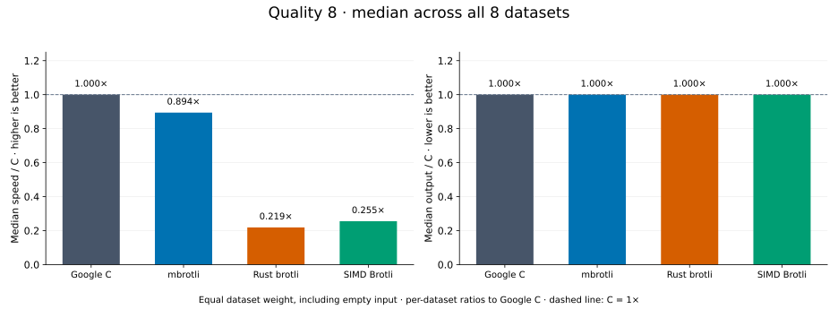
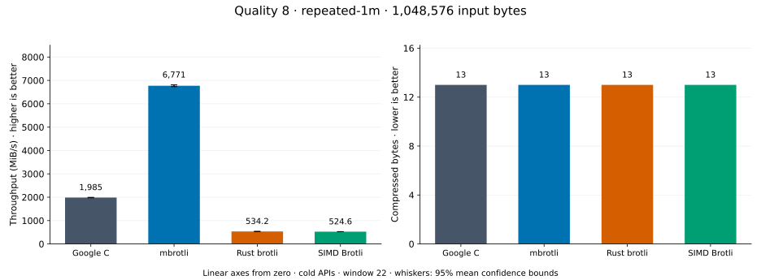
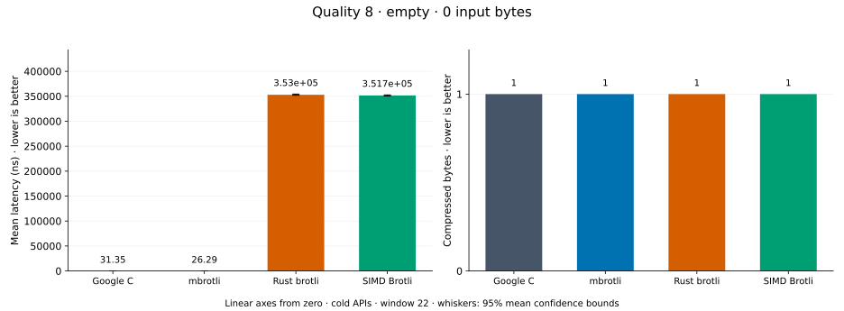
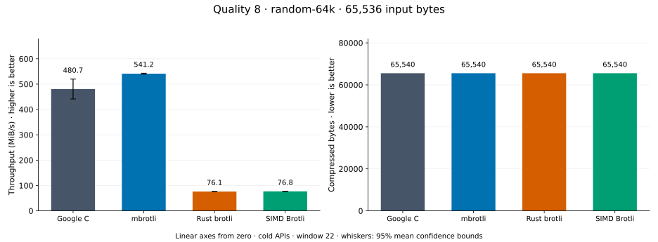
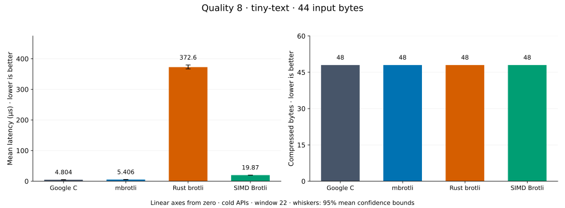
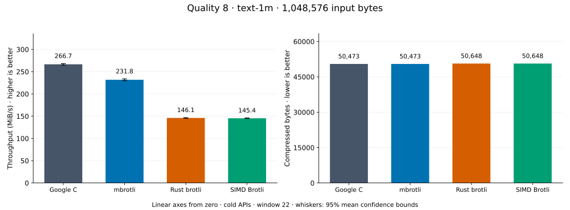
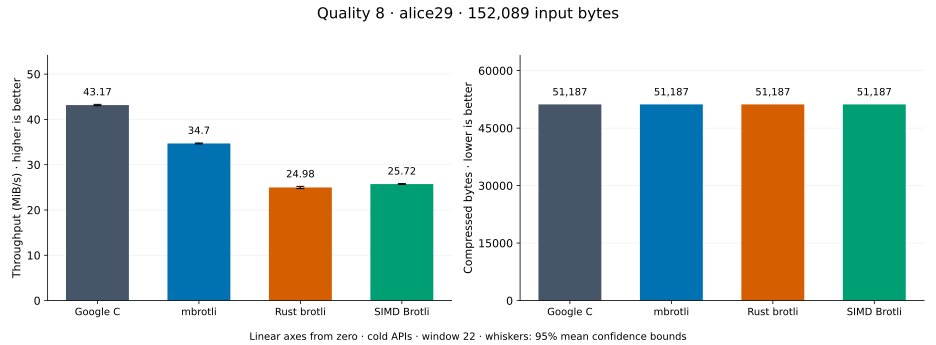
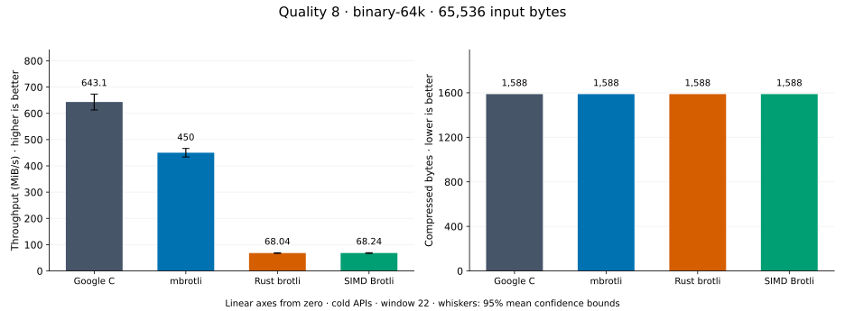
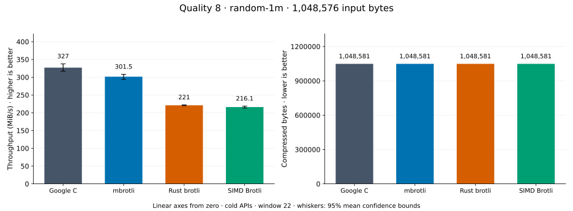

# Compression quality 8

[Benchmark index](../README.md) · [Median overview](README.md) · [← Quality 7](q7.md) · [Quality 9 →](q9.md)

Recorded run: **library-refresh-2026-09-07-191328** (2026-09-07).
[Raw results](../encoder-comparison.csv) · [Environment](../encoder-comparison-environment.json) · [Run analysis](../encoder-comparison.md).

## Median across all datasets

Each of the eight datasets has equal weight, including empty and tiny input.
Speed / C = C mean latency / implementation mean latency; output / C = implementation bytes / C bytes.
We take the median of these eight per-dataset ratios separately for speed and size.
1× matches C; higher speed and lower output are better. These are medians across datasets,
not median sample latencies, and do not imply equal compressed size or statistical significance.

| Implementation | Median speed / C ↑ | Median output / C ↓ | Datasets |
| --- | ---: | ---: | ---: |
| Google C | 1.000× | 1.000× | 8 |
| mbrotli | 0.862× | 1.000× | 8 |
| Rust brotli | 0.218× | 1.000× | 8 |
| SIMD Brotli | 0.250× | 1.000× | 8 |

Measurement setup and interpretation

Google C Brotli 1.2.0, mbrotli at the recorded optimized checkout, Rust brotli 9.0.0,
and SIMD Brotli 10.0.1 are compared at this quality.
**Burli supports only qualities 0–5; it has no results at this quality.**

These are cold native API measurements: construction, allocation, compression, and disposal.
Generic mode, window 22, known input size; 30 samples, 0.2 s warmup, at least 0.5 s measurement.
Host: 13th Gen Intel(R) Core(TM) i7-13700KF, logical CPU 2; unset; Cargo release defaults, runtime SIMD dispatch.
Rust brotli and SIMD Brotli include their native 4 KiB I/O adapters.

Chart whiskers and table intervals describe 95% confidence bounds on mean timing.
They do not capture all host or allocator variation. Throughput bounds are transformed latency bounds.
Output / input is compressed bytes divided by input bytes; smaller is better, and values above 100% mean expansion.
For empty input, throughput and output / input are undefined (—).
See the [run analysis](../encoder-comparison.md#final-measurements) for measurement limitations.

## Dataset details

Ordered by mbrotli speed / fastest competing implementation, highest first; all eight datasets are shown.
This order uses recorded mean latency, not statistical significance. Bars start at zero.

[repeated-1m](#repeated-1m) · [empty](#empty) · [random-64k](#random-64k) · [tiny-text](#tiny-text) · [text-1m](#text-1m) · [alice29](#alice29) · [binary-64k](#binary-64k) · [random-1m](#random-1m)

### repeated-1m

1 MiB of repeated a bytes. **Input: 1,048,576 bytes.**

mbrotli speed / fastest peer (Google C): **3.140×**; output: 13 / 13 bytes.

Exact measurements and confidence bounds

| Implementation | Mean, µs | 95% mean interval, µs | MiB/s | Output bytes | Output / input | Speed / C |
| --- | ---: | ---: | ---: | ---: | ---: | ---: |
| Google C | 501.4 | 498.8–504.3 | 1,994.43 | 13 | 0.001% | 1.000× |
| mbrotli | 159.7 | 158–161.9 | 6,261.89 | 13 | 0.001% | 3.140× |
| Rust brotli | 1,745 | 1,728–1,763 | 573.14 | 13 | 0.001% | 0.287× |
| SIMD Brotli | 1,966 | 1,954–1,978 | 508.67 | 13 | 0.001% | 0.255× |

### empty

Empty input; measures API overhead. **Input: 0 bytes.**

mbrotli speed / fastest peer (Google C): **1.185×**; output: 1 / 1 bytes.

Exact measurements and confidence bounds

| Implementation | Mean, ns | 95% mean interval, ns | MiB/s | Output bytes | Output / input | Speed / C |
| --- | ---: | ---: | ---: | ---: | ---: | ---: |
| Google C | 32.62 | 32.33–32.92 | — | 1 | — | 1.000× |
| mbrotli | 27.51 | 27.23–27.81 | — | 1 | — | 1.185× |
| Rust brotli | 3.554e+05 | 3.53e+05–3.579e+05 | — | 1 | — | 0.000× |
| SIMD Brotli | 3.572e+05 | 3.535e+05–3.611e+05 | — | 1 | — | 0.000× |

### random-64k

64 KiB prefix of the deterministic pseudorandom corpus. **Input: 65,536 bytes.**

mbrotli speed / fastest peer (Google C): **0.927×**; output: 65,540 / 65,540 bytes.

Exact measurements and confidence bounds

| Implementation | Mean, µs | 95% mean interval, µs | MiB/s | Output bytes | Output / input | Speed / C |
| --- | ---: | ---: | ---: | ---: | ---: | ---: |
| Google C | 117.3 | 110.2–126.3 | 532.69 | 65,540 | 100.006% | 1.000× |
| mbrotli | 126.6 | 125.5–127.7 | 493.86 | 65,540 | 100.006% | 0.927× |
| Rust brotli | 785.5 | 780–791 | 79.56 | 65,540 | 100.006% | 0.149× |
| SIMD Brotli | 801.5 | 793.9–809.5 | 77.98 | 65,540 | 100.006% | 0.146× |

### tiny-text

44-byte quick-brown-fox sentence. **Input: 44 bytes.**

mbrotli speed / fastest peer (Google C): **0.906×**; output: 48 / 48 bytes.

Exact measurements and confidence bounds

| Implementation | Mean, µs | 95% mean interval, µs | MiB/s | Output bytes | Output / input | Speed / C |
| --- | ---: | ---: | ---: | ---: | ---: | ---: |
| Google C | 4.851 | 4.803–4.909 | 8.65 | 48 | 109.091% | 1.000× |
| mbrotli | 5.354 | 5.334–5.373 | 7.84 | 48 | 109.091% | 0.906× |
| Rust brotli | 364.9 | 362.1–368.8 | 0.11 | 48 | 109.091% | 0.013× |
| SIMD Brotli | 19.82 | 19.74–19.91 | 2.12 | 48 | 109.091% | 0.245× |

### text-1m

Alice text repeated cyclically to 1 MiB. **Input: 1,048,576 bytes.**

mbrotli speed / fastest peer (Google C): **0.818×**; output: 50,473 / 50,473 bytes.

Exact measurements and confidence bounds

| Implementation | Mean, µs | 95% mean interval, µs | MiB/s | Output bytes | Output / input | Speed / C |
| --- | ---: | ---: | ---: | ---: | ---: | ---: |
| Google C | 3,796 | 3,753–3,851 | 263.43 | 50,473 | 4.813% | 1.000× |
| mbrotli | 4,643 | 4,612–4,680 | 215.38 | 50,473 | 4.813% | 0.818× |
| Rust brotli | 7,097 | 7,029–7,168 | 140.91 | 50,648 | 4.830% | 0.535× |
| SIMD Brotli | 7,200 | 7,132–7,273 | 138.89 | 50,648 | 4.830% | 0.527× |

### alice29

Vendored Alice in Wonderland text. **Input: 152,089 bytes.**

mbrotli speed / fastest peer (Google C): **0.788×**; output: 51,187 / 51,187 bytes.

Exact measurements and confidence bounds

| Implementation | Mean, µs | 95% mean interval, µs | MiB/s | Output bytes | Output / input | Speed / C |
| --- | ---: | ---: | ---: | ---: | ---: | ---: |
| Google C | 3,423 | 3,399–3,448 | 42.37 | 51,187 | 33.656% | 1.000× |
| mbrotli | 4,342 | 4,287–4,401 | 33.41 | 51,187 | 33.656% | 0.788× |
| Rust brotli | 6,036 | 5,949–6,135 | 24.03 | 51,187 | 33.656% | 0.567× |
| SIMD Brotli | 5,873 | 5,783–5,971 | 24.70 | 51,187 | 33.656% | 0.583× |

### binary-64k

64 KiB of structured binary bytes: ((i / 16) XOR i) modulo 256. **Input: 65,536 bytes.**

mbrotli speed / fastest peer (Google C): **0.723×**; output: 1,588 / 1,588 bytes.

Exact measurements and confidence bounds

| Implementation | Mean, µs | 95% mean interval, µs | MiB/s | Output bytes | Output / input | Speed / C |
| --- | ---: | ---: | ---: | ---: | ---: | ---: |
| Google C | 93.02 | 90.99–95.53 | 671.93 | 1,588 | 2.423% | 1.000× |
| mbrotli | 128.7 | 126.9–130.5 | 485.60 | 1,588 | 2.423% | 0.723× |
| Rust brotli | 865 | 856–874.5 | 72.26 | 1,588 | 2.423% | 0.108× |
| SIMD Brotli | 854.4 | 845.3–864.3 | 73.15 | 1,588 | 2.423% | 0.109× |

### random-1m

1 MiB of deterministic xorshift64 pseudorandom bytes. **Input: 1,048,576 bytes.**

mbrotli speed / fastest peer (Google C): **0.663×**; output: 1,048,581 / 1,048,581 bytes.

Exact measurements and confidence bounds

| Implementation | Mean, µs | 95% mean interval, µs | MiB/s | Output bytes | Output / input | Speed / C |
| --- | ---: | ---: | ---: | ---: | ---: | ---: |
| Google C | 3,114 | 3,019–3,207 | 321.16 | 1,048,581 | 100.000% | 1.000× |
| mbrotli | 4,698 | 4,654–4,749 | 212.85 | 1,048,581 | 100.000% | 0.663× |
| Rust brotli | 4,547 | 4,494–4,604 | 219.91 | 1,048,581 | 100.000% | 0.685× |
| SIMD Brotli | 4,716 | 4,661–4,769 | 212.06 | 1,048,581 | 100.000% | 0.660× |

