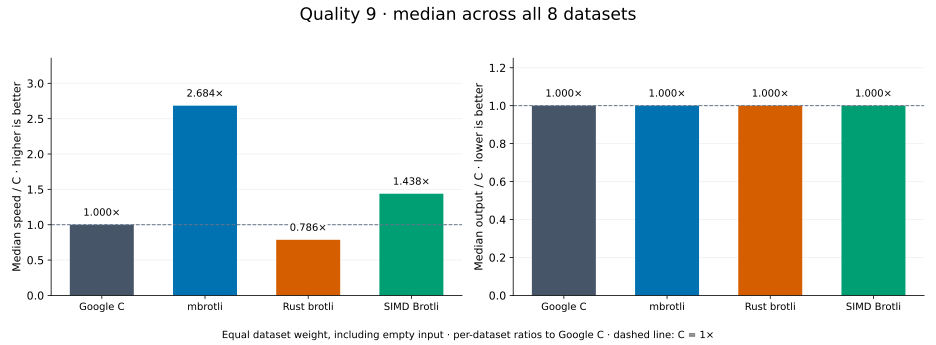
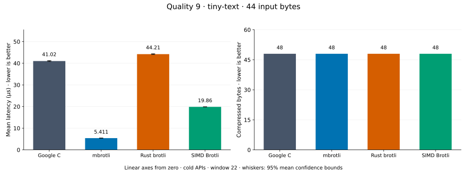
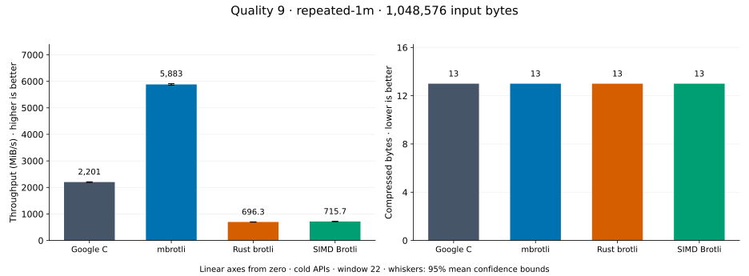
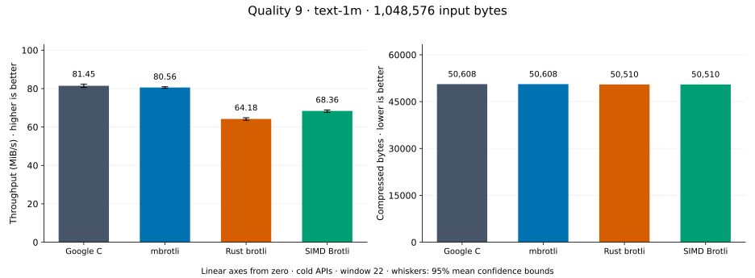
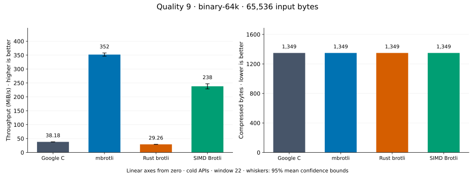
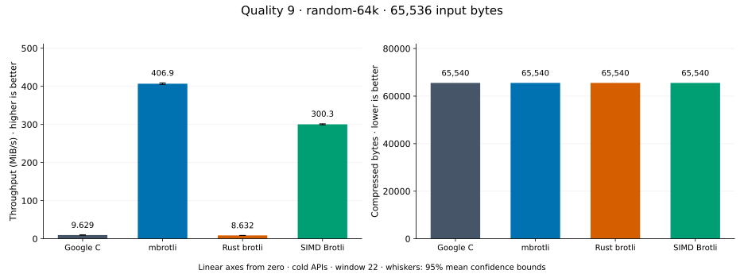
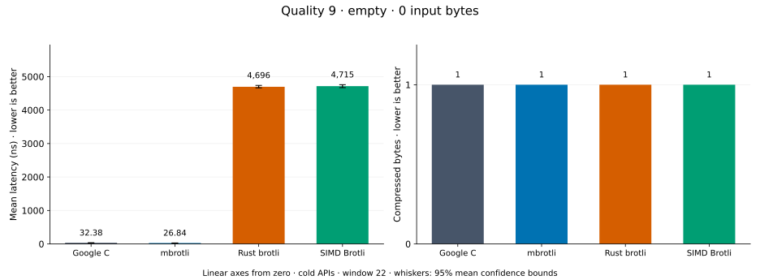
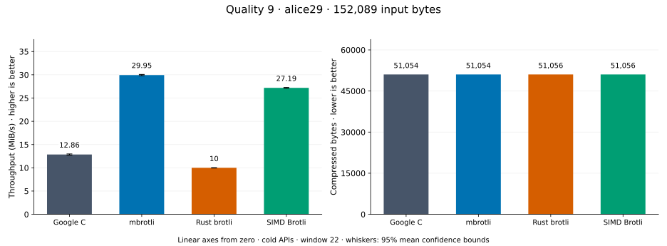
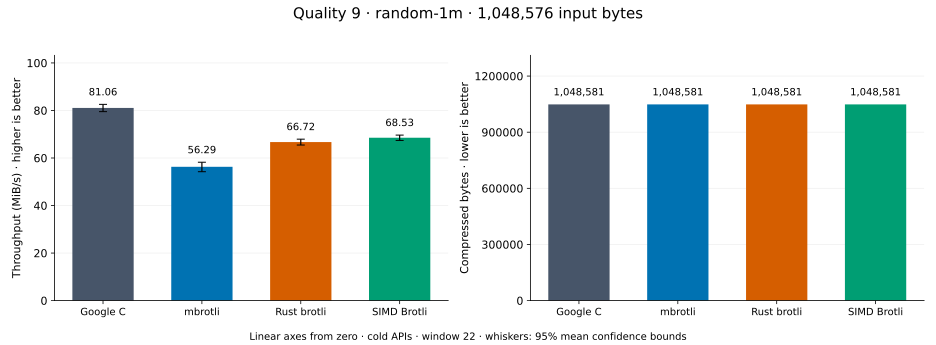

# Compression quality 9

[Benchmark index](../README.md) · [Median overview](README.md) · [← Quality 8](q8.md) · [Quality 10 →](q10.md)

Recorded run: **library-refresh-2026-09-07-191328** (2026-09-07).
[Raw results](../encoder-comparison.csv) · [Environment](../encoder-comparison-environment.json) · [Run analysis](../encoder-comparison.md).

## Median across all datasets

Each of the eight datasets has equal weight, including empty and tiny input.
Speed / C = C mean latency / implementation mean latency; output / C = implementation bytes / C bytes.
We take the median of these eight per-dataset ratios separately for speed and size.
1× matches C; higher speed and lower output are better. These are medians across datasets,
not median sample latencies, and do not imply equal compressed size or statistical significance.

| Implementation | Median speed / C ↑ | Median output / C ↓ | Datasets |
| --- | ---: | ---: | ---: |
| Google C | 1.000× | 1.000× | 8 |
| mbrotli | 2.386× | 1.000× | 8 |
| Rust brotli | 0.762× | 1.000× | 8 |
| SIMD Brotli | 1.413× | 1.000× | 8 |

Measurement setup and interpretation

Google C Brotli 1.2.0, mbrotli at the recorded optimized checkout, Rust brotli 9.0.0,
and SIMD Brotli 10.0.1 are compared at this quality.
**Burli supports only qualities 0–5; it has no results at this quality.**

These are cold native API measurements: construction, allocation, compression, and disposal.
Generic mode, window 22, known input size; 30 samples, 0.2 s warmup, at least 0.5 s measurement.
Host: 13th Gen Intel(R) Core(TM) i7-13700KF, logical CPU 2; unset; Cargo release defaults, runtime SIMD dispatch.
Rust brotli and SIMD Brotli include their native 4 KiB I/O adapters.

Chart whiskers and table intervals describe 95% confidence bounds on mean timing.
They do not capture all host or allocator variation. Throughput bounds are transformed latency bounds.
Output / input is compressed bytes divided by input bytes; smaller is better, and values above 100% mean expansion.
For empty input, throughput and output / input are undefined (—).
See the [run analysis](../encoder-comparison.md#final-measurements) for measurement limitations.

## Dataset details

Ordered by mbrotli speed / fastest competing implementation, highest first; all eight datasets are shown.
This order uses recorded mean latency, not statistical significance. Bars start at zero.

[tiny-text](#tiny-text) · [repeated-1m](#repeated-1m) · [text-1m](#text-1m) · [binary-64k](#binary-64k) · [random-64k](#random-64k) · [empty](#empty) · [alice29](#alice29) · [random-1m](#random-1m)

### tiny-text

44-byte quick-brown-fox sentence. **Input: 44 bytes.**

mbrotli speed / fastest peer (SIMD Brotli): **3.651×**; output: 48 / 48 bytes.

Exact measurements and confidence bounds

| Implementation | Mean, µs | 95% mean interval, µs | MiB/s | Output bytes | Output / input | Speed / C |
| --- | ---: | ---: | ---: | ---: | ---: | ---: |
| Google C | 41.83 | 41.19–42.8 | 1.00 | 48 | 109.091% | 1.000× |
| mbrotli | 5.494 | 5.445–5.556 | 7.64 | 48 | 109.091% | 7.614× |
| Rust brotli | 44.15 | 43.82–44.54 | 0.95 | 48 | 109.091% | 0.947× |
| SIMD Brotli | 20.06 | 19.94–20.21 | 2.09 | 48 | 109.091% | 2.085× |

### repeated-1m

1 MiB of repeated a bytes. **Input: 1,048,576 bytes.**

mbrotli speed / fastest peer (Google C): **2.687×**; output: 13 / 13 bytes.

Exact measurements and confidence bounds

| Implementation | Mean, µs | 95% mean interval, µs | MiB/s | Output bytes | Output / input | Speed / C |
| --- | ---: | ---: | ---: | ---: | ---: | ---: |
| Google C | 450.5 | 446.4–454.9 | 2,219.88 | 13 | 0.001% | 1.000× |
| mbrotli | 167.7 | 166.1–169.3 | 5,964.23 | 13 | 0.001% | 2.687× |
| Rust brotli | 1,498 | 1,462–1,544 | 667.65 | 13 | 0.001% | 0.301× |
| SIMD Brotli | 1,553 | 1,535–1,572 | 643.75 | 13 | 0.001% | 0.290× |

### text-1m

Alice text repeated cyclically to 1 MiB. **Input: 1,048,576 bytes.**

mbrotli speed / fastest peer (Google C): **2.085×**; output: 50,608 / 50,608 bytes.

Exact measurements and confidence bounds

| Implementation | Mean, µs | 95% mean interval, µs | MiB/s | Output bytes | Output / input | Speed / C |
| --- | ---: | ---: | ---: | ---: | ---: | ---: |
| Google C | 1.214e+04 | 1.204e+04–1.224e+04 | 82.40 | 50,608 | 4.826% | 1.000× |
| mbrotli | 5,821 | 5,763–5,884 | 171.80 | 50,608 | 4.826% | 2.085× |
| Rust brotli | 1.569e+04 | 1.556e+04–1.582e+04 | 63.75 | 50,510 | 4.817% | 0.774× |
| SIMD Brotli | 1.48e+04 | 1.466e+04–1.496e+04 | 67.55 | 50,510 | 4.817% | 0.820× |

### binary-64k

64 KiB of structured binary bytes: ((i / 16) XOR i) modulo 256. **Input: 65,536 bytes.**

mbrotli speed / fastest peer (SIMD Brotli): **1.470×**; output: 1,349 / 1,349 bytes.

Exact measurements and confidence bounds

| Implementation | Mean, µs | 95% mean interval, µs | MiB/s | Output bytes | Output / input | Speed / C |
| --- | ---: | ---: | ---: | ---: | ---: | ---: |
| Google C | 1,605 | 1,595–1,616 | 38.93 | 1,349 | 2.058% | 1.000× |
| mbrotli | 172.3 | 169.8–175 | 362.78 | 1,349 | 2.058% | 9.319× |
| Rust brotli | 2,140 | 2,113–2,170 | 29.20 | 1,349 | 2.058% | 0.750× |
| SIMD Brotli | 253.2 | 244.5–264.5 | 246.81 | 1,349 | 2.058% | 6.340× |

### random-64k

64 KiB prefix of the deterministic pseudorandom corpus. **Input: 65,536 bytes.**

mbrotli speed / fastest peer (SIMD Brotli): **1.258×**; output: 65,540 / 65,540 bytes.

Exact measurements and confidence bounds

| Implementation | Mean, µs | 95% mean interval, µs | MiB/s | Output bytes | Output / input | Speed / C |
| --- | ---: | ---: | ---: | ---: | ---: | ---: |
| Google C | 6,303 | 6,251–6,362 | 9.92 | 65,540 | 100.006% | 1.000× |
| mbrotli | 163.9 | 162.8–165.2 | 381.31 | 65,540 | 100.006% | 38.454× |
| Rust brotli | 7,037 | 6,987–7,091 | 8.88 | 65,540 | 100.006% | 0.896× |
| SIMD Brotli | 206.3 | 204.9–207.9 | 302.99 | 65,540 | 100.006% | 30.556× |

### empty

Empty input; measures API overhead. **Input: 0 bytes.**

mbrotli speed / fastest peer (Google C): **1.244×**; output: 1 / 1 bytes.

Exact measurements and confidence bounds

| Implementation | Mean, ns | 95% mean interval, ns | MiB/s | Output bytes | Output / input | Speed / C |
| --- | ---: | ---: | ---: | ---: | ---: | ---: |
| Google C | 34.86 | 32.99–38.02 | — | 1 | — | 1.000× |
| mbrotli | 28.02 | 27.61–28.44 | — | 1 | — | 1.244× |
| Rust brotli | 4,698 | 4,578–4,838 | — | 1 | — | 0.007× |
| SIMD Brotli | 4,512 | 4,432–4,595 | — | 1 | — | 0.008× |

### alice29

Vendored Alice in Wonderland text. **Input: 152,089 bytes.**

mbrotli speed / fastest peer (SIMD Brotli): **0.999×**; output: 51,054 / 51,056 bytes.

Exact measurements and confidence bounds

| Implementation | Mean, µs | 95% mean interval, µs | MiB/s | Output bytes | Output / input | Speed / C |
| --- | ---: | ---: | ---: | ---: | ---: | ---: |
| Google C | 1.088e+04 | 1.074e+04–1.102e+04 | 13.34 | 51,054 | 33.569% | 1.000× |
| mbrotli | 5,495 | 5,422–5,578 | 26.39 | 51,054 | 33.569% | 1.979× |
| Rust brotli | 1.452e+04 | 1.44e+04–1.464e+04 | 9.99 | 51,056 | 33.570% | 0.749× |
| SIMD Brotli | 5,490 | 5,437–5,548 | 26.42 | 51,056 | 33.570% | 1.981× |

### random-1m

1 MiB of deterministic xorshift64 pseudorandom bytes. **Input: 1,048,576 bytes.**

mbrotli speed / fastest peer (Google C): **0.715×**; output: 1,048,581 / 1,048,581 bytes.

Exact measurements and confidence bounds

| Implementation | Mean, µs | 95% mean interval, µs | MiB/s | Output bytes | Output / input | Speed / C |
| --- | ---: | ---: | ---: | ---: | ---: | ---: |
| Google C | 1.127e+04 | 1.117e+04–1.137e+04 | 88.74 | 1,048,581 | 100.000% | 1.000× |
| mbrotli | 1.575e+04 | 1.564e+04–1.587e+04 | 63.47 | 1,048,581 | 100.000% | 0.715× |
| Rust brotli | 1.359e+04 | 1.351e+04–1.368e+04 | 73.58 | 1,048,581 | 100.000% | 0.829× |
| SIMD Brotli | 1.333e+04 | 1.322e+04–1.344e+04 | 75.03 | 1,048,581 | 100.000% | 0.846× |

