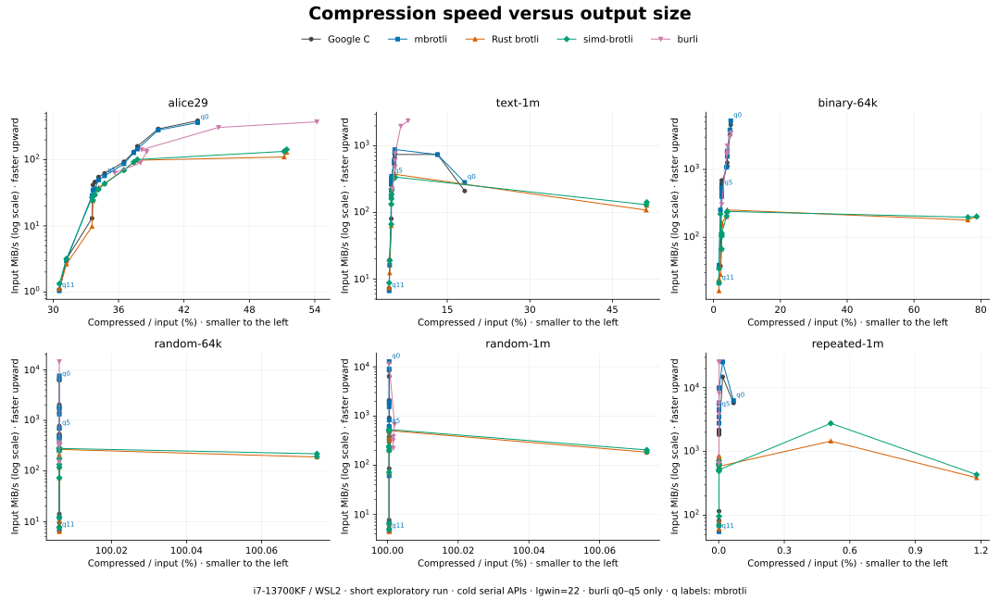
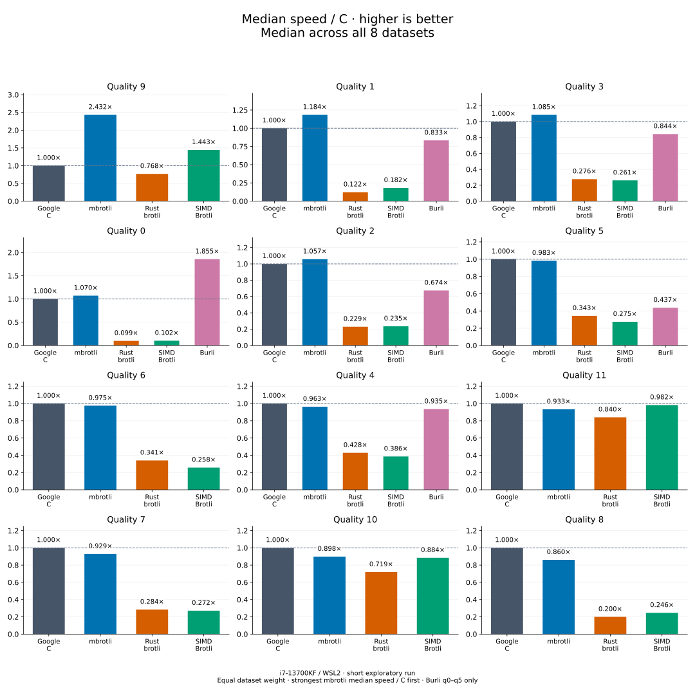
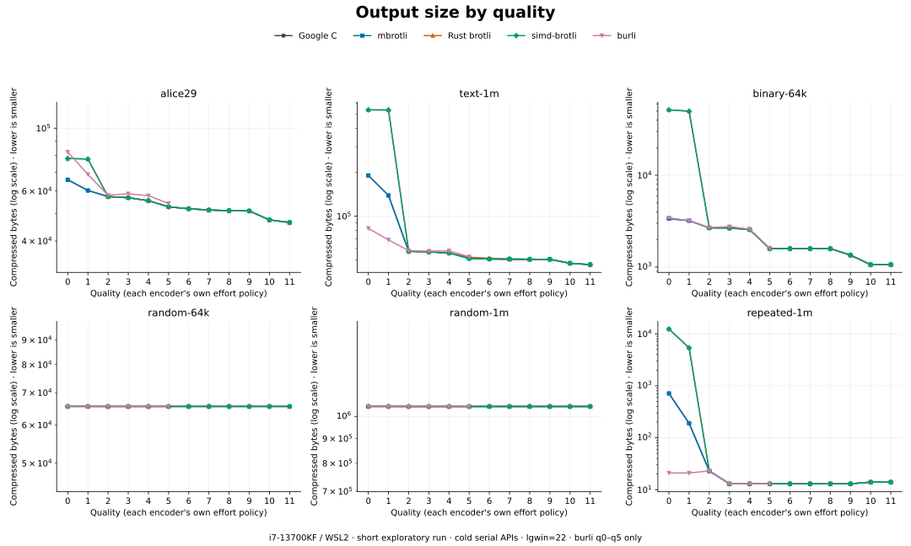

# Brotli implementation comparison — 2026-09-07

[Benchmark index](README.md) · [Latest results by compression quality](README.md#results-by-quality)

This new suite compares cold compression in `mbrotli`, Google C Brotli, Rust
`brotli`, `simd-brotli`, and `burli`. Each result includes both speed and output
size. The original benchmark harnesses and their Criterion data are independent.

## Results

The complete [432-case CSV](implementation-comparison.csv) records individual
mean timings, 95% confidence bounds, throughput, and compressed bytes. All cases
passed the C decoder oracle. The diagrams summarize all eight datasets,
including empty and tiny input, using vertical bars on linear axes from zero.
This is the earlier run; [current results](README.md) use the later 30-sample run.

### Median speed and size



For each dataset, speed / C is C mean latency divided by the encoder's mean
latency; output / C is encoder bytes divided by C bytes. Each summary is the
median of eight ratios with equal dataset weight. Qualities are ordered by
mbrotli median speed / C, highest first. Burli has results only through q5.
The medians describe datasets, not Criterion timing samples; they do not imply
statistical significance or equal compressed size.

On **Alice at q5** (152,089 input bytes):

| Implementation | MiB/s | 95% mean interval, MiB/s | Compressed bytes | Speed / C |
| --- | ---: | ---: | ---: | ---: |
| Google C Brotli | 62.33 | 61.37–63.21 | 52,809 | 1.00× |
| mbrotli | 57.24 | 56.32–58.08 | 52,809 | 0.92× |
| Rust brotli | 44.12 | 43.67–44.49 | 52,808 | 0.71× |
| simd-brotli | 43.52 | 42.78–44.18 | 52,808 | 0.70× |
| burli | 63.33 | 62.58–64.00 | 54,231 | 1.02× |

C and Burli's throughput intervals overlap in this case, while Burli's stream
is 2.69% larger. `mbrotli` produces C's size with lower measured throughput.
Results change with the workload: at q5 on 1 MiB of repeated bytes, `mbrotli`
measured 4,544.82 MiB/s versus C's 1,980.79 MiB/s, both producing 13 bytes.
At q11 on Alice, SIMD Brotli measured 1.33 MiB/s versus C's 1.09 MiB/s, producing
46,493 versus 46,487 bytes. These are individual measurements from this run.

### Median speed by quality

Higher is faster; 1× matches C. These are medians of per-dataset timing ratios.
Individual timing confidence bounds remain in the CSV; no confidence interval
is inferred for an across-dataset median.



### Median output size by quality

Lower is smaller; 1× matches C. Each bar is the median of output / C across all
eight datasets. Exact byte lengths remain available in the CSV.
For example, Alice at q0 produces 65,795 bytes with C and `mbrotli`, 78,217 with
Rust Brotli and SIMD Brotli, and 82,431 with Burli. Native API scheduling matters
to the comparison, as explained below.



## Reproduction

Encoder revision: `452ca706e1720caa2702f0738e4778383e3f70e5`, with the new
benchmark and documentation additions in this change; encoder code is unchanged.
The [environment record](implementation-comparison-environment.json) pins source
and lockfile hashes, versions, compilers, and settings.

| Setting | Recorded value |
| --- | --- |
| Host | Intel Core i7-13700KF, x86_64, WSL2 |
| Affinity | Logical CPU 2 |
| Rust | rustc 1.98.1; release defaults; runtime SIMD selection |
| C compiler | GCC 11.4.0; vendored build's release defaults |
| C Brotli | 1.2.0; commit `028fb5a23661f123017c060daa546b55cf4bde29` |
| Rust brotli / simd-brotli / burli | 9.0.0 / 10.0.1 / 0.3.1 |
| Compression settings | Generic mode, window 22, full known input, no custom dictionary or explicit flush |
| Sampling | 20 samples, 100 ms warmup, 300 ms requested measurement per case |

```sh
taskset -c 2 cargo bench --manifest-path benchmarks/comparison/Cargo.toml --bench implementations --locked -- --save-baseline comparison-2026-09-07 --sample-size 20 --warm-up-time 0.1 --measurement-time 0.3 --noplot
python3 benchmarks/comparison/report.py --baseline comparison-2026-09-07 --csv docs/benchmarks/implementation-comparison.csv
python3 benchmarks/comparison/plot.py --csv docs/benchmarks/implementation-comparison.csv --output docs/benchmarks/implementation-comparison --subtitle 'i7-13700KF / WSL2 · short exploratory run'
```

Plotting requires Matplotlib 3.10.8; see the [benchmark guide](../benchmarking.md)
for an isolated installation and longer-run commands. Slow cases extend their
measurement duration to collect all samples. Use a new baseline name when
repeating the experiment. Raw Criterion samples remain in the standalone
package's ignored `target/criterion/` directory.

## What is measured

Each timed call constructs an encoder, allocates its workspace and output,
compresses a complete input, and disposes of the result. Inputs are prepared
outside timing. C's native one-shot API includes its output rewrites; the Rust
`BrotliCompress` APIs include their native 4 KiB I/O adaptation. These are public
API costs and can change low-quality block scheduling and output size.

Quality numbers represent each implementation's own effort policy. Burli supports
q0–q5 and has no q6–q11 rows. The suite does not require compressed byte identity
or equal output size; every output must decode to the exact input through C.
The [harness mechanics](../../architecture/benchmark-comparison.md) describe the
adapters and data flow.

## Validation

- Root formatting and all-target/all-feature Clippy passed.
- `cargo test --workspace --all-features --locked`: 1,003 tests and doc tests passed.
- Independent package formatting, Clippy, and three unit tests passed.
- Criterion validation mode passed all 432 cases before timing.
- Two exporter tests cover complete pairing, missing measurements, and invalid baseline names.
- Inspected LLVM coverage: all 17 new Rust functions executed, including the
  benchmark entry point. Function coverage is 100%; line coverage is 95.77%.

Coverage was collected with:

```sh
cargo llvm-cov --manifest-path benchmarks/comparison/Cargo.toml --release --locked --benches --no-report -- --test
cargo llvm-cov report --manifest-path benchmarks/comparison/Cargo.toml --release --json --output-path /tmp/comparison-coverage.json
```

The benchmark entry point was also inspected directly with `llvm-cov report`,
since cargo-llvm-cov excludes `benches/` from its default displayed report.

## Interpretation limits

This is a short exploratory run on one WSL2 host. CPU affinity does not fix
frequency, thermal state, or host scheduling. Implementation order is fixed;
confidence intervals describe sampling variation, not every source of bias.
No profiling, tests, or compilation ran concurrently with the timed sweep.
There is no universal winner implied across machines or workloads.

The new suite measures cold serial APIs. It does not establish streaming,
workspace-reuse, parallel, dictionary, or decompression performance. Existing
API benchmarks retain those separate contracts and their original comparison
script. The historical optimization reports have been removed; these new
measurements are not before/after evidence for an encoder change.
