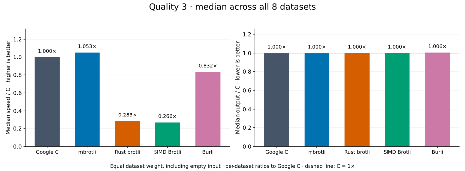
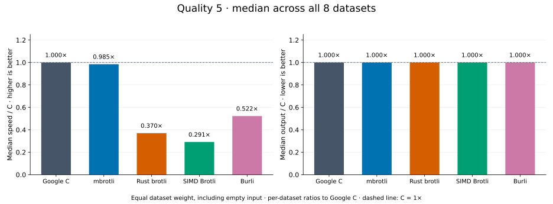

# Median results by quality

[Benchmark index](../README.md)

Recorded run: **library-refresh-2026-09-07-191328** (2026-09-07).
[Raw results](../library-comparison.csv) · [Environment](../library-comparison-environment.json) · [Run analysis](../library-comparison.md).

All eight datasets contribute equally to each median, including empty and tiny input.
For each dataset, speed / C = C mean latency / implementation mean latency;
output / C = implementation bytes / C bytes. Medians are taken over those ratios.
Qualities are ordered by mbrotli median speed / C, highest first. Burli supports q0–q5 only.

| Quality | mbrotli speed / C ↑ | mbrotli output / C ↓ | Datasets |
| --- | ---: | ---: | ---: | ---: |
| [Quality 9](q9.md) | 2.386× | 1.000× | 8 |
| [Quality 1](q1.md) | 1.196× | 1.000× | 8 |
| [Quality 11](q11.md) | 1.140× | 1.000× | 8 |
| [Quality 0](q0.md) | 1.132× | 1.000× | 8 |
| [Quality 2](q2.md) | 1.094× | 1.000× | 8 |
| [Quality 3](q3.md) | 1.066× | 1.000× | 8 |
| [Quality 7](q7.md) | 1.052× | 1.000× | 8 |
| [Quality 10](q10.md) | 1.002× | 1.000× | 8 |
| [Quality 5](q5.md) | 0.985× | 1.000× | 8 |
| [Quality 4](q4.md) | 0.975× | 1.000× | 8 |
| [Quality 6](q6.md) | 0.941× | 1.000× | 8 |
| [Quality 8](q8.md) | 0.862× | 1.000× | 8 |

## [Quality 9](q9.md)

## [Quality 1](q1.md)

## [Quality 11](q11.md)

## [Quality 0](q0.md)

## [Quality 2](q2.md)

## [Quality 3](q3.md)

## [Quality 7](q7.md)

## [Quality 10](q10.md)

## [Quality 5](q5.md)

## [Quality 4](q4.md)

## [Quality 6](q6.md)

## [Quality 8](q8.md)

