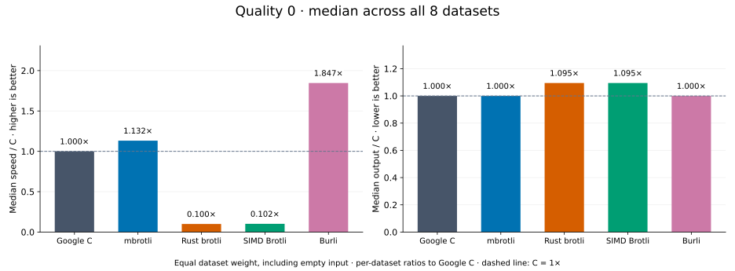
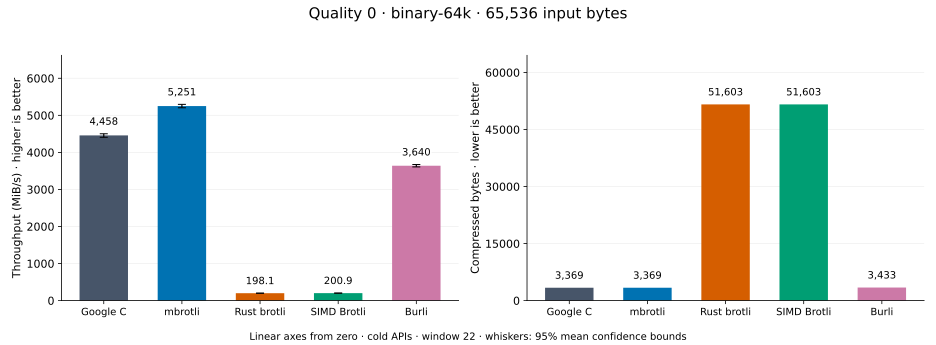
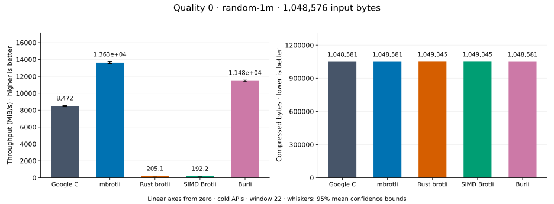
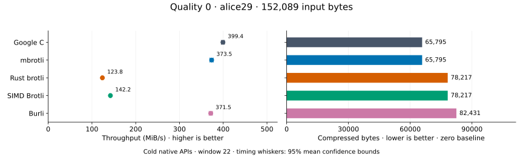
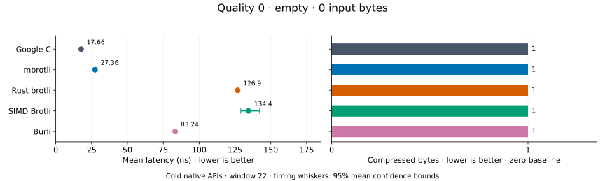
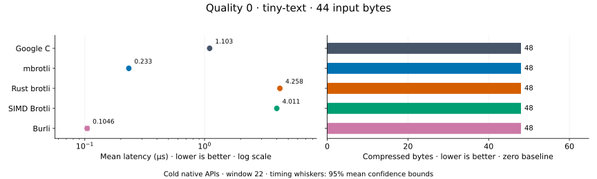
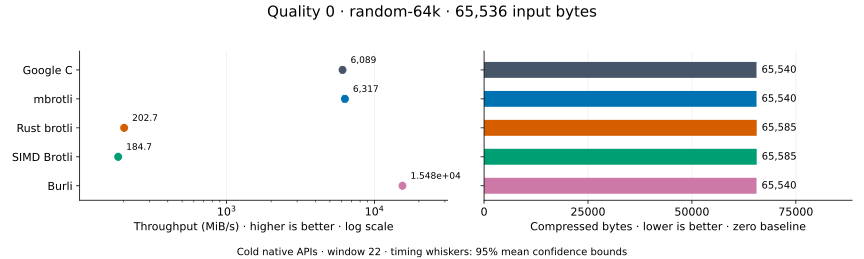
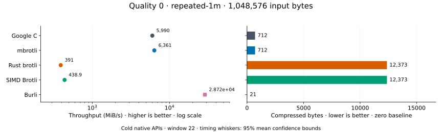
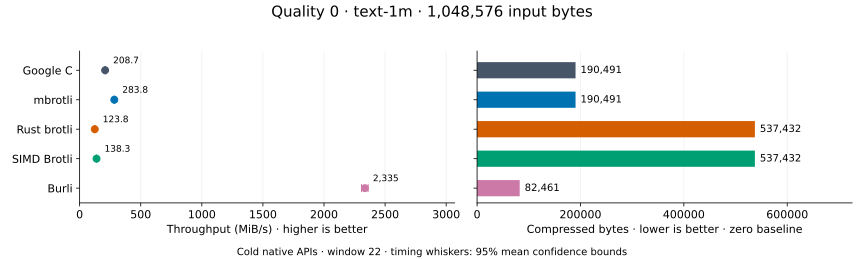

# Compression quality 0

[Benchmark index](../README.md) · [Median overview](README.md) · [Quality 1 →](q1.md)

Recorded run: **path-review-final-after** (2026-09-07).
[Raw results](../competitor-paths-comparison.csv) · [Environment](../competitor-paths-environment.json) · [Run analysis](../competitor-paths.md).

## Median across all datasets

Each of the eight datasets has equal weight, including empty and tiny input.
Speed / C = C mean latency / implementation mean latency; output / C = implementation bytes / C bytes.
We take the median of these eight per-dataset ratios separately for speed and size.
1× matches C; higher speed and lower output are better. These are medians across datasets,
not median sample latencies, and do not imply equal compressed size or statistical significance.

| Implementation | Median speed / C ↑ | Median output / C ↓ | Datasets |
| --- | ---: | ---: | ---: |
| Google C | 1.000× | 1.000× | 8 |
| mbrotli | 1.120× | 1.000× | 8 |
| Rust brotli | 0.102× | 1.095× | 8 |
| SIMD Brotli | 0.102× | 1.095× | 8 |
| Burli | 1.935× | 1.000× | 8 |

Measurement setup and interpretation

Google C Brotli 1.2.0, mbrotli at the recorded optimized checkout, Rust brotli 9.0.0,
and SIMD Brotli 10.0.1 are compared at this quality.
Burli 0.3.1 is also included.

These are cold native API measurements: construction, allocation, compression, and disposal.
Generic mode, window 22, known input size; 30 samples, 0.2 s warmup, at least 0.5 s measurement.
Host: 13th Gen Intel(R) Core(TM) i7-13700KF, logical CPU 2; unset; Cargo release defaults, runtime SIMD dispatch.
Rust brotli and SIMD Brotli include their native 4 KiB I/O adapters.

Chart whiskers and table intervals describe 95% confidence bounds on mean timing.
They do not capture all host or allocator variation. Throughput bounds are transformed latency bounds.
Output / input is compressed bytes divided by input bytes; smaller is better, and values above 100% mean expansion.
For empty input, throughput and output / input are undefined (—).
See the [optimization tradeoffs and rechecks](../competitor-paths.md#final-measurements) for before/after limitations.

## Dataset details

Ordered by mbrotli speed / fastest competing implementation, highest first; all eight datasets are shown.
This order uses recorded mean latency, not statistical significance. Bars start at zero.

[binary-64k](#binary-64k) · [random-1m](#random-1m) · [alice29](#alice29) · [empty](#empty) · [tiny-text](#tiny-text) · [random-64k](#random-64k) · [repeated-1m](#repeated-1m) · [text-1m](#text-1m)

### binary-64k

64 KiB of structured binary bytes: ((i / 16) XOR i) modulo 256. **Input: 65,536 bytes.**

mbrotli speed / fastest peer (Google C): **1.178×**; output: 3,369 / 3,369 bytes.

Exact measurements and confidence bounds

| Implementation | Mean, µs | 95% mean interval, µs | MiB/s | Output bytes | Output / input | Speed / C |
| --- | ---: | ---: | ---: | ---: | ---: | ---: |
| Google C | 14.02 | 13.88–14.18 | 4,457.97 | 3,369 | 5.141% | 1.000× |
| mbrotli | 11.9 | 11.8–12.01 | 5,251.04 | 3,369 | 5.141% | 1.178× |
| Rust brotli | 315.5 | 314.1–316.9 | 198.12 | 51,603 | 78.740% | 0.044× |
| SIMD Brotli | 311.1 | 309.3–313.2 | 200.92 | 51,603 | 78.740% | 0.045× |
| Burli | 17.17 | 17.02–17.32 | 3,640.31 | 3,433 | 5.238% | 0.817× |

### random-1m

1 MiB of deterministic xorshift64 pseudorandom bytes. **Input: 1,048,576 bytes.**

mbrotli speed / fastest peer (Burli): **1.171×**; output: 1,048,581 / 1,048,581 bytes.

Exact measurements and confidence bounds

| Implementation | Mean, µs | 95% mean interval, µs | MiB/s | Output bytes | Output / input | Speed / C |
| --- | ---: | ---: | ---: | ---: | ---: | ---: |
| Google C | 119.1 | 117.9–120.4 | 8,393.83 | 1,048,581 | 100.000% | 1.000× |
| mbrotli | 76.7 | 75.78–77.73 | 13,038.21 | 1,048,581 | 100.000% | 1.553× |
| Rust brotli | 5,073 | 5,036–5,113 | 197.13 | 1,049,345 | 100.073% | 0.023× |
| SIMD Brotli | 5,359 | 5,325–5,397 | 186.60 | 1,049,345 | 100.073% | 0.022× |
| Burli | 89.81 | 88.85–90.86 | 11,135.18 | 1,048,581 | 100.000% | 1.327× |

### alice29

Vendored Alice in Wonderland text. **Input: 152,089 bytes.**

mbrotli speed / fastest peer (Google C): **0.935×**; output: 65,795 / 65,795 bytes.

Exact measurements and confidence bounds

| Implementation | Mean, µs | 95% mean interval, µs | MiB/s | Output bytes | Output / input | Speed / C |
| --- | ---: | ---: | ---: | ---: | ---: | ---: |
| Google C | 363.2 | 360–366.6 | 399.36 | 65,795 | 43.261% | 1.000× |
| mbrotli | 388.3 | 384.5–392.5 | 373.50 | 65,795 | 43.261% | 0.935× |
| Rust brotli | 1,171 | 1,158–1,186 | 123.82 | 78,217 | 51.428% | 0.310× |
| SIMD Brotli | 1,020 | 1,011–1,030 | 142.17 | 78,217 | 51.428% | 0.356× |
| Burli | 390.4 | 386.4–394.6 | 371.50 | 82,431 | 54.199% | 0.930× |

### empty

Empty input; measures API overhead. **Input: 0 bytes.**

mbrotli speed / fastest peer (Google C): **0.646×**; output: 1 / 1 bytes.

Exact measurements and confidence bounds

| Implementation | Mean, ns | 95% mean interval, ns | MiB/s | Output bytes | Output / input | Speed / C |
| --- | ---: | ---: | ---: | ---: | ---: | ---: |
| Google C | 17.66 | 17.49–17.85 | — | 1 | — | 1.000× |
| mbrotli | 27.36 | 27.22–27.52 | — | 1 | — | 0.646× |
| Rust brotli | 126.9 | 126.3–127.5 | — | 1 | — | 0.139× |
| SIMD Brotli | 134.4 | 129–142.2 | — | 1 | — | 0.131× |
| Burli | 83.24 | 82.52–84.35 | — | 1 | — | 0.212× |

### tiny-text

44-byte quick-brown-fox sentence. **Input: 44 bytes.**

mbrotli speed / fastest peer (Burli): **0.449×**; output: 48 / 48 bytes.

Exact measurements and confidence bounds

| Implementation | Mean, µs | 95% mean interval, µs | MiB/s | Output bytes | Output / input | Speed / C |
| --- | ---: | ---: | ---: | ---: | ---: | ---: |
| Google C | 1.103 | 1.092–1.116 | 38.05 | 48 | 109.091% | 1.000× |
| mbrotli | 0.233 | 0.2304–0.2361 | 180.09 | 48 | 109.091% | 4.733× |
| Rust brotli | 4.258 | 4.207–4.312 | 9.86 | 48 | 109.091% | 0.259× |
| SIMD Brotli | 4.011 | 3.969–4.058 | 10.46 | 48 | 109.091% | 0.275× |
| Burli | 0.1046 | 0.1015–0.1085 | 401.25 | 48 | 109.091% | 10.546× |

### random-64k

64 KiB prefix of the deterministic pseudorandom corpus. **Input: 65,536 bytes.**

mbrotli speed / fastest peer (Burli): **0.408×**; output: 65,540 / 65,540 bytes.

Exact measurements and confidence bounds

| Implementation | Mean, µs | 95% mean interval, µs | MiB/s | Output bytes | Output / input | Speed / C |
| --- | ---: | ---: | ---: | ---: | ---: | ---: |
| Google C | 10.26 | 10.06–10.51 | 6,089.19 | 65,540 | 100.006% | 1.000× |
| mbrotli | 9.893 | 9.7–10.18 | 6,317.46 | 65,540 | 100.006% | 1.037× |
| Rust brotli | 308.4 | 306–311 | 202.69 | 65,585 | 100.075% | 0.033× |
| SIMD Brotli | 338.3 | 334.3–342.7 | 184.73 | 65,585 | 100.075% | 0.030× |
| Burli | 4.037 | 3.991–4.085 | 15,483.49 | 65,540 | 100.006% | 2.543× |

### repeated-1m

1 MiB of repeated a bytes. **Input: 1,048,576 bytes.**

mbrotli speed / fastest peer (Burli): **0.221×**; output: 712 / 21 bytes.

Exact measurements and confidence bounds

| Implementation | Mean, µs | 95% mean interval, µs | MiB/s | Output bytes | Output / input | Speed / C |
| --- | ---: | ---: | ---: | ---: | ---: | ---: |
| Google C | 166.9 | 165.6–168.5 | 5,989.85 | 712 | 0.068% | 1.000× |
| mbrotli | 157.2 | 156.5–158.1 | 6,360.54 | 712 | 0.068% | 1.062× |
| Rust brotli | 2,558 | 2,540–2,578 | 390.98 | 12,373 | 1.180% | 0.065× |
| SIMD Brotli | 2,278 | 2,269–2,288 | 438.94 | 12,373 | 1.180% | 0.073× |
| Burli | 34.82 | 33.3–36.49 | 28,722.49 | 21 | 0.002% | 4.795× |

### text-1m

Alice text repeated cyclically to 1 MiB. **Input: 1,048,576 bytes.**

mbrotli speed / fastest peer (Burli): **0.122×**; output: 190,491 / 82,461 bytes.

Exact measurements and confidence bounds

| Implementation | Mean, µs | 95% mean interval, µs | MiB/s | Output bytes | Output / input | Speed / C |
| --- | ---: | ---: | ---: | ---: | ---: | ---: |
| Google C | 4,791 | 4,691–4,884 | 208.73 | 190,491 | 18.167% | 1.000× |
| mbrotli | 3,524 | 3,487–3,563 | 283.80 | 190,491 | 18.167% | 1.360× |
| Rust brotli | 8,077 | 8,010–8,146 | 123.81 | 537,432 | 51.254% | 0.593× |
| SIMD Brotli | 7,233 | 7,170–7,296 | 138.26 | 537,432 | 51.254% | 0.662× |
| Burli | 428.3 | 423.5–433.5 | 2,334.63 | 82,461 | 7.864% | 11.185× |

