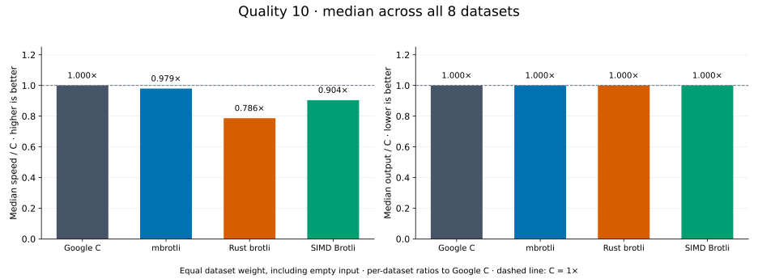
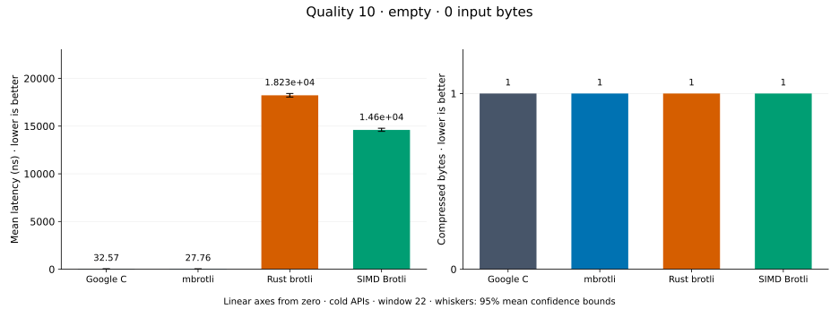
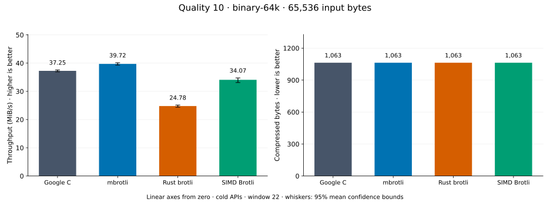
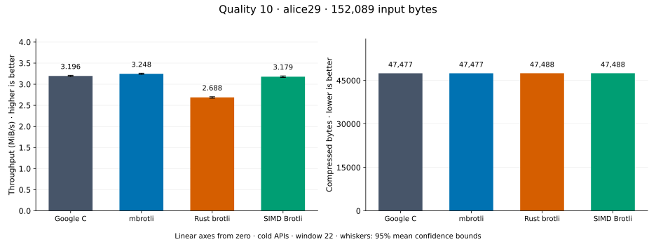
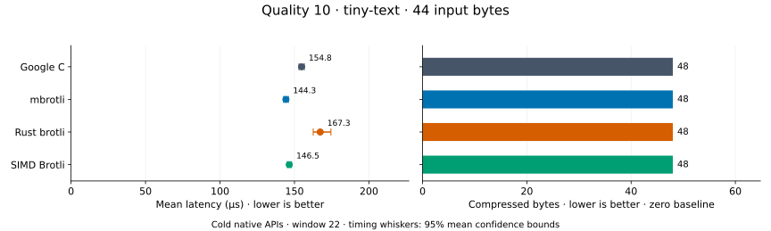
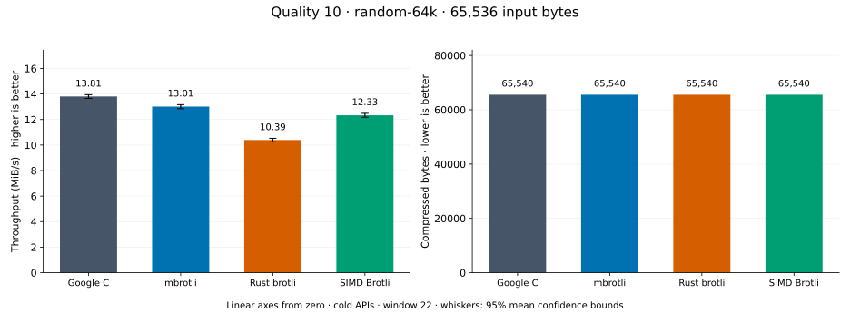
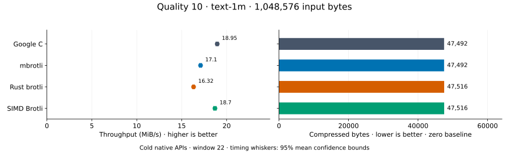
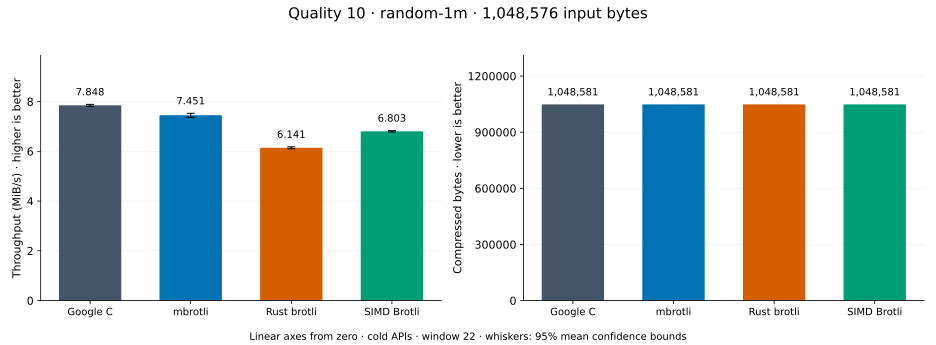
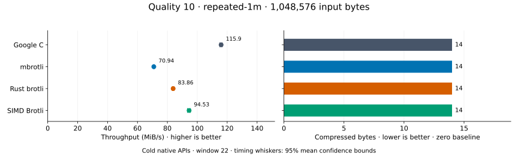

# Compression quality 10

[Benchmark index](../README.md) · [Median overview](README.md) · [← Quality 9](q9.md) · [Quality 11 →](q11.md)

Recorded run: **path-review-final-after** (2026-09-07).
[Raw results](../competitor-paths-comparison.csv) · [Environment](../competitor-paths-environment.json) · [Run analysis](../competitor-paths.md).

## Median across all datasets

Each of the eight datasets has equal weight, including empty and tiny input.
Speed / C = C mean latency / implementation mean latency; output / C = implementation bytes / C bytes.
We take the median of these eight per-dataset ratios separately for speed and size.
1× matches C; higher speed and lower output are better. These are medians across datasets,
not median sample latencies, and do not imply equal compressed size or statistical significance.

| Implementation | Median speed / C ↑ | Median output / C ↓ | Datasets |
| --- | ---: | ---: | ---: |
| Google C | 1.000× | 1.000× | 8 |
| mbrotli | 0.979× | 1.000× | 8 |
| Rust brotli | 0.786× | 1.000× | 8 |
| SIMD Brotli | 0.904× | 1.000× | 8 |

Measurement setup and interpretation

Google C Brotli 1.2.0, mbrotli at the recorded optimized checkout, Rust brotli 9.0.0,
and SIMD Brotli 10.0.1 are compared at this quality.
**Burli supports only qualities 0–5; it has no results at this quality.**

These are cold native API measurements: construction, allocation, compression, and disposal.
Generic mode, window 22, known input size; 30 samples, 0.2 s warmup, at least 0.5 s measurement.
Host: 13th Gen Intel(R) Core(TM) i7-13700KF, logical CPU 2; unset; Cargo release defaults, runtime SIMD dispatch.
Rust brotli and SIMD Brotli include their native 4 KiB I/O adapters.

Chart whiskers and table intervals describe 95% confidence bounds on mean timing.
They do not capture all host or allocator variation. Throughput bounds are transformed latency bounds.
Output / input is compressed bytes divided by input bytes; smaller is better, and values above 100% mean expansion.
For empty input, throughput and output / input are undefined (—).
See the [optimization tradeoffs and rechecks](../competitor-paths.md#final-measurements) for before/after limitations.

## Dataset details

Ordered by mbrotli speed / fastest competing implementation, highest first; all eight datasets are shown.
This order uses recorded mean latency, not statistical significance. Bars start at zero.

[empty](#empty) · [binary-64k](#binary-64k) · [alice29](#alice29) · [tiny-text](#tiny-text) · [random-64k](#random-64k) · [text-1m](#text-1m) · [random-1m](#random-1m) · [repeated-1m](#repeated-1m)

### empty

Empty input; measures API overhead. **Input: 0 bytes.**

mbrotli speed / fastest peer (Google C): **1.173×**; output: 1 / 1 bytes.

Exact measurements and confidence bounds

| Implementation | Mean, ns | 95% mean interval, ns | MiB/s | Output bytes | Output / input | Speed / C |
| --- | ---: | ---: | ---: | ---: | ---: | ---: |
| Google C | 32.57 | 32.29–32.86 | — | 1 | — | 1.000× |
| mbrotli | 27.76 | 27.46–28.12 | — | 1 | — | 1.173× |
| Rust brotli | 1.823e+04 | 1.804e+04–1.842e+04 | — | 1 | — | 0.002× |
| SIMD Brotli | 1.46e+04 | 1.445e+04–1.477e+04 | — | 1 | — | 0.002× |

### binary-64k

64 KiB of structured binary bytes: ((i / 16) XOR i) modulo 256. **Input: 65,536 bytes.**

mbrotli speed / fastest peer (Google C): **1.066×**; output: 1,063 / 1,063 bytes.

Exact measurements and confidence bounds

| Implementation | Mean, µs | 95% mean interval, µs | MiB/s | Output bytes | Output / input | Speed / C |
| --- | ---: | ---: | ---: | ---: | ---: | ---: |
| Google C | 1,678 | 1,664–1,694 | 37.25 | 1,063 | 1.622% | 1.000× |
| mbrotli | 1,573 | 1,558–1,590 | 39.72 | 1,063 | 1.622% | 1.066× |
| Rust brotli | 2,523 | 2,487–2,561 | 24.78 | 1,063 | 1.622% | 0.665× |
| SIMD Brotli | 1,835 | 1,799–1,887 | 34.07 | 1,063 | 1.622% | 0.915× |

### alice29

Vendored Alice in Wonderland text. **Input: 152,089 bytes.**

mbrotli speed / fastest peer (Google C): **1.016×**; output: 47,477 / 47,477 bytes.

Exact measurements and confidence bounds

| Implementation | Mean, µs | 95% mean interval, µs | MiB/s | Output bytes | Output / input | Speed / C |
| --- | ---: | ---: | ---: | ---: | ---: | ---: |
| Google C | 4.538e+04 | 4.516e+04–4.56e+04 | 3.20 | 47,477 | 31.217% | 1.000× |
| mbrotli | 4.466e+04 | 4.448e+04–4.485e+04 | 3.25 | 47,477 | 31.217% | 1.016× |
| Rust brotli | 5.396e+04 | 5.363e+04–5.434e+04 | 2.69 | 47,488 | 31.224% | 0.841× |
| SIMD Brotli | 4.563e+04 | 4.537e+04–4.589e+04 | 3.18 | 47,488 | 31.224% | 0.994× |

### tiny-text

44-byte quick-brown-fox sentence. **Input: 44 bytes.**

mbrotli speed / fastest peer (SIMD Brotli): **1.015×**; output: 48 / 48 bytes.

Exact measurements and confidence bounds

| Implementation | Mean, µs | 95% mean interval, µs | MiB/s | Output bytes | Output / input | Speed / C |
| --- | ---: | ---: | ---: | ---: | ---: | ---: |
| Google C | 154.8 | 153–156.6 | 0.27 | 48 | 109.091% | 1.000× |
| mbrotli | 144.3 | 142.8–145.9 | 0.29 | 48 | 109.091% | 1.073× |
| Rust brotli | 167.3 | 162.6–174.5 | 0.25 | 48 | 109.091% | 0.925× |
| SIMD Brotli | 146.5 | 145.1–148 | 0.29 | 48 | 109.091% | 1.057× |

### random-64k

64 KiB prefix of the deterministic pseudorandom corpus. **Input: 65,536 bytes.**

mbrotli speed / fastest peer (Google C): **0.943×**; output: 65,540 / 65,540 bytes.

Exact measurements and confidence bounds

| Implementation | Mean, µs | 95% mean interval, µs | MiB/s | Output bytes | Output / input | Speed / C |
| --- | ---: | ---: | ---: | ---: | ---: | ---: |
| Google C | 4,527 | 4,482–4,578 | 13.81 | 65,540 | 100.006% | 1.000× |
| mbrotli | 4,802 | 4,747–4,863 | 13.01 | 65,540 | 100.006% | 0.943× |
| Rust brotli | 6,013 | 5,936–6,099 | 10.39 | 65,540 | 100.006% | 0.753× |
| SIMD Brotli | 5,067 | 5,005–5,132 | 12.33 | 65,540 | 100.006% | 0.893× |

### text-1m

Alice text repeated cyclically to 1 MiB. **Input: 1,048,576 bytes.**

mbrotli speed / fastest peer (Google C): **0.902×**; output: 47,492 / 47,492 bytes.

Exact measurements and confidence bounds

| Implementation | Mean, µs | 95% mean interval, µs | MiB/s | Output bytes | Output / input | Speed / C |
| --- | ---: | ---: | ---: | ---: | ---: | ---: |
| Google C | 5.277e+04 | 5.239e+04–5.32e+04 | 18.95 | 47,492 | 4.529% | 1.000× |
| mbrotli | 5.849e+04 | 5.806e+04–5.895e+04 | 17.10 | 47,492 | 4.529% | 0.902× |
| Rust brotli | 6.128e+04 | 6.09e+04–6.169e+04 | 16.32 | 47,516 | 4.531% | 0.861× |
| SIMD Brotli | 5.349e+04 | 5.306e+04–5.394e+04 | 18.70 | 47,516 | 4.531% | 0.987× |

### random-1m

1 MiB of deterministic xorshift64 pseudorandom bytes. **Input: 1,048,576 bytes.**

mbrotli speed / fastest peer (Google C): **0.891×**; output: 1,048,581 / 1,048,581 bytes.

Exact measurements and confidence bounds

| Implementation | Mean, µs | 95% mean interval, µs | MiB/s | Output bytes | Output / input | Speed / C |
| --- | ---: | ---: | ---: | ---: | ---: | ---: |
| Google C | 1.314e+05 | 1.306e+05–1.323e+05 | 7.61 | 1,048,581 | 100.000% | 1.000× |
| mbrotli | 1.475e+05 | 1.458e+05–1.497e+05 | 6.78 | 1,048,581 | 100.000% | 0.891× |
| Rust brotli | 1.604e+05 | 1.589e+05–1.62e+05 | 6.24 | 1,048,581 | 100.000% | 0.820× |
| SIMD Brotli | 1.498e+05 | 1.488e+05–1.508e+05 | 6.67 | 1,048,581 | 100.000% | 0.877× |

### repeated-1m

1 MiB of repeated a bytes. **Input: 1,048,576 bytes.**

mbrotli speed / fastest peer (Google C): **0.612×**; output: 14 / 14 bytes.

Exact measurements and confidence bounds

| Implementation | Mean, µs | 95% mean interval, µs | MiB/s | Output bytes | Output / input | Speed / C |
| --- | ---: | ---: | ---: | ---: | ---: | ---: |
| Google C | 8,625 | 8,565–8,694 | 115.94 | 14 | 0.001% | 1.000× |
| mbrotli | 1.41e+04 | 1.403e+04–1.417e+04 | 70.94 | 14 | 0.001% | 0.612× |
| Rust brotli | 1.193e+04 | 1.185e+04–1.201e+04 | 83.86 | 14 | 0.001% | 0.723× |
| SIMD Brotli | 1.058e+04 | 1.048e+04–1.07e+04 | 94.53 | 14 | 0.001% | 0.815× |

