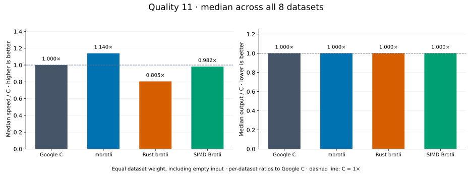
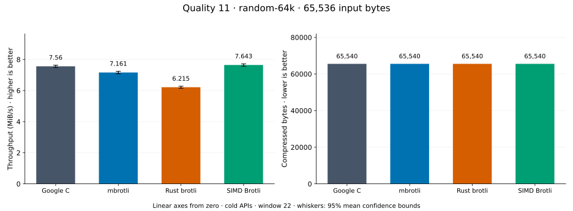
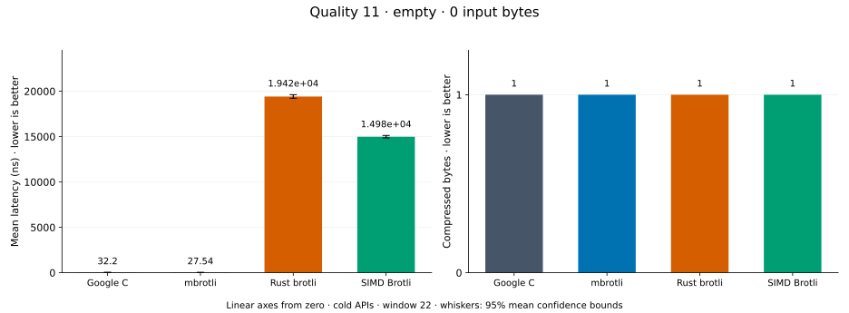
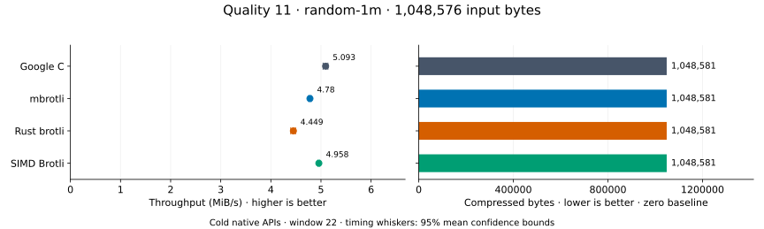
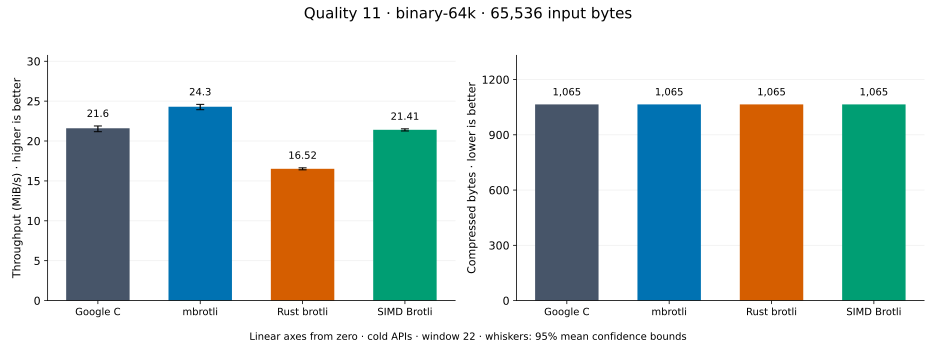
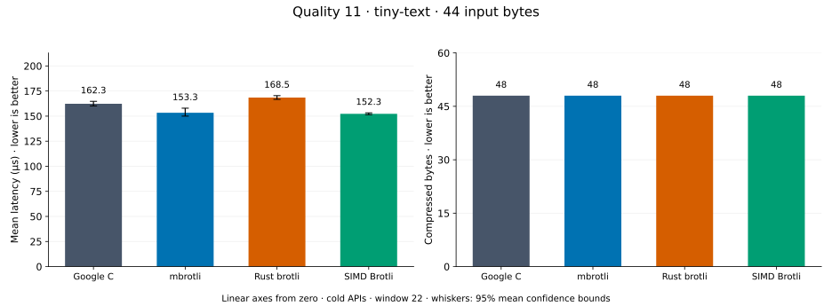
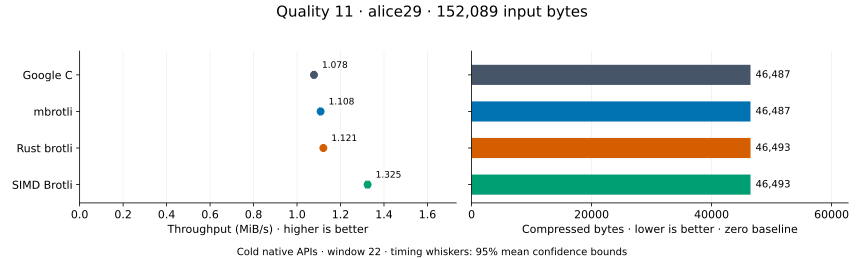
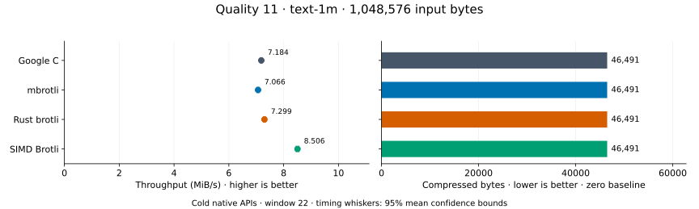
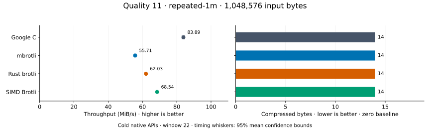

# Compression quality 11

[Benchmark index](../README.md) · [Median overview](README.md) · [← Quality 10](q10.md)

Recorded run: **library-refresh-2026-09-07-191328** (2026-09-07).
[Raw results](../library-comparison.csv) · [Environment](../library-comparison-environment.json) · [Run analysis](../library-comparison.md).

## Median across all datasets

Each of the eight datasets has equal weight, including empty and tiny input.
Speed / C = C mean latency / implementation mean latency; output / C = implementation bytes / C bytes.
We take the median of these eight per-dataset ratios separately for speed and size.
1× matches C; higher speed and lower output are better. These are medians across datasets,
not median sample latencies, and do not imply equal compressed size or statistical significance.

| Implementation | Median speed / C ↑ | Median output / C ↓ | Datasets |
| --- | ---: | ---: | ---: |
| Google C | 1.000× | 1.000× | 8 |
| mbrotli | 1.140× | 1.000× | 8 |
| Rust brotli | 0.805× | 1.000× | 8 |
| SIMD Brotli | 0.982× | 1.000× | 8 |

Measurement setup and interpretation

Google C Brotli 1.2.0, mbrotli at the recorded optimized checkout, Rust brotli 9.0.0,
and SIMD Brotli 10.0.1 are compared at this quality.
**Burli supports only qualities 0–5; it has no results at this quality.**

These are cold native API measurements: construction, allocation, compression, and disposal.
Generic mode, window 22, known input size; 30 samples, 0.2 s warmup, at least 0.5 s measurement.
Host: 13th Gen Intel(R) Core(TM) i7-13700KF, logical CPU 2; unset; Cargo release defaults, runtime SIMD dispatch.
Rust brotli and SIMD Brotli include their native 4 KiB I/O adapters.

Chart whiskers and table intervals describe 95% confidence bounds on mean timing.
They do not capture all host or allocator variation. Throughput bounds are transformed latency bounds.
Output / input is compressed bytes divided by input bytes; smaller is better, and values above 100% mean expansion.
For empty input, throughput and output / input are undefined (—).
See the [run analysis](../library-comparison.md#final-measurements) for measurement limitations.

## Dataset details

Ordered by mbrotli speed / fastest competing implementation, highest first; all eight datasets are shown.
This order uses recorded mean latency, not statistical significance. Bars start at zero.

[random-64k](#random-64k) · [empty](#empty) · [random-1m](#random-1m) · [binary-64k](#binary-64k) · [tiny-text](#tiny-text) · [alice29](#alice29) · [text-1m](#text-1m) · [repeated-1m](#repeated-1m)

### random-64k

64 KiB prefix of the deterministic pseudorandom corpus. **Input: 65,536 bytes.**

mbrotli speed / fastest peer (Google C): **1.345×**; output: 65,540 / 65,540 bytes.

Exact measurements and confidence bounds

| Implementation | Mean, µs | 95% mean interval, µs | MiB/s | Output bytes | Output / input | Speed / C |
| --- | ---: | ---: | ---: | ---: | ---: | ---: |
| Google C | 8,013 | 7,934–8,119 | 7.80 | 65,540 | 100.006% | 1.000× |
| mbrotli | 5,959 | 5,917–6,017 | 10.49 | 65,540 | 100.006% | 1.345× |
| Rust brotli | 1.016e+04 | 1.01e+04–1.023e+04 | 6.15 | 65,540 | 100.006% | 0.789× |
| SIMD Brotli | 8,103 | 8,051–8,157 | 7.71 | 65,540 | 100.006% | 0.989× |

### empty

Empty input; measures API overhead. **Input: 0 bytes.**

mbrotli speed / fastest peer (Google C): **1.175×**; output: 1 / 1 bytes.

Exact measurements and confidence bounds

| Implementation | Mean, ns | 95% mean interval, ns | MiB/s | Output bytes | Output / input | Speed / C |
| --- | ---: | ---: | ---: | ---: | ---: | ---: |
| Google C | 32.72 | 32.38–33.1 | — | 1 | — | 1.000× |
| mbrotli | 27.85 | 27.44–28.31 | — | 1 | — | 1.175× |
| Rust brotli | 1.92e+04 | 1.909e+04–1.932e+04 | — | 1 | — | 0.002× |
| SIMD Brotli | 1.528e+04 | 1.518e+04–1.537e+04 | — | 1 | — | 0.002× |

### random-1m

1 MiB of deterministic xorshift64 pseudorandom bytes. **Input: 1,048,576 bytes.**

mbrotli speed / fastest peer (Google C): **1.155×**; output: 1,048,581 / 1,048,581 bytes.

Exact measurements and confidence bounds

| Implementation | Mean, µs | 95% mean interval, µs | MiB/s | Output bytes | Output / input | Speed / C |
| --- | ---: | ---: | ---: | ---: | ---: | ---: |
| Google C | 1.877e+05 | 1.868e+05–1.887e+05 | 5.33 | 1,048,581 | 100.000% | 1.000× |
| mbrotli | 1.626e+05 | 1.618e+05–1.634e+05 | 6.15 | 1,048,581 | 100.000% | 1.155× |
| Rust brotli | 2.286e+05 | 2.272e+05–2.302e+05 | 4.37 | 1,048,581 | 100.000% | 0.821× |
| SIMD Brotli | 2.016e+05 | 2.003e+05–2.031e+05 | 4.96 | 1,048,581 | 100.000% | 0.931× |

### binary-64k

64 KiB of structured binary bytes: ((i / 16) XOR i) modulo 256. **Input: 65,536 bytes.**

mbrotli speed / fastest peer (Google C): **1.125×**; output: 1,065 / 1,065 bytes.

Exact measurements and confidence bounds

| Implementation | Mean, µs | 95% mean interval, µs | MiB/s | Output bytes | Output / input | Speed / C |
| --- | ---: | ---: | ---: | ---: | ---: | ---: |
| Google C | 2,894 | 2,856–2,952 | 21.60 | 1,065 | 1.625% | 1.000× |
| mbrotli | 2,572 | 2,541–2,612 | 24.30 | 1,065 | 1.625% | 1.125× |
| Rust brotli | 3,783 | 3,756–3,813 | 16.52 | 1,065 | 1.625% | 0.765× |
| SIMD Brotli | 2,919 | 2,903–2,940 | 21.41 | 1,065 | 1.625% | 0.991× |

### tiny-text

44-byte quick-brown-fox sentence. **Input: 44 bytes.**

mbrotli speed / fastest peer (Google C): **1.001×**; output: 48 / 48 bytes.

Exact measurements and confidence bounds

| Implementation | Mean, µs | 95% mean interval, µs | MiB/s | Output bytes | Output / input | Speed / C |
| --- | ---: | ---: | ---: | ---: | ---: | ---: |
| Google C | 149.6 | 147.5–152.3 | 0.28 | 48 | 109.091% | 1.000× |
| mbrotli | 149.5 | 148.6–150.5 | 0.28 | 48 | 109.091% | 1.001× |
| Rust brotli | 162.1 | 161–163.5 | 0.26 | 48 | 109.091% | 0.922× |
| SIMD Brotli | 153.5 | 151.8–155.9 | 0.27 | 48 | 109.091% | 0.974× |

### alice29

Vendored Alice in Wonderland text. **Input: 152,089 bytes.**

mbrotli speed / fastest peer (SIMD Brotli): **0.982×**; output: 46,487 / 46,493 bytes.

Exact measurements and confidence bounds

| Implementation | Mean, µs | 95% mean interval, µs | MiB/s | Output bytes | Output / input | Speed / C |
| --- | ---: | ---: | ---: | ---: | ---: | ---: |
| Google C | 1.324e+05 | 1.318e+05–1.33e+05 | 1.10 | 46,487 | 30.566% | 1.000× |
| mbrotli | 1.114e+05 | 1.11e+05–1.117e+05 | 1.30 | 46,487 | 30.566% | 1.189× |
| Rust brotli | 1.296e+05 | 1.29e+05–1.301e+05 | 1.12 | 46,493 | 30.570% | 1.022× |
| SIMD Brotli | 1.093e+05 | 1.089e+05–1.098e+05 | 1.33 | 46,493 | 30.570% | 1.211× |

### text-1m

Alice text repeated cyclically to 1 MiB. **Input: 1,048,576 bytes.**

mbrotli speed / fastest peer (SIMD Brotli): **0.958×**; output: 46,491 / 46,491 bytes.

Exact measurements and confidence bounds

| Implementation | Mean, µs | 95% mean interval, µs | MiB/s | Output bytes | Output / input | Speed / C |
| --- | ---: | ---: | ---: | ---: | ---: | ---: |
| Google C | 1.346e+05 | 1.342e+05–1.35e+05 | 7.43 | 46,491 | 4.434% | 1.000× |
| mbrotli | 1.221e+05 | 1.217e+05–1.224e+05 | 8.19 | 46,491 | 4.434% | 1.103× |
| Rust brotli | 1.375e+05 | 1.37e+05–1.38e+05 | 7.27 | 46,491 | 4.434% | 0.979× |
| SIMD Brotli | 1.17e+05 | 1.167e+05–1.173e+05 | 8.55 | 46,491 | 4.434% | 1.150× |

### repeated-1m

1 MiB of repeated a bytes. **Input: 1,048,576 bytes.**

mbrotli speed / fastest peer (Google C): **0.674×**; output: 14 / 14 bytes.

Exact measurements and confidence bounds

| Implementation | Mean, µs | 95% mean interval, µs | MiB/s | Output bytes | Output / input | Speed / C |
| --- | ---: | ---: | ---: | ---: | ---: | ---: |
| Google C | 1.19e+04 | 1.182e+04–1.199e+04 | 84.05 | 14 | 0.001% | 1.000× |
| mbrotli | 1.765e+04 | 1.748e+04–1.782e+04 | 56.67 | 14 | 0.001% | 0.674× |
| Rust brotli | 1.625e+04 | 1.615e+04–1.637e+04 | 61.54 | 14 | 0.001% | 0.732× |
| SIMD Brotli | 1.461e+04 | 1.447e+04–1.478e+04 | 68.44 | 14 | 0.001% | 0.814× |

