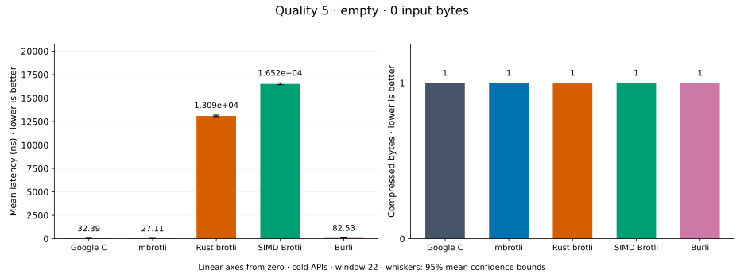
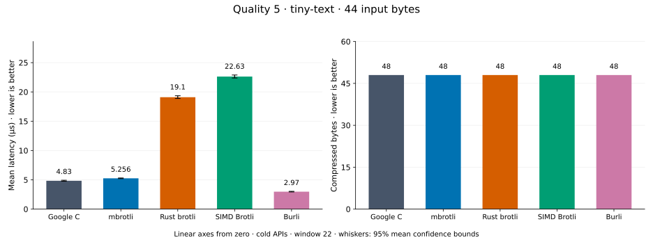
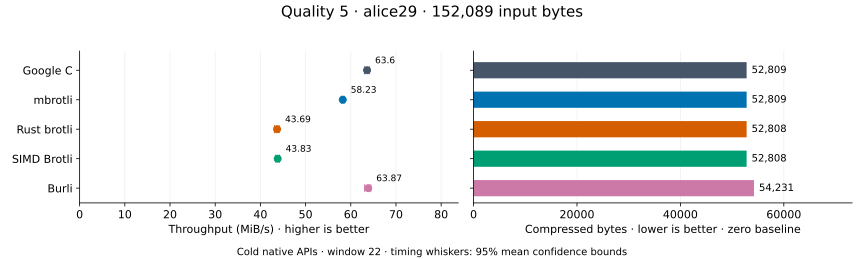
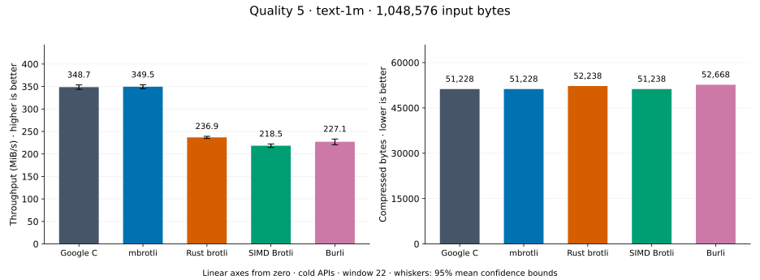
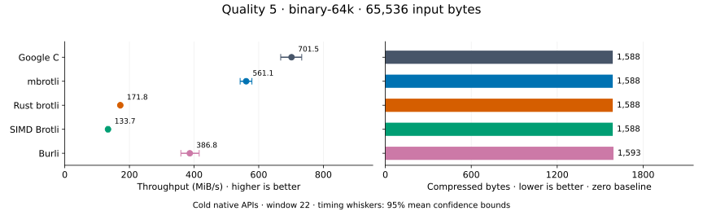
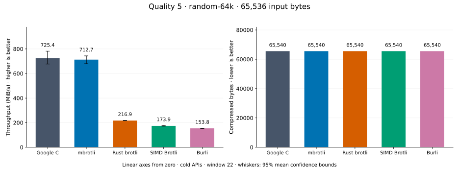
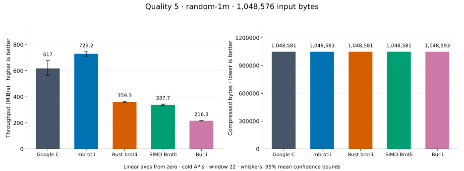
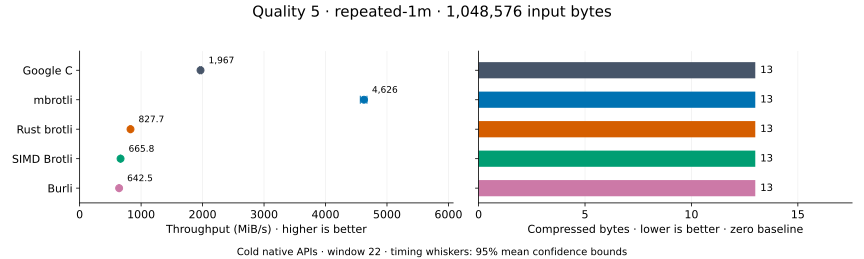

# Compression quality 5

[Benchmark index](../README.md) · [← Quality 4](q4.md) · [Quality 6 →](q6.md)

Recorded run: **path-review-final-after** (2026-09-07).
[Raw results](../competitor-paths-comparison.csv) · [Environment](../competitor-paths-environment.json) · [Run analysis](../competitor-paths.md).

Google C Brotli 1.2.0, mbrotli at the recorded optimized checkout, Rust brotli 9.0.0,
and SIMD Brotli 10.0.1 are compared at this quality.
Burli 0.3.1 is also included.

These are cold native API measurements: construction, allocation, compression, and disposal.
Generic mode, window 22, known input size; 30 samples, 0.2 s warmup, at least 0.5 s measurement.
Host: 13th Gen Intel(R) Core(TM) i7-13700KF, logical CPU 2; unset; Cargo release defaults, runtime SIMD dispatch.
Rust brotli and SIMD Brotli include their native 4 KiB I/O adapters.

## Dataset summary

Lowest latency means the lowest recorded mean, not a statistically established winner.
`mbrotli / fastest speed` is fastest mean latency divided by mbrotli mean latency; 1× is fastest.
Smallest output includes stream overhead. Equal quality numbers do not imply equal output size.

| Dataset | Input bytes | Lowest mean latency | mbrotli / fastest speed | Smallest output, bytes | mbrotli output, bytes |
| --- | ---: | --- | ---: | ---: | ---: |
| [empty](#empty) | 0 | mbrotli | 1.000× | 1 | 1 |
| [tiny-text](#tiny-text) | 44 | Burli | 0.565× | 48 | 48 |
| [alice29](#alice29) | 152,089 | Burli | 0.912× | 52,808 | 52,809 |
| [text-1m](#text-1m) | 1,048,576 | mbrotli | 1.000× | 51,228 | 51,228 |
| [binary-64k](#binary-64k) | 65,536 | Google C | 0.800× | 1,588 | 1,588 |
| [random-64k](#random-64k) | 65,536 | Google C | 0.711× | 65,540 | 65,540 |
| [random-1m](#random-1m) | 1,048,576 | mbrotli | 1.000× | 1,048,581 | 1,048,581 |
| [repeated-1m](#repeated-1m) | 1,048,576 | mbrotli | 1.000× | 13 | 13 |

## Dataset details

Chart whiskers and table intervals describe 95% confidence bounds on mean timing.
They do not capture all host or allocator variation. Throughput bounds are transformed latency bounds.
Output / input is compressed bytes divided by input bytes; smaller is better, and values above 100% mean expansion.
For empty input, throughput and output / input are undefined (—).
See the [optimization tradeoffs and rechecks](../competitor-paths.md#final-measurements) for before/after limitations.

### empty

Empty input; measures API overhead. **Input: 0 bytes.**

| Implementation | Mean, ns | 95% mean interval, ns | MiB/s | Output bytes | Output / input | Speed / C |
| --- | ---: | ---: | ---: | ---: | ---: | ---: |
| Google C | 32.39 | 32.01–32.93 | — | 1 | — | 1.000× |
| mbrotli | 27.11 | 26.96–27.3 | — | 1 | — | 1.194× |
| Rust brotli | 1.309e+04 | 1.302e+04–1.318e+04 | — | 1 | — | 0.002× |
| SIMD Brotli | 1.652e+04 | 1.642e+04–1.662e+04 | — | 1 | — | 0.002× |
| Burli | 82.53 | 82.12–83 | — | 1 | — | 0.392× |

### tiny-text

44-byte quick-brown-fox sentence. **Input: 44 bytes.**

| Implementation | Mean, µs | 95% mean interval, µs | MiB/s | Output bytes | Output / input | Speed / C |
| --- | ---: | ---: | ---: | ---: | ---: | ---: |
| Google C | 4.83 | 4.762–4.921 | 8.69 | 48 | 109.091% | 1.000× |
| mbrotli | 5.256 | 5.205–5.31 | 7.98 | 48 | 109.091% | 0.919× |
| Rust brotli | 19.1 | 18.89–19.35 | 2.20 | 48 | 109.091% | 0.253× |
| SIMD Brotli | 22.63 | 22.38–22.89 | 1.85 | 48 | 109.091% | 0.213× |
| Burli | 2.97 | 2.928–3.029 | 14.13 | 48 | 109.091% | 1.626× |

### alice29

Vendored Alice in Wonderland text. **Input: 152,089 bytes.**

| Implementation | Mean, µs | 95% mean interval, µs | MiB/s | Output bytes | Output / input | Speed / C |
| --- | ---: | ---: | ---: | ---: | ---: | ---: |
| Google C | 2,280 | 2,263–2,300 | 63.60 | 52,809 | 34.722% | 1.000× |
| mbrotli | 2,491 | 2,479–2,504 | 58.23 | 52,809 | 34.722% | 0.915× |
| Rust brotli | 3,320 | 3,285–3,364 | 43.69 | 52,808 | 34.722% | 0.687× |
| SIMD Brotli | 3,310 | 3,280–3,342 | 43.83 | 52,808 | 34.722% | 0.689× |
| Burli | 2,271 | 2,251–2,299 | 63.87 | 54,231 | 35.657% | 1.004× |

### text-1m

Alice text repeated cyclically to 1 MiB. **Input: 1,048,576 bytes.**

| Implementation | Mean, µs | 95% mean interval, µs | MiB/s | Output bytes | Output / input | Speed / C |
| --- | ---: | ---: | ---: | ---: | ---: | ---: |
| Google C | 2,867 | 2,828–2,910 | 348.74 | 51,228 | 4.885% | 1.000× |
| mbrotli | 2,861 | 2,825–2,898 | 349.55 | 51,228 | 4.885% | 1.002× |
| Rust brotli | 4,221 | 4,180–4,267 | 236.93 | 52,238 | 4.982% | 0.679× |
| SIMD Brotli | 4,578 | 4,497–4,662 | 218.46 | 51,238 | 4.886% | 0.626× |
| Burli | 4,403 | 4,288–4,535 | 227.14 | 52,668 | 5.023% | 0.651× |

### binary-64k

64 KiB of structured binary bytes: ((i / 16) XOR i) modulo 256. **Input: 65,536 bytes.**

| Implementation | Mean, µs | 95% mean interval, µs | MiB/s | Output bytes | Output / input | Speed / C |
| --- | ---: | ---: | ---: | ---: | ---: | ---: |
| Google C | 89.09 | 85.26–93.57 | 701.52 | 1,588 | 2.423% | 1.000× |
| mbrotli | 111.4 | 108–115.2 | 561.07 | 1,588 | 2.423% | 0.800× |
| Rust brotli | 363.9 | 359.7–368.5 | 171.76 | 1,588 | 2.423% | 0.245× |
| SIMD Brotli | 467.3 | 456.2–480.4 | 133.74 | 1,588 | 2.423% | 0.191× |
| Burli | 161.6 | 150.3–174 | 386.83 | 1,593 | 2.431% | 0.551× |

### random-64k

64 KiB prefix of the deterministic pseudorandom corpus. **Input: 65,536 bytes.**

| Implementation | Mean, µs | 95% mean interval, µs | MiB/s | Output bytes | Output / input | Speed / C |
| --- | ---: | ---: | ---: | ---: | ---: | ---: |
| Google C | 76.01 | 72.98–79.48 | 822.30 | 65,540 | 100.006% | 1.000× |
| mbrotli | 106.9 | 101.2–112.4 | 584.58 | 65,540 | 100.006% | 0.711× |
| Rust brotli | 290.8 | 288.6–293.5 | 214.90 | 65,540 | 100.006% | 0.261× |
| SIMD Brotli | 354.9 | 351.2–359 | 176.09 | 65,540 | 100.006% | 0.214× |
| Burli | 424.6 | 420.9–428.9 | 147.20 | 65,540 | 100.006% | 0.179× |

### random-1m

1 MiB of deterministic xorshift64 pseudorandom bytes. **Input: 1,048,576 bytes.**

| Implementation | Mean, µs | 95% mean interval, µs | MiB/s | Output bytes | Output / input | Speed / C |
| --- | ---: | ---: | ---: | ---: | ---: | ---: |
| Google C | 1,621 | 1,477–1,775 | 617.00 | 1,048,581 | 100.000% | 1.000× |
| mbrotli | 1,371 | 1,342–1,406 | 729.17 | 1,048,581 | 100.000% | 1.182× |
| Rust brotli | 2,783 | 2,753–2,814 | 359.35 | 1,048,581 | 100.000% | 0.582× |
| SIMD Brotli | 2,961 | 2,911–3,019 | 337.70 | 1,048,581 | 100.000% | 0.547× |
| Burli | 4,624 | 4,596–4,654 | 216.27 | 1,048,593 | 100.002% | 0.351× |

### repeated-1m

1 MiB of repeated a bytes. **Input: 1,048,576 bytes.**

| Implementation | Mean, µs | 95% mean interval, µs | MiB/s | Output bytes | Output / input | Speed / C |
| --- | ---: | ---: | ---: | ---: | ---: | ---: |
| Google C | 508.5 | 504.3–512.9 | 1,966.76 | 13 | 0.001% | 1.000× |
| mbrotli | 216.2 | 213.9–219 | 4,625.58 | 13 | 0.001% | 2.352× |
| Rust brotli | 1,208 | 1,195–1,223 | 827.70 | 13 | 0.001% | 0.421× |
| SIMD Brotli | 1,502 | 1,490–1,514 | 665.82 | 13 | 0.001% | 0.339× |
| Burli | 1,556 | 1,544–1,573 | 642.54 | 13 | 0.001% | 0.327× |
