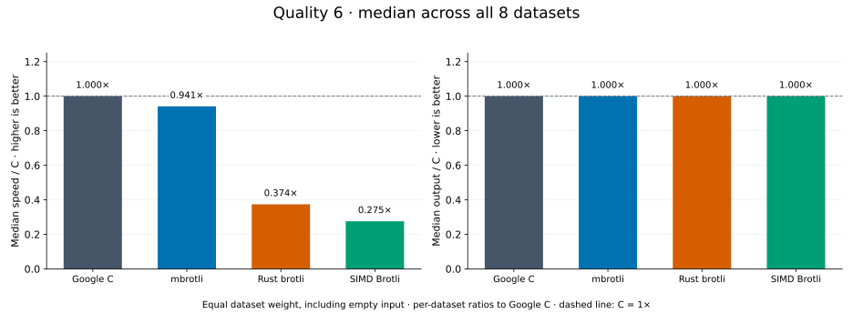
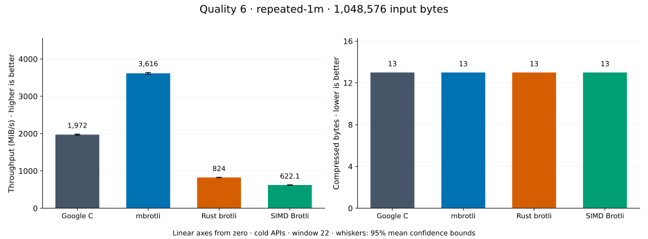
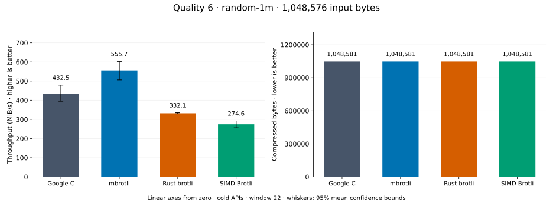
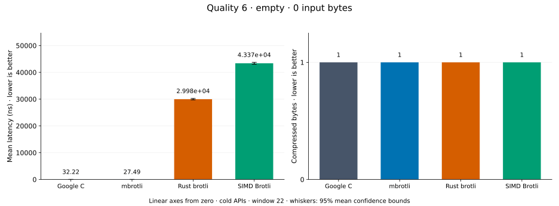
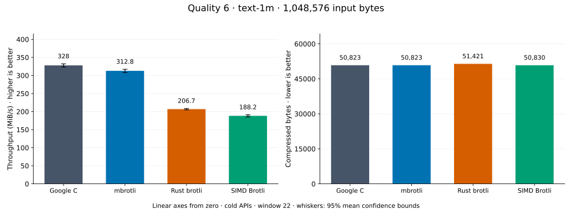
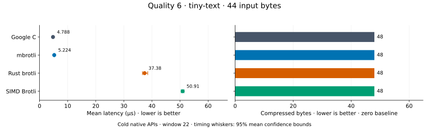
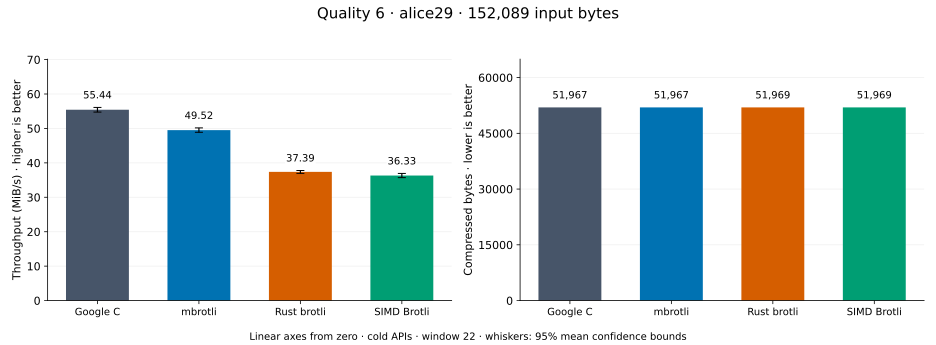
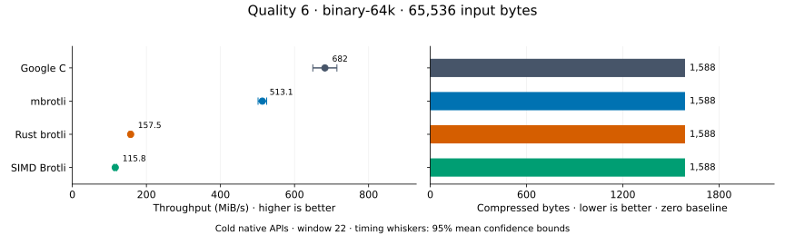
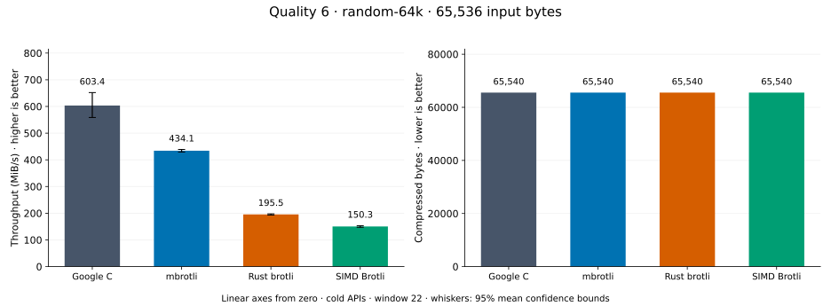

# Compression quality 6

[Benchmark index](../README.md) · [Median overview](README.md) · [← Quality 5](q5.md) · [Quality 7 →](q7.md)

Recorded run: **library-refresh-2026-09-07-191328** (2026-09-07).
[Raw results](../library-comparison.csv) · [Environment](../library-comparison-environment.json) · [Run analysis](../library-comparison.md).

## Median across all datasets

Each of the eight datasets has equal weight, including empty and tiny input.
Speed / C = C mean latency / implementation mean latency; output / C = implementation bytes / C bytes.
We take the median of these eight per-dataset ratios separately for speed and size.
1× matches C; higher speed and lower output are better. These are medians across datasets,
not median sample latencies, and do not imply equal compressed size or statistical significance.

| Implementation | Median speed / C ↑ | Median output / C ↓ | Datasets |
| --- | ---: | ---: | ---: |
| Google C | 1.000× | 1.000× | 8 |
| mbrotli | 0.941× | 1.000× | 8 |
| Rust brotli | 0.374× | 1.000× | 8 |
| SIMD Brotli | 0.275× | 1.000× | 8 |

Measurement setup and interpretation

Google C Brotli 1.2.0, mbrotli at the recorded optimized checkout, Rust brotli 9.0.0,
and SIMD Brotli 10.0.1 are compared at this quality.
**Burli supports only qualities 0–5; it has no results at this quality.**

These are cold native API measurements: construction, allocation, compression, and disposal.
Generic mode, window 22, known input size; 30 samples, 0.2 s warmup, at least 0.5 s measurement.
Host: 13th Gen Intel(R) Core(TM) i7-13700KF, logical CPU 2; unset; Cargo release defaults, runtime SIMD dispatch.
Rust brotli and SIMD Brotli include their native 4 KiB I/O adapters.

Chart whiskers and table intervals describe 95% confidence bounds on mean timing.
They do not capture all host or allocator variation. Throughput bounds are transformed latency bounds.
Output / input is compressed bytes divided by input bytes; smaller is better, and values above 100% mean expansion.
For empty input, throughput and output / input are undefined (—).
See the [run analysis](../library-comparison.md#final-measurements) for measurement limitations.

## Dataset details

Ordered by mbrotli speed / fastest competing implementation, highest first; all eight datasets are shown.
This order uses recorded mean latency, not statistical significance. Bars start at zero.

[repeated-1m](#repeated-1m) · [random-1m](#random-1m) · [empty](#empty) · [text-1m](#text-1m) · [tiny-text](#tiny-text) · [alice29](#alice29) · [binary-64k](#binary-64k) · [random-64k](#random-64k)

### repeated-1m

1 MiB of repeated a bytes. **Input: 1,048,576 bytes.**

mbrotli speed / fastest peer (Google C): **1.889×**; output: 13 / 13 bytes.

Exact measurements and confidence bounds

| Implementation | Mean, µs | 95% mean interval, µs | MiB/s | Output bytes | Output / input | Speed / C |
| --- | ---: | ---: | ---: | ---: | ---: | ---: |
| Google C | 505.9 | 503.6–508.4 | 1,976.57 | 13 | 0.001% | 1.000× |
| mbrotli | 267.8 | 265.7–270.6 | 3,734.31 | 13 | 0.001% | 1.889× |
| Rust brotli | 1,192 | 1,183–1,201 | 839.06 | 13 | 0.001% | 0.425× |
| SIMD Brotli | 1,561 | 1,552–1,571 | 640.69 | 13 | 0.001% | 0.324× |

### random-1m

1 MiB of deterministic xorshift64 pseudorandom bytes. **Input: 1,048,576 bytes.**

mbrotli speed / fastest peer (Google C): **1.285×**; output: 1,048,581 / 1,048,581 bytes.

Exact measurements and confidence bounds

| Implementation | Mean, µs | 95% mean interval, µs | MiB/s | Output bytes | Output / input | Speed / C |
| --- | ---: | ---: | ---: | ---: | ---: | ---: |
| Google C | 2,312 | 2,090–2,534 | 432.53 | 1,048,581 | 100.000% | 1.000× |
| mbrotli | 1,800 | 1,660–1,977 | 555.69 | 1,048,581 | 100.000% | 1.285× |
| Rust brotli | 3,011 | 2,987–3,036 | 332.07 | 1,048,581 | 100.000% | 0.768× |
| SIMD Brotli | 3,641 | 3,425–3,900 | 274.62 | 1,048,581 | 100.000% | 0.635× |

### empty

Empty input; measures API overhead. **Input: 0 bytes.**

mbrotli speed / fastest peer (Google C): **1.182×**; output: 1 / 1 bytes.

Exact measurements and confidence bounds

| Implementation | Mean, ns | 95% mean interval, ns | MiB/s | Output bytes | Output / input | Speed / C |
| --- | ---: | ---: | ---: | ---: | ---: | ---: |
| Google C | 33.01 | 32.63–33.39 | — | 1 | — | 1.000× |
| mbrotli | 27.92 | 27.55–28.31 | — | 1 | — | 1.182× |
| Rust brotli | 2.922e+04 | 2.896e+04–2.951e+04 | — | 1 | — | 0.001× |
| SIMD Brotli | 4.275e+04 | 4.224e+04–4.334e+04 | — | 1 | — | 0.001× |

### text-1m

Alice text repeated cyclically to 1 MiB. **Input: 1,048,576 bytes.**

mbrotli speed / fastest peer (Google C): **0.985×**; output: 50,823 / 50,823 bytes.

Exact measurements and confidence bounds

| Implementation | Mean, µs | 95% mean interval, µs | MiB/s | Output bytes | Output / input | Speed / C |
| --- | ---: | ---: | ---: | ---: | ---: | ---: |
| Google C | 3,103 | 3,066–3,141 | 322.31 | 50,823 | 4.847% | 1.000× |
| mbrotli | 3,150 | 3,109–3,195 | 317.46 | 50,823 | 4.847% | 0.985× |
| Rust brotli | 4,885 | 4,828–4,949 | 204.72 | 51,421 | 4.904% | 0.635× |
| SIMD Brotli | 5,297 | 5,229–5,370 | 188.79 | 50,830 | 4.848% | 0.586× |

### tiny-text

44-byte quick-brown-fox sentence. **Input: 44 bytes.**

mbrotli speed / fastest peer (Google C): **0.897×**; output: 48 / 48 bytes.

Exact measurements and confidence bounds

| Implementation | Mean, µs | 95% mean interval, µs | MiB/s | Output bytes | Output / input | Speed / C |
| --- | ---: | ---: | ---: | ---: | ---: | ---: |
| Google C | 4.767 | 4.724–4.819 | 8.80 | 48 | 109.091% | 1.000× |
| mbrotli | 5.317 | 5.238–5.422 | 7.89 | 48 | 109.091% | 0.897× |
| Rust brotli | 36.61 | 36.09–37.19 | 1.15 | 48 | 109.091% | 0.130× |
| SIMD Brotli | 50.72 | 50.06–51.45 | 0.83 | 48 | 109.091% | 0.094× |

### alice29

Vendored Alice in Wonderland text. **Input: 152,089 bytes.**

mbrotli speed / fastest peer (Google C): **0.893×**; output: 51,967 / 51,967 bytes.

Exact measurements and confidence bounds

| Implementation | Mean, µs | 95% mean interval, µs | MiB/s | Output bytes | Output / input | Speed / C |
| --- | ---: | ---: | ---: | ---: | ---: | ---: |
| Google C | 2,616 | 2,585–2,649 | 55.44 | 51,967 | 34.169% | 1.000× |
| mbrotli | 2,929 | 2,892–2,968 | 49.52 | 51,967 | 34.169% | 0.893× |
| Rust brotli | 3,879 | 3,839–3,925 | 37.39 | 51,969 | 34.170% | 0.674× |
| SIMD Brotli | 3,993 | 3,928–4,060 | 36.33 | 51,969 | 34.170% | 0.655× |

### binary-64k

64 KiB of structured binary bytes: ((i / 16) XOR i) modulo 256. **Input: 65,536 bytes.**

mbrotli speed / fastest peer (Google C): **0.775×**; output: 1,588 / 1,588 bytes.

Exact measurements and confidence bounds

| Implementation | Mean, µs | 95% mean interval, µs | MiB/s | Output bytes | Output / input | Speed / C |
| --- | ---: | ---: | ---: | ---: | ---: | ---: |
| Google C | 86.34 | 84.22–89.03 | 723.92 | 1,588 | 2.423% | 1.000× |
| mbrotli | 111.3 | 109.9–113 | 561.33 | 1,588 | 2.423% | 0.775× |
| Rust brotli | 390.2 | 386.6–394.3 | 160.16 | 1,588 | 2.423% | 0.221× |
| SIMD Brotli | 494.4 | 490.1–499.9 | 126.41 | 1,588 | 2.423% | 0.175× |

### random-64k

64 KiB prefix of the deterministic pseudorandom corpus. **Input: 65,536 bytes.**

mbrotli speed / fastest peer (Google C): **0.743×**; output: 65,540 / 65,540 bytes.

Exact measurements and confidence bounds

| Implementation | Mean, µs | 95% mean interval, µs | MiB/s | Output bytes | Output / input | Speed / C |
| --- | ---: | ---: | ---: | ---: | ---: | ---: |
| Google C | 105.3 | 97.38–113.7 | 593.40 | 65,540 | 100.006% | 1.000× |
| mbrotli | 141.8 | 140.4–143.4 | 440.77 | 65,540 | 100.006% | 0.743× |
| Rust brotli | 326 | 320.8–332 | 191.74 | 65,540 | 100.006% | 0.323× |
| SIMD Brotli | 464.6 | 452.2–476.1 | 134.53 | 65,540 | 100.006% | 0.227× |

