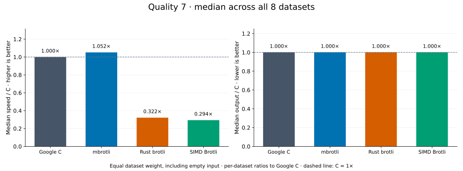
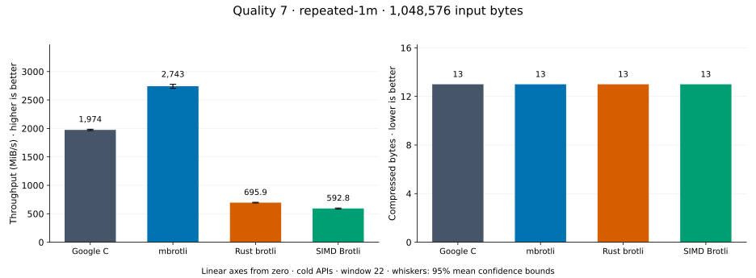
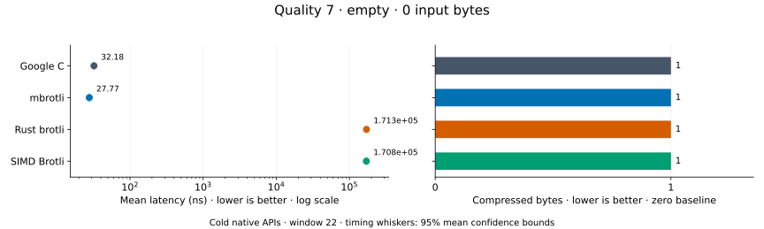
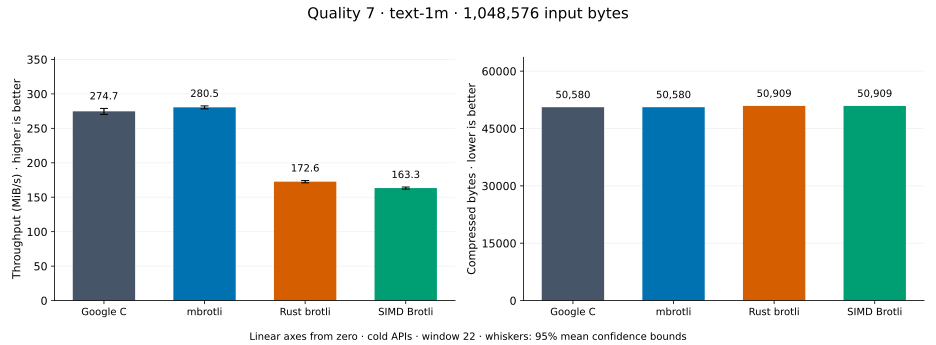
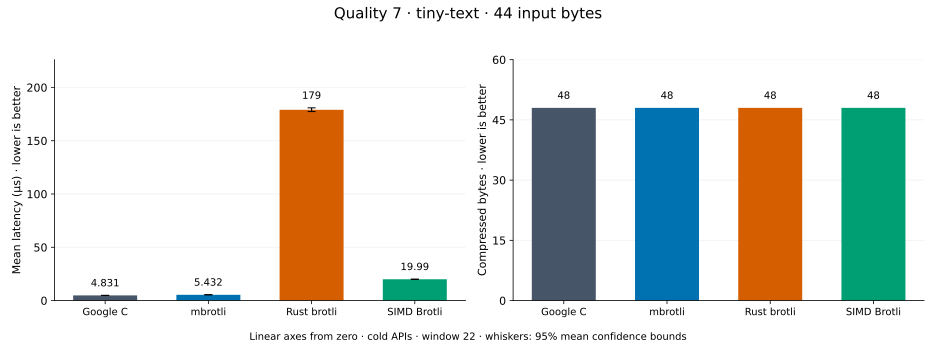
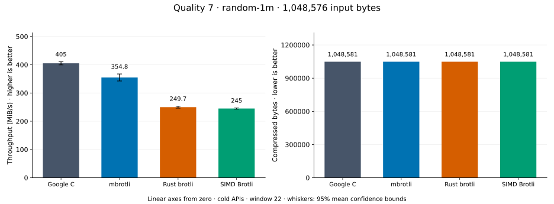
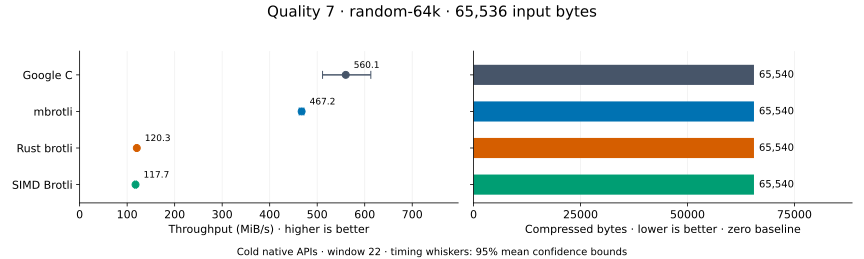
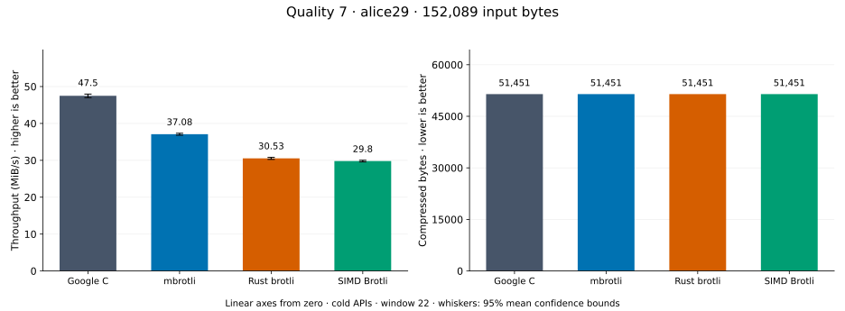
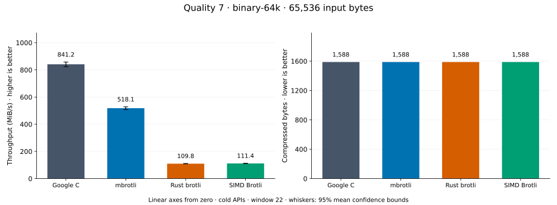

# Compression quality 7

[Benchmark index](../README.md) · [Median overview](README.md) · [← Quality 6](q6.md) · [Quality 8 →](q8.md)

Recorded run: **path-review-final-after** (2026-09-07).
[Raw results](../competitor-paths-comparison.csv) · [Environment](../competitor-paths-environment.json) · [Run analysis](../competitor-paths.md).

## Median across all datasets

Each of the eight datasets has equal weight, including empty and tiny input.
Speed / C = C mean latency / implementation mean latency; output / C = implementation bytes / C bytes.
We take the median of these eight per-dataset ratios separately for speed and size.
1× matches C; higher speed and lower output are better. These are medians across datasets,
not median sample latencies, and do not imply equal compressed size or statistical significance.

| Implementation | Median speed / C ↑ | Median output / C ↓ | Datasets |
| --- | ---: | ---: | ---: |
| Google C | 1.000× | 1.000× | 8 |
| mbrotli | 0.883× | 1.000× | 8 |
| Rust brotli | 0.284× | 1.000× | 8 |
| SIMD Brotli | 0.271× | 1.000× | 8 |

Measurement setup and interpretation

Google C Brotli 1.2.0, mbrotli at the recorded optimized checkout, Rust brotli 9.0.0,
and SIMD Brotli 10.0.1 are compared at this quality.
**Burli supports only qualities 0–5; it has no results at this quality.**

These are cold native API measurements: construction, allocation, compression, and disposal.
Generic mode, window 22, known input size; 30 samples, 0.2 s warmup, at least 0.5 s measurement.
Host: 13th Gen Intel(R) Core(TM) i7-13700KF, logical CPU 2; unset; Cargo release defaults, runtime SIMD dispatch.
Rust brotli and SIMD Brotli include their native 4 KiB I/O adapters.

Chart whiskers and table intervals describe 95% confidence bounds on mean timing.
They do not capture all host or allocator variation. Throughput bounds are transformed latency bounds.
Output / input is compressed bytes divided by input bytes; smaller is better, and values above 100% mean expansion.
For empty input, throughput and output / input are undefined (—).
See the [optimization tradeoffs and rechecks](../competitor-paths.md#final-measurements) for before/after limitations.

## Dataset details

Ordered by mbrotli speed / fastest competing implementation, highest first; all eight datasets are shown.
This order uses recorded mean latency, not statistical significance. Bars start at zero.

[repeated-1m](#repeated-1m) · [empty](#empty) · [text-1m](#text-1m) · [tiny-text](#tiny-text) · [random-1m](#random-1m) · [random-64k](#random-64k) · [alice29](#alice29) · [binary-64k](#binary-64k)

### repeated-1m

1 MiB of repeated a bytes. **Input: 1,048,576 bytes.**

mbrotli speed / fastest peer (Google C): **1.389×**; output: 13 / 13 bytes.

Exact measurements and confidence bounds

| Implementation | Mean, µs | 95% mean interval, µs | MiB/s | Output bytes | Output / input | Speed / C |
| --- | ---: | ---: | ---: | ---: | ---: | ---: |
| Google C | 506.6 | 503.6–509.6 | 1,973.94 | 13 | 0.001% | 1.000× |
| mbrotli | 364.6 | 360.1–369.7 | 2,742.58 | 13 | 0.001% | 1.389× |
| Rust brotli | 1,437 | 1,425–1,451 | 695.89 | 13 | 0.001% | 0.353× |
| SIMD Brotli | 1,687 | 1,665–1,711 | 592.82 | 13 | 0.001% | 0.300× |

### empty

Empty input; measures API overhead. **Input: 0 bytes.**

mbrotli speed / fastest peer (Google C): **1.159×**; output: 1 / 1 bytes.

Exact measurements and confidence bounds

| Implementation | Mean, ns | 95% mean interval, ns | MiB/s | Output bytes | Output / input | Speed / C |
| --- | ---: | ---: | ---: | ---: | ---: | ---: |
| Google C | 32.18 | 32.05–32.31 | — | 1 | — | 1.000× |
| mbrotli | 27.77 | 27.57–27.97 | — | 1 | — | 1.159× |
| Rust brotli | 1.713e+05 | 1.702e+05–1.725e+05 | — | 1 | — | 0.000× |
| SIMD Brotli | 1.708e+05 | 1.696e+05–1.721e+05 | — | 1 | — | 0.000× |

### text-1m

Alice text repeated cyclically to 1 MiB. **Input: 1,048,576 bytes.**

mbrotli speed / fastest peer (Google C): **0.969×**; output: 50,580 / 50,580 bytes.

Exact measurements and confidence bounds

| Implementation | Mean, µs | 95% mean interval, µs | MiB/s | Output bytes | Output / input | Speed / C |
| --- | ---: | ---: | ---: | ---: | ---: | ---: |
| Google C | 3,631 | 3,581–3,692 | 275.40 | 50,580 | 4.824% | 1.000× |
| mbrotli | 3,748 | 3,687–3,818 | 266.79 | 50,580 | 4.824% | 0.969× |
| Rust brotli | 6,073 | 5,978–6,174 | 164.67 | 50,909 | 4.855% | 0.598× |
| SIMD Brotli | 6,300 | 6,208–6,404 | 158.74 | 50,909 | 4.855% | 0.576× |

### tiny-text

44-byte quick-brown-fox sentence. **Input: 44 bytes.**

mbrotli speed / fastest peer (Google C): **0.889×**; output: 48 / 48 bytes.

Exact measurements and confidence bounds

| Implementation | Mean, µs | 95% mean interval, µs | MiB/s | Output bytes | Output / input | Speed / C |
| --- | ---: | ---: | ---: | ---: | ---: | ---: |
| Google C | 4.831 | 4.79–4.878 | 8.69 | 48 | 109.091% | 1.000× |
| mbrotli | 5.432 | 5.367–5.506 | 7.72 | 48 | 109.091% | 0.889× |
| Rust brotli | 179 | 177.4–180.9 | 0.23 | 48 | 109.091% | 0.027× |
| SIMD Brotli | 19.99 | 19.83–20.14 | 2.10 | 48 | 109.091% | 0.242× |

### random-1m

1 MiB of deterministic xorshift64 pseudorandom bytes. **Input: 1,048,576 bytes.**

mbrotli speed / fastest peer (Google C): **0.876×**; output: 1,048,581 / 1,048,581 bytes.

Exact measurements and confidence bounds

| Implementation | Mean, µs | 95% mean interval, µs | MiB/s | Output bytes | Output / input | Speed / C |
| --- | ---: | ---: | ---: | ---: | ---: | ---: |
| Google C | 2,469 | 2,435–2,504 | 404.99 | 1,048,581 | 100.000% | 1.000× |
| mbrotli | 2,818 | 2,723–2,920 | 354.84 | 1,048,581 | 100.000% | 0.876× |
| Rust brotli | 4,005 | 3,949–4,061 | 249.70 | 1,048,581 | 100.000% | 0.617× |
| SIMD Brotli | 4,082 | 4,049–4,119 | 244.95 | 1,048,581 | 100.000% | 0.605× |

### random-64k

64 KiB prefix of the deterministic pseudorandom corpus. **Input: 65,536 bytes.**

mbrotli speed / fastest peer (Google C): **0.834×**; output: 65,540 / 65,540 bytes.

Exact measurements and confidence bounds

| Implementation | Mean, µs | 95% mean interval, µs | MiB/s | Output bytes | Output / input | Speed / C |
| --- | ---: | ---: | ---: | ---: | ---: | ---: |
| Google C | 111.6 | 102–122.2 | 560.09 | 65,540 | 100.006% | 1.000× |
| mbrotli | 133.8 | 132.4–135.3 | 467.24 | 65,540 | 100.006% | 0.834× |
| Rust brotli | 519.5 | 512.5–527.4 | 120.31 | 65,540 | 100.006% | 0.215× |
| SIMD Brotli | 531.2 | 521.8–541.8 | 117.65 | 65,540 | 100.006% | 0.210× |

### alice29

Vendored Alice in Wonderland text. **Input: 152,089 bytes.**

mbrotli speed / fastest peer (Google C): **0.781×**; output: 51,451 / 51,451 bytes.

Exact measurements and confidence bounds

| Implementation | Mean, µs | 95% mean interval, µs | MiB/s | Output bytes | Output / input | Speed / C |
| --- | ---: | ---: | ---: | ---: | ---: | ---: |
| Google C | 3,054 | 3,024–3,086 | 47.50 | 51,451 | 33.830% | 1.000× |
| mbrotli | 3,911 | 3,885–3,940 | 37.08 | 51,451 | 33.830% | 0.781× |
| Rust brotli | 4,750 | 4,709–4,795 | 30.53 | 51,451 | 33.830% | 0.643× |
| SIMD Brotli | 4,867 | 4,832–4,903 | 29.80 | 51,451 | 33.830% | 0.627× |

### binary-64k

64 KiB of structured binary bytes: ((i / 16) XOR i) modulo 256. **Input: 65,536 bytes.**

mbrotli speed / fastest peer (Google C): **0.720×**; output: 1,588 / 1,588 bytes.

Exact measurements and confidence bounds

| Implementation | Mean, µs | 95% mean interval, µs | MiB/s | Output bytes | Output / input | Speed / C |
| --- | ---: | ---: | ---: | ---: | ---: | ---: |
| Google C | 82.87 | 78.03–88.08 | 754.21 | 1,588 | 2.423% | 1.000× |
| mbrotli | 115 | 113.7–116.5 | 543.39 | 1,588 | 2.423% | 0.720× |
| Rust brotli | 586.4 | 577.1–596 | 106.59 | 1,588 | 2.423% | 0.141× |
| SIMD Brotli | 607.4 | 596.2–620 | 102.90 | 1,588 | 2.423% | 0.136× |

