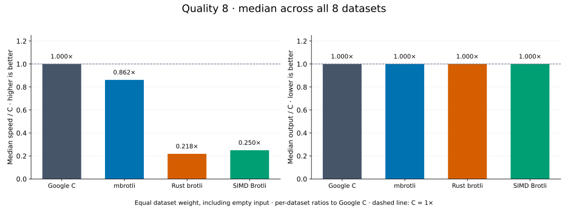
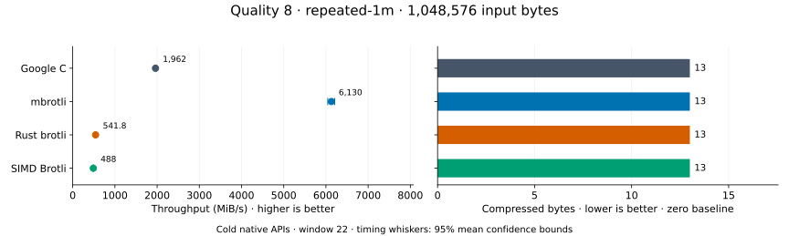
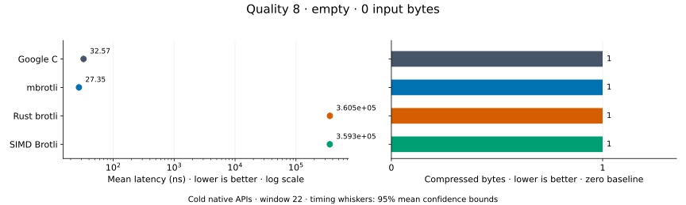
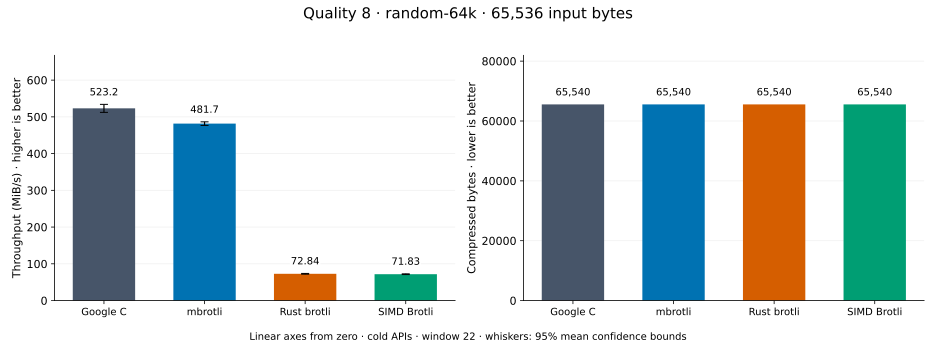
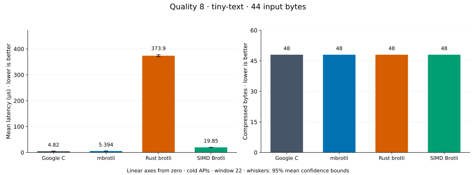
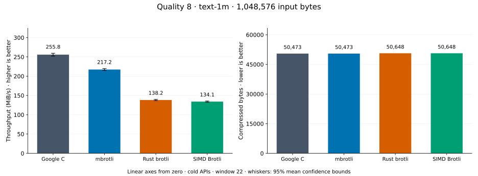
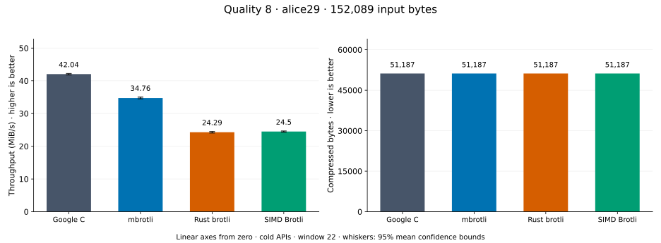
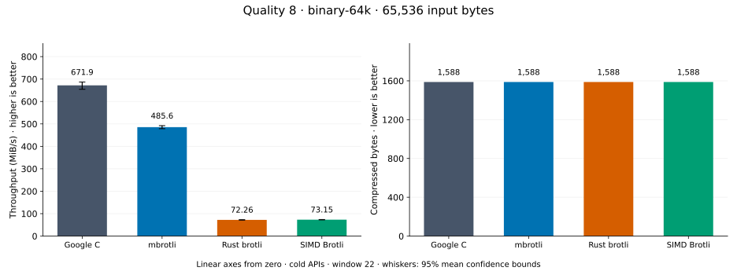
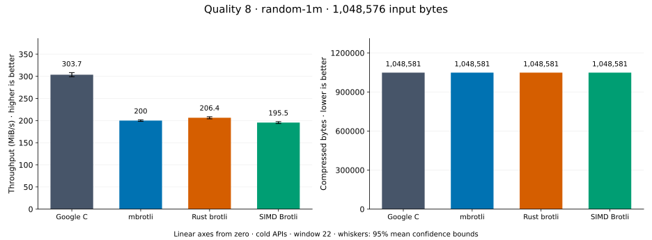

# Compression quality 8

[Benchmark index](../README.md) · [Median overview](README.md) · [← Quality 7](q7.md) · [Quality 9 →](q9.md)

Recorded run: **path-review-final-after** (2026-09-07).
[Raw results](../competitor-paths-comparison.csv) · [Environment](../competitor-paths-environment.json) · [Run analysis](../competitor-paths.md).

## Median across all datasets

Each of the eight datasets has equal weight, including empty and tiny input.
Speed / C = C mean latency / implementation mean latency; output / C = implementation bytes / C bytes.
We take the median of these eight per-dataset ratios separately for speed and size.
1× matches C; higher speed and lower output are better. These are medians across datasets,
not median sample latencies, and do not imply equal compressed size or statistical significance.

| Implementation | Median speed / C ↑ | Median output / C ↓ | Datasets |
| --- | ---: | ---: | ---: |
| Google C | 1.000× | 1.000× | 8 |
| mbrotli | 0.871× | 1.000× | 8 |
| Rust brotli | 0.208× | 1.000× | 8 |
| SIMD Brotli | 0.246× | 1.000× | 8 |

Measurement setup and interpretation

Google C Brotli 1.2.0, mbrotli at the recorded optimized checkout, Rust brotli 9.0.0,
and SIMD Brotli 10.0.1 are compared at this quality.
**Burli supports only qualities 0–5; it has no results at this quality.**

These are cold native API measurements: construction, allocation, compression, and disposal.
Generic mode, window 22, known input size; 30 samples, 0.2 s warmup, at least 0.5 s measurement.
Host: 13th Gen Intel(R) Core(TM) i7-13700KF, logical CPU 2; unset; Cargo release defaults, runtime SIMD dispatch.
Rust brotli and SIMD Brotli include their native 4 KiB I/O adapters.

Chart whiskers and table intervals describe 95% confidence bounds on mean timing.
They do not capture all host or allocator variation. Throughput bounds are transformed latency bounds.
Output / input is compressed bytes divided by input bytes; smaller is better, and values above 100% mean expansion.
For empty input, throughput and output / input are undefined (—).
See the [optimization tradeoffs and rechecks](../competitor-paths.md#final-measurements) for before/after limitations.

## Dataset details

Ordered by mbrotli speed / fastest competing implementation, highest first; all eight datasets are shown.
This order uses recorded mean latency, not statistical significance. Bars start at zero.

[repeated-1m](#repeated-1m) · [empty](#empty) · [random-64k](#random-64k) · [tiny-text](#tiny-text) · [text-1m](#text-1m) · [alice29](#alice29) · [binary-64k](#binary-64k) · [random-1m](#random-1m)

### repeated-1m

1 MiB of repeated a bytes. **Input: 1,048,576 bytes.**

mbrotli speed / fastest peer (Google C): **3.124×**; output: 13 / 13 bytes.

Exact measurements and confidence bounds

| Implementation | Mean, µs | 95% mean interval, µs | MiB/s | Output bytes | Output / input | Speed / C |
| --- | ---: | ---: | ---: | ---: | ---: | ---: |
| Google C | 509.7 | 504.8–515.4 | 1,961.83 | 13 | 0.001% | 1.000× |
| mbrotli | 163.1 | 161.1–165.5 | 6,129.69 | 13 | 0.001% | 3.124× |
| Rust brotli | 1,846 | 1,825–1,870 | 541.78 | 13 | 0.001% | 0.276× |
| SIMD Brotli | 2,049 | 2,032–2,069 | 487.97 | 13 | 0.001% | 0.249× |

### empty

Empty input; measures API overhead. **Input: 0 bytes.**

mbrotli speed / fastest peer (Google C): **1.191×**; output: 1 / 1 bytes.

Exact measurements and confidence bounds

| Implementation | Mean, ns | 95% mean interval, ns | MiB/s | Output bytes | Output / input | Speed / C |
| --- | ---: | ---: | ---: | ---: | ---: | ---: |
| Google C | 32.57 | 32.34–32.85 | — | 1 | — | 1.000× |
| mbrotli | 27.35 | 27.19–27.51 | — | 1 | — | 1.191× |
| Rust brotli | 3.605e+05 | 3.581e+05–3.633e+05 | — | 1 | — | 0.000× |
| SIMD Brotli | 3.593e+05 | 3.572e+05–3.617e+05 | — | 1 | — | 0.000× |

### random-64k

64 KiB prefix of the deterministic pseudorandom corpus. **Input: 65,536 bytes.**

mbrotli speed / fastest peer (Google C): **0.921×**; output: 65,540 / 65,540 bytes.

Exact measurements and confidence bounds

| Implementation | Mean, µs | 95% mean interval, µs | MiB/s | Output bytes | Output / input | Speed / C |
| --- | ---: | ---: | ---: | ---: | ---: | ---: |
| Google C | 119.5 | 117.1–122 | 523.20 | 65,540 | 100.006% | 1.000× |
| mbrotli | 129.8 | 128.5–131.1 | 481.69 | 65,540 | 100.006% | 0.921× |
| Rust brotli | 858 | 845.8–870.7 | 72.84 | 65,540 | 100.006% | 0.139× |
| SIMD Brotli | 870.1 | 858–884.4 | 71.83 | 65,540 | 100.006% | 0.137× |

### tiny-text

44-byte quick-brown-fox sentence. **Input: 44 bytes.**

mbrotli speed / fastest peer (Google C): **0.894×**; output: 48 / 48 bytes.

Exact measurements and confidence bounds

| Implementation | Mean, µs | 95% mean interval, µs | MiB/s | Output bytes | Output / input | Speed / C |
| --- | ---: | ---: | ---: | ---: | ---: | ---: |
| Google C | 4.82 | 4.767–4.881 | 8.71 | 48 | 109.091% | 1.000× |
| mbrotli | 5.394 | 5.317–5.485 | 7.78 | 48 | 109.091% | 0.894× |
| Rust brotli | 373.9 | 370.2–377.7 | 0.11 | 48 | 109.091% | 0.013× |
| SIMD Brotli | 19.85 | 19.64–20.11 | 2.11 | 48 | 109.091% | 0.243× |

### text-1m

Alice text repeated cyclically to 1 MiB. **Input: 1,048,576 bytes.**

mbrotli speed / fastest peer (Google C): **0.849×**; output: 50,473 / 50,473 bytes.

Exact measurements and confidence bounds

| Implementation | Mean, µs | 95% mean interval, µs | MiB/s | Output bytes | Output / input | Speed / C |
| --- | ---: | ---: | ---: | ---: | ---: | ---: |
| Google C | 3,909 | 3,854–3,966 | 255.84 | 50,473 | 4.813% | 1.000× |
| mbrotli | 4,603 | 4,551–4,658 | 217.23 | 50,473 | 4.813% | 0.849× |
| Rust brotli | 7,233 | 7,150–7,321 | 138.25 | 50,648 | 4.830% | 0.540× |
| SIMD Brotli | 7,457 | 7,375–7,543 | 134.10 | 50,648 | 4.830% | 0.524× |

### alice29

Vendored Alice in Wonderland text. **Input: 152,089 bytes.**

mbrotli speed / fastest peer (Google C): **0.827×**; output: 51,187 / 51,187 bytes.

Exact measurements and confidence bounds

| Implementation | Mean, µs | 95% mean interval, µs | MiB/s | Output bytes | Output / input | Speed / C |
| --- | ---: | ---: | ---: | ---: | ---: | ---: |
| Google C | 3,450 | 3,435–3,466 | 42.04 | 51,187 | 33.656% | 1.000× |
| mbrotli | 4,173 | 4,143–4,208 | 34.76 | 51,187 | 33.656% | 0.827× |
| Rust brotli | 5,972 | 5,918–6,032 | 24.29 | 51,187 | 33.656% | 0.578× |
| SIMD Brotli | 5,920 | 5,879–5,963 | 24.50 | 51,187 | 33.656% | 0.583× |

### binary-64k

64 KiB of structured binary bytes: ((i / 16) XOR i) modulo 256. **Input: 65,536 bytes.**

mbrotli speed / fastest peer (Google C): **0.715×**; output: 1,588 / 1,588 bytes.

Exact measurements and confidence bounds

| Implementation | Mean, µs | 95% mean interval, µs | MiB/s | Output bytes | Output / input | Speed / C |
| --- | ---: | ---: | ---: | ---: | ---: | ---: |
| Google C | 112.6 | 108–116.8 | 555.25 | 1,588 | 2.423% | 1.000× |
| mbrotli | 157.4 | 155.9–159 | 397.13 | 1,588 | 2.423% | 0.715× |
| Rust brotli | 928.8 | 914.7–944.2 | 67.29 | 1,588 | 2.423% | 0.121× |
| SIMD Brotli | 918.9 | 905.8–932 | 68.02 | 1,588 | 2.423% | 0.122× |

### random-1m

1 MiB of deterministic xorshift64 pseudorandom bytes. **Input: 1,048,576 bytes.**

mbrotli speed / fastest peer (Google C): **0.659×**; output: 1,048,581 / 1,048,581 bytes.

Exact measurements and confidence bounds

| Implementation | Mean, µs | 95% mean interval, µs | MiB/s | Output bytes | Output / input | Speed / C |
| --- | ---: | ---: | ---: | ---: | ---: | ---: |
| Google C | 3,292 | 3,242–3,342 | 303.73 | 1,048,581 | 100.000% | 1.000× |
| mbrotli | 4,999 | 4,955–5,046 | 200.02 | 1,048,581 | 100.000% | 0.659× |
| Rust brotli | 4,844 | 4,791–4,904 | 206.45 | 1,048,581 | 100.000% | 0.680× |
| SIMD Brotli | 5,114 | 5,060–5,173 | 195.53 | 1,048,581 | 100.000% | 0.644× |

