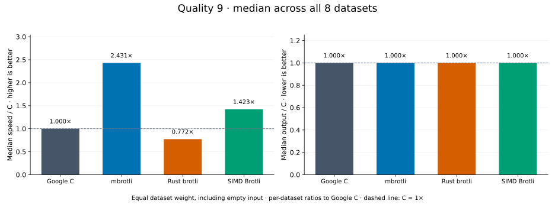
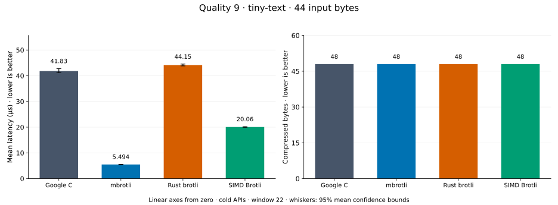
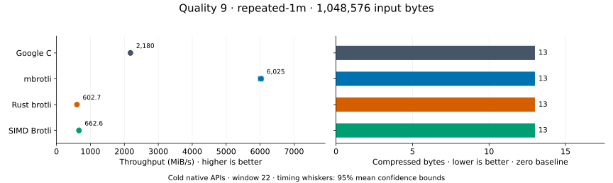
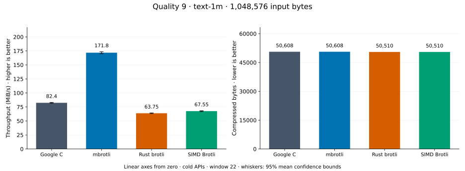
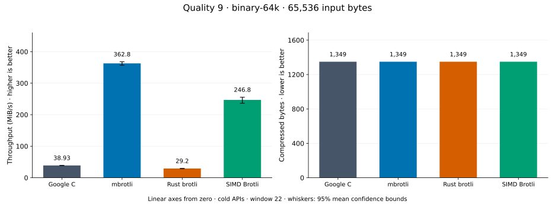
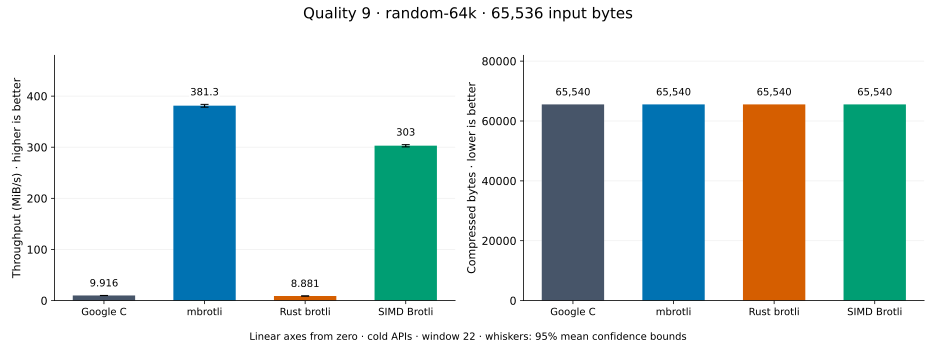
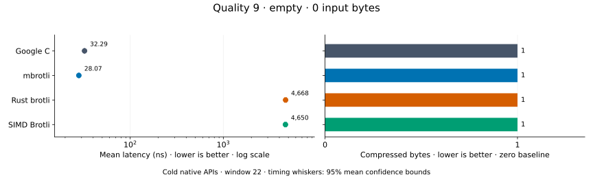
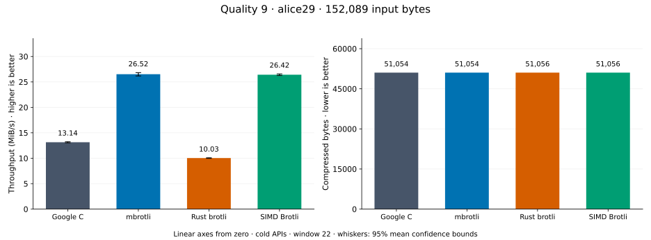
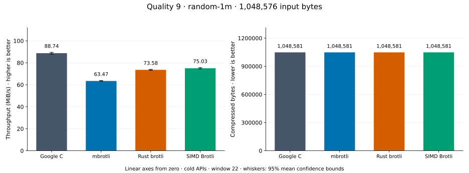

# Compression quality 9

[Benchmark index](../README.md) · [Median overview](README.md) · [← Quality 8](q8.md) · [Quality 10 →](q10.md)

Recorded run: **path-review-final-after** (2026-09-07).
[Raw results](../competitor-paths-comparison.csv) · [Environment](../competitor-paths-environment.json) · [Run analysis](../competitor-paths.md).

## Median across all datasets

Each of the eight datasets has equal weight, including empty and tiny input.
Speed / C = C mean latency / implementation mean latency; output / C = implementation bytes / C bytes.
We take the median of these eight per-dataset ratios separately for speed and size.
1× matches C; higher speed and lower output are better. These are medians across datasets,
not median sample latencies, and do not imply equal compressed size or statistical significance.

| Implementation | Median speed / C ↑ | Median output / C ↓ | Datasets |
| --- | ---: | ---: | ---: |
| Google C | 1.000× | 1.000× | 8 |
| mbrotli | 2.431× | 1.000× | 8 |
| Rust brotli | 0.772× | 1.000× | 8 |
| SIMD Brotli | 1.423× | 1.000× | 8 |

Measurement setup and interpretation

Google C Brotli 1.2.0, mbrotli at the recorded optimized checkout, Rust brotli 9.0.0,
and SIMD Brotli 10.0.1 are compared at this quality.
**Burli supports only qualities 0–5; it has no results at this quality.**

These are cold native API measurements: construction, allocation, compression, and disposal.
Generic mode, window 22, known input size; 30 samples, 0.2 s warmup, at least 0.5 s measurement.
Host: 13th Gen Intel(R) Core(TM) i7-13700KF, logical CPU 2; unset; Cargo release defaults, runtime SIMD dispatch.
Rust brotli and SIMD Brotli include their native 4 KiB I/O adapters.

Chart whiskers and table intervals describe 95% confidence bounds on mean timing.
They do not capture all host or allocator variation. Throughput bounds are transformed latency bounds.
Output / input is compressed bytes divided by input bytes; smaller is better, and values above 100% mean expansion.
For empty input, throughput and output / input are undefined (—).
See the [optimization tradeoffs and rechecks](../competitor-paths.md#final-measurements) for before/after limitations.

## Dataset details

Ordered by mbrotli speed / fastest competing implementation, highest first; all eight datasets are shown.
This order uses recorded mean latency, not statistical significance. Bars start at zero.

[tiny-text](#tiny-text) · [repeated-1m](#repeated-1m) · [text-1m](#text-1m) · [binary-64k](#binary-64k) · [random-64k](#random-64k) · [empty](#empty) · [alice29](#alice29) · [random-1m](#random-1m)

### tiny-text

44-byte quick-brown-fox sentence. **Input: 44 bytes.**

mbrotli speed / fastest peer (SIMD Brotli): **3.738×**; output: 48 / 48 bytes.

Exact measurements and confidence bounds

| Implementation | Mean, µs | 95% mean interval, µs | MiB/s | Output bytes | Output / input | Speed / C |
| --- | ---: | ---: | ---: | ---: | ---: | ---: |
| Google C | 42.23 | 41.68–42.82 | 0.99 | 48 | 109.091% | 1.000× |
| mbrotli | 5.442 | 5.398–5.49 | 7.71 | 48 | 109.091% | 7.760× |
| Rust brotli | 44.53 | 43.97–45.13 | 0.94 | 48 | 109.091% | 0.948× |
| SIMD Brotli | 20.34 | 20.08–20.74 | 2.06 | 48 | 109.091% | 2.076× |

### repeated-1m

1 MiB of repeated a bytes. **Input: 1,048,576 bytes.**

mbrotli speed / fastest peer (Google C): **2.764×**; output: 13 / 13 bytes.

Exact measurements and confidence bounds

| Implementation | Mean, µs | 95% mean interval, µs | MiB/s | Output bytes | Output / input | Speed / C |
| --- | ---: | ---: | ---: | ---: | ---: | ---: |
| Google C | 458.8 | 455.7–461.7 | 2,179.83 | 13 | 0.001% | 1.000× |
| mbrotli | 166 | 164.2–168.1 | 6,025.28 | 13 | 0.001% | 2.764× |
| Rust brotli | 1,659 | 1,646–1,673 | 602.74 | 13 | 0.001% | 0.277× |
| SIMD Brotli | 1,509 | 1,499–1,520 | 662.59 | 13 | 0.001% | 0.304× |

### text-1m

Alice text repeated cyclically to 1 MiB. **Input: 1,048,576 bytes.**

mbrotli speed / fastest peer (Google C): **2.098×**; output: 50,608 / 50,608 bytes.

Exact measurements and confidence bounds

| Implementation | Mean, µs | 95% mean interval, µs | MiB/s | Output bytes | Output / input | Speed / C |
| --- | ---: | ---: | ---: | ---: | ---: | ---: |
| Google C | 1.242e+04 | 1.229e+04–1.255e+04 | 80.54 | 50,608 | 4.826% | 1.000× |
| mbrotli | 5,917 | 5,819–6,023 | 169.00 | 50,608 | 4.826% | 2.098× |
| Rust brotli | 1.59e+04 | 1.578e+04–1.603e+04 | 62.91 | 50,510 | 4.817% | 0.781× |
| SIMD Brotli | 1.521e+04 | 1.506e+04–1.537e+04 | 65.75 | 50,510 | 4.817% | 0.816× |

### binary-64k

64 KiB of structured binary bytes: ((i / 16) XOR i) modulo 256. **Input: 65,536 bytes.**

mbrotli speed / fastest peer (SIMD Brotli): **1.435×**; output: 1,349 / 1,349 bytes.

Exact measurements and confidence bounds

| Implementation | Mean, µs | 95% mean interval, µs | MiB/s | Output bytes | Output / input | Speed / C |
| --- | ---: | ---: | ---: | ---: | ---: | ---: |
| Google C | 1,637 | 1,622–1,653 | 38.18 | 1,349 | 2.058% | 1.000× |
| mbrotli | 203.3 | 200.1–206.7 | 307.48 | 1,349 | 2.058% | 8.054× |
| Rust brotli | 2,240 | 2,203–2,277 | 27.90 | 1,349 | 2.058% | 0.731× |
| SIMD Brotli | 291.7 | 272.5–311.8 | 214.27 | 1,349 | 2.058% | 5.612× |

### random-64k

64 KiB prefix of the deterministic pseudorandom corpus. **Input: 65,536 bytes.**

mbrotli speed / fastest peer (SIMD Brotli): **1.237×**; output: 65,540 / 65,540 bytes.

Exact measurements and confidence bounds

| Implementation | Mean, µs | 95% mean interval, µs | MiB/s | Output bytes | Output / input | Speed / C |
| --- | ---: | ---: | ---: | ---: | ---: | ---: |
| Google C | 6,509 | 6,434–6,587 | 9.60 | 65,540 | 100.006% | 1.000× |
| mbrotli | 170.4 | 168.2–172.8 | 366.71 | 65,540 | 100.006% | 38.189× |
| Rust brotli | 7,165 | 7,085–7,248 | 8.72 | 65,540 | 100.006% | 0.908× |
| SIMD Brotli | 210.9 | 208.8–213.3 | 296.36 | 65,540 | 100.006% | 30.864× |

### empty

Empty input; measures API overhead. **Input: 0 bytes.**

mbrotli speed / fastest peer (Google C): **1.151×**; output: 1 / 1 bytes.

Exact measurements and confidence bounds

| Implementation | Mean, ns | 95% mean interval, ns | MiB/s | Output bytes | Output / input | Speed / C |
| --- | ---: | ---: | ---: | ---: | ---: | ---: |
| Google C | 32.29 | 32.03–32.58 | — | 1 | — | 1.000× |
| mbrotli | 28.07 | 27.77–28.4 | — | 1 | — | 1.151× |
| Rust brotli | 4,668 | 4,574–4,768 | — | 1 | — | 0.007× |
| SIMD Brotli | 4,650 | 4,562–4,750 | — | 1 | — | 0.007× |

### alice29

Vendored Alice in Wonderland text. **Input: 152,089 bytes.**

mbrotli speed / fastest peer (SIMD Brotli): **1.004×**; output: 51,054 / 51,056 bytes.

Exact measurements and confidence bounds

| Implementation | Mean, µs | 95% mean interval, µs | MiB/s | Output bytes | Output / input | Speed / C |
| --- | ---: | ---: | ---: | ---: | ---: | ---: |
| Google C | 1.104e+04 | 1.096e+04–1.112e+04 | 13.14 | 51,054 | 33.569% | 1.000× |
| mbrotli | 5,469 | 5,406–5,540 | 26.52 | 51,054 | 33.569% | 2.018× |
| Rust brotli | 1.446e+04 | 1.438e+04–1.454e+04 | 10.03 | 51,056 | 33.570% | 0.763× |
| SIMD Brotli | 5,490 | 5,458–5,524 | 26.42 | 51,056 | 33.570% | 2.010× |

### random-1m

1 MiB of deterministic xorshift64 pseudorandom bytes. **Input: 1,048,576 bytes.**

mbrotli speed / fastest peer (Google C): **0.720×**; output: 1,048,581 / 1,048,581 bytes.

Exact measurements and confidence bounds

| Implementation | Mean, µs | 95% mean interval, µs | MiB/s | Output bytes | Output / input | Speed / C |
| --- | ---: | ---: | ---: | ---: | ---: | ---: |
| Google C | 1.151e+04 | 1.143e+04–1.159e+04 | 86.90 | 1,048,581 | 100.000% | 1.000× |
| mbrotli | 1.599e+04 | 1.588e+04–1.611e+04 | 62.53 | 1,048,581 | 100.000% | 0.720× |
| Rust brotli | 1.376e+04 | 1.364e+04–1.389e+04 | 72.65 | 1,048,581 | 100.000% | 0.836× |
| SIMD Brotli | 1.377e+04 | 1.365e+04–1.389e+04 | 72.61 | 1,048,581 | 100.000% | 0.836× |

