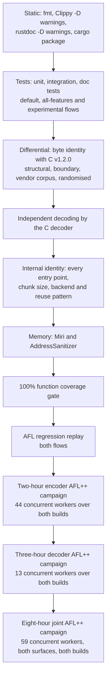

# Correctness proof

This document states what `mbrotli` claims about its output, how each claim
is checked by a machine, and the results of one complete run of every check
over both the standard and the `experimental` feature flows. "Proof" here
means layered, reproducible evidence against independent oracles, not a formal
verification: the encoder is compared byte for byte with the pinned C reference,
its streams are decoded by the reference decoder, its own entry points and SIMD
backends are compared with each other, its memory behaviour is checked under
Miri and AddressSanitizer, every function is required to execute under test,
and coverage-guided fuzz campaigns over both feature builds — most recently
eight hours across both surfaces at once, on top of the earlier two across the
encoder and three across the decoder — drive all of those oracles with
mutated inputs. Every command below runs from a
checkout; nothing in the record depends on a hosted service.

## What is claimed

| Surface | Claim | Oracle |
| --- | --- | --- |
| Default features, qualities 0–11, windows 10–24 | Byte identity with Google Brotli v1.2.0 as of upstream `master` `4508218e` (`brotli-ffi/vendor/brotli`, 2026-09-01) configured with equivalent streaming settings, and decodability by its decoder | C encoder and decoder through `google-brotli-ffi` |
| Large Window Brotli, qualities 3–11 | Decodable by the C decoder up to its 30-bit limit; above it, identical to the 30-bit stream apart from the header bits | C decoder; header comparison |
| Prepared prefix dictionaries, qualities 5–11 | Byte identity with C where C supports the same attachment, and C decoding with the dictionary attached | C encoder and decoder |
| Native decoder, any input bytes | A stream the C decoder accepts decodes to the same bytes and consumes the same prefix, or is refused by a declared resource budget; no input panics | C decoder through `google-brotli-ffi` |
| Native decoder, streaming | Chunked sessions agree with one-shot decoding on bytes, on cumulative progress, and on termination, at any chunk and output size | Cross-entry-point comparison |
| All serial entry points | Same bytes from `compress`, `compress_into`, `compress_to_slice`, `writer`, `reader`, and `start` at any chunk size, with any backend, from a fresh or reused compressor | Cross-API and cross-backend comparison |
| Parallel compression | One valid stream, deterministic across task counts | C decoder; cross-schedule comparison |
| `experimental`: serialized dictionaries, custom static encoding, continuations, framing | RFC 9841 conformance validated by the C parser and decoder built with `BROTLI_EXPERIMENTAL`, byte identity with C for continuations, and this crate's own fixtures | C decoder; fixtures |
| Memory safety | The library forbids `unsafe` code outside test modules; retained storage and streaming state are checked under Miri and AddressSanitizer | `#![forbid(unsafe_code)]`, Miri, ASan |

## Evidence layers



Each layer strengthens the one above it. Static checks and tests establish
that the code builds and behaves as documented. The differential tests make
the C encoder the oracle for the bytes, and decoding makes the C decoder the
oracle for validity even where byte identity is not claimed. Internal identity
tests turn one oracle-checked path into a check of every path. Miri and
AddressSanitizer look for what tests cannot see. The coverage gate ensures the
tests reach every function, and fuzzing removes the dependence on hand-chosen
inputs by mutating toward new code paths under the same oracles.

### Differential tests

| Test file | What it compares |
| --- | --- |
| `tests/differential_c.rs` | Structural corpora, boundary lengths, every window size, reused and reconfigured compressors against the C encoder |
| `tests/greedy_qualities.rs` | Qualities 2–9 byte for byte |
| `tests/vendor_corpus.rs` | Google's own test corpus, including a 12 MiB multi-fragment input, against the C encoder, through the C decoder, and across backends |
| `tests/randomized.rs` | Deterministically seeded structured inputs against the C encoder and decoder |
| `tests/large_window.rs`, `tests/window_bits.rs` | Large Window headers and bounds |
| `tests/dictionary.rs`, `tests/serialized_dictionary.rs`, `tests/stream_offset.rs` | Prefix dictionaries, serialized dictionaries and continuations against the C encoder and decoder |
| `tests/roundtrip.rs`, `tests/framing.rs`, `tests/parallel.rs` | Decoding of every quality, framing fixtures, and parallel stream validity |

### Internal identity tests

`tests/streaming.rs`, `tests/flush.rs`, `tests/reuse.rs`,
`tests/simd_backends.rs`, `tests/track_a_lifecycle.rs`, and
`tests/writer_faults.rs` check that chunk boundaries, destination shapes,
workspace reuse, backend selection, and misbehaving sinks never change the
bytes. `tests/compressor_memory.rs` and `tests/dictionary_memory.rs` check the
retention and preparation budgets with an accounting allocator.

### Fuzzing

The `fuzz/afl` package holds 30 AFL++ targets — 27 in a default build, three
more behind `experimental` — whose bodies are engine-neutral functions, so the
same code runs under the fuzzer and under `cargo afl test`, which replays the
committed regression corpus. The oracles are the ones above: bound, C decoding,
byte identity with C, cross-API and cross-backend identity, and typed refusals
where the API contract requires them. Seven of the targets drive the native
decoder instead, against the C decoder's typed outcome. The
[fuzzing specification](../architecture/fuzzing.md) describes each target's
input model and oracle.

Two builds are fuzzed. The `experimental` feature reaches into the encoder
(match finders, the high-quality search, and parameter resolution carry
`cfg(feature = "experimental")` branches), so the stable targets are fuzzed
once from a `--no-default-features` build and again from a
`--features experimental` build, alongside the experimental-only targets.
Two scripts divide the surface: `fuzz/afl/campaign.sh` runs the encoder targets
and `decode_roundtrip`, in sequence by default or together under
`CAMPAIGN_PARALLEL=1`, and `fuzz/afl/decoder-campaign.sh` runs the decoder
targets, both builds at once. Running one leaves the other's surface unfuzzed,
so a complete record needs both.

## Record: 2026-09-07

| Item | Value |
| --- | --- |
| Revision | `bcd9267` plus the working-tree changes in this record's commit |
| C reference | Google Brotli v1.2.0, submodule `028fb5a` at the time of this record; since moved to upstream `4508218e` |
| Host | Intel Core i7-13700KF, 24 hardware threads, 47 GiB, Ubuntu 22.04 under WSL2 |
| Stable toolchain | rustc 1.98.1 (2026-09-01), cargo 1.98.1 |
| Nightly toolchain | rustc 1.100.0-nightly (2026-09-05), Miri of the same date |
| Fuzzer | cargo-afl 0.18.2, AFL++ 4.40c, CmpLog, persistent mode with shared-memory test cases and a deferred forkserver |

### Static checks, tests, and memory checks

Both flows were run: "standard" means the default feature set or
`--no-default-features` where the package has no default, and "experimental"
means `--features experimental`. `--all-features` adds only `diagnostics` and
the profiling anchors on top of `experimental`.

| Check | Command | Standard | Experimental |
| --- | --- | --- | --- |
| Formatting | `cargo fmt --all -- --check` | pass | n/a |
| Lint | `cargo clippy --workspace --all-targets --all-features --locked -- -D warnings` | n/a | pass |
| Documentation | `RUSTDOCFLAGS='-D warnings' cargo doc --workspace --all-features --no-deps --locked` | n/a | pass |
| Packaging | `cargo package --allow-dirty --locked` | pass | n/a |
| Tests, debug | `cargo test --workspace --all-features --locked` | n/a | pass, 1006 tests |
| Tests, release | `cargo test --workspace --release --locked` and `--features experimental` | pass, 806 tests | pass, 1002 tests |
| Tests, release, all features | `cargo test --workspace --all-features --release --locked` | n/a | pass, 1006 tests |
| Function coverage | `CARGO_PROFILE_TEST_OPT_LEVEL=1 cargo llvm-cov --workspace --all-features --locked --html --fail-under-functions 100` | n/a | pass: 2259/2259 functions, 97.69% lines, 97.16% regions |
| Miri | `cargo +nightly miri test --lib` over the ring buffer, stream, hasher, fast-workspace and prefix-merge modules | pass (five groups, 39 tests) | n/a |
| AddressSanitizer | `RUSTFLAGS=-Zsanitizer=address cargo +nightly test --release --target x86_64-unknown-linux-gnu --test reuse --test writer_faults --test streaming --test simd_backends --test dictionary` | pass | pass |
| Fuzz package lint | `cargo clippy --all-targets --no-default-features [--features experimental] -- -D warnings` | pass | pass |
| Regression replay | `cargo afl test --no-default-features [--features experimental]` | pass (177 inputs, 21 targets) | pass (195 inputs, 23 targets) |

The Miri and Clippy invocations use the groups and feature configurations that
`.github/workflows` run. One Miri group had been naming a test that commit
`01a2684` deleted on 2026-09-06; `cargo miri test` exits successfully when a
filter matches nothing, so that step had been passing without interpreting
anything. The filters now name modules — the greedy hashers and the fast
encoder's workspace, which is where the deleted bucket-promotion test's
storage now lives — and this record's run interprets 39 tests.

### Fuzz campaign

```sh
cd fuzz/afl
./prepare-seeds.sh
cargo afl build --release --no-default-features --target-dir target/stable
TARGET_DIR=target/stable/release ./minimise-seeds.sh
CAMPAIGN_PARALLEL=1 ./campaign.sh findings/campaign-2026-09-07-2h 7200
```

Seed corpora after minimisation: `generic` 24 → 21, `params` 127 → 85,
`large_window` 508 → 101, `dictionary` 1016 → 90, `serialized` 16, and the
committed `compressor_lifecycle`, `framing` and `parallel` regression corpora.
Both phases ran at once, from 15:14:14Z to 17:17:24Z: 21 workers on the
`--no-default-features` build and 23 on the `--features experimental` build,
two hours each, 88 worker-hours over 24 hardware threads. Every worker used
CmpLog, a fixed thirty-second execution timeout, and no memory limit. Payloads
are capped at 128 KiB by the targets.

Executions per second are a floor, not a representative rate: 44 workers shared
24 hardware threads, and for the whole two hours the host also carried 23
workers left over from an earlier campaign, so about 67 AFL workers competed
for the machine. Oracle outcomes do not depend on that load; reached edges and
queue growth do.

#### stable build (21 workers)

| Target | Executions | Execs/s | Queue | Edges | Map | Stability | Crashes | Hangs |
| --- | ---: | ---: | ---: | ---: | ---: | ---: | ---: | ---: |
| `compressor_lifecycle` | 851,705 | 118 | 6 → 7678 | 17,606 | 10.44% | 99.99% | 0 | 0 |
| `dictionary` | 219,661 | 30 | 90 → 1779 | 29,391 | 17.38% | 99.99% | 0 | 0 |
| `differential_c` | 885,249 | 122 | 85 → 3715 | 24,643 | 14.65% | 99.99% | 0 | 0 |
| `large_window` | 183,395 | 25 | 101 → 1782 | 23,992 | 14.26% | 99.99% | 0 | 0 |
| `output_capacity` | 297,954 | 41 | 85 → 2524 | 28,483 | 16.92% | 99.99% | 0 | 0 |
| `parallel` | 172,419 | 23 | 9 → 2932 | 22,104 | 7.12% | 99.99% | 0 | 0 |
| `parameter_parsing` | 451,762 | 62 | 85 → 2261 | 19,240 | 11.44% | 99.99% | 0 | 0 |
| `params_roundtrip` | 238,992 | 33 | 85 → 2399 | 24,302 | 14.45% | 99.99% | 0 | 0 |
| `q0_roundtrip` | 2,383,759 | 331 | 21 → 1241 | 3,552 | 2.11% | 99.94% | 0 | 0 |
| `q10_roundtrip` | 12,522 | 1 | 21 → 879 | 6,952 | 4.14% | 99.97% | 0 | 0 |
| `q11_roundtrip` | 12,087 | 1 | 21 → 505 | 7,050 | 4.19% | 99.97% | 0 | 0 |
| `q1_roundtrip` | 2,934,251 | 407 | 21 → 1673 | 3,821 | 2.27% | 99.95% | 0 | 0 |
| `q3_roundtrip` | 609,418 | 84 | 21 → 951 | 2,468 | 1.47% | 99.92% | 0 | 0 |
| `q4_roundtrip` | 410,620 | 57 | 21 → 1047 | 3,518 | 2.09% | 99.94% | 0 | 0 |
| `q5_roundtrip` | 316,880 | 44 | 21 → 1389 | 4,369 | 2.60% | 99.95% | 0 | 0 |
| `q6_roundtrip` | 192,006 | 26 | 21 → 1300 | 4,374 | 2.60% | 99.95% | 0 | 0 |
| `q7_roundtrip` | 123,652 | 17 | 21 → 1139 | 3,818 | 2.27% | 99.95% | 0 | 0 |
| `q8_roundtrip` | 248,368 | 34 | 21 → 1074 | 3,865 | 2.30% | 99.95% | 0 | 0 |
| `q9_roundtrip` | 98,558 | 13 | 21 → 1083 | 3,685 | 2.19% | 99.95% | 0 | 0 |
| `simd_equivalence` | 295,564 | 41 | 85 → 2696 | 37,338 | 22.21% | 99.99% | 0 | 0 |
| `streaming_equivalence` | 298,745 | 41 | 85 → 2194 | 26,711 | 15.81% | 99.99% | 0 | 0 |

#### experimental build (23 workers)

| Target | Executions | Execs/s | Queue | Edges | Map | Stability | Crashes | Hangs |
| --- | ---: | ---: | ---: | ---: | ---: | ---: | ---: | ---: |
| `compressor_lifecycle` | 996,051 | 138 | 6 → 8247 | 18,842 | 10.96% | 99.99% | 0 | 0 |
| `dictionary` | 223,876 | 31 | 90 → 2256 | 28,620 | 16.44% | 99.99% | 0 | 0 |
| `differential_c` | 566,657 | 78 | 85 → 3122 | 24,481 | 14.27% | 99.99% | 0 | 0 |
| `framing` | 1,111,385 | 154 | 2 → 1689 | 3,849 | 2.22% | 99.95% | 0 | 0 |
| `large_window` | 57,771 | 8 | 101 → 1123 | 21,636 | 12.60% | 99.99% | 0 | 0 |
| `output_capacity` | 387,395 | 53 | 85 → 2600 | 29,063 | 16.93% | 99.99% | 0 | 0 |
| `parallel` | 171,904 | 23 | 9 → 2881 | 22,185 | 7.00% | 99.99% | 0 | 0 |
| `parameter_parsing` | 383,599 | 53 | 85 → 2141 | 19,237 | 11.22% | 99.99% | 0 | 0 |
| `params_roundtrip` | 268,643 | 37 | 85 → 2174 | 24,831 | 14.48% | 99.99% | 0 | 0 |
| `q0_roundtrip` | 1,754,358 | 243 | 21 → 1151 | 3,543 | 2.07% | 99.94% | 0 | 0 |
| `q10_roundtrip` | 13,032 | 1 | 21 → 934 | 6,963 | 4.06% | 99.97% | 0 | 0 |
| `q11_roundtrip` | 8,637 | 1 | 21 → 470 | 7,065 | 4.12% | 99.97% | 0 | 0 |
| `q1_roundtrip` | 3,714,798 | 515 | 21 → 1530 | 3,522 | 2.05% | 99.94% | 0 | 0 |
| `q3_roundtrip` | 527,546 | 73 | 21 → 879 | 2,468 | 1.44% | 99.92% | 0 | 0 |
| `q4_roundtrip` | 516,785 | 71 | 21 → 1115 | 3,516 | 2.05% | 99.94% | 0 | 0 |
| `q5_roundtrip` | 271,384 | 37 | 21 → 1323 | 4,391 | 2.56% | 99.95% | 0 | 0 |
| `q6_roundtrip` | 244,865 | 34 | 21 → 1441 | 4,403 | 2.57% | 99.95% | 0 | 0 |
| `q7_roundtrip` | 128,904 | 17 | 21 → 1096 | 3,849 | 2.24% | 99.95% | 0 | 0 |
| `q8_roundtrip` | 152,805 | 21 | 21 → 1094 | 3,883 | 2.26% | 99.95% | 0 | 0 |
| `q9_roundtrip` | 66,258 | 9 | 21 → 974 | 3,702 | 2.16% | 99.95% | 0 | 0 |
| `serialized_dictionary` | 890,924 | 123 | 15 → 2434 | 8,819 | 5.04% | 99.98% | 0 | 0 |
| `simd_equivalence` | 328,161 | 45 | 85 → 3054 | 37,668 | 21.97% | 99.99% | 0 | 0 |
| `streaming_equivalence` | 263,084 | 36 | 85 → 2064 | 27,042 | 15.70% | 99.99% | 0 | 0 |

| Build | Workers | Executions | Queue | Crashes | Hangs | Timeouts |
| --- | ---: | ---: | ---: | ---: | ---: | ---: |
| stable | 21 | 11,237,567 | 947 → 42,241 | 0 | 0 | 0 |
| experimental | 23 | 13,048,822 | 964 → 45,792 | 0 | 0 | 0 |
| both | 44 | 24,286,389 | 1,911 → 88,033 | 0 | 0 | 0 |

**Result.** No worker saved a crash, a hang, or a timeout. Every oracle held
over 24.3 million executions: the size bound, decoding by the C decoder, byte
identity with the C encoder under equivalent streaming settings, agreement
between every entry point, chunk schedule and SIMD backend, and the typed
refusals the API contract requires. Per-worker stability stayed at or above
99.92%, so the instrumentation saw deterministic executions rather than
run-to-run variation that would blunt the coverage feedback. The queue grew
from 1,911 seeds to 88,033 saved inputs, and the map density column shows how
far each target's exploration reached.

**Timeouts.** This run replaces an earlier six-hour campaign that used a fixed
ten-second timeout and saved 45 hangs, all in the targets that compress a
128 KiB payload several times per execution — `simd_equivalence` and
`streaming_equivalence` across backends and entry points, `output_capacity`
twice per buffer shape, `dictionary` and `large_window` at quality 10 and 11.
Each was a slow execution rather than a non-terminating one: the earlier
record measured one such input at 7.4 s standalone on the instrumented binary,
against 0.15 s for the uninstrumented C encoder in the same process.
`campaign.sh` now defaults to a thirty-second timeout, which is what this run
used, and under a load at least as heavy — the earlier campaign's second phase
was still running throughout — nothing reached it.

**Harness finding, carried over.** The earlier campaign's only crashes were one
assertion in the fuzz harness, not in the encoder: the `dictionary` target
asserted that a request for more than fifteen attachments had been refused,
while a payload shorter than the request, or one the rounded-up cut stride does
not divide, yields fewer attachments than requested, and the builder correctly
accepted those. The assertion now keys on the number actually attached, and two
minimised inputs are committed as `fuzz/afl/regressions/dictionary/crash-*.bin`,
which this record's regression replay executes in both flows.

## Record: 2026-09-10, decoder campaign

This record covers the native decoder. The encoder record above still stands;
nothing in this run changed encoder code.

| Item | Value |
| --- | --- |
| Revision | `438666b` plus this record's commit |
| C reference | Google Brotli v1.2.0, upstream `4508218e` (`brotli-ffi/vendor/brotli`) |
| Host | Intel Core i7-13700KF, 24 hardware threads, 47 GiB, Ubuntu 22.04 under WSL2 |
| Stable toolchain | rustc 1.98.1 (2026-09-01), cargo 1.98.1 |
| Fuzzer | cargo-afl 0.18.2, AFL++ 4.40c, CmpLog, persistent mode with shared-memory test cases and a deferred forkserver |

### What ran

```sh
cd fuzz/afl
./prepare-decoder-seeds.sh
cargo afl build --release --no-default-features --target-dir target/stable
cargo afl build --release --no-default-features --features experimental \
    --target-dir target/experimental
SEED_ROOT=seeds/decoder-cmin ./decoder-campaign.sh findings/decoder-3h 10800
```

Thirteen workers, all at once on 24 hardware threads: six decoder targets from
the `--no-default-features` build and seven from the `--features experimental`
build, three hours each, 39 worker-hours. Every worker used CmpLog, a fixed
five-second execution timeout, and no memory limit. Payloads are capped at
128 KiB by the targets and decoded output at 64 KiB.

### The defect this campaign found

A first campaign, from the committed corpora, saved its first crash after seven
minutes and 32 in the hour before it was stopped, spread over `decompress`,
`decode_dictionary`, `decode_io_limits` and `decode_serialized` in both builds.
Every one of them was the same defect, and it was in the decoder rather than in
the harness.

A built-in dictionary word whose transform consumes the whole word decodes to
no bytes at all — transform 42, `OmitLast4`, over a four-byte word. RFC 7932
rejects an empty transformed word only for distance codes at or below 120, and
the C decoder accepts one above that, advancing its position by zero. So did
this decoder, except that the ring write derived its wrap mask as
`ring.len() - 1` before testing whether it had anything to store. As a member's
first command nothing has been written yet, the history ring is still
unallocated, and `0usize - 1` underflowed.

The fix derives the mask only after an empty write has returned. The other
eight ring-mask derivations in `core::stream` are each dominated by a guard
that implies a non-empty ring — a non-zero pending region, a position of at
least two, a non-zero insert, a growth call for at least one byte, or a
distance within the bytes already produced — so this was the only site that
could reach an unallocated ring.

`tests/decompress_wire.rs` reproduces it without AFL: a hand-assembled member
whose single command is that dictionary reference, padded so the whole-word bit
reservoir decodes it in the command fast path rather than byte by byte through
the stage machine. The test fails before the fix and passes after it. Three
minimised inputs are committed as
`fuzz/afl/regressions/{decompress,decode_dictionary,decode_io_limits}/crash-zero-length-dictionary-word.bin`,
which `cargo afl test` replays in both flows.

The campaign below is the rerun against the fixed decoder. Its seeds are the
`cargo afl cmin` reduction of the first campaign's queues, so the three hours
extend that exploration instead of re-deriving it.

### Static checks and tests

| Check | Command | Standard | Experimental |
| --- | --- | --- | --- |
| Formatting | `cargo fmt --all -- --check` | pass | n/a |
| Lint | `cargo clippy --workspace --all-targets --all-features --locked -- -D warnings` | n/a | pass |
| Tests, all features | `cargo test --workspace --all-features --locked` | n/a | pass, 234 tests |
| Tests, default features | `cargo test --workspace --locked` | pass, 928 tests | n/a |
| Tests, experimental | `cargo test --workspace --features experimental --locked` | n/a | pass, 1131 tests |
| Fuzz package lint | `cargo clippy --all-targets --no-default-features [--features experimental] -- -D warnings` | pass | pass |
| Regression replay | `cargo afl test --no-default-features [--features experimental]` | pass (206 inputs, 27 targets) | pass (227 inputs, 30 targets) |
| Decoder function coverage | `cargo llvm-cov --lib --test decompress[...] --summary-only` | pass: `decompressor/core/stream.rs` 55/55 functions, 92.10% regions, 93.89% lines | n/a |

`--all-features` runs far fewer tests than the default feature set, because it
enables `no_std` alongside `std`, and the integration suites that need `std`
carry `#![cfg(not(feature = "no_std"))]`. The 234 tests it executes are the
ones that survive that gate, so it is the narrowest of the three test rows
rather than the widest; the default and `experimental` rows above are what
cover the decoder's std-facing surface. The function-coverage gate inherits the
same narrowing, which is why the decoder's coverage above was measured with the
default feature set instead.

### Fuzz campaign

#### stable build (6 workers)

| Target | Executions | Execs/s | Queue | Edges | Map | Stability | Crashes | Hangs |
| --- | ---: | ---: | ---: | ---: | ---: | ---: | ---: | ---: |
| `decode_dictionary` | 47,230,961 | 4373 | 518 → 900 | 2,356 | 45.29% | 99.92% | 0 | 0 |
| `decode_io_limits` | 46,559,148 | 4311 | 436 → 661 | 2,427 | 44.85% | 99.92% | 0 | 0 |
| `decode_lifecycle` | 76,204,631 | 7056 | 65 → 65 | 419 | 8.24% | 99.52% | 0 | 0 |
| `decode_roundtrip` | 480,501 | 44 | 287 → 657 | 2,132 | 40.52% | 99.91% | 0 | 0 |
| `decode_streaming` | 6,421,661 | 595 | 346 → 810 | 2,322 | 44.92% | 99.91% | 0 | 0 |
| `decompress` | 35,733,688 | 3309 | 401 → 541 | 2,347 | 45.70% | 99.91% | 0 | 0 |


#### experimental build (7 workers)

| Target | Executions | Execs/s | Queue | Edges | Map | Stability | Crashes | Hangs |
| --- | ---: | ---: | ---: | ---: | ---: | ---: | ---: | ---: |
| `decode_dictionary` | 21,557,386 | 1996 | 517 → 961 | 2,434 | 41.44% | 99.92% | 0 | 0 |
| `decode_io_limits` | 42,441,749 | 3930 | 399 → 664 | 2,431 | 43.16% | 99.92% | 0 | 0 |
| `decode_lifecycle` | 75,550,197 | 6995 | 68 → 68 | 419 | 7.91% | 99.52% | 0 | 0 |
| `decode_roundtrip` | 847,615 | 78 | 260 → 732 | 2,149 | 39.24% | 99.91% | 0 | 0 |
| `decode_serialized` | 73,043,925 | 6763 | 552 → 880 | 2,787 | 48.12% | 99.93% | 0 | 0 |
| `decode_streaming` | 7,370,520 | 682 | 372 → 780 | 2,343 | 43.54% | 99.91% | 0 | 0 |
| `decompress` | 35,589,543 | 3295 | 392 → 612 | 2,363 | 44.18% | 99.92% | 0 | 0 |


| Build | Workers | Executions | Queue | Crashes | Hangs | Timeouts |
| --- | ---: | ---: | ---: | ---: | ---: | ---: |
| stable | 6 | 212,630,590 | 2,053 → 3,634 | 0 | 0 | 0 |
| experimental | 7 | 256,400,935 | 2,560 → 4,697 | 0 | 0 | 0 |
| both | 13 | 469,031,525 | 4,613 → 8,331 | 0 | 0 | 0 |

**Result.** No worker saved a crash, a hang, or a timeout in 469 million
executions over 26,350 completed queue cycles. Every decoder oracle held: the
C decoder's typed outcome for arbitrary bytes, exact member consumption, an
unlimited replay of every accepted stream, chunked sessions agreeing with
one-shot decoding on bytes and on cumulative progress, attached raw and
serialized dictionaries against C with the same attachment, lifecycle recovery
after abandonment, and a retryable sink failure that may neither duplicate nor
drop payload. Per-worker stability stayed at or above 99.52%, so the
instrumentation saw deterministic executions.

Execution rates differ by two orders of magnitude across targets because the
work per iteration does. `decode_lifecycle` runs up to 256 tiny operations on
a decoder that never decodes a real member; `decode_roundtrip` compresses a
payload of up to 64 KiB with the C encoder before decoding it, and at quality
11 that dominates the iteration. Queue growth, not the rate, is what shows how
far each target's exploration reached: `decode_lifecycle`'s corpus was already
saturated at 65 inputs and never grew, while every target reading a compressed
member kept finding new coverage for the whole three hours.

### Benchmarks

The fix adds one branch to the ring write, which raw meta-blocks, prefix runs
and dictionary words all pass through, so it was measured rather than assumed.
Criterion ran `decompress/{reused,dictionary}/q{5,9}` on the fixed tree, then
again with the guard removed and compared against that baseline, on an idle
host after the campaign:

```sh
cargo bench --bench decompress --locked -- --save-baseline fixed \
    'decompress/(dictionary|reused)/q(5|9)'
# with the two-line guard removed:
cargo bench --bench decompress --locked -- --baseline fixed \
    'decompress/(dictionary|reused)/q(5|9)'
```

Across the 24 `mbrotli` cases the median difference was -0.20% and the mean
-0.40%, spread from -5.91% to +2.33%. The sign goes both ways and the two
largest positive differences say the build *without* the guard was slower,
which no single predictable branch can cause, so the spread is run-to-run
variation rather than a cost. The guard is not measurable at this resolution,
which is what the call sites predict: it is one test per ring write, and the
writes it can reject are the ones that would have copied nothing.


## Record: 2026-09-11, eight-hour encoder and decoder campaign

This record covers both surfaces in one run: the encoder campaign and the
decoder campaign ran side by side for eight hours each, against the tree at
`f936968`, the commit that landed the large-file decoder work. The two records
above still stand; this one extends them and reports the one defect the run
found, which this record's commit fixes.

| Item | Value |
| --- | --- |
| Revision fuzzed | `f936968` |
| Revision recorded | `f936968` plus this record's commit, which carries the fix, its regression test and these documents |
| C reference | Google Brotli v1.2.0, upstream `4508218e` (`brotli-ffi/vendor/brotli`) |
| Host | Intel Core i7-13700KF, 24 hardware threads, 47 GiB, Ubuntu 22.04 under WSL2 |
| Stable toolchain | rustc 1.98.1 (2026-09-01), cargo 1.98.1 |
| Fuzzer | cargo-afl 0.18.2, AFL++ 4.40c, CmpLog, persistent mode with shared-memory test cases and a deferred forkserver |

### What ran

```sh
cd fuzz/afl
cargo afl build --release --no-default-features --target-dir target/stable
cargo afl build --release --no-default-features --features experimental \
    --target-dir target/experimental
CAMPAIGN_PARALLEL=1 ./campaign.sh findings/campaign-2026-09-10-8h 28800 &
SEED_ROOT=seeds/decoder-cmin ./decoder-campaign.sh findings/decoder-2026-09-10-8h 28800 &
wait
```

Fifty-nine workers at once on 24 hardware threads, from 2026-09-10T20:12:38Z to
2026-09-11T04:15:36Z: 46 encoder workers — 22 from the `--no-default-features`
build and 24 from the `--features experimental` build — and 13 decoder workers,
six and seven. Eight hours each, 472 worker-hours. Every worker used CmpLog and
no memory limit, with a fixed timeout of thirty seconds for the encoder targets
and five for the decoder ones. Payloads are capped at 128 KiB by the targets
and decoded output at 64 KiB.

The encoder seeds are the committed corpora minimised by `minimise-seeds.sh`
and the committed regression corpora, as in the 2026-09-07 record. The decoder
seeds are `seeds/decoder-cmin`, the `cargo afl cmin` reduction carried forward
from the 2026-09-10 decoder campaign, so those thirteen workers extended that
exploration rather than re-deriving it.

Executions per second are a floor rather than a representative rate: 59 workers
shared 24 hardware threads, about 2.5 workers per thread for the whole run.
Oracle outcomes do not depend on that load; reached edges and queue growth do.

### The defect this campaign found

Nothing crashed. Every one of the nineteen saved hangs, and all twenty-eight
executions that reached the thirty-second timeout, came from `large_window` —
ten hangs and fourteen timeouts in the stable build, nine and fourteen in the
experimental one. The decoder campaign saved neither a crash, a hang, nor a
timeout in 786 million executions.

The hangs are one input class: quality ten or eleven, a declared window of at
least thirty bits, a pinned sixteen-bit block size, and a payload longer than
that block. AFL reached it from both directions — a 65,679-byte input declaring
window 44, and a 131,328-byte one declaring window 62; the encoder caps both at
thirty bits.

A payload longer than one input block makes the first `process` call non-final,
so `BinaryTreeMatcher::prepare` takes the reference's non-one-shot branch and
sizes the match forest by the window rather than by the payload: `2 << 30`
links, 8 GiB. The reference's `HashMemAllocInBytes`
(`c/enc/hash_to_binary_tree_inc.h`) computes the same number, so the
*reservation* was never a divergence. What it did with it was: the forest was
grown with `Vec::resize`, which writes every link, so all 8 GiB became resident
— about 10.5 million minor page faults and 15.5 s of kernel time to compress
64 KiB — while the reference allocates the same reservation and never touches
its pages. A stream that is not one final block reads almost none of those
links.

The fix takes the forest from the allocator's zeroing path instead, releasing
the previous one first, so the pages arrive zeroed from the operating system
and are faulted in only as the forest is used. Nothing is lost by dropping the
old allocation: `prepare` has just reset every bucket to the empty marker, so
no chain reaches a node from a previous stream.

Measured on the idle host, release with debug info, quality 10, window 30,
block bits 16, and a payload of 65,672 bytes — one byte over the block:

| | Time | Peak RSS |
| --- | ---: | ---: |
| `mbrotli`, before | 8.17 s | 8,197 MiB |
| `mbrotli`, after | 8.03 ms | 6 MiB |
| C reference, same streaming settings | 36.8 ms | 5 MiB |

The same payload at 65,536 bytes — exactly one block, so the one-shot branch
applies — always took 23 ms and 6 MiB, before the fix as well; so did the
default block size, which is wide enough that the payload fits one block. That
is what made the class so narrow, and what an eight-hour run found that shorter
ones had not.

`tests/hq_forest_allocation.rs` pins it without AFL. A global allocator that
counts large `alloc` and `alloc_zeroed` requests separately compresses one byte
over a pinned block at quality ten with a twenty-four-bit window, where the
forest is a single 128 MiB request: it must arrive zeroed, and no plain
allocation of that size may be made. The test fails before the fix and passes
after it. A twenty-four-bit window keeps the reservation modest while
exercising the same branch, so the test costs nothing to run.

**Carried over.** The six-hour campaign of 2026-09-07 saved hangs in
`large_window` at qualities ten and eleven too, and the record attributed them
to slow compression, measuring one input at 7.4 s standalone. That measurement
was right and the attribution was wrong: the seconds were kernel time spent
faulting in a forest, not search. The two-hour campaign that replaced it saved
no hangs, which the record read as the thirty-second timeout being the right
one. Either explanation fits what was recorded — the class stayed under the
new threshold, or those two hours never reached the combination — and neither
was checked, because a hang already explained is one nobody measures again.

### Fuzz campaign
#### encoder campaign, stable build (22 workers)

| Target | Executions | Execs/s | Queue | Edges | Map | Stability | Crashes | Hangs |
| --- | ---: | ---: | ---: | ---: | ---: | ---: | ---: | ---: |
| `compressor_lifecycle` | 5,117,245 | 178 | 7 → 13,062 | 22,117 | 21.21% | 99.99% | 0 | 0 |
| `decode_roundtrip` | 668,216 | 23 | 85 → 987 | 2,212 | 40.73% | 99.91% | 0 | 0 |
| `dictionary` | 1,105,452 | 38 | 90 → 4,431 | 31,593 | 30.13% | 99.99% | 0 | 0 |
| `differential_c` | 2,203,231 | 76 | 85 → 6,568 | 25,448 | 24.50% | 99.99% | 0 | 0 |
| `large_window` | 389,149 | 14 | 101 → 3,783 | 18,257 | 17.55% | 99.99% | 0 | 10 |
| `output_capacity` | 1,484,252 | 52 | 85 → 6,030 | 30,127 | 28.96% | 99.99% | 0 | 0 |
| `parallel` | 660,784 | 23 | 9 → 4,792 | 15,425 | 8.31% | 99.99% | 0 | 0 |
| `parameter_parsing` | 689,023 | 24 | 85 → 3,791 | 20,863 | 20.09% | 99.99% | 0 | 0 |
| `params_roundtrip` | 897,117 | 31 | 85 → 5,005 | 25,776 | 24.81% | 99.99% | 0 | 0 |
| `q0_roundtrip` | 13,340,510 | 463 | 21 → 1,683 | 3,704 | 3.57% | 99.95% | 0 | 0 |
| `q10_roundtrip` | 58,572 | 2 | 21 → 1,964 | 7,017 | 6.76% | 99.97% | 0 | 0 |
| `q11_roundtrip` | 19,382 | 1 | 21 → 1,213 | 7,087 | 6.83% | 99.97% | 0 | 0 |
| `q1_roundtrip` | 25,480,979 | 885 | 21 → 1,999 | 4,145 | 3.99% | 99.95% | 0 | 0 |
| `q3_roundtrip` | 3,306,151 | 115 | 21 → 1,145 | 2,486 | 2.39% | 99.92% | 0 | 0 |
| `q4_roundtrip` | 1,585,337 | 55 | 21 → 1,273 | 3,522 | 3.39% | 99.94% | 0 | 0 |
| `q5_roundtrip` | 1,310,097 | 45 | 21 → 1,524 | 4,378 | 4.22% | 99.95% | 0 | 0 |
| `q6_roundtrip` | 1,094,374 | 38 | 21 → 1,462 | 4,390 | 4.23% | 99.95% | 0 | 0 |
| `q7_roundtrip` | 752,157 | 26 | 21 → 1,152 | 3,871 | 3.73% | 99.95% | 0 | 0 |
| `q8_roundtrip` | 598,050 | 21 | 21 → 1,143 | 3,868 | 3.73% | 99.95% | 0 | 0 |
| `q9_roundtrip` | 424,677 | 15 | 21 → 1,208 | 3,722 | 3.58% | 99.95% | 0 | 0 |
| `simd_equivalence` | 887,527 | 31 | 85 → 5,385 | 25,253 | 24.32% | 99.99% | 0 | 0 |
| `streaming_equivalence` | 719,914 | 25 | 85 → 4,219 | 28,406 | 27.15% | 99.99% | 0 | 0 |


#### encoder campaign, experimental build (24 workers)

| Target | Executions | Execs/s | Queue | Edges | Map | Stability | Crashes | Hangs |
| --- | ---: | ---: | ---: | ---: | ---: | ---: | ---: | ---: |
| `compressor_lifecycle` | 4,255,723 | 148 | 7 → 12,890 | 22,406 | 21.11% | 99.99% | 0 | 0 |
| `decode_roundtrip` | 559,996 | 19 | 85 → 985 | 2,232 | 39.48% | 99.91% | 0 | 0 |
| `dictionary` | 657,691 | 23 | 90 → 4,527 | 31,510 | 29.08% | 99.99% | 0 | 0 |
| `differential_c` | 1,598,096 | 55 | 85 → 5,547 | 25,251 | 23.88% | 99.99% | 0 | 0 |
| `framing` | 1,943,262 | 67 | 2 → 1,777 | 3,847 | 3.57% | 99.95% | 0 | 0 |
| `large_window` | 674,724 | 23 | 101 → 3,426 | 18,352 | 17.33% | 99.99% | 0 | 9 |
| `output_capacity` | 515,023 | 18 | 85 → 4,750 | 29,142 | 27.52% | 99.99% | 0 | 0 |
| `parallel` | 501,145 | 17 | 9 → 4,450 | 15,514 | 8.21% | 99.99% | 0 | 0 |
| `parameter_parsing` | 2,026,333 | 70 | 85 → 5,779 | 24,317 | 23.00% | 99.99% | 0 | 0 |
| `params_roundtrip` | 872,402 | 30 | 85 → 5,571 | 25,923 | 24.51% | 99.99% | 0 | 0 |
| `q0_roundtrip` | 13,454,179 | 467 | 21 → 1,685 | 3,705 | 3.51% | 99.95% | 0 | 0 |
| `q10_roundtrip` | 30,870 | 1 | 21 → 1,700 | 7,031 | 6.65% | 99.97% | 0 | 0 |
| `q11_roundtrip` | 19,795 | 1 | 21 → 1,150 | 7,099 | 6.72% | 99.97% | 0 | 0 |
| `q1_roundtrip` | 27,506,851 | 955 | 21 → 2,035 | 4,144 | 3.92% | 99.95% | 0 | 0 |
| `q3_roundtrip` | 1,829,383 | 64 | 21 → 1,012 | 2,472 | 2.34% | 99.92% | 0 | 0 |
| `q4_roundtrip` | 1,488,652 | 52 | 21 → 1,205 | 3,516 | 3.33% | 99.94% | 0 | 0 |
| `q5_roundtrip` | 1,224,516 | 43 | 21 → 1,471 | 4,404 | 4.17% | 99.95% | 0 | 0 |
| `q6_roundtrip` | 924,182 | 32 | 21 → 1,406 | 4,410 | 4.17% | 99.95% | 0 | 0 |
| `q7_roundtrip` | 574,523 | 20 | 21 → 1,105 | 3,889 | 3.68% | 99.95% | 0 | 0 |
| `q8_roundtrip` | 505,650 | 18 | 21 → 1,147 | 3,887 | 3.68% | 99.95% | 0 | 0 |
| `q9_roundtrip` | 369,512 | 13 | 21 → 1,172 | 3,762 | 3.56% | 99.95% | 0 | 0 |
| `serialized_dictionary` | 2,814,241 | 98 | 16 → 3,881 | 9,505 | 8.69% | 99.98% | 0 | 0 |
| `simd_equivalence` | 814,938 | 28 | 85 → 5,455 | 25,050 | 23.70% | 99.99% | 0 | 0 |
| `streaming_equivalence` | 602,145 | 21 | 85 → 4,316 | 28,577 | 26.84% | 99.99% | 0 | 0 |


#### decoder campaign, stable build (6 workers)

| Target | Executions | Execs/s | Queue | Edges | Map | Stability | Crashes | Hangs |
| --- | ---: | ---: | ---: | ---: | ---: | ---: | ---: | ---: |
| `decode_dictionary` | 29,022,824 | 1008 | 518 → 949 | 2,495 | 46.49% | 99.92% | 0 | 0 |
| `decode_io_limits` | 76,689,580 | 2663 | 436 → 708 | 2,518 | 45.09% | 99.92% | 0 | 0 |
| `decode_lifecycle` | 139,004,201 | 4827 | 65 → 65 | 322 | 6.11% | 99.38% | 0 | 0 |
| `decode_roundtrip` | 351,531 | 12 | 287 → 704 | 2,209 | 40.67% | 99.91% | 0 | 0 |
| `decode_streaming` | 6,761,851 | 235 | 346 → 773 | 2,396 | 44.84% | 99.92% | 0 | 0 |
| `decompress` | 70,145,286 | 2436 | 401 → 556 | 2,429 | 45.84% | 99.92% | 0 | 0 |


#### decoder campaign, experimental build (7 workers)

| Target | Executions | Execs/s | Queue | Edges | Map | Stability | Crashes | Hangs |
| --- | ---: | ---: | ---: | ---: | ---: | ---: | ---: | ---: |
| `decode_dictionary` | 31,051,685 | 1078 | 517 → 1,020 | 2,531 | 41.87% | 99.92% | 0 | 0 |
| `decode_io_limits` | 71,582,797 | 2486 | 399 → 709 | 2,537 | 43.64% | 99.92% | 0 | 0 |
| `decode_lifecycle` | 144,644,565 | 5022 | 68 → 68 | 322 | 5.87% | 99.38% | 0 | 0 |
| `decode_roundtrip` | 467,365 | 16 | 260 → 753 | 2,232 | 39.48% | 99.91% | 0 | 0 |
| `decode_serialized` | 148,052,747 | 5141 | 552 → 960 | 2,882 | 48.32% | 99.93% | 0 | 0 |
| `decode_streaming` | 5,125,101 | 178 | 372 → 767 | 2,437 | 43.82% | 99.92% | 0 | 0 |
| `decompress` | 63,427,246 | 2202 | 392 → 663 | 2,457 | 44.53% | 99.92% | 0 | 0 |

| Campaign | Build | Workers | Executions | Queue | Crashes | Hangs | Timeouts |
| --- | --- | ---: | ---: | ---: | ---: | ---: | ---: |
| encoder | stable | 22 | 62,792,196 | 1,033 → 73,819 | 0 | 10 | 14 |
| encoder | experimental | 24 | 65,763,832 | 1,051 → 78,442 | 0 | 9 | 14 |
| decoder | stable | 6 | 321,975,273 | 2,053 → 3,755 | 0 | 0 | 0 |
| decoder | experimental | 7 | 464,351,506 | 2,560 → 4,940 | 0 | 0 | 0 |
| all | both | 59 | 914,882,807 | 6,697 → 160,956 | 0 | 19 | 28 |

**Result.** No worker saved a crash in 914.9 million executions over 19,335
completed queue cycles, and the only hangs and timeouts are the `large_window`
class above. Every oracle held: the size bound, decoding by the C decoder, byte
identity with the C encoder under equivalent streaming settings, agreement
between every entry point, chunk schedule and SIMD backend, the typed refusals
the API contract requires, the C decoder's typed outcome for arbitrary bytes,
exact member consumption, chunked sessions agreeing with one-shot decoding on
bytes and on cumulative progress, attached raw and serialized dictionaries
against C, lifecycle recovery after abandonment, and a retryable sink failure
that may neither duplicate nor drop payload. Per-worker stability stayed at or
above 99.38%, so the instrumentation saw deterministic executions rather than
run-to-run variation that would blunt the coverage feedback.

The encoder queue grew from 2,084 seeds to 152,261 saved inputs, 1.7 times what
the two-hour campaign reached, and in the stable build `compressor_lifecycle`,
`differential_c`, `output_capacity`, `params_roundtrip` and `simd_equivalence`
each passed 5,000 saved inputs. The
decoder queue grew from 4,613 to 8,695 on top of a corpus that was already the
minimised product of an earlier campaign; its targets completed 19,276 cycles
between them, so that surface is closer to saturation than the encoder's, where
the slowest targets had not finished a first cycle.

### Static checks and tests

Run on the fixed tree, after the campaign.

| Check | Command | Standard | Experimental |
| --- | --- | --- | --- |
| Formatting | `cargo fmt --all -- --check` | pass | n/a |
| Lint | `cargo clippy --workspace --all-targets --all-features --locked -- -D warnings` | n/a | pass |
| Tests, default features | `cargo test --workspace --locked` | pass, 929 tests | n/a |
| Tests, experimental | `cargo test --workspace --features experimental --locked` | n/a | pass, 1132 tests |
| Tests, all features | `cargo test --workspace --all-features --locked` | n/a | pass, 234 tests |
| Tests, release, per binary | `cargo test --release --locked --test <each> --lib --doc`, and the `experimental` suites the same way | pass, 927 tests | pass, 901 tests |
| Function coverage | `CARGO_PROFILE_TEST_OPT_LEVEL=1 cargo llvm-cov --workspace --locked --summary-only --fail-under-functions 100` | pass: 2173/2173 functions, 96.80% regions, 97.58% lines | n/a |
| Match finder coverage | `cargo llvm-cov --locked --lib --test hq_forest_allocation --test simd_backends --test differential_c --summary-only` | pass: `compressor/core/hq/h10.rs` 70/70 functions, 97.49% regions, 98.73% lines | n/a |
| Fuzz package lint | `cargo clippy --all-targets --no-default-features [--features experimental] -- -D warnings` | pass | pass |
| Regression replay | `cargo afl test --no-default-features [--features experimental]` | pass (209 inputs, 27 targets) | pass (230 inputs, 30 targets) |

The three workspace rows were run before the `standard_table` unit test below
was added; the release row was run after it, one test binary at a time, and is
the one that covers the tree exactly as this record leaves it. Slicing it was a
host constraint rather than a methodological choice: after eight hours of
fuzzing the machine held 30 GiB of page cache, and whole-workspace runs were
killed by the sandbox's memory guard while individual binaries were not. The
experimental column of that row counts the four `experimental`-gated suites plus
the library and documentation tests in that configuration.

As the 2026-09-10 record explains, `--all-features` enables `no_std` alongside
`std` and so compiles out the integration suites that need `std`; its 234 tests
are the narrowest of the three rows, not the widest. The new
`tests/hq_forest_allocation.rs` runs in all three.

The function-coverage gate is therefore recorded with the default feature set,
which is the configuration that executes the std-facing suites. Run with
`--all-features` it reports eleven functions unexecuted, and all eleven are
executed in the row above; they are reached only by suites `no_std` compiles
out. The gate also found one genuine gap, unrelated to the campaign:
`decompressor::core::distance::standard_table` is evaluated at compile time to
build `STANDARD_TABLE`, so nothing ever ran it. A unit test now calls it and
pins the constant to the layout it claims to copy, which is a check worth
having on its own and not only a coverage formality.

### Verification rerun

Both `large_window` workers were rerun against the fixed build, from a corpus
of the 101 minimised `seeds/large_window` inputs plus all nineteen saved hangs,
so the trigger class was in the starting corpus rather than something the
fuzzer had to rediscover:

```sh
cd fuzz/afl
cargo afl fuzz -i <seeds/large_window + the 19 saved hangs> \
    -o findings/verify-2026-09-11-large_window/<build> -V 2700 -t 30000 -m none \
    -- target/<build>/release/large_window
```

| Build | Workers | Executions | Queue | Edges | Stability | Crashes | Hangs |
| --- | ---: | ---: | ---: | ---: | ---: | ---: | ---: |
| stable | 1 | 8,658 | 120 → 578 | 10,537 | 99.98% | 0 | 0 |
| experimental | 1 | 9,742 | 120 → 657 | 9,070 | 99.98% | 0 | 0 |

Forty-five minutes each, nothing saved. Replaying the nineteen hangs directly
against the fixed binaries takes 0.11 s to 1.66 s and 9 MiB to 13 MiB each,
against 40 s to 51 s and 16.8 GiB before; the eight slowest are the 128 KiB
payloads, which compress the same data several times per execution across the
backends the target compares. The pre-fix build saved its first hang of this
class thirteen minutes into the campaign.

### Benchmarks

The fix changes how one allocation is obtained, on a path every quality ten and
eleven stream reaches, so it was measured rather than assumed. Criterion ran the
quality ten and eleven cases of the `compress` benchmark on the fixed tree, then
again with the forest grown by `Vec::resize` as before, on an idle host after
the campaign:

```sh
cargo bench --bench compress --locked -- --save-baseline fixed \
    'q(10|11)/(mbrotli|c-brotli)'
# with the fix reverted:
cargo bench --bench compress --locked -- --baseline fixed \
    'q(10|11)/(mbrotli|c-brotli)'
```

The percentages below are the older code measured against the fixed baseline,
so a positive number is the pre-fix build being slower. The `c-brotli` cases
are the control: the same C encoder ran in both passes, so whatever it shows is
drift between the two runs rather than an effect of the change.

| Group | Cases | Median | Range |
| --- | ---: | ---: | --- |
| `mbrotli`, all quality 10 and 11 cases | 69 | -0.61% | -3.77% .. +7.00% |
| `c-brotli` control | 78 | -0.71% | -7.75% .. +1.65% |
| `cold/q10/mbrotli` | 11 | -0.06% | -1.72% .. +7.00% |
| `reused/q11/mbrotli` | 11 | -1.57% | -3.60% .. -0.20% |

Both distributions sit around the same small negative median, which is the
drift, and the fix is invisible in all but one corner. That corner is real:
four `cold/q10` cases — `vendor-mapsdatazrh` +7.00%, `text-1MiB` +6.13%,
`vendor-plrabn12.txt` +4.47%, `vendor-lcet10.txt` +3.59% — are the inputs long
enough to span several encoder blocks, where a fresh compressor used to zero a
32 MiB forest before finding its first match. Nothing regressed beyond the
control's own spread, which is what the call site predicts: the allocation
happens once per stream, and the branch around it is unchanged.

## What this does not prove

- The C reference is the oracle for bytes and validity. A defect shared with
  Google Brotli v1.2.0 would not be detected.
- Byte identity holds for equivalent C streaming settings. C's native one-shot
  API and arbitrary C chunk schedules can legitimately emit different bytes,
  as the [user guide](README.md#output-compatibility) explains.
- Declared windows above 30 bits are checked by header comparison against the
  30-bit stream, because the pinned C decoder reads at most 30 bits.
- Fuzzed payloads are at most 128 KiB, so multi-fragment behaviour at windows
  of 2^17 bytes and above rests on the integration tests, not on the fuzzer.
- The `experimental` API has no stable reference encoder; its evidence is
  RFC conformance through the C parser and decoder plus fixtures, not byte
  identity with a pinned encoder.
- Fuzzing is bounded evidence. The three campaigns recorded here reached 88,
  39 and 472 worker-hours; the queue and edge counts show how far each target's
  exploration went, and every one of those runs oversubscribed its host, so a
  longer or less contended run would execute more. The eight-hour run is also
  what found a defect the two shorter ones had missed, which is the shape of
  the limit: duration buys input classes, not certainty.
- Decoded output is capped at 64 KiB and the decoder workspace at 8 MiB under
  the fuzzer, so a stream that legitimately expands past either budget reaches
  a resource refusal instead of the code beyond it. Larger decodes rest on the
  integration tests and the benchmark corpora.
- The decoder campaigns' seeds were carried forward from an earlier campaign's
  queue. That deepens the exploration but means the corpus is not reproducible
  from the repository alone; `prepare-decoder-seeds.sh` regenerates the
  committed starting point, not that queue.
- A saved hang is a slow execution, not a proven non-terminating one, and the
  fuzzer's timeout is wall clock on a loaded host. Each one has to be measured
  standalone before it means anything; the `large_window` class in the
  eight-hour record was real, and the same target's hangs in the six-hour
  record had been read as ordinary slowness for months.
- The `--all-features` test and coverage gates enable `no_std`, which compiles
  out the std-facing integration suites. They are not the widest configuration,
  and a claim resting on them alone would understate what was run.
- The run used one x86-64 host. CI executes the test suite on AArch64 and
  macOS as well, but this record's Miri, sanitizer, and fuzz results are
  x86-64 only.

## Reproducing

Run the commands in the tables above from the repository root, or from
`fuzz/afl` for the fuzz package. [Development](development.md) lists the
routine checks and tool installation; the [AFL guide](../fuzz/afl/README.md)
covers seeds, campaigns and triage. A shorter campaign is the same script with
a smaller duration:

```sh
cd fuzz/afl && ./campaign.sh findings/smoke 600
cd fuzz/afl && ./decoder-campaign.sh findings/decoder-smoke 600
```

Both scripts are needed for a complete record: the first covers the encoder
surface and the C-to-native round trip, the second the decoder surface. They
can run at once, as the eight-hour record did, at the cost of oversubscribing
the host further; a host with fewer than 24 hardware threads should run them
one after the other instead.
`scripts/fuzz_decoder.sh base|experimental 60` is the shortest decoder run,
one target at a time against a `target/release` build.

Record the revision, toolchain, corpus, duration, executions, stability,
crashes, and hangs alongside any new result; a run shorter than this one is
evidence only for the inputs it executed.
