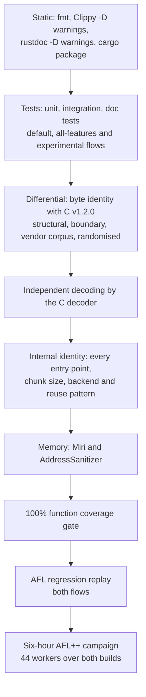

# Correctness proof

This document states what `mbrotli` claims about its output, how each claim
is checked by a machine, and the results of one complete run of every check
over both the standard and the `experimental` feature flows. "Proof" here
means layered, reproducible evidence against independent oracles, not a formal
verification: the encoder is compared byte for byte with the pinned C reference,
its streams are decoded by the reference decoder, its own entry points and SIMD
backends are compared with each other, its memory behaviour is checked under
Miri and AddressSanitizer, every function is required to execute under test,
and a six-hour coverage-guided fuzz campaign drives all of those oracles with
mutated inputs. Every command below runs from a checkout; nothing in the
record depends on a hosted service.

## What is claimed

| Surface | Claim | Oracle |
| --- | --- | --- |
| Default features, qualities 0–11, windows 10–24 | Byte identity with Google Brotli v1.2.0 (`brotli-ffi/vendor/brotli` at `028fb5a`) configured with equivalent streaming settings, and decodability by its decoder | C encoder and decoder through `google-brotli-ffi` |
| Large Window Brotli, qualities 3–11 | Decodable by the C decoder up to its 30-bit limit; above it, identical to the 30-bit stream apart from the header bits | C decoder; header comparison |
| Prepared prefix dictionaries, qualities 5–11 | Byte identity with C where C supports the same attachment, and C decoding with the dictionary attached | C encoder and decoder |
| All serial entry points | Same bytes from `compress`, `compress_into`, `compress_to_slice`, `writer`, `reader`, and `start` at any chunk size, with any backend, from a fresh or reused compressor | Cross-API and cross-backend comparison |
| Parallel compression | One valid stream, deterministic across task counts | C decoder; cross-schedule comparison |
| `experimental`: serialized dictionaries, custom static encoding, continuations, framing | RFC 9841 conformance validated by the C parser and decoder built with `BROTLI_EXPERIMENTAL`, byte identity with C for continuations, and this crate's own fixtures | C decoder; fixtures |
| Memory safety | The library forbids `unsafe` code outside test modules; retained storage and streaming state are checked under Miri and AddressSanitizer | `#![forbid(unsafe_code)]`, Miri, ASan |

## Evidence layers



Each layer strengthens the one above it. Static checks and tests establish
that the code builds and behaves as documented. The differential tests make
the C encoder the oracle for the bytes, and decoding makes the C decoder the
oracle for validity even where byte identity is not claimed. Internal identity
tests turn one oracle-checked path into a check of every path. Miri and
AddressSanitizer look for what tests cannot see. The coverage gate ensures the
tests reach every function, and fuzzing removes the dependence on hand-chosen
inputs by mutating toward new code paths under the same oracles.

### Differential tests

| Test file | What it compares |
| --- | --- |
| `tests/differential_c.rs` | Structural corpora, boundary lengths, every window size, reused and reconfigured compressors against the C encoder |
| `tests/greedy_qualities.rs` | Qualities 2–9 byte for byte |
| `tests/vendor_corpus.rs` | Google's own test corpus, including a 12 MiB multi-fragment input, against the C encoder, through the C decoder, and across backends |
| `tests/randomized.rs` | Deterministically seeded structured inputs against the C encoder and decoder |
| `tests/large_window.rs`, `tests/window_bits.rs` | Large Window headers and bounds |
| `tests/dictionary.rs`, `tests/serialized_dictionary.rs`, `tests/stream_offset.rs` | Prefix dictionaries, serialized dictionaries and continuations against the C encoder and decoder |
| `tests/roundtrip.rs`, `tests/framing.rs`, `tests/parallel.rs` | Decoding of every quality, framing fixtures, and parallel stream validity |

### Internal identity tests

`tests/streaming.rs`, `tests/flush.rs`, `tests/reuse.rs`,
`tests/simd_backends.rs`, `tests/track_a_lifecycle.rs`, and
`tests/writer_faults.rs` check that chunk boundaries, destination shapes,
workspace reuse, backend selection, and misbehaving sinks never change the
bytes. `tests/compressor_memory.rs` and `tests/dictionary_memory.rs` check the
retention and preparation budgets with an accounting allocator.

### Fuzzing

The `fuzz/afl` package holds 23 AFL++ targets whose bodies are engine-neutral
functions, so the same code runs under the fuzzer and under
`cargo afl test`, which replays the committed regression corpus. The oracles
are the ones above: bound, C decoding, byte identity with C, cross-API and
cross-backend identity, and typed refusals where the API contract requires
them. The [fuzzing specification](../architecture/fuzzing.md) describes each
target's input model and oracle.

Two builds are fuzzed. The `experimental` feature reaches into the encoder
(match finders, the high-quality search, and parameter resolution carry
`cfg(feature = "experimental")` branches), so the 21 stable targets are fuzzed
once from a `--no-default-features` build and again from a
`--features experimental` build, alongside the two experimental-only targets.
`fuzz/afl/campaign.sh` runs both phases.

## Record: 2026-09-07

| Item | Value |
| --- | --- |
| Revision | `632b640` plus the changes in this record's commit |
| C reference | Google Brotli v1.2.0, submodule `028fb5a` |
| Host | Intel Core i7-13700KF, 24 hardware threads, 47 GiB, Ubuntu 22.04 under WSL2 |
| Stable toolchain | rustc 1.98.1 (2026-09-01), cargo 1.98.1 |
| Nightly toolchain | rustc 1.100.0-nightly (2026-09-05), Miri of the same date |
| Fuzzer | cargo-afl 0.18.2, AFL++ 4.40c, CmpLog level 2, persistent mode |

### Static checks, tests, and memory checks

Both flows were run: "standard" means the default feature set or
`--no-default-features` where the package has no default, and "experimental"
means `--features experimental`. `--all-features` adds only `diagnostics` and
the profiling anchors on top of `experimental`.

| Check | Command | Standard | Experimental |
| --- | --- | --- | --- |
| Formatting | `cargo fmt --all -- --check` | pass | n/a |
| Lint | `cargo clippy --workspace --all-targets --all-features --locked -- -D warnings` | n/a | pass |
| Documentation | `RUSTDOCFLAGS='-D warnings' cargo doc --workspace --all-features --no-deps --locked` | n/a | pass |
| Packaging | `cargo package --allow-dirty --locked` | pass | n/a |
| Tests, debug | `cargo test --workspace --all-features --locked` | n/a | pass, 1005 tests |
| Tests, release | `cargo test --workspace --release --locked` and `--features experimental` | pass, 805 tests | pass, 1001 tests |
| Tests, release, all features | `cargo test --workspace --all-features --release --locked` | n/a | pass, 1005 tests |
| Function coverage | `CARGO_PROFILE_TEST_OPT_LEVEL=1 cargo llvm-cov --workspace --all-features --locked --html --fail-under-functions 100` | n/a | pass: 2245/2245 functions, 97.67% lines, 97.16% regions |
| Miri | `cargo +nightly miri test --lib` over the ring buffer, stream, prefix-merge and bucket-promotion tests | pass (four groups) | n/a |
| AddressSanitizer | `RUSTFLAGS=-Zsanitizer=address cargo +nightly test --release --target x86_64-unknown-linux-gnu --test reuse --test writer_faults --test streaming --test simd_backends --test dictionary` | pass | pass |
| Fuzz package lint | `cargo clippy --all-targets --no-default-features [--features experimental] -- -D warnings` | pass | pass |
| Regression replay | `cargo afl test --no-default-features [--features experimental]` | pass (177 inputs, 21 targets) | pass (195 inputs, 23 targets) |

The Miri and Clippy invocations for the fuzz package use the four Miri test
groups and the two feature configurations that `.github/workflows` run.

### Fuzz campaign

```sh
cd fuzz/afl
./prepare-seeds.sh
TARGET_DIR=target/stable/release ./minimise-seeds.sh
./campaign.sh findings/campaign-2026-09-07-6h 10800
```

Seed corpora after minimisation: `generic` 24 → 21, `params` 127 → 85,
`large_window` 508 → 101, `dictionary` 1016 → 90, `serialized` 16, and the
committed `compressor_lifecycle`, `framing` and `parallel` regression corpora.
Every worker ran for three hours on its own hardware thread: 21 stable-build
workers in the first phase, 23 experimental-build workers in the second, with a
fixed ten-second execution timeout and no memory limit. Payloads are capped at
128 KiB by the targets.

CAMPAIGN_TABLE

CAMPAIGN_TOTALS

**Finding.** Within the first minute the stable `dictionary` worker saved
crashes. All were one assertion in the fuzz harness, not in the encoder: the
target asserted that a request for more than fifteen attachments had been
refused, but a payload shorter than the request, or one the rounded-up cut
stride does not divide, yields fewer attachments than requested, and the
builder correctly accepted those. Two minimised inputs were committed to
`fuzz/afl/regressions/dictionary/` as `crash-*.bin`, confirmed to fail on the
old assertion under `cargo afl test`, the assertion was changed to key on the
number actually attached, and the replay passes in both flows. That worker was
restarted on the corrected binary for a full three hours; its first run is
kept as `dictionary-harness-bug` in the table above.

**Timeouts.** The stable `simd_equivalence` worker saved three hangs after
about thirteen minutes. Each is the same 128 KiB text seed with its quality
byte mutated to quality 11, which that target compresses once per available
backend, three times on this host. Standalone, each input completes in
7.4 s on the AFL-instrumented binary and the encoder's own quality 11 pass
takes 1.4 s, against 0.15 s for the uninstrumented C encoder on the same input
in the same process, so these are slow executions that crossed the fixed
ten-second limit under a fully loaded machine, not non-terminating ones.
`campaign.sh` now defaults to a thirty-second timeout and takes the timeout as
its third argument; the recorded run used ten seconds throughout.
HANG_SUMMARY

## What this does not prove

- The C reference is the oracle for bytes and validity. A defect shared with
  Google Brotli v1.2.0 would not be detected.
- Byte identity holds for equivalent C streaming settings. C's native one-shot
  API and arbitrary C chunk schedules can legitimately emit different bytes,
  as the [user guide](README.md#output-compatibility) explains.
- Declared windows above 30 bits are checked by header comparison against the
  30-bit stream, because the pinned C decoder reads at most 30 bits.
- Fuzzed payloads are at most 128 KiB, so multi-fragment behaviour at windows
  of 2^17 bytes and above rests on the integration tests, not on the fuzzer.
- The `experimental` API has no stable reference encoder; its evidence is
  RFC conformance through the C parser and decoder plus fixtures, not byte
  identity with a pinned encoder.
- Fuzzing is bounded evidence. The record shows what 132 core-hours reached;
  the queue and edge counts show how far each target's exploration went.
- The run used one x86-64 host. CI executes the test suite on AArch64 and
  macOS as well, but this record's Miri, sanitizer, and fuzz results are
  x86-64 only.

## Reproducing

Run the commands in the tables above from the repository root, or from
`fuzz/afl` for the fuzz package. [Development](development.md) lists the
routine checks and tool installation; the [AFL guide](../fuzz/afl/README.md)
covers seeds, campaigns and triage. A shorter campaign is the same script with
a smaller duration:

```sh
cd fuzz/afl && ./campaign.sh findings/smoke 600
```

Record the revision, toolchain, corpus, duration, executions, stability,
crashes, and hangs alongside any new result; a run shorter than this one is
evidence only for the inputs it executed.
