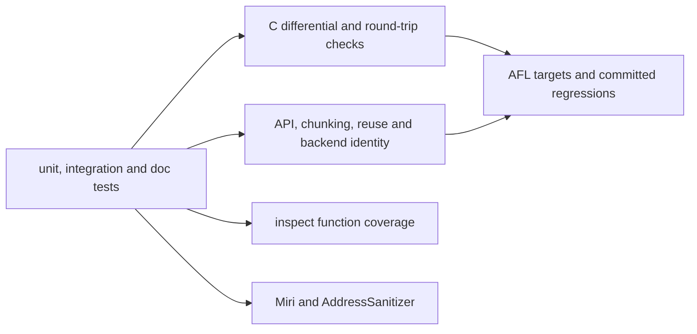

# Compatibility and validation

This page describes the contracts checked by the repository. Tests, coverage,
fuzzing and memory tools provide bounded evidence, not formal verification.
For commands, use the [development guide](development.md).

## What is claimed

| Surface | Claim | Oracle |
| --- | --- | --- |
| Default features, qualities 0–11, windows 10–24 | Byte identity with Google Brotli v1.2.0 as of upstream `master` `4508218e` (`brotli-ffi/vendor/brotli`, 2026-09-01) configured with equivalent streaming settings, and decodability by its decoder | C encoder and decoder through `google-brotli-ffi` |
| Large Window Brotli, qualities 3–11 | Decodable by the C decoder up to its 30-bit limit; above it, identical to the 30-bit stream apart from the header bits | C decoder; header comparison |
| Prepared prefix dictionaries, qualities 5–11 | Byte identity with C where C supports the same attachment, and C decoding with the dictionary attached | C encoder and decoder |
| Native decoder, any input bytes | A stream the C decoder accepts decodes to the same bytes and consumes the same prefix, or is refused by a declared resource budget; no input panics | C decoder through `google-brotli-ffi` |
| Native decoder, streaming | Chunked sessions agree with one-shot decoding on bytes, on cumulative progress, and on termination, at any chunk and output size | Cross-entry-point comparison |
| All serial entry points | Same bytes from `compress`, `compress_into`, `compress_to_slice`, `writer`, `reader`, and `start` at any chunk size, with any backend, from a fresh or reused compressor | Cross-API and cross-backend comparison |
| Parallel compression | One valid stream, deterministic across task counts | C decoder; cross-schedule comparison |
| `experimental`: serialized dictionaries, custom static encoding, continuations, framing | RFC 9841 conformance validated by the C parser and decoder built with `BROTLI_EXPERIMENTAL`, byte identity with C for continuations, and this crate's own fixtures | C decoder; fixtures |
| Memory safety | The library forbids `unsafe` code outside test modules; retained storage and streaming state are checked under Miri and AddressSanitizer | `#![forbid(unsafe_code)]`, Miri, ASan |

## Validation layers

### Differential tests

| Test file | What it compares |
| --- | --- |
| `tests/differential_c.rs` | Structural corpora, boundary lengths, every window size, reused and reconfigured compressors against the C encoder |
| `tests/greedy_qualities.rs` | Qualities 2–9 byte for byte |
| `tests/vendor_corpus.rs` | Google's own test corpus, including a 12 MiB multi-fragment input, against the C encoder, through the C decoder, and across backends |
| `tests/randomized.rs` | Deterministically seeded structured inputs against the C encoder and decoder |
| `tests/large_window.rs`, `tests/window_bits.rs` | Large Window headers and bounds |
| `tests/dictionary.rs`, `tests/serialized_dictionary.rs`, `tests/stream_offset.rs` | Prefix dictionaries, serialized dictionaries and continuations against the C encoder and decoder |
| `tests/roundtrip.rs`, `tests/framing.rs`, `tests/parallel.rs` | Decoding of every quality, framing fixtures, and parallel stream validity |

### Internal identity tests

`tests/streaming.rs`, `tests/flush.rs`, `tests/reuse.rs`,
`tests/simd_backends.rs`, `tests/track_a_lifecycle.rs`, and
`tests/writer_faults.rs` check that chunk boundaries, destination shapes,
workspace reuse, backend selection, and misbehaving sinks never change the
bytes. `tests/compressor_memory.rs` and `tests/dictionary_memory.rs` check the
retention and preparation budgets with an accounting allocator.

## Feature and fuzz coverage

Run std and alloc-backed configurations separately, with and without
`experimental`. `--all-features` enables `no_std` and therefore excludes std-only
I/O and parallel APIs; it does not replace a std test run. Feature consumer
scripts check both accepted imports and APIs that must be absent.

The isolated AFL package reuses engine-neutral target bodies for fuzzing and
committed regression replay. `campaign.sh` covers encoder boundaries and the
C-to-native round trip; `decoder-campaign.sh` covers decoder boundaries. Both
stable and experimental builds are needed. See the [AFL guide](../fuzz/afl/README.md)
and [target mechanics](../architecture/fuzzing.md).

## Six-hour AFL campaign — 2026-09-26

After the decoder changes of 2026-09-26 (unmasked refill, literal tail runs,
linear slice history), every fuzz target ran for **6 hours** from fresh builds of
the working tree: `campaign.sh` with `CAMPAIGN_PARALLEL=1` (22 stable and 24
experimental encoder-side targets), `decoder-campaign.sh` (6 stable and 7
experimental decoder targets) and the three framed targets that neither script
covers (`framed_decode`, `framed_encode`, `framed_roundtrip`, experimental build),
for **62 AFL++ workers** on the i7-13700KF/WSL2 host's 24 threads.

| Group | Workers | Executions |
| --- | ---: | ---: |
| Encoder, stable | 22 | 43,668,477 |
| Encoder, experimental | 24 | 48,598,336 |
| Decoder, stable | 6 | 204,316,217 |
| Decoder, experimental | 7 | 327,495,724 |
| Framed, experimental | 3 | 6,915,108 |
| **Total** | **62** | **630,993,862** |

No crashes or correctness-oracle failures were recorded; stability stayed at or
above 99.38%. The `decompress` target now also checks that
`decompress_to_slice` matches ring-backed session delivery, byte for byte.

`framed_decode` saved two hangs at its 5 s timeout. Both inputs finish in 0.57 s
standalone under instrumentation, so the timeouts came from oversubscription,
not an unbounded loop. Their time goes to `framing::core::Engine::framing_bytes`:
it recomputes workspace accounting over every chunk and metadata record on
each budget check, which is quadratic in the number of records. This campaign
found that slow path in the experimental framed decoder; it is open, and it is
not a decoding error.

## Eight-hour AFL campaign — 2026-09-11

The recorded campaign exercised compression and decompression in stable and
experimental builds for **8 hours**, using **59 AFL++ workers** on an
Intel Core i7-13700KF/WSL2 host. Across **914,882,807 executions**, no crashes or
correctness-oracle failures were recorded. Checks included C compatibility,
round trips, API/chunking/backend equivalence, dictionaries, limits and lifecycle.

The run found one allocation-related slowdown in `large_window` (19 saved hangs).
It was fixed and covered by [`hq_forest_allocation`](../tests/hq_forest_allocation.rs).
Both affected feature builds were then fuzzed for **45 minutes each**, starting
with the saved inputs: **18,400 further executions, no crashes or hangs**.
This is a completed validation record, not a guarantee for all possible inputs
or later revisions.

## Limits of the evidence

- C byte identity requires [equivalent streaming settings](README.md#output-compatibility).
  Native C one-shot shortcuts and arbitrary chunk schedules can differ.
- C validates extended windows through 30 bits. Wider declarations use independent
  header and distance-model tests; they have no equivalent C end-to-end oracle.
- Experimental custom static encoding and framing use parser/decoder checks and
  fixtures; they have no blanket C-encoder byte-identity guarantee.
- A bug shared with the reference implementation can escape differential tests.
- Fuzz budgets cap payload, decoded output and workspace. Large histories and
  cumulative counters rely on separate integration and ignored heavy tests.
- Coverage measures executed functions, not all paths or possible inputs.
  Backend execution tests cover only instruction sets available on their host.
- A saved AFL timeout needs standalone reproduction and resource profiling before
  classification. A bounded campaign cannot establish absence of bugs.

See [decoder verification](../architecture/decompressor-compatibility.md) for
wire-format, dictionary, resource-limit and large-history checks.
