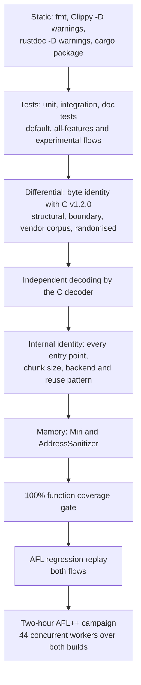

# Correctness proof

This document states what `mbrotli` claims about its output, how each claim
is checked by a machine, and the results of one complete run of every check
over both the standard and the `experimental` feature flows. "Proof" here
means layered, reproducible evidence against independent oracles, not a formal
verification: the encoder is compared byte for byte with the pinned C reference,
its streams are decoded by the reference decoder, its own entry points and SIMD
backends are compared with each other, its memory behaviour is checked under
Miri and AddressSanitizer, every function is required to execute under test,
and a two-hour coverage-guided fuzz campaign over both feature builds drives
all of those oracles with mutated inputs. Every command below runs from a
checkout; nothing in the record depends on a hosted service.

## What is claimed

| Surface | Claim | Oracle |
| --- | --- | --- |
| Default features, qualities 0–11, windows 10–24 | Byte identity with Google Brotli v1.2.0 (`brotli-ffi/vendor/brotli` at `028fb5a`) configured with equivalent streaming settings, and decodability by its decoder | C encoder and decoder through `google-brotli-ffi` |
| Large Window Brotli, qualities 3–11 | Decodable by the C decoder up to its 30-bit limit; above it, identical to the 30-bit stream apart from the header bits | C decoder; header comparison |
| Prepared prefix dictionaries, qualities 5–11 | Byte identity with C where C supports the same attachment, and C decoding with the dictionary attached | C encoder and decoder |
| All serial entry points | Same bytes from `compress`, `compress_into`, `compress_to_slice`, `writer`, `reader`, and `start` at any chunk size, with any backend, from a fresh or reused compressor | Cross-API and cross-backend comparison |
| Parallel compression | One valid stream, deterministic across task counts | C decoder; cross-schedule comparison |
| `experimental`: serialized dictionaries, custom static encoding, continuations, framing | RFC 9841 conformance validated by the C parser and decoder built with `BROTLI_EXPERIMENTAL`, byte identity with C for continuations, and this crate's own fixtures | C decoder; fixtures |
| Memory safety | The library forbids `unsafe` code outside test modules; retained storage and streaming state are checked under Miri and AddressSanitizer | `#![forbid(unsafe_code)]`, Miri, ASan |

## Evidence layers



Each layer strengthens the one above it. Static checks and tests establish
that the code builds and behaves as documented. The differential tests make
the C encoder the oracle for the bytes, and decoding makes the C decoder the
oracle for validity even where byte identity is not claimed. Internal identity
tests turn one oracle-checked path into a check of every path. Miri and
AddressSanitizer look for what tests cannot see. The coverage gate ensures the
tests reach every function, and fuzzing removes the dependence on hand-chosen
inputs by mutating toward new code paths under the same oracles.

### Differential tests

| Test file | What it compares |
| --- | --- |
| `tests/differential_c.rs` | Structural corpora, boundary lengths, every window size, reused and reconfigured compressors against the C encoder |
| `tests/greedy_qualities.rs` | Qualities 2–9 byte for byte |
| `tests/vendor_corpus.rs` | Google's own test corpus, including a 12 MiB multi-fragment input, against the C encoder, through the C decoder, and across backends |
| `tests/randomized.rs` | Deterministically seeded structured inputs against the C encoder and decoder |
| `tests/large_window.rs`, `tests/window_bits.rs` | Large Window headers and bounds |
| `tests/dictionary.rs`, `tests/serialized_dictionary.rs`, `tests/stream_offset.rs` | Prefix dictionaries, serialized dictionaries and continuations against the C encoder and decoder |
| `tests/roundtrip.rs`, `tests/framing.rs`, `tests/parallel.rs` | Decoding of every quality, framing fixtures, and parallel stream validity |

### Internal identity tests

`tests/streaming.rs`, `tests/flush.rs`, `tests/reuse.rs`,
`tests/simd_backends.rs`, `tests/track_a_lifecycle.rs`, and
`tests/writer_faults.rs` check that chunk boundaries, destination shapes,
workspace reuse, backend selection, and misbehaving sinks never change the
bytes. `tests/compressor_memory.rs` and `tests/dictionary_memory.rs` check the
retention and preparation budgets with an accounting allocator.

### Fuzzing

The `fuzz/afl` package holds 23 AFL++ targets whose bodies are engine-neutral
functions, so the same code runs under the fuzzer and under
`cargo afl test`, which replays the committed regression corpus. The oracles
are the ones above: bound, C decoding, byte identity with C, cross-API and
cross-backend identity, and typed refusals where the API contract requires
them. The [fuzzing specification](../architecture/fuzzing.md) describes each
target's input model and oracle.

Two builds are fuzzed. The `experimental` feature reaches into the encoder
(match finders, the high-quality search, and parameter resolution carry
`cfg(feature = "experimental")` branches), so the 21 stable targets are fuzzed
once from a `--no-default-features` build and again from a
`--features experimental` build, alongside the two experimental-only targets.
`fuzz/afl/campaign.sh` runs both phases, in sequence by default or together
under `CAMPAIGN_PARALLEL=1`.

## Record: 2026-09-07

| Item | Value |
| --- | --- |
| Revision | `bcd9267` plus the working-tree changes in this record's commit |
| C reference | Google Brotli v1.2.0, submodule `028fb5a` |
| Host | Intel Core i7-13700KF, 24 hardware threads, 47 GiB, Ubuntu 22.04 under WSL2 |
| Stable toolchain | rustc 1.98.1 (2026-09-01), cargo 1.98.1 |
| Nightly toolchain | rustc 1.100.0-nightly (2026-09-05), Miri of the same date |
| Fuzzer | cargo-afl 0.18.2, AFL++ 4.40c, CmpLog, persistent mode with shared-memory test cases and a deferred forkserver |

### Static checks, tests, and memory checks

Both flows were run: "standard" means the default feature set or
`--no-default-features` where the package has no default, and "experimental"
means `--features experimental`. `--all-features` adds only `diagnostics` and
the profiling anchors on top of `experimental`.

| Check | Command | Standard | Experimental |
| --- | --- | --- | --- |
| Formatting | `cargo fmt --all -- --check` | pass | n/a |
| Lint | `cargo clippy --workspace --all-targets --all-features --locked -- -D warnings` | n/a | pass |
| Documentation | `RUSTDOCFLAGS='-D warnings' cargo doc --workspace --all-features --no-deps --locked` | n/a | pass |
| Packaging | `cargo package --allow-dirty --locked` | pass | n/a |
| Tests, debug | `cargo test --workspace --all-features --locked` | n/a | pass, 1006 tests |
| Tests, release | `cargo test --workspace --release --locked` and `--features experimental` | pass, 806 tests | pass, 1002 tests |
| Tests, release, all features | `cargo test --workspace --all-features --release --locked` | n/a | pass, 1006 tests |
| Function coverage | `CARGO_PROFILE_TEST_OPT_LEVEL=1 cargo llvm-cov --workspace --all-features --locked --html --fail-under-functions 100` | n/a | pass: 2259/2259 functions, 97.69% lines, 97.16% regions |
| Miri | `cargo +nightly miri test --lib` over the ring buffer, stream, hasher, fast-workspace and prefix-merge modules | pass (five groups, 39 tests) | n/a |
| AddressSanitizer | `RUSTFLAGS=-Zsanitizer=address cargo +nightly test --release --target x86_64-unknown-linux-gnu --test reuse --test writer_faults --test streaming --test simd_backends --test dictionary` | pass | pass |
| Fuzz package lint | `cargo clippy --all-targets --no-default-features [--features experimental] -- -D warnings` | pass | pass |
| Regression replay | `cargo afl test --no-default-features [--features experimental]` | pass (177 inputs, 21 targets) | pass (195 inputs, 23 targets) |

The Miri and Clippy invocations use the groups and feature configurations that
`.github/workflows` run. One Miri group had been naming a test that commit
`01a2684` deleted on 2026-09-06; `cargo miri test` exits successfully when a
filter matches nothing, so that step had been passing without interpreting
anything. The filters now name modules — the greedy hashers and the fast
encoder's workspace, which is where the deleted bucket-promotion test's
storage now lives — and this record's run interprets 39 tests.

### Fuzz campaign

```sh
cd fuzz/afl
./prepare-seeds.sh
cargo afl build --release --no-default-features --target-dir target/stable
TARGET_DIR=target/stable/release ./minimise-seeds.sh
CAMPAIGN_PARALLEL=1 ./campaign.sh findings/campaign-2026-09-07-2h 7200
```

Seed corpora after minimisation: `generic` 24 → 21, `params` 127 → 85,
`large_window` 508 → 101, `dictionary` 1016 → 90, `serialized` 16, and the
committed `compressor_lifecycle`, `framing` and `parallel` regression corpora.
Both phases ran at once, from 15:14:14Z to 17:17:24Z: 21 workers on the
`--no-default-features` build and 23 on the `--features experimental` build,
two hours each, 88 worker-hours over 24 hardware threads. Every worker used
CmpLog, a fixed thirty-second execution timeout, and no memory limit. Payloads
are capped at 128 KiB by the targets.

Executions per second are a floor, not a representative rate: 44 workers shared
24 hardware threads, and for the whole two hours the host also carried 23
workers left over from an earlier campaign, so about 67 AFL workers competed
for the machine. Oracle outcomes do not depend on that load; reached edges and
queue growth do.

#### stable build (21 workers)

| Target | Executions | Execs/s | Queue | Edges | Map | Stability | Crashes | Hangs |
| --- | ---: | ---: | ---: | ---: | ---: | ---: | ---: | ---: |
| `compressor_lifecycle` | 851,705 | 118 | 6 → 7678 | 17,606 | 10.44% | 99.99% | 0 | 0 |
| `dictionary` | 219,661 | 30 | 90 → 1779 | 29,391 | 17.38% | 99.99% | 0 | 0 |
| `differential_c` | 885,249 | 122 | 85 → 3715 | 24,643 | 14.65% | 99.99% | 0 | 0 |
| `large_window` | 183,395 | 25 | 101 → 1782 | 23,992 | 14.26% | 99.99% | 0 | 0 |
| `output_capacity` | 297,954 | 41 | 85 → 2524 | 28,483 | 16.92% | 99.99% | 0 | 0 |
| `parallel` | 172,419 | 23 | 9 → 2932 | 22,104 | 7.12% | 99.99% | 0 | 0 |
| `parameter_parsing` | 451,762 | 62 | 85 → 2261 | 19,240 | 11.44% | 99.99% | 0 | 0 |
| `params_roundtrip` | 238,992 | 33 | 85 → 2399 | 24,302 | 14.45% | 99.99% | 0 | 0 |
| `q0_roundtrip` | 2,383,759 | 331 | 21 → 1241 | 3,552 | 2.11% | 99.94% | 0 | 0 |
| `q10_roundtrip` | 12,522 | 1 | 21 → 879 | 6,952 | 4.14% | 99.97% | 0 | 0 |
| `q11_roundtrip` | 12,087 | 1 | 21 → 505 | 7,050 | 4.19% | 99.97% | 0 | 0 |
| `q1_roundtrip` | 2,934,251 | 407 | 21 → 1673 | 3,821 | 2.27% | 99.95% | 0 | 0 |
| `q3_roundtrip` | 609,418 | 84 | 21 → 951 | 2,468 | 1.47% | 99.92% | 0 | 0 |
| `q4_roundtrip` | 410,620 | 57 | 21 → 1047 | 3,518 | 2.09% | 99.94% | 0 | 0 |
| `q5_roundtrip` | 316,880 | 44 | 21 → 1389 | 4,369 | 2.60% | 99.95% | 0 | 0 |
| `q6_roundtrip` | 192,006 | 26 | 21 → 1300 | 4,374 | 2.60% | 99.95% | 0 | 0 |
| `q7_roundtrip` | 123,652 | 17 | 21 → 1139 | 3,818 | 2.27% | 99.95% | 0 | 0 |
| `q8_roundtrip` | 248,368 | 34 | 21 → 1074 | 3,865 | 2.30% | 99.95% | 0 | 0 |
| `q9_roundtrip` | 98,558 | 13 | 21 → 1083 | 3,685 | 2.19% | 99.95% | 0 | 0 |
| `simd_equivalence` | 295,564 | 41 | 85 → 2696 | 37,338 | 22.21% | 99.99% | 0 | 0 |
| `streaming_equivalence` | 298,745 | 41 | 85 → 2194 | 26,711 | 15.81% | 99.99% | 0 | 0 |

#### experimental build (23 workers)

| Target | Executions | Execs/s | Queue | Edges | Map | Stability | Crashes | Hangs |
| --- | ---: | ---: | ---: | ---: | ---: | ---: | ---: | ---: |
| `compressor_lifecycle` | 996,051 | 138 | 6 → 8247 | 18,842 | 10.96% | 99.99% | 0 | 0 |
| `dictionary` | 223,876 | 31 | 90 → 2256 | 28,620 | 16.44% | 99.99% | 0 | 0 |
| `differential_c` | 566,657 | 78 | 85 → 3122 | 24,481 | 14.27% | 99.99% | 0 | 0 |
| `framing` | 1,111,385 | 154 | 2 → 1689 | 3,849 | 2.22% | 99.95% | 0 | 0 |
| `large_window` | 57,771 | 8 | 101 → 1123 | 21,636 | 12.60% | 99.99% | 0 | 0 |
| `output_capacity` | 387,395 | 53 | 85 → 2600 | 29,063 | 16.93% | 99.99% | 0 | 0 |
| `parallel` | 171,904 | 23 | 9 → 2881 | 22,185 | 7.00% | 99.99% | 0 | 0 |
| `parameter_parsing` | 383,599 | 53 | 85 → 2141 | 19,237 | 11.22% | 99.99% | 0 | 0 |
| `params_roundtrip` | 268,643 | 37 | 85 → 2174 | 24,831 | 14.48% | 99.99% | 0 | 0 |
| `q0_roundtrip` | 1,754,358 | 243 | 21 → 1151 | 3,543 | 2.07% | 99.94% | 0 | 0 |
| `q10_roundtrip` | 13,032 | 1 | 21 → 934 | 6,963 | 4.06% | 99.97% | 0 | 0 |
| `q11_roundtrip` | 8,637 | 1 | 21 → 470 | 7,065 | 4.12% | 99.97% | 0 | 0 |
| `q1_roundtrip` | 3,714,798 | 515 | 21 → 1530 | 3,522 | 2.05% | 99.94% | 0 | 0 |
| `q3_roundtrip` | 527,546 | 73 | 21 → 879 | 2,468 | 1.44% | 99.92% | 0 | 0 |
| `q4_roundtrip` | 516,785 | 71 | 21 → 1115 | 3,516 | 2.05% | 99.94% | 0 | 0 |
| `q5_roundtrip` | 271,384 | 37 | 21 → 1323 | 4,391 | 2.56% | 99.95% | 0 | 0 |
| `q6_roundtrip` | 244,865 | 34 | 21 → 1441 | 4,403 | 2.57% | 99.95% | 0 | 0 |
| `q7_roundtrip` | 128,904 | 17 | 21 → 1096 | 3,849 | 2.24% | 99.95% | 0 | 0 |
| `q8_roundtrip` | 152,805 | 21 | 21 → 1094 | 3,883 | 2.26% | 99.95% | 0 | 0 |
| `q9_roundtrip` | 66,258 | 9 | 21 → 974 | 3,702 | 2.16% | 99.95% | 0 | 0 |
| `serialized_dictionary` | 890,924 | 123 | 15 → 2434 | 8,819 | 5.04% | 99.98% | 0 | 0 |
| `simd_equivalence` | 328,161 | 45 | 85 → 3054 | 37,668 | 21.97% | 99.99% | 0 | 0 |
| `streaming_equivalence` | 263,084 | 36 | 85 → 2064 | 27,042 | 15.70% | 99.99% | 0 | 0 |

| Build | Workers | Executions | Queue | Crashes | Hangs | Timeouts |
| --- | ---: | ---: | ---: | ---: | ---: | ---: |
| stable | 21 | 11,237,567 | 947 → 42,241 | 0 | 0 | 0 |
| experimental | 23 | 13,048,822 | 964 → 45,792 | 0 | 0 | 0 |
| both | 44 | 24,286,389 | 1,911 → 88,033 | 0 | 0 | 0 |

**Result.** No worker saved a crash, a hang, or a timeout. Every oracle held
over 24.3 million executions: the size bound, decoding by the C decoder, byte
identity with the C encoder under equivalent streaming settings, agreement
between every entry point, chunk schedule and SIMD backend, and the typed
refusals the API contract requires. Per-worker stability stayed at or above
99.92%, so the instrumentation saw deterministic executions rather than
run-to-run variation that would blunt the coverage feedback. The queue grew
from 1,911 seeds to 88,033 saved inputs, and the map density column shows how
far each target's exploration reached.

**Timeouts.** This run replaces an earlier six-hour campaign that used a fixed
ten-second timeout and saved 45 hangs, all in the targets that compress a
128 KiB payload several times per execution — `simd_equivalence` and
`streaming_equivalence` across backends and entry points, `output_capacity`
twice per buffer shape, `dictionary` and `large_window` at quality 10 and 11.
Each was a slow execution rather than a non-terminating one: the earlier
record measured one such input at 7.4 s standalone on the instrumented binary,
against 0.15 s for the uninstrumented C encoder in the same process.
`campaign.sh` now defaults to a thirty-second timeout, which is what this run
used, and under a load at least as heavy — the earlier campaign's second phase
was still running throughout — nothing reached it.

**Harness finding, carried over.** The earlier campaign's only crashes were one
assertion in the fuzz harness, not in the encoder: the `dictionary` target
asserted that a request for more than fifteen attachments had been refused,
while a payload shorter than the request, or one the rounded-up cut stride does
not divide, yields fewer attachments than requested, and the builder correctly
accepted those. The assertion now keys on the number actually attached, and two
minimised inputs are committed as `fuzz/afl/regressions/dictionary/crash-*.bin`,
which this record's regression replay executes in both flows.

## What this does not prove

- The C reference is the oracle for bytes and validity. A defect shared with
  Google Brotli v1.2.0 would not be detected.
- Byte identity holds for equivalent C streaming settings. C's native one-shot
  API and arbitrary C chunk schedules can legitimately emit different bytes,
  as the [user guide](README.md#output-compatibility) explains.
- Declared windows above 30 bits are checked by header comparison against the
  30-bit stream, because the pinned C decoder reads at most 30 bits.
- Fuzzed payloads are at most 128 KiB, so multi-fragment behaviour at windows
  of 2^17 bytes and above rests on the integration tests, not on the fuzzer.
- The `experimental` API has no stable reference encoder; its evidence is
  RFC conformance through the C parser and decoder plus fixtures, not byte
  identity with a pinned encoder.
- Fuzzing is bounded evidence. The record shows what 88 worker-hours reached;
  the queue and edge counts show how far each target's exploration went, and
  the host was oversubscribed throughout, so a longer or less contended run
  would execute more.
- The run used one x86-64 host. CI executes the test suite on AArch64 and
  macOS as well, but this record's Miri, sanitizer, and fuzz results are
  x86-64 only.

## Reproducing

Run the commands in the tables above from the repository root, or from
`fuzz/afl` for the fuzz package. [Development](development.md) lists the
routine checks and tool installation; the [AFL guide](../fuzz/afl/README.md)
covers seeds, campaigns and triage. A shorter campaign is the same script with
a smaller duration:

```sh
cd fuzz/afl && ./campaign.sh findings/smoke 600
```

Record the revision, toolchain, corpus, duration, executions, stability,
crashes, and hangs alongside any new result; a run shorter than this one is
evidence only for the inputs it executed.
