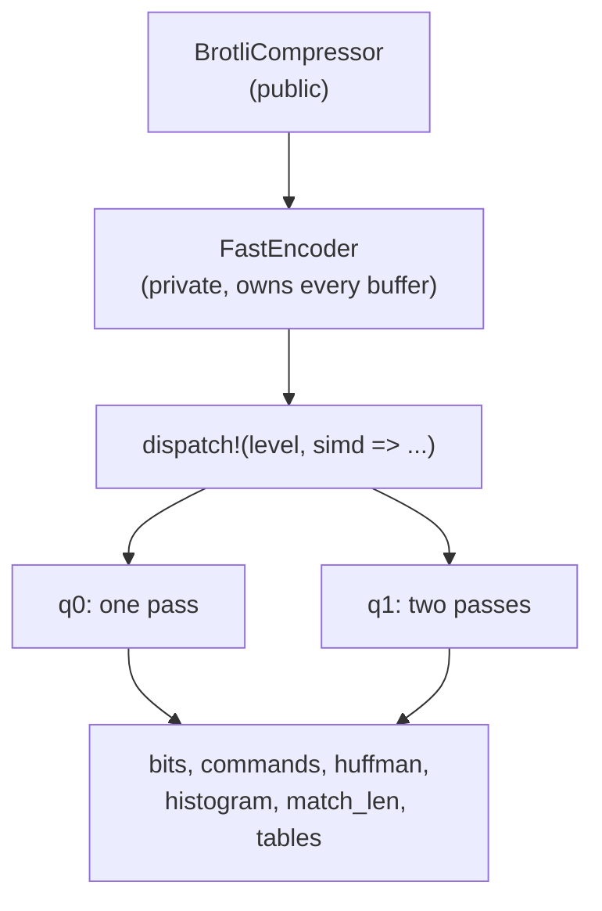
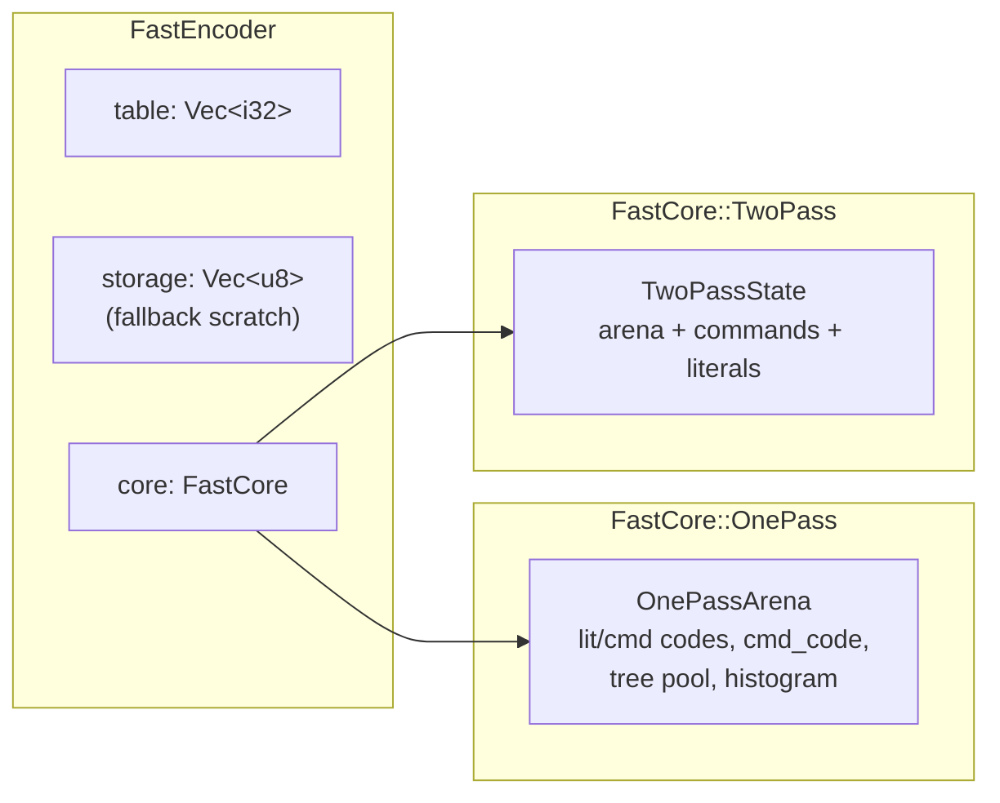
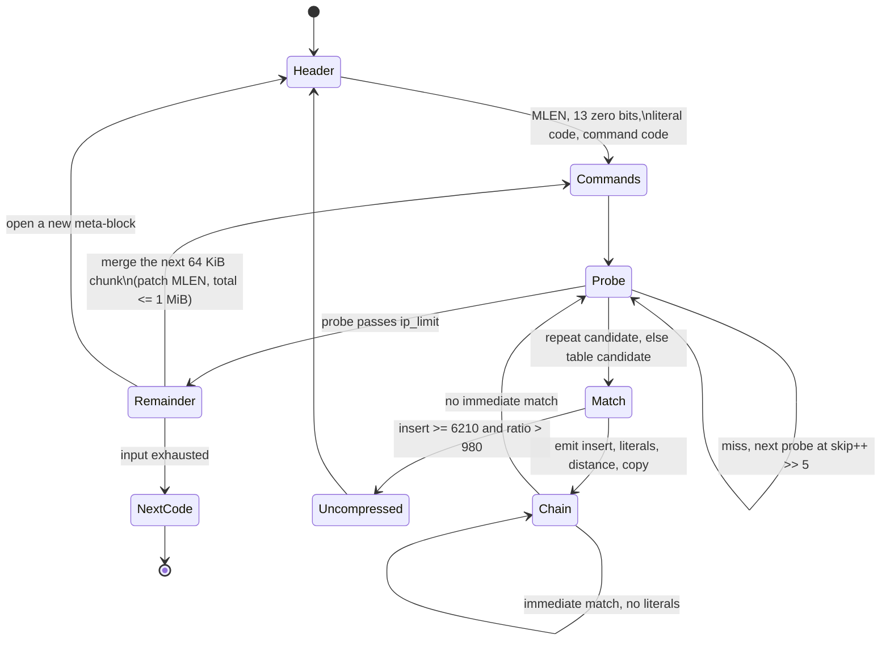
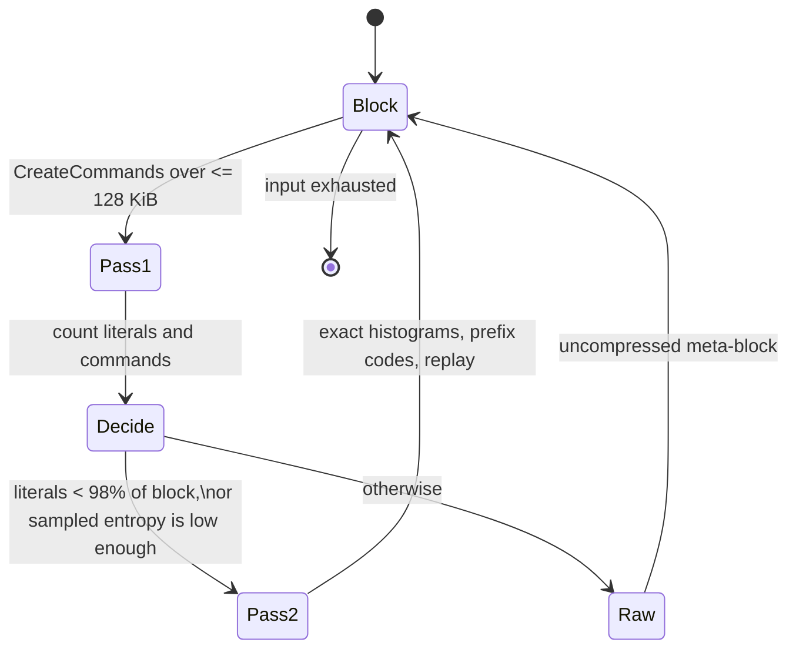

# Quality 0 / quality 1 design

How the two fast Brotli encoders are built in this crate, and why. The
architecture specifications in `architecture/` describe the same code from the
module-boundary angle; this document is the port's design record.

Reference: Google Brotli v1.2.0, commit `028fb5a`, MIT licence, vendored at
`brotli-ffi/vendor/brotli`. Format: RFC 7932.

## 1. Layering

The public API never sees a `core` type. Quality routing happens once, when a
`FastEncoder` is constructed; qualities 2 and up are refused there rather than
deeper down.

## 2. Fragmenting

The reference streaming driver cuts the input at `1 << lgwin` and hands each
fragment to the fragment encoder with a fresh, cleared hash table. This port
does the same, including the two details that are easy to miss:

- the **stream header** advertises `max(lgwin, 18)`, while the **fragment size**
  uses the requested `lgwin` unchanged. A ten bit window therefore produces
  1 KiB fragments behind an eighteen bit window header.
- the **trailing partial byte** of a fragment is not emitted. It is kept in
  `last_bytes` and re-seeded as byte 0 of the next fragment's scratch buffer.

## 3. Memory layout

| Buffer | Size | Lifetime |
| --- | --- | --- |
| quality 0 hash table | up to `32768 × 4 B` = 128 KiB | grows, never shrinks; active range cleared per fragment |
| quality 1 hash table | up to `131072 × 4 B` = 512 KiB | same |
| quality 1 command buffer | up to `131072 × 4 B` = 512 KiB | reserved once, cleared per block |
| quality 1 literal buffer | up to 131072 B = 128 KiB | same |
| scratch output | `2 × fragment + 511 B` | grows, never shrinks; unused only when encoding in place |
| `OnePassArena` | ≈ 9 KiB | one per encoder |
| `TwoPassArena` | ≈ 10 KiB | one per encoder |

Buffers that need to grow are replaced by a freshly zeroed allocation rather
than resized in place: the allocator serves large zeroed requests from zero
pages, while a resize would memset a region the encoder overwrites immediately.

### 3.1. Writing in place

A destination sized with `BrotliCompressor::calculate_bound` always has room
for a whole fragment's reservation, so `compress` and `compress_to_slice`
encode straight into it and never copy the compressed stream. That is what the
bound counts the bit writer's eight byte headroom **per fragment** for. The
scratch buffer is only used when a caller passes a tighter slice, and then the
result is copied once.

## 4. Quality 0 state machine

Decisions taken in exactly the reference order, because each of them changes
the emitted stream:

1. the repeat candidate is tested before the table candidate;
2. the table is written at the same points, with the same values;
3. after a copy, positions `ip - 3`, `ip - 2`, `ip - 1` and `ip` are hashed from
   one word load, in that order;
4. `ShouldMergeBlock` samples every 43rd byte and charges the current literal
   depths;
5. `ShouldUseUncompressedMode` compares `compressed * 50 > insertlen` first and
   the literal ratio second;
6. after the fragment, a final guard rewrites everything verbatim if the
   compressed form exceeded `31 + 8 × len` bits.

## 5. Quality 1 state machine

Pass one writes packed `u32` commands (`code | extra << 8`) and raw literal
bytes; pass two builds exact histograms from those buffers, so the literal code
is not the approximation quality 0 has to live with.

## 6. Bitstream

`BitWriter` is least-significant-bit-first within a byte and materialises a
whole 64-bit word per write, which is what clears the bits above the new
position. It supports the five operations the fast path needs: append bits,
patch an already emitted field (quality 0's `MLEN` when a block is merged),
rewind to a saved position (both uncompressed fallbacks), byte-align, and copy
raw bytes.

Writes past the end of the buffer set an overflow flag rather than panicking;
the encoder reports `BrotliCompressError::BufferOverflow`, which no correct
input reaches.

## 7. SIMD strategy

Only the exact match-length scan is vectorised, because it is the only place
where a wide compare does not change a decision. Everything else — hash
lookups, candidate choice, skip logic, command encoding, the bit writer, the
Huffman builder, the entropy samplers — stays scalar, in reference order.

`find_match_length` runs four stages:

| Stage | Width | Why |
| --- | --- | --- |
| scalar prefix | 8 B words, first 16 B | short matches dominate; a vector loop costs more than it saves |
| native vectors | 16 / 32 / 64 B | the bulk of a long match |
| word tail | 8 B | what the vector loop could not cover |
| byte tail | 1 B | the final few bytes |

The lane count is resolved into a const parameter at monomorphisation time, so
the vector loop splits its windows with `as_chunks` and loads them with
`load_array_ref`: no bounds check and no length assertion survive into the
loop. Backends therefore differ only in how a length is *found*, never in what
it *is*, which the byte-equality tests confirm.

## 8. Avoiding bounds checks without unsafe

There is no `unsafe` anywhere in `src/`. The hot loops get their bounds checks
removed by shape rather than by assertion:

| Technique | Where |
| --- | --- |
| `as_chunks::<N>` + iterator | word and vector match scans, histograms, literal packing |
| `load_array_ref` on `&[u8; N]` | vector loads |
| `first_chunk::<8>` | the single-word loader, which borrows instead of copying |
| re-slicing to `1 << TABLE_BITS` | hash table lookups |
| masking a symbol with `& 127` | command alphabet lookups |
| const generic table bits and match length | shift and predicate widths |

## 9. Packing writes

Two independent packings cut the number of bit-writer calls without changing a
single emitted bit:

- quality 0 emits literals in pairs, because its runs between matches are short;
- quality 1 accumulates literal codes until the next one would overflow the
  writer's 56 bit limit, because its replay sees a whole meta-block of literals
  at once.

Both were chosen by measurement; the alternative was measurably worse on the
other quality.

## 10. Profiling hooks

`#[hotpath::measure]` anchors sit on `FastEncoder::encode_block` and
`encode_block_into`, the two scan implementations, the prefix-code builders,
`should_merge_block`, `should_compress` and `histogram::accumulate`. They are
outside the innermost loops on purpose — a timer inside the match scan would
dominate what it measures — and compile to nothing unless one of the `hotpath`
features is enabled.

The optimisations in this port were selected by A/B benchmarking against the C
encoder on the full corpus, with byte identity re-asserted on every run, rather
than by a single synthetic microbenchmark. Changes that won a microbenchmark
but lost end to end were removed; the two literal packings in section 9 are the
surviving halves of exactly that process.

## 11. What was deliberately not done

- no static dictionary matching, block splitting or context modelling: out of
  scope for both fast qualities, as in the reference;
- no change to greedy match selection, the skip sequence or the hash update
  order: parity comes first, and these are exactly the decisions parity is
  made of;
- no speculative reads past the end of the input: the loaders return zero
  instead, and the scan never depends on that;
- no batch hash precomputation or multi-candidate search: both change the
  command stream.
